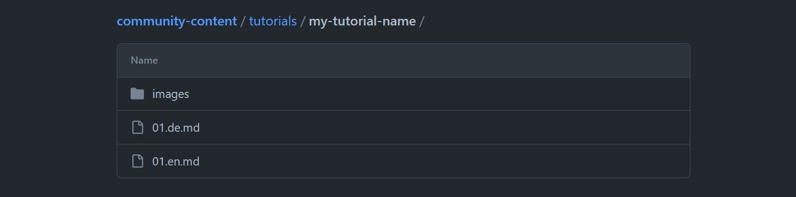

# Hetzner Tutorial Richtlinien

Hier findest du wichtige Informationen bezüglich allgemeiner Voraussetzungen wie [Inhalt](#inhalt), [Sprache](#sprache) und [externe Inhalte](#externe-inhalte), bezüglich dem [Review-Verfahren](#review-verfahren), [Credits](#credits) und eine [kurze Anleitung](#tutorial-beitragen---schritt-für-schritt-anleitung), wie du ein Tutorial einreichen kannst.

> Wenn du ein Tutorial einreichen möchtest, solltest du dir auch das [Beispiel-Tutorial](tutorial-template.de.md) und die [Markdown-Vorschau](https://community.hetzner.com/markdown-test-suite/) ansehen!

## Allgemeine Voraussetzungen 

### Inhalt

* **Original**
  
  * Es ist nicht möglich einen Text einzureichen, der bereits an anderer Stelle im Web veröffentlicht wurde, selbst wenn du selbst der Autor bist.
  * Wenn du einen Pull Request erstellst und sich herausstellt, dass dieses Tutorial zuvor bereits an anderer Stelle im Web veröffentlicht wurde, wird der Pull Request geschlossen und das Tutorial wird nicht veröffentlicht. Zusätzlich werden auch künftig keine weiteren Tutorials von diesem Nutzer veröffentlicht. Sollte der Nutzer noch einen Pull Request öffnen, wird dieser ohne Review geschlossen.

* **Thema**
  
  * Bevor du ein Tutorial schreibst, prüfe auf [community.hetzner.com](https://community.hetzner.com/tutorials) ob bereits ein Tutorial zum selben Thema verfügbar ist.
  * Um ganz sicher zu gehen, kannst du auch prüfen zu welchen Themen es aktuell bereits Pull Requests gibt.

* **Mehrwert**
  
  * Das Tutorial sollte einen gewissen Mehrwert bieten. Versuche also nicht einfach nur Befehle mit kurzen Anweisungen aufzulisten. Ergänze stattdessen kurze Erklärungen wo nötig und erwähne zusätzliche Informationen falls relevant.
  * Bitte schreibe nicht einfach nur über ein Produkt oder eine Software selbst. Meist gibt es bereits eine offizielle Dokumentation mit genau diesen Informationen. Worüber du aber schreiben kannst, ist ein bestimmter Anwendungsfall eines Produkts oder einer Software.

### Sprache
 
* **Englisch**
  
  * Wenn du eine andere Sprache fließend beherrscht und eine Übersetzung anfertigen kannst, kannst du das Tutorial in mehreren Sprachen einreichen, sofern mindestens eine Englisch ist.
  * Wenn du Englisch nicht fließend sprichst, aber ein hochwertiges Tutorial hast, dass du in einer anderen Sprache teilen kannst, kontaktiere uns bitte. Wir sind offen für die Möglichkeit, Ausnahmen für bestimmte Tutorials zu machen.

* **Leicht verständlich**
  
  * Diese Tutorials werden von Anwendern mit einem breiten Erfahrungsspektrum gelesen. Stelle sicher, dass Anfänger den Schritten noch folgen können. Das bedeutet, dass es wichtig ist, keine Schritte zu überspringen, egal wie offensichtlich oder selbsterklärend sie erscheinen mögen. Du kannst gerne Screenshots hinzufügen, um genau zu zeigen, was der Benutzer sehen sollte.
  * Wenn du Abkürzungen verwendest, stelle sicher, dass du diese bei der ersten Verwendung ausschreibst.
  * Verwende keinen übermäßigen Jargon oder Techspeak. Auch hier gilt: Wenn du ein Wort verwendest, das nicht jeder verstehen könnte, erkläre es entweder oder verwende ein leichter verständliches Wort oder einen Satz.
  * Witze sind erlaubt, es sollte aber nicht übertrieben werden.

### Externe Inhalte

* **Kostenlos und Open-Source**
  
  * Wenn im Tutorial Produkte oder Software von Dritten vorkommen, sollte darauf geachtet werden, dass diese kostenlos genutzt werden können und open-source sind, damit jeder dem Tutorial folgen kann.

* **Links, Docker Images, Terraform Module**
  
  * Wenn du im Tutorial einen Link hinzufügst, achte darauf, dass dieser auf eine offizielle und vertrauenswürdige Webseite verweist.
  * Wenn du im Tutorial ein Docker Image oder ein Terraform Modul verwenden möchtest, achte darauf, dass dieses vertrauenswürdig ist. Das heißt, dass das Docker Image beispielsweiße nicht nur 12 Downloads haben sollte.

* **Externe Repositories**
  
  * Das Tutorial sollte weder auf kleine externe Repositories verlinken, noch Dateien oder Inhalte davon verwenden. Hintergrund dafür ist, dass wir bei Hetzner keine Kontrolle darüber haben, welche Änderungen an diesen Repositories eventuell vorgenommen werden. Dadurch könnte es passieren, dass das Tutorial irgendwann nicht mehr funktioniert.

----------------------------------

## Review-Verfahren

1. Nachdem ein Pull Request geöffnet wurde, überprüft der Community Manager den Inhalt des Tutorials und gibt dir Feedback. Falls etwas geändert werden muss, wird das an dieser Stelle angegeben.
2. Je nachdem wie das Feedback ausfällt, musst du dein Tutorial ggf. aktualisieren.
   
   > Wenn du auf das Feedback des Community Managers nicht reagierst und an diesem Tutorial nicht mehr weiterarbeitest, wird der Pull Request mit einem `stale`-Label versehen. Wenn du die Arbeit an deinem Tutorial anschließend fortsetzt, wird das Label wieder entfernt. Wenn du auch anschließend nicht mehr an deinem Tutorial weiterarbeitest, wird der Pull Request geschlossen. Solltest du zu einem späteren Zeitpunkt wieder Zeit dafür finden die Arbeit daran fortzusetzen, kannst du gerne einen neuen Pull Request öffnen.

3. Wenn der Community Manager keine weiteren Anmerkungen hat und das Tutorial gut aussieht, fügt der Community Manager bei deinem Pull Request das `ready`-Label hinzu.
4. Als letzten Schritt, wird das Tutorial auf Rechtschreib- und Formatierungsfehler geprüft, bevor es schließlich veröffentlicht wird.

Nachdem das Tutorial angenommen wurde, erhältst du eine E-Mail vom Hetzner Online Community Manager. Bitte beantworte diese E-Mail und gib deine Hetzner Kundennummer an, damit wir den Credit auf deinem Account hinzufügen können.

----------------------------------

## Credits

* **Neue Tutorials**
  
  * Für neue Tutorials werden **bis zu** 50 € Credit vergeben. Der genaue Betrag hängt davon ab, wie ausführlich und aufwendig das Tutorial ist.

* **Updates**
  
  * Für kleine Updates wird kein Credit vergeben.
  * Für große Updates werden je nach Umfang ca. 10 € Credit vergeben.

* **Voraussetzungen**
  
  * Damit ein Credit hinzugefügt werden kann, muss in deinem Hetzner Account mindestens eine Rechnung sein.

----------------------------------

## Updates

Da du dein Tutorial am besten kennst, wäre es gut, wenn du uns dabei unterstützen könntest das Tutorial auf dem aktuellsten Stand zu halten.

* **Issues**
  
  Falls jemand ein Issue öffnet, das sich auf dein Tutorial bezieht, werden wir dich ggf. darin verlinken, damit du entscheiden kannst, ob du dabei helfen möchtest das im Issue beschriebene Problem zu lösen und, falls nötig, das Tutorial entsprechend zu aktualisieren.

----------------------------------
----------------------------------

## Tutorial beitragen - Schritt-für-Schritt-Anleitung

1. **[Fork](https://github.com/hetzneronline/community-content/fork) des Projekts anlegen**

2. **Ordner fürs Tutorial hinzufügen**
   
   ```console
   cd community-content
   mkdir -p tutorials/my-tutorial-name
   ```

   > Ersetze `my-tutorial-name` mit einem eigenen Namen. Den Namen des Ordners musst du auch in den Metadaten des Tutorials angeben.

   Jedes Tutorial besitzt einen eigenen Ordner. Dieser Ordner enthält alle Dateien, die für das Tutorial relevant sind. Wenn Bilder verwendet werden, müssen diese in den Ordner `images` innerhalb des `my-tutorial-name`-Ordners hinzugefügt werden. Die Datei mit dem Tutorial in englischer Sprache muss `01.en.md` benannt werden. Wenn du noch weitere Sprachen hinzufügen möchtest, muss für jede Sprache eine eigene Datei erstellt werden.
   
   Hier ist ein Beispiel von einem Tutorial, das in Englisch und Deutsch geschrieben wurde und Bilder enthält.
   
   

3. **Beispiel-Tutorial verwenden**
   
   Beachte, dass alle Tutorials auf Englisch verfasst sein müssen. Wenn du zusätzlich eine deutsche Übersetzung bereitstellen willst, kannst du dieses [Beispiel-Tutorial](tutorial-template.de.md) als Vorlage verwenden. Es enthält ein grundlegendes Layout für das Tutorial, einige Beispiele für die Formatierung und eine Reihe von Tipps und Tricks für die Einrichtung. Du kannst den Inhalt der Datei zu deinem Tutorial kopieren und bearbeiten.
   
   - Englische Vorlage:
     
     ```console
     cat tutorial-template.md > tutorials/my-tutorial-name/01.en.md
     ```
   
   - Deutsche Vorlage:
     ```console
     cat tutorial-template.de.md > tutorials/my-tutorial-name/01.de.md
     ```
   
   Die Tutorials auf [community.hetzner.com](https://community.hetzner.com/tutorials) werden alle mit Markdown geschrieben. Dies ist eine Auszeichnungssprache, die im gesamten Web verwendet wird. Eine gute Übersicht gibt es auf Github:
   [Markdown-Cheatsheet](https://github.com/adam-p/markdown-here/wiki/Markdown-Cheatsheet "Github")
   
   Der Titel, den du ganz oben bei `title: "<your-title>"` angibst, wird automatisch als H1 Überschrift am Anfang des Tutorials eingefügt. Das heißt, du musst den Titel nach den Metadaten kein zweites mal angeben und du kannst direkt mit der Einführung loslegen.
   
   ```markdown
   ---
   SPDX-License-Identifier: MIT
   path: "/tutorials/my-tutorial-name/de"
   slug: "my-tutorial-name"
   title: "Installation von `<Software>` auf Ubuntu"
   short_description: "Diese Beschreibung sollte nicht mehr als 160 Zeichen haben."
   ...
   ---
   
   ## Einführung
   ```
   
   Abgesehen vom Titel, sollten alle anderen Header H2 sein. Wenn es zwei oder mehr Unterpunkte gibt, kannst du diese Unterpunkte mit einem H3-Header formatieren.
   Für konkrete Beispiele, wie du ein Tutorial formatieren kannst, schaue dir bitte das [Beispiel-Tutorial](tutorial-template.md) an.
   
   Beim Bearbeiten des Beispiel-Tutorials sollten noch folgende Punkte beachtet werden:

<ul><ul>

<details>

<summary>Tutorial Metadaten</summary>

* **"title"**

  * Der Titel sollte deutlich machen, was das Ziel des Tutorials ist. Stecke aber nicht alles in den Titel. Dieser sollte lediglich eine Zusammenfassung sein, die dem Benutzer eine sofortige Vorstellung davon vermittelt, worum es im Tutorial geht. z.B. Installation von `<Software>` auf `<Betriebssystem>`.

* **"short_description"**
     
  * Nicht mehr als 160 Zeichen.

* **"tags"**
     
  <u>Betriebssysteme wie:</u>
  * Ubuntu
  * Fedora
  * oder andere
 
  <u>Hetzner-Tools wie:</u>
  * `hcloud-cli`
  * `installimage`
  * oder andere
   
  Software die im Tutorial verwendet wird<br>
  Oder andere Label

------

</details>

<details>

<summary>Voraussetzungen</summary>

**Server**

<ul><li>Wenn das Tutorial einen Server benötigt, sollte es auf einem neuen Server funktionieren.</li>
<li>Wenn ein Benutzer gerade einen Server bestellt hat, sollte er das Tutorial Schritt für Schritt durchlaufen können, ohne vorher etwas installieren oder konfigurieren zu müssen. Wenn dies jedoch eine Voraussetzung für das Tutorial ist, stelle bitte sicher, dass es bereits ein Tutorial gibt, das dies erklärt, und vergewissere dich dann, dass zu Beginn des Tutorials auf dieses Tutorial verwiesen wird.</li></ul>

------

</details>

</ul></ul>

4. **Tutorial schreiben**
   
   Achte beim Schreiben des Tutorials darauf, dass du die allgemeinen Voraussetzungen erfüllst, die am Anfang von diesem Dokument gelistet sind.

   Mit der [Markdown-Vorschau](https://community.hetzner.com/markdown-test-suite/) kannst du testen, wie das Tutorial aussehen wird, nachdem es veröffentlicht wurde und prüfen, ob es an einer Stelle noch Formatierungsfehler gibt.

   Beachte außerdem, dass ganz unten vom Tutorial der [License-Block](https://github.com/hetzneronline/community-content/blob/master/tutorial-template.de.md?plain=1#L96-L125) angegeben werden muss. Ersetze an dieser Stelle `[submitter's name and email address here]` mit deinem eigenen Namen und deiner E-Mail-Adresse.

5. **Commit und push**

   Erstelle einen Branch für dein Tutorial:
   
   ```bash
   git checkout -b my-tutorial
   ```
   
   > Ersetze `my-tutorial` mit einem kurzen Namen, der das Tutorial beschreibt.

   Speicher deine Änderungen und pushe das Tutorial auf GitHub.

6. **Pull-Request erstellen**
   
   Erstelle [auf GitHub](https://github.com/hetzneronline/community-content) einen Pull-Request und füge folgenden Kommentar hinzu:
   
   ```text
   I have read and understood the Contributor's Certificate of Origin available at the end of 
   https://raw.githubusercontent.com/hetzneronline/community-content/master/tutorial-template.md
   and I hereby certify that I meet the contribution criteria described in it.
   Signed-off-by: YOUR NAME <YOUR@EMAILPROVIDER.TLD>
   ```

Wenn der Community Manager keine weiteren Anmerkungen hat, wird das Tutorial veröffentlicht.
