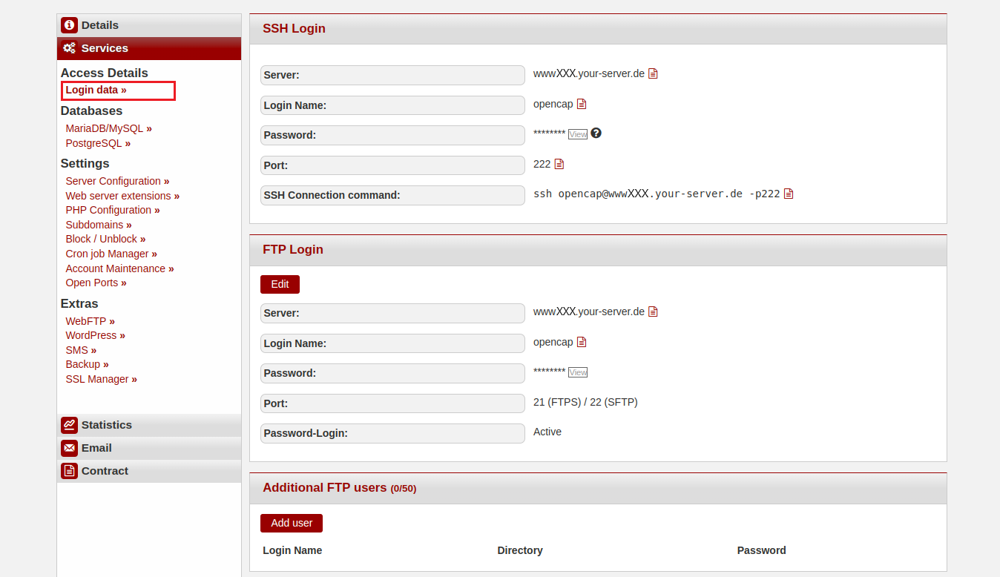
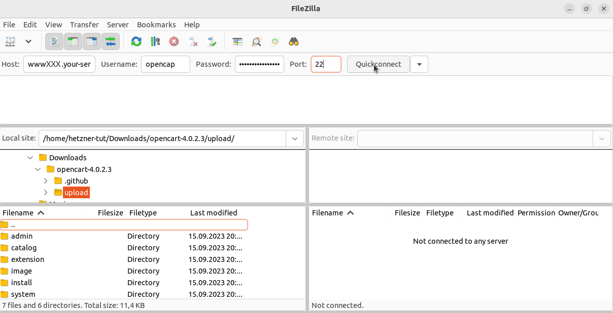
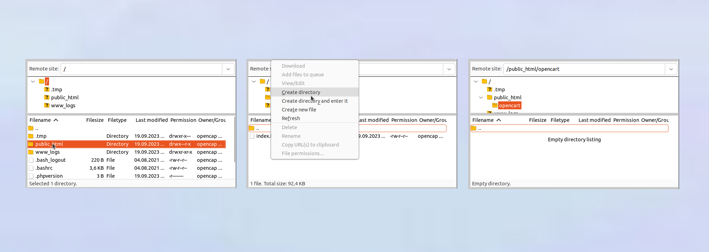
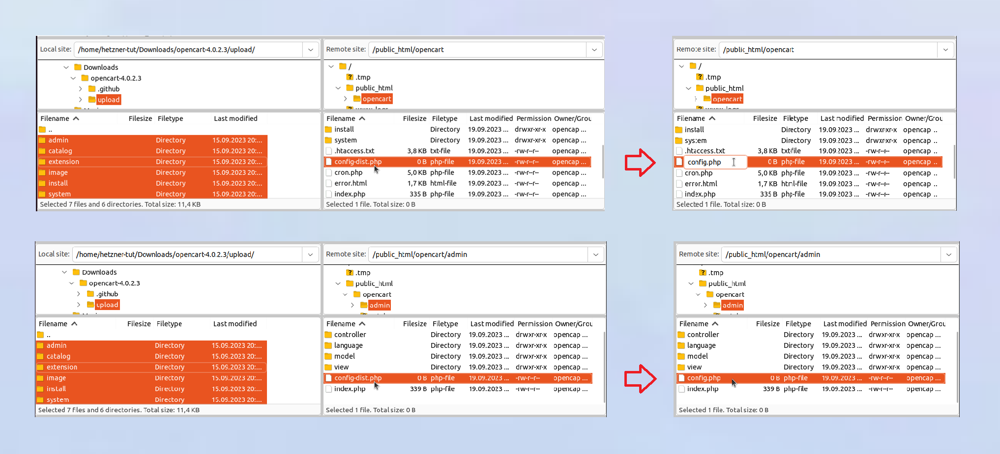
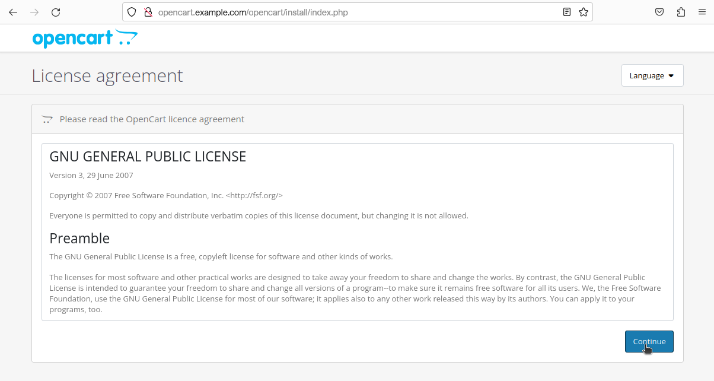
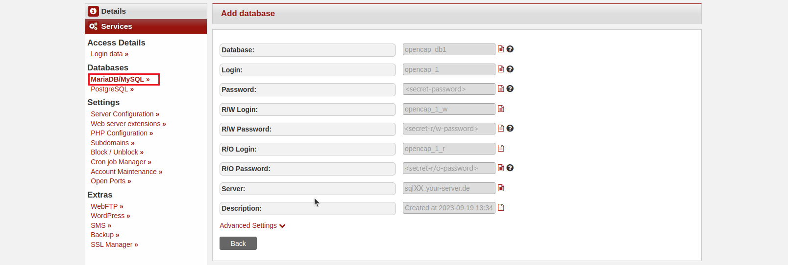
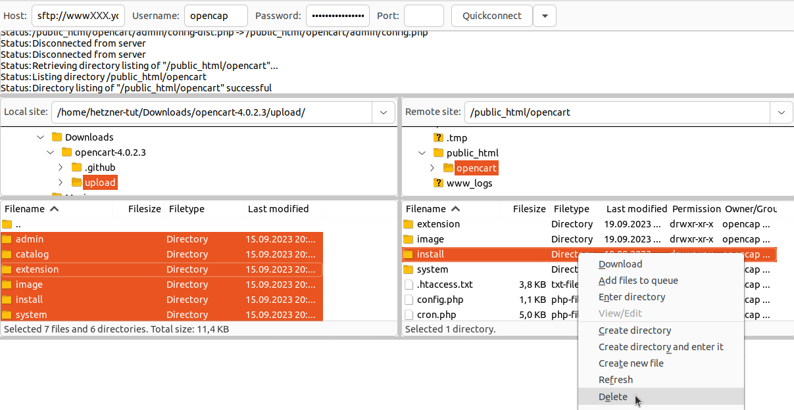

## Einführung  
[OpenCart](https://www.opencart.com) ist ein Open-Source-Onlineshop-System, das eine flexible und erweiterbare Plattform zur Erstellung und Verwaltung von Webshops bereitstellt. Es eignet sich sowohl für kleine als auch größere Shops und bietet eine modulare Struktur mit einer Vielzahl von Erweiterungen.  

**Beispiel-Benennungen**

* Benutzername: `opencap`
* Hostname: `<wwwXXX>`
* Domain: `<example.com>`
* Subdomain: `<opencart.example.com>`

---

### Schritt 1 – OpenCart herunterladen  
Um [OpenCart](https://www.opencart.com) herunterzuladen kann man entweder eine SSH-Verbindung aufbauen oder eine FTP-Verbindung. Die Zugangsdaten können in [konsoleH](https://konsoleh.hetzner.com/) unter `Zugangsdetails`→`Logindaten »` eingesehen werden.



 **Option 1 - Über SSH-Verbindung**<br>
  Für diese Option ist mindestens [Webhosting Level 9](https://www.hetzner.com/webhosting) nötig.
  
  * <u>ZIP-Datei herunterladen</u><br>
    Nachdem eine SSH-Verbindung hergestellt wurde, kann die ZIP-Datei direkt in den `public_html`-Ordner heruntergeladen werden.

```bash
opencap@<wwwXXX>:~$ cd public_html
opencap@<wwwXXX>:~/public_html$ wget https://github.com/opencart/opencart/releases
```
  
  * <u>ZIP-Datei entpacken</u><br>
    Nachdem die `opencart-<version>.zip`-Datei heruntergeladen wurde, kann diese entpackt werden.
```bash
 opencap@<wwwXXX>:~/public_html$ unzip opencart-latest.zip
```
  
    In dem `public_html`-Ordner sollte jetzt der `opencart-laest`-Ordner sichtbar sein.

  * <u>Dateien verschieben</u><br>
    Der gesamte Inhalt vom `upload`-Ordner innerhalb des `opencart-laest`-Ordners kann jetzt in den `public_html`-Ordner verschoben werden.

```bash
opencap@<wwwXXX>:~/public_html$ cd opencart-latest/upload
opencap@<wwwXXX>:~/public_html/opencart-latest/upload$ mv * ../..
```

    Der `upload`-Ordner sollte jetzt keine Dateien mehr enthalten. Stattdessen sollten jetzt alle Dateien im `public_html`-Ordner liegen.

  * <u>Dateien umbenennen</u><br>
    Innerhalb des `public_html`-Ordners kann jetzt die `config-dist.php`-Datei in `config.php` umbenannt werden. Dasselbe dann nochmal mir der Datei im `admin`-Unterordner.

```bash
opencap@<wwwXXX>:~/public_html$ mv config-dist.php config.php
opencap@<wwwXXX>:~/public_html$ mv admin/config-dist.php admin/config.php
```

-----------

**Option 2 - Über FTP-Verbindung**<br>
  
  * <u>ZIP-Datei auf dem lokalen Gerät herunterladen</u><br>
    Öffnen Sie [https://www.opencart.com/index.php?route=cms/download](https://www.opencart.com/index.php?route=cms/download) und wählen Sie anschließend bei der Option "**Download & host your own**" `DOWNLOAD NOW` aus.
  
  * <u>ZIP-Datei entpacken</u><br>
    * Öffnen Sie auf Ihrem lokalen Gerät den "Downloads"-Ordner. Dort sollte die OpenCart-Datei sein.
    * Wählen Sie die OpenCart-Datei mit einem Rechtsklick aus.
    * Wählen Sie in dem Menü, das sich öffnet, die Option "Alle extrahieren" (Linux) bzw. "Alle extrahieren" (Windows).
  
  * <u>Entpackte Dateien per FTP hochladen</u><br>
    Die Dateien müssen jetzt per FTP auf den Server kopiert werden. Der Ordner `opencart-4.0.2.3` sollte im "Downloads"-Ordner sein.
    
    Innerhalb des `opencart-4.0.2.3`-Ordners ist ein Ordner namens `upload`. Wählen Sie alle Dateien innerhalb des `upload`-Ordners auf dem lokalen Gerät aus und kopieren Sie diese in den `public_html`-Ordner auf dem Server. Falls der Shop nicht direkt auf der Hauptseite erscheinen soll, kann innerhalb des `public_html`-Ordner ein Unterordner namens `opencart` erstellt werden. Die Dateien aus dem `upload`-Ordner müssen dann in diesen Unterordner hinzugefügt werden.
    
  
  * <u>Dateien umbenennen</u><br>
    Als nächstes muss in zwei Ordnern die `config-dist.php`-Datei in `config.php` umbenannt werden:
    * `public_html/config-dist.php`
    * `phblic_html/admin/config-dist.php`
    
    Wählen Sie die Dateien jeweils mit einem Rechtsklick aus und klicken Sie auf "Umbenennen". Geben Sie den Dateien den neuen Namen `config.php` und speichern Sie die Änderungen.
    

### Schritt 2 - OpenCart installieren

Geben Sie im Webbrowser den Domainnamen ein (z.B. `opencart.example.com`). Wenn die Dateinen in einem Unterordner gespeichert wurden, muss dieser am Ende der Domain ergänzt werden (z.B. `opencart.example.com/opencart`). Die Installationsseite für OpenCart sollte jetzt angezeigt werden.

2.1 **Lizenzvereinbarung akzeptieren**<br>
  Lesen Sie sich die Lizenzvereinbarungen durch und klicken Sie auf `Continue`.
  

2.2 **Automatische Überprüfung**<br>
  Im nächsten Schritt wird die richtige Konfiguration überprüft. Hier sollten alle Haken grün sein bzw. der Status der Dateien auf "Writable" stehen.
  > Bei Problemen mit den Dateien unten sollten die Berechtigungen für diese für den Zeitpunkt der Installation auf 777 gestellt werden.
  
  

2.3 **Datenbank und Benutzer einrichten**<br>
  Fügen Sie eine Datenbank hinzu und erstellen Sie einen neuen Benutzer mit administrativen Benutzerrechten zum Verwalten des Shops. Klicken Sie anschließend auf `Continue`.
  > Die genauen Informationen bezüglich der Datenbank können in [konsoleH](https://konsoleh.hetzner.com/) unter `Datenbanken`→`MariaDB/MySQL »` eingesehen werden. Wenn noch keine Datenbank hinzugefügt wurde, kann jetzt eine erstellt werden.
    

Die Installation sollte jetzt automatisch abgeschlossen werden.

### Schritt 3 - Installationsordner löschen

Aus Sicherheitsgründen sollte zuletzt noch der `install`-Ordner auf dem Server gelöscht werden. Wie zuvor gibt es auch hier zwei Möglichkeiten:

**Option 1 - Über SSH-Verbindung**<br>
  Für diese Option ist mindestens [Webhosting Level 9](https://www.hetzner.com/webhosting) nötig.
  
  Nachdem eine SSH-Verbindung hergestellt wurde, kann der Ordner direkt aus dem `public_html`-Ordner gelöscht werden.

```bash
opencap@<wwwXXX>:~$ cd public_html
opencap@<wwwXXX>:~/public_html$ rm -rf install
```

-----------

**Option 2 - Über FTP-Verbindung**<br>
  
  Nachdem eine Verbindung zu dem Server hergestellt wurde, kann die Datei direkt aus dem `public_html`-Ordner gelöscht werden. Wenn die Dateien in einem Unterordner gespeichert wurden, muss die Datei aus diesen (z.B. `public_html/opencart`) gelöscht werden.  
  Wählen Sie den `install`-Ordner mit einem Rechtsklick aus und klicken Sie auf die Option "Löschen".
  

---

### Troubleshooting – Häufige Probleme und Lösungen  

1. **Fehlerhafte Dateiberechtigungen**  
   - Warnungen im Installationsprozess deuten auf fehlende Schreibrechte hin.  
   - Lösung: Temporär Schreibrechte (z. B. 755 oder 775, notfalls 777) setzen und danach wieder anpassen.  

2. **Leere Seite nach Installation**  
   - Ursache: Meist inkompatible PHP-Version oder fehlende Module.  
   - Lösung: Prüfen, ob notwendige PHP-Module wie `curl`, `mbstring`, `gd` oder `zip` installiert sind.  

3. **"Permission Denied“-Fehler im Admin-Bereich**  
   - Ursache: Fehlende Benutzerrechte.  
   - Lösung: Im Admin-Bereich unter *System → Benutzergruppen* die erforderlichen Berechtigungen setzen.  

4. **Langsame Ladezeiten**  
   - Lösung: Caching aktivieren, Erweiterungen prüfen, Server-Performance optimieren.  

5. **Fehler beim Hochladen von Erweiterungen**  
   - Ursache: Limit für Uploads oder deaktivierte ZIP-Unterstützung.  
   - Lösung: PHP-Einstellungen (`upload_max_filesize`, `post_max_size`) anpassen oder Module per FTP hochladen.  

---

### Weiterführende Links und Tipps 

- Erweiterungen installieren  
  Über den [OpenCart Marketplace](https://www.opencart.com/index.php?route=marketplace/extension) können zusätzliche Module und Themes integriert werden.  

- Updates und Upgrades  
  Vor Aktualisierungen immer ein vollständiges Backup von Dateien und Datenbank erstellen. Prüfen, ob Themes und Erweiterungen kompatibel sind.  
  Offizielle Hinweise: [OpenCart Upgrade Guide](https://docs.opencart.com/upgrading/)  

- Sicherheit  
  - Standard-Admin-Pfad ändern  
  - HTTPS aktivieren  
  - Regelmäßige Updates einspielen  

- Mehrere Shops verwalten 
  Mit einer Installation können mehrere Shops über das Admin-Panel gesteuert werden.  

- Suchmaschinenoptimierung (SEO)
  - Aktivieren von SEO-URLs  
  - Einrichtung von Meta-Informationen und URL-Aliases  

---

### Support und Community  

- [Offizielle Dokumentation](https://docs.opencart.com)  
- [OpenCart Forum](https://forum.opencart.com)  
- [OpenCart Marketplace](https://www.opencart.com/index.php?route=marketplace/extension)  

---
