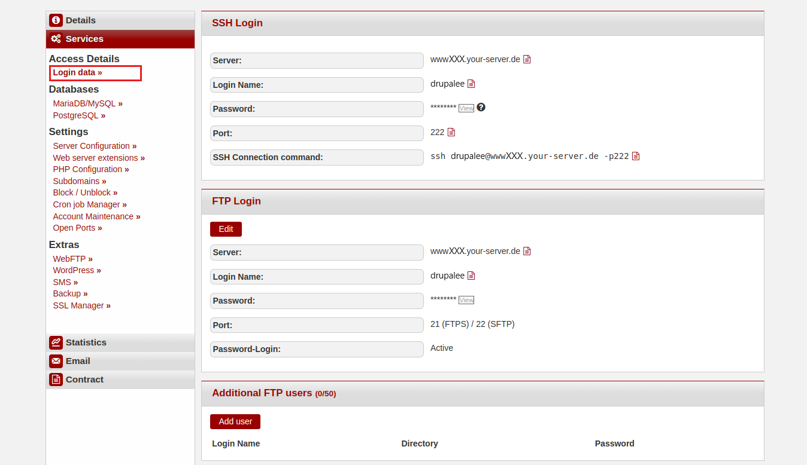
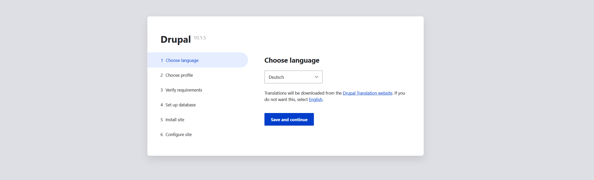
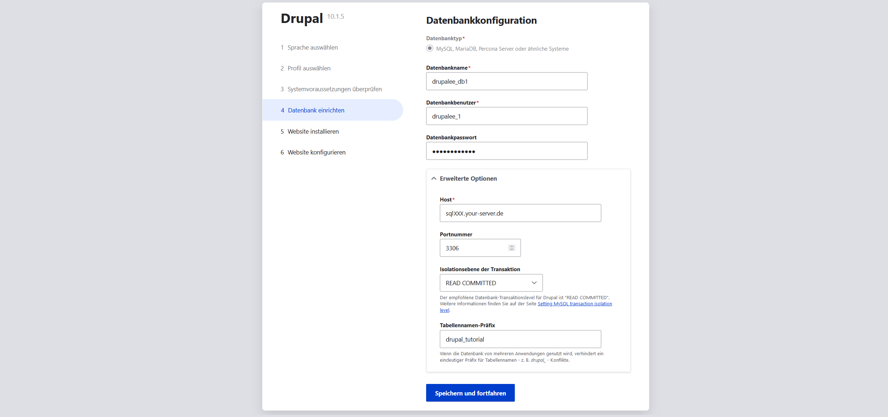

In dieser Anleitung erfahren Sie, wie Sie das Content-Management-System (CMS) Drupal auf einem Webhosting-Paket bei konsoleH installieren.

**Beispiel-Benennungen**

* Benutzername: `drupalee`
* Hostname: `<wwwXXX>`
* Domain: `<example.com>`
* Subdomain: `<drupal.example.com>

## Drupal installieren

### Schritt 1 - Drupal herunterladen

Um [Drupal](https://www.drupal.org/) herunterzuladen kann man entweder eine SSH-Verbindung aufbauen oder eine FTP-Verbindung. Die Zugangsdaten können in [konsoleH](https://konsoleh.hetzner.com/) unter `Zugangsdetails`→`Logindaten »` eingesehen werden.



* **Option 1 - Über SSH-Verbindung**<br>
  Für diese Option ist mindestens [Webhosting Level 9](https://www.hetzner.com/webhosting) nötig.
  
  * <u>Datei herunterladen</u><br>
    Nachdem eine SSH-Verbindung hergestellt wurde, kann die Datei direkt in den `public_html`-Ordner heruntergeladen werden.
    ```bash
    drupalee@<wwwXXX>:~/public-html$ wget https://www.drupal.org/download-latest/tar.gz
    ```
  
  * <u>Datei entpacken</u><br>
    Nachdem die `tar.gz`-Datei heruntergeladen wurde, kann diese entpackt werden.
    ```bash
    drupalee@<wwwXXX>:~/public_html$ tar -xf tar.gz
    ```
    In dem `public_html`-Ordner sollte jetzt der `drupal-10.1.4`-Ordner sichtbar sein.

  * <u>Dateien verschieben</u><br>
    Der gesamte Inhalt vom `drupal-10.1.4`-Ordner kann jetzt in den `public_html`-Ordner verschoben werden.
    ```bash
    drupalee@<wwwXXX>:~/public_html$ cd drupal-x.x.x
    drupalee@<wwwXXX>:~/public_html/drupal-x.x.x$ mv * ..
    ```
    Der `drupal-x.x.x`-Ordner sollte jetzt keine Dateien mehr enthalten. Stattdessen sollten jetzt alle Dateien im `public_html`-Ordner liegen.


* **Option 2 - Über FTP-Verbindung**<br>
  
  * <u>ZIP-Datei auf dem lokalen Gerät herunterladen</u><br>
    Öffnen Sie [https://www.drupal.org/download-latest/tar.gz](https://www.drupal.org/download-latest/tar.gz), um die aktuellste Version herunterzuladen.
  
  * <u>ZIP-Datei entpacken</u><br>
    * Öffnen Sie auf Ihrem lokalen Gerät den "Downloads"-Ordner. Dort sollte die Drupal-Datei liegen.
    * Wählen Sie die Drupal-Datei mit einem Rechtsklick aus.
    * Wählen Sie in dem Menü, das sich öffnet, die Option "Alle extrahieren" (Linux) bzw. "Alle extrahieren" (Windows).
  
  * <u>Entpackte Dateien per FTP hochladen</u><br>
    Die Dateien müssen jetzt per FTP auf den Server kopiert werden. Wählen Sie alle Dateien innerhalb des `drupal-x.x.x`-Ordners auf dem lokalen Gerät aus und kopieren Sie diese in den `public_html`-Ordner auf dem Server.

### Schritt 2 - PHP-Einstellungen bearbeiten

* Öffnen Sie [konsoleH](https://konsoleh.hetzner.com/)
* Wählen Sie `Konfiguration`→`PHP-Konfiguration »` aus
* Unter "PHP-Einstellungen", stellenSie `memory_limit` auf 256M
* Scrollen Sie nach ganz unten und speichern Sie die Änderungen


### Schritt 3 - Drupal installieren

Geben Sie im Webbrowser den Domainnamen ein (z.B. `drupal.example.com`). Dort sollte die Installationsseite für Drupal angezeigt werden. 

3.1 Wählen Sie eine Sprache und klicken Sie anschließend auf `Save and continue`.
  

3.2 Wählen Sie eine Option und klicken Sie anschließend auf `Speichern und vorfahren`.
  

3.3 Überprüfen Sie die Voraussetzungen und fahren Sie anschließend trotzdem fort.

3.4 Denken Sie beim Hinzufügen der Datenbank daran auch die erweiterten Optionen anzugeben.
  

3.5 Lassen Sie die Installation einmal durchlaufen und geben Sie anschließend Webseiten-Informationen wie den Namen der Webseite, eine E-Mail und ein Benutzerkonto zur Wartung der Webseite an. Klicken Sie anschließend auf `Speichern und vorfahren`, um die Installation zu beenden.

### Troubleshooting – Häufige Probleme und Lösungen

**Weißer Bildschirm / Seite lädt nicht**  
- Liegen alle Drupal-Dateien direkt im Verzeichnis `public_html`?  
- Ist die Domain/Subdomain korrekt zugewiesen?  
- In konsoleH: PHP-Fehlermeldungen aktivieren

**Fehlende PHP-Erweiterungen (z. B. OPcache, pdo_mysql)**  
- Optionale Erweiterungen (wie OPcache) können ignoriert werden  
- Für Pflichtmodule: PHP-Version auf 8.2 oder höher umstellen

**Datei-Uploads schlagen fehl**  
- In der PHP-Konfiguration:  
  - `upload_max_filesize = 64M`  
  - `post_max_size = 64M`  
- Schreibrechte setzen:
  ```bash
  chmod -R 755 sites/default/files
  ```
**Datenbankverbindung schlägt fehl**
- Hostname meist localhost
- Datenbankname, Benutzername und Passwort überprüfen
- Datenbankrechte prüfen

**Fehler: Allowed memory size exhausted**
- In konsoleH memory_limit auf mindestens 256M erhöhen

**Fehlende Schreibrechte**
- Standardrechte setzen:
```bash
chmod 755 sites/default
chmod 644 sites/default/settings.php
```

### Nächste Schritte

Wenn alles geklappt hat, kannst du sofort loslegen:
[Inhalte erstellen](https://drupal.example.com/node/add)
[Website anzeigen](https://drupal.example.com)
