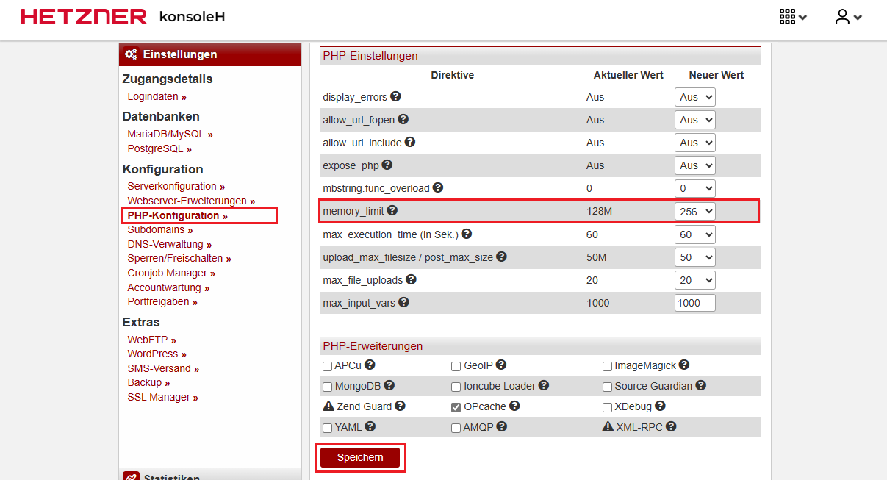
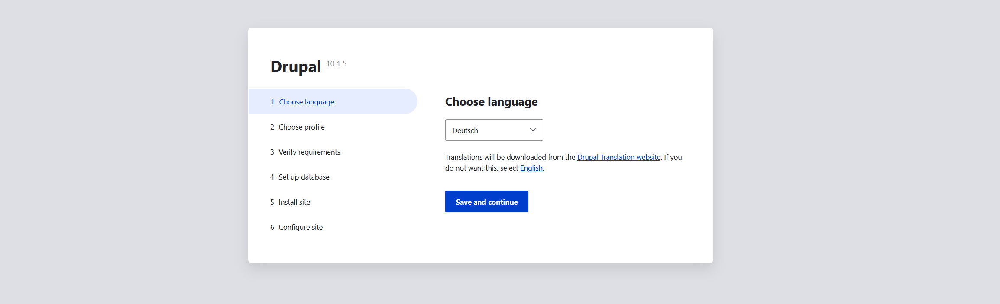
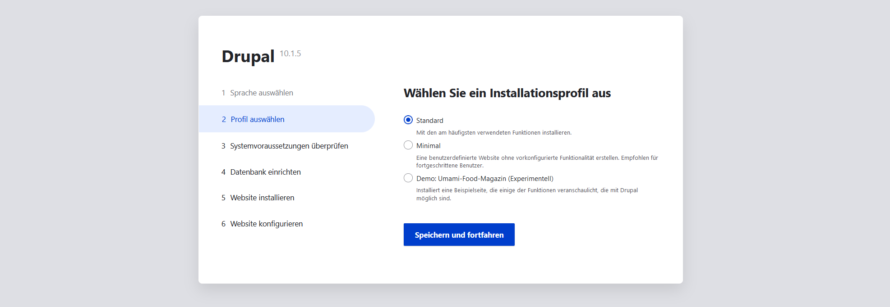
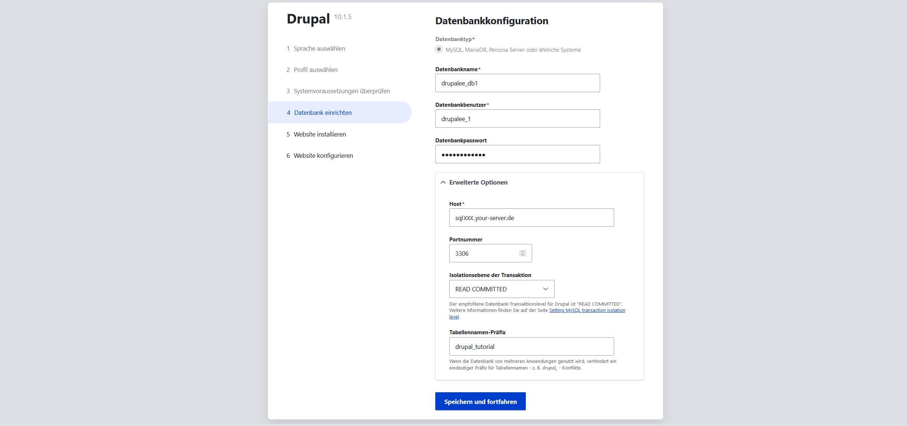

## Introduction

In this guide, you’ll learn how to install the [Drupal](https://www.drupal.org/) content management system (CMS) on a web hosting package at konsoleH.

**Example terminology**

* Username: `drupalee`
* Hostname: `<wwwXXX>`
* Domain: `<example.com>`
* Subdomain: `<drupal.example.com>`

## Step 1 – Download Drupal

To download [Drupal](https://www.drupal.org/), you can either establish an SSH connection or use an FTP connection. The access data can be viewed in [konsoleH](https://konsoleh.hetzner.com/) under `Access details`→`Login data »`.


* **Option 1 – Via SSH connection**<br>
  For this option you need at least [Webhosting Level 9](https://www.hetzner.com/webhosting).
  
  * <u>Download the file</u><br>
    After establishing an SSH connection, you can download the file directly into the `public_html` folder.
    ```bash
    drupalee@<wwwXXX>:~/public-html$ wget https://www.drupal.org/download-latest/tar.gz
    ```
  
  * <u>Extract the file</u><br>
    After the `tar.gz` file has been downloaded, you can extract it.
    ```bash
    drupalee@<wwwXXX>:~/public_html$ tar -xf tar.gz
    ```
    The `drupal-10.1.4` folder should now be visible in the `public_html` directory.

  * <u>Move the files</u><br>
    You can now move the entire contents of the `drupal-10.1.4` folder into the `public_html` directory.
    ```bash
    drupalee@<wwwXXX>:~/public_html$ cd drupal-x.x.x
    drupalee@<wwwXXX>:~/public_html/drupal-x.x.x$ mv * ..
    ```
    The `drupal-x.x.x` folder should now be empty. Instead, all files should now be located in the `public_html` folder.

<br>

* **Option 2 – Via FTP connection**<br>
  
  * <u>Download the ZIP file to your local device</u><br>
    Open [https://www.drupal.org/download-latest/tar.gz](https://www.drupal.org/download-latest/tar.gz) to download the latest version.
  
  * <u>Extract the ZIP file</u><br>
    * On your local device, open the "Downloads" folder. The Drupal file should be there.
    * Right-click the Drupal file.
    * In the menu that opens, choose "Extract All" (Linux) or "Extract All" (Windows).
  
  * <u>Upload the extracted files via FTP</u><br>
    You now need to copy the files to the server via FTP. Select all files inside the `drupal-x.x.x` folder on your local device and copy them into the `public_html` folder on the server.

## Step 2 – Edit PHP settings

* Open [konsoleH](https://konsoleh.hetzner.com/)
* Select `Configuration`→`PHP configuration »`
* Under "PHP settings", set `memory_limit` to 256M
* Scroll all the way down and save the changes



## Step 3 – Install Drupal

Enter the domain name in your web browser (e.g., `drupal.example.com`). The installation page for Drupal should appear. 

1. Choose a language and then click `Save and continue`.  
   

2. Choose an option and then click `Save and continue`.  
   

3. Review the requirements and proceed anyway.

4. When adding the database, remember to also set the advanced options.  
   

5. Let the installation run, then provide site information such as the site name, an email address, and an admin account for maintaining the site. Finally, click `Save and continue` to complete the installation.

## Step 4 - Troubleshooting: Common Issues and Solutions

**White screen / Page won’t load**  
- Are all Drupal files directly in the `public_html` directory?  
- Is the domain/subdomain correctly assigned?  
- In konsoleH: enable PHP error messages

**Missing PHP extensions (e.g., OPcache, pdo_mysql)**  
- Optional extensions (such as OPcache) can be ignored  
- For required modules: switch PHP version to 8.2 or higher

**File uploads fail**  
- In the PHP configuration:  
  - `upload_max_filesize = 64M`  
  - `post_max_size = 64M`  
- Set write permissions:
  ```bash
  chmod -R 755 sites/default/files
  ```

**Database connection fails**  
- Hostname is usually `localhost`  
- Check database name, username, and password  
- Verify database privileges

**Error: Allowed memory size exhausted**  
- In konsoleH, increase `memory_limit` to at least 256M

**Missing write permissions**  
- Set standard permissions:
  ```bash
  chmod 755 sites/default
  chmod 644 sites/default/settings.php
  ```

## Conclusion

If everything worked, you can get started right away:

* [Create content](https://drupal.example.com/node/add)  
* [View website](https://drupal.example.com)
