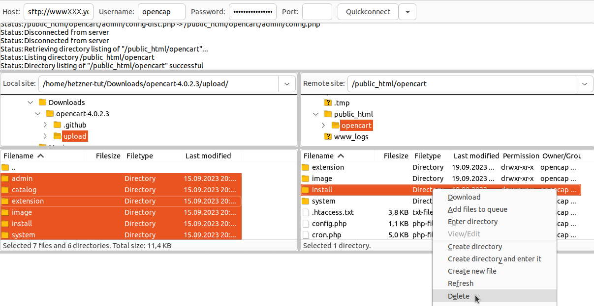

## Introduction
[OpenCart](https://www.opencart.com) is an open-source online shop system that provides a flexible and extensible platform for creating and managing web shops. It is suitable for both small and larger shops and offers a modular structure with a wide range of extensions.

**Example names**
* User name: `opencap`
* Host name: `<wwwXXX>`
* Domain: `<example.com>`
* Subdomain: `<opencart.example.com>`
---

### Step 1 – Download OpenCart
  
To download [OpenCart](https://www.opencart.com), you can either establish an SSH connection or an FTP connection. The access data can be found in [konsoleH](https://konsoleh.hetzner.com/) under `Access details`→`Login data »`.


 **Option 1 – Via SSH connection**<br>
For this option, you need at least [Web Hosting Level 9](https://www.hetzner.com/webhosting).
* <u>Download ZIP file</u><br>
    
Once an SSH connection has been established, the ZIP file can be downloaded directly to the `public_html` folder.

```bash
opencap@<wwwXXX>:~$ cd public_html
opencap@<wwwXXX>:~/public_html$ wget https://github.com/opencart/opencart/releases
```
    
* <u>Unzip ZIP file</u><br>
    Once the `opencart-<version>.zip` file has been downloaded, it can be unzipped.

```bash 
opencap@<wwwXXX>:~/public_html$ unzip opencart-latest.zip
```
    
The `opencart-4.0.2.3` folder should now be visible in the `public_html` folder.
  * <u>Move files</u><br>
The entire contents of the `upload` folder within the `opencart-4.0.2.3` folder can now be moved to the `public_html` folder.
    
```bash
opencap@<wwwXXX>:~/public_html$ cd opencart-latest/upload
opencap@<wwwXXX>:~/public_html/opencart-latest/upload$ mv * ../..
```

The `upload` folder should now be empty. Instead, all files should now be located in the `public_html` folder.
* <u>Rename files</u><br>
Within the `public_html` folder, the `config-dist.php` file can now be renamed to `config.php`. Repeat this step for the file in the `admin` subfolder.
    
```bash
opencap@<wwwXXX>:~/public_html$ mv config-dist.php config.php
opencap@<wwwXXX>:~/public_html$ mv admin/config-dist.php admin/config.php
```


**Option 2 - Via FTP connection**<br>
    
* <u>Download ZIP file to your local device</u><br>
    Open [https://www.opencart.com/index.php?route=cms/download](https://www.opencart.com/index.php?route=cms/download) and then select ‘**Download & host your own**’ `DOWNLOAD NOW`.
* <u>Unzip the ZIP file</u><br>
* Open the ‘Downloads’ folder on your local device. The OpenCart file should be there.
    
* Right-click on the OpenCart file.
* In the menu that opens, select ‘Extract All’ (Linux) or ‘Extract All’ (Windows).
* <u>Upload unzipped files via FTP</u><br>
    
The files must now be copied to the server via FTP. The folder `opencart-latest` should be in the ‘Downloads’ folder.
    
    Inside the `opencart-latest` folder is a folder called `upload`. Select all files within the `upload` folder on your local device and copy them to the `public_html` folder on the server. If you do not want the shop to appear directly on the main page, you can create a subfolder called `opencart` within the `public_html` folder. The files from the `upload` folder must then be added to this subfolder.
    

* <u>Rename files</u><br>
Next, the `config-dist.php` file must be renamed to `config.php` in two folders:
* `public_html/config-dist.php`
    
* `phblic_html/admin/config-dist.php`
Select the files by right-clicking on them and clicking on ‘Rename’. Rename the files `config.php` and save the changes.


## Step 2 - Install OpenCart

Enter the domain name in your web browser (e.g. `opencart.example.com`). If the files were saved in a subfolder, this must be added to the end of the domain (e.g. `opencart.example.com/opencart`). The installation page for OpenCart should now be displayed. 

2.1 **Accept the licence agreement**<br>
Read the licence agreements and click `Continue`.
  

2.2 **Automatic check**<br>  
The next step checks that the configuration is correct. All boxes should be green and the status of the files should be ‘Writable’.
  > If you encounter problems with the files below, set the permissions for these files to 777 for the duration of the installation.
  

2.3 **Set up database and user**<br>
Add a database and create a new user with administrative user rights to manage the shop. Then click on `Continue`.
  
> The exact information regarding the database can be found in [konsoleH](https://konsoleh.hetzner.com/) under `Databases`→`MariaDB/MySQL »`. If no database has been added yet, one can be created now.
    
The installation should now be completed automatically. 

### Step 3 - Delete the installation folder
For security reasons, the `install` folder on the server should be deleted last. As before, there are two options here:
* **Option 1 - Via SSH connection**<br>
  
This option requires at least [Web Hosting Level 9](https://www.hetzner.com/webhosting).
1.
After establishing an SSH connection, the folder can be deleted directly from the `public_html` folder.

```bash
opencap@<wwwXXX>:~/public_html$ rm -rf install
```

* **Option 2 - Via FTP connection**<br>
  Once a connection to the server has been established, the file can be deleted directly from the `public_html` folder. If the files were saved in a subfolder, the file must be deleted from there (e.g. `public_html/opencart`).  
  Select the `install` folder by right-clicking on it and click on the ‘Delete’ option.



## Troubleshooting – Common problems and solutions
1. **Incorrect file permissions**
- Warnings during the installation process indicate that write permissions are missing.
 - Solution: Temporarily set write permissions (e.g. 755 or 775, or 777 if necessary) and then adjust them again.
  
2. **Empty page after installation**
- Cause: Usually an incompatible PHP version or missing modules.
- Solution: Check whether the necessary PHP modules such as `curl`, `mbstring`, `gd` or `zip` are installed.

3. **‘Permission Denied’ error in the admin area**    
- Cause: Missing user rights.  
 - Solution: Set the required permissions in the admin area under *System → User groups*.
 
4. **Slow loading times**
 - Solution: Activate caching, check extensions, optimise server performance.
  
5. **Error when uploading extensions**
- Cause: Upload limit or ZIP support disabled.
- Solution: Adjust PHP settings (`upload_max_filesize`, `post_max_size`) or upload modules via FTP.


## Further links and tips
- Installing extensions
Additional modules and themes can be integrated via the [OpenCart Marketplace](https://www.opencart.com/index.php?route=marketplace/extension).
- Updates and upgrades
 Always make a complete backup of your files and database before updating. Check whether themes and extensions are compatible.  
  Official information: [OpenCart Upgrade Guide](https://docs.opencart.com/upgrading/)
- Security
- Change the default admin path
- Enable HTTPS
 - Install regular updates
  
- Manage multiple shops
With a single installation, multiple shops can be controlled via the admin panel.
- Search engine optimisation (SEO)
- Enable SEO URLs
- Set up meta information and URL aliases


## Support and community
- [Official documentation](https://docs.opencart.com)
- [OpenCart forum](https://forum.opencart.com)
- [OpenCart Marketplace](https://www.opencart.com/index.php?route=marketplace/extension)