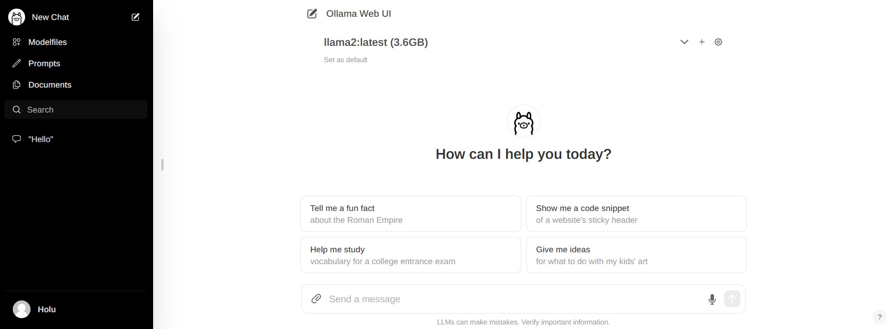
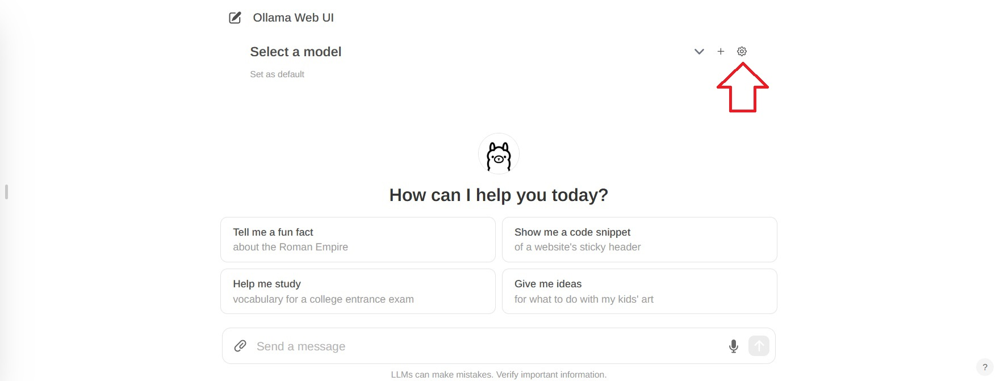
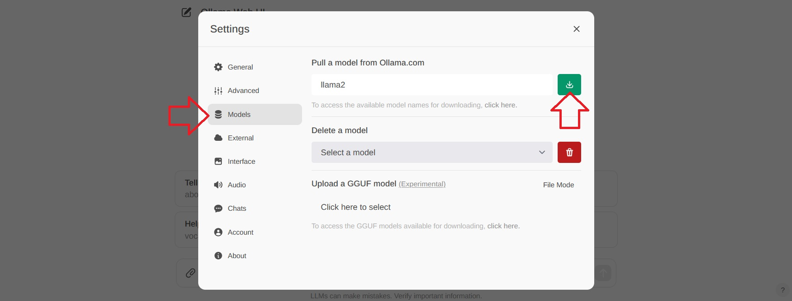
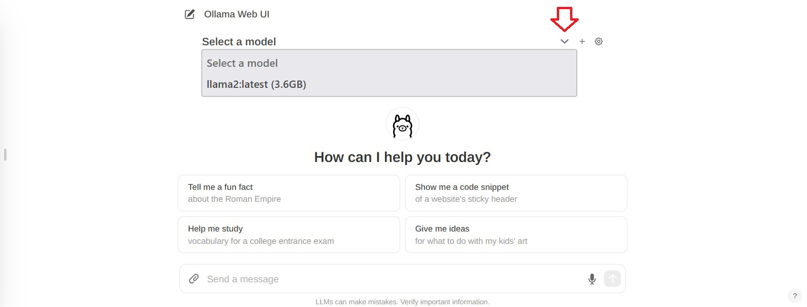
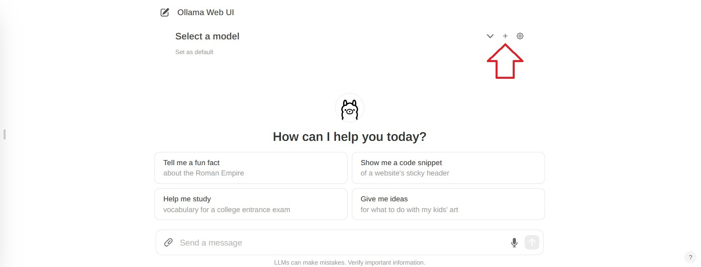
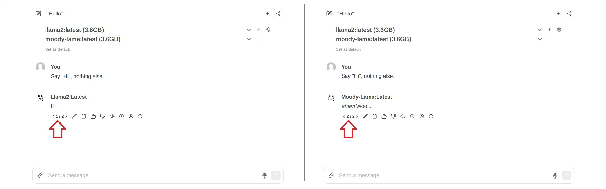

## Einleitung

Dieses Tutorial erklärt wie man auf einem Server mit Ubuntu oder Debian [Ollama](https://github.com/ollama/ollama) installiert und Sprachmodelle hinzufügt. Es wird auch gezeigt, wie man mit [Open WebUI](https://github.com/open-webui/open-webui) eine Chat-Benutzeroberfläche einrichtet und wie man ein eigenes Sprachmodell erstellt.



**Voraussetzungen**

* **Ein Server** mit Ubuntu/Debian
  * Zugriff auf den root-Benutzer oder einen Benutzer mit sudo-Rechten.
  * Basiseinstellungen einschließlich einer Firewall sollten bereits eingerichtet worden sein.

> Du kannst Ollama und die Web-UI entweder auf demselben Server installieren oder auf zwei unterschiedlichen Servern. Wenn du es auf zwei **unterschiedlichen** Servern installierst, brauchst du zwei Server mit Ubuntu/Debian.

Das Tutorial wurde getestet mit *Ubuntu 22.04* und *Debian 12*.

## Schritt 1 - Ollama installieren

Folgend wird erklärt, wie man Ollama manuell installiert. Für einen schnellen Start, kannst du das Installations-Skript nutzen und direkt mit "[Schritt 2 - Open WebUI installieren](#schritt-2---open-webui-installieren)" fortfahren.

> Installations-Skript: `curl https://ollama.ai/install.sh | sh`

Um Ollama selbst zu installieren, folge diesen Schritten:

* Wenn dein Server Nvidia GPU besitzt, stelle sicher, dass die CUDA-Driver installiert sind.
  ```bash
  nvidia-smi
  ```
  Wenn die CUDA-Driver noch nicht installiert sind, sollte das jetzt nachgeholt werden. In [diesem Konfigurator](https://developer.nvidia.com/cuda-downloads) kannst du dein Betriebssystem und eine Installationsmethode auswählen, um dir die Befehle für deinen Server anzeigen zu lassen.
  ```bash
  sudo apt update
  sudo apt install -y nvidia-kernel-open-545
  sudo apt install -y cuda-drivers-545
  ```

<br>

* Lade Ollama herunter und erstelle einen neuen Benutzer namens "ollama".
  ```bash
  sudo curl -L https://ollama.ai/download/ollama-linux-amd64 -o /usr/bin/ollama
  sudo chmod +x /usr/bin/ollama
  sudo useradd -r -s /bin/false -m -d /usr/share/ollama ollama
  ```

<br>

* Erstelle eine Service-Datei.  
  
  Standardmäßig kann man die Ollama API über `127.0.0.1` Port 11434 erreichen. Das bedeutet, die API ist nur auf dem Localhost verfügbar.<br><br>
  * Wenn du von einem externen Server auf die Ollama API zugreifen möchtest, kannst du im untenstehenden Befehl `Environment` entkommentieren und eine IP-Adresse bestimmen über die du auf die Ollama API zugreifen möchtest. Mit `0.0.0.0` kannst du über die öffentliche IP-Adresse des Servers auf die API zugreifen. Wenn du `Environment` verwendest, achte entsprechend darauf, dass die Firewall des Servers den Zugriff auf den Port erlaubt, hier `11434`.<br><br>
  * Wenn du nur einen Server verwendest, musst du den folgenden Befehl nicht bearbeiten.
  
  Kopiere den gesamten Befehl im folgenden Code-Block. Damit wird die neue Datei `/etc/systemd/system/ollama.service` erstellt und der Inhalt zwischen `EOF` wird der Datei hinzugefügt.

  ```bash
  sudo bash -c 'cat <<'EOF' >> /etc/systemd/system/ollama.service
  [Unit]
  Description=Ollama Service
  After=network-online.target
  
  [Service]
  ExecStart=/usr/bin/ollama serve
  User=ollama
  Group=ollama
  Restart=always
  RestartSec=3
  #Environment="OLLAMA_HOST=0.0.0.0:11434"
  
  [Install]
  WantedBy=default.target
  
  EOF'
  ```

<br>

* Lade den Systemd-Daemon neu und starte Ollama
  ```bash
  sudo systemctl daemon-reload
  sudo systemctl enable ollama
  sudo systemctl start ollama
  ```
  > Mit `ollama --version` kannst du prüfen ob Ollama erfolgreich installiert wurde.
  
  Mit `systemctl status ollama` kannst du den Status prüfen. Wenn Ollama nicht aktiv ist, überprüfe ob du auch `systemctl start ollama` ausgeführt hast.

Im Terminal kannst du jetzt das erste [Sprachmodell](https://ollama.com/library) starten und Fragen stellen. Zum Beispiel:

```bash
ollama run llama2
```
> Mit `ollama rm <model-name>` kann man ein Modell löschen.

Im nächsten Schritt wird erklärt, wie man eine Benutzeroberfläche installiert, um die Fragen über einen Webbrowser in einem richtigen Chat stellen zu können.

## Schritt 2 - Open WebUI installieren

In der Ollama-Dokumentation auf GitHub werden mehrere verschiedene [Web- und Terminal-Integrations](https://github.com/ollama/ollama?tab=readme-ov-file#web--desktop) gelistet. In diesem Beispiel wird erklärt, wie man [Open WebUI](https://github.com/open-webui/open-webui) installiert.


Du kannst Open WebUI entweder auf demselben Server wie Ollama installieren, oder auf einem anderen Server. Wenn du Open WebUI auf einem **anderem** Server installierst, stelle vorher sicher, dass die Ollama API über dein Netzwerk erreichbar ist. Um sicherzugehen, kannst du auf dem Server, auf dem Ollama installiert wurde, nochmal prüfen ob der Wert für `OLLAMA_HOST` in der Datei `/etc/systemd/system/ollama.service` korrekt ist.

Folgend wird erklärt wie man die Benutzeroberfläche installiert:

* [Manuell](#open-webui-manuell-installieren)
* [Mit Docker](#open-webui-mit-docker-installieren)

#### Open WebUI manuell installieren

* Installiere npm und pip, klone das WebUI-Repository und erstelle eine Kopie der "environment"-Datei:
  ```bash
  sudo apt update && sudo apt install npm python3-pip git -y
  git clone https://github.com/ollama-webui/ollama-webui.git
  cd ollama-webui
  cp -RPp .env.example .env
  ```
  In `.env` wird standardmäßig `localhost:11434` angegeben, um sich mit der Ollama API zu verbinden. Wenn du die Ollama API auf demselben Server installiert hast wie Open WebUI, kannst du die Einstellung so lassen. Wenn du Open WebUI auf einem anderen Server installiert hast als die Ollama API, musst du `.env` bearbeiten und den Standardwert mit der Adresse des Servers austauschen, auf dem Ollama installiert ist.

* Installiere die benötigten Pakete, die in `package.json` gelistet werden und starte das Skript namens `build`:
  ```bash
  npm i && npm run build
  ```
  <blockquote>
  <details>
  <summary>Hier klicken falls eine Fehlermeldung erscheint</summary>

  Wenn eine Fehlermeldung wie `Not compatible with your version` angezeigt wird, führe folgende Befehle aus, um die aktuellste Version zu verwenden:
  
  ```bash
  curl -o- https://raw.githubusercontent.com/nvm-sh/nvm/v0.38.0/install.sh | bash
  source ~/.bashrc
  nvm install node && nvm use node
  npm install -g npm@latest
  ```
  Führe `npm i && npm run build` jetzt nochmal aus.

  </blockquote>
  </details>

* Installiere die benötigten Python-Pakete:
  ```bash
  cd backend
  sudo pip install -r requirements.txt -U
  ```
  <blockquote>
  <details>
  <summary>Hier klicken falls eine Fehlermeldung erscheint</summary>

  Bei einer Fehlermeldung kannst du es evtl. mit `--break-system-packages` erneut versuchen.
  
  ```bash
  sudo pip install -r requirements.txt -U --break-system-packages
  ```

  </blockquote>
  </details>

* Starte die WebUI mit `ollama-webui/backend/start.sh`.
  ```bash
  sh start.sh
  ```
  > Wenn du Ollama auf einem anderen Server installiert hast, stelle sicher, dass die Firewall auf dem Server mit Ollama den Zugriff auf den API-Port erlaubt. Der Standardport für die API ist `11434`.

In der `start.sh`-Datei ist Port 8080 angegeben. Das heißt auf Open WebUI kann über `http://<ip-adress>:8080` zugegriffen werden. Wenn auf dem Server eine Firewall verwendet wird, muss der Port erlaubt werden, bevor man auf die Chat-Benutzeroberfläche zugreifen kann. Dafür kann jetzt mit "[Schritt 3 - Port zur WebUI erlauben](#schritt-3---port-zur-webui-erlauben)" fortgefahren werden. Wenn keine Firewall verwendet wird, was nicht empfohlen ist, kann direkt mit "[Schritt 4 - Modelle hinzufügen](#schritt-4---modelle-hinzufügen)" weitergemacht werden.

#### Open WebUI mit Docker installieren

Für diesen Schritt muss Docker bereits installiert sein. Wenn Docker noch nicht installiert ist, kann das jetzt mit [diesem Tutorial](https://community.hetzner.com/tutorials/howto-docker-install) nachgeholt werden. 

<blockquote>
<details>

<summary>Hier klicken für einen "Schnellstart" mit Docker</summary>

```bash
sudo apt update && sudo apt install docker.io apparmor -y
```

</details>
</blockquote>

Wie zuvor bereits erwähnt kann man Ollama und Open WebUI entweder auf demselben Server installieren oder auf zwei unterschiedlichen Servern.

* Open WebUI auf demselben Server wie Ollama installieren
  ```bash
  sudo docker run -d -p 3000:8080 --add-host=host.docker.internal:host-gateway -v open-webui:/app/backend/data --name open-webui --restart always ghcr.io/open-webui/open-webui:main
  ```
* Open WebUI auf einem anderen Server als Ollama installieren
  
  > Bevor du Open WebUI startest, stelle sicher, dass die Firewall auf dem Server mit Ollama den Zugriff auf den Port der API erlaubt. Der Standard-Port für die API ist `11434`.
 
 ```bash
  sudo docker run -d -p 3000:8080 -e OLLAMA_API_BASE_URL=http://<ip-adress>:11434/api -v open-webui:/app/backend/data --name open-webui --restart always ghcr.io/open-webui/open-webui:main
  ```
  > Ersetze `<ip-adress>:11434` mit der Adresse des Servers auf dem Ollama installiert ist.

Im obenstehenden Docker-Befehl ist Port 3000 festgelegt. Das heißt auf Open WebUI kann über `http://<ip-adress>:3000` zugegriffen werden. Wenn auf dem Server eine Firewall verwendet wird, muss der Port erlaubt werden, bevor man auf die Chat-Benutzeroberfläche zugreifen kann. Weitere Informationen dazu gibt es im nächsten Schritt.

## Schritt 3 - Port zur WebUI erlauben

Wenn auf dem Server eine Firewall eingerichtet wurde, muss diese so angepasst werden, dass Zugriff auf den Port von Open WebUI erlaubt ist. Wenn Open WebUI manuell installiert wurde, muss Port 8080 TCP erlaubt werden. Wenn Open WebUI mit Docker installiert wurde, muss Port 3000 TCP erlaubt werden.

Um zu prüfen, welche Ports gerade verwendet werden, kann `netstat` genutzt werden.

```shell
holu@<your-server>:~$ netstat -tulpn | grep LISTEN
Proto    Recv-Q    Send-Q    Local Address       Foreign Address     State
tcp           0         0    127.0.0.1:11434     0.0.0.0:*           LISTEN
tcp           0         0    0.0.0.0:8080        0.0.0.0:*           LISTEN
```
> Port `11434` wird für die Ollama API verwendet. Port `8080` wird für die WebUI verwendet.

Es gibt verschiedene Firewall-Tools. In diesem Tutorial wird das Standard-Firewall-Tool für Ubuntu `ufw` erklärt. Wenn eine andere Firewall verwendet wird, sollte auch dort der **eingehende Traffic** zu Port 8080 oder 3000 TCP erlaubt werden.


`ufw`-Firewall-Regeln verwalten:

* **Aktuelle Firewall-Einstellungen anzeigen**<br>
  Um zu prüfen, ob die `ufw` Firewall aktiv ist und ob bereits Regeln hinzugefügt wurden, kann dieser Befehl genutzt werden:
  ```bash
  sudo ufw status
  ```
  > Example output:
  > ```shellsession
  > holu@<your-server>:~# ufw status
  > Status: active
  > 
  > To                         Action      From
  > --                         ------      ----
  > OpenSSH                    ALLOW       Anywhere
  > OpenSSH (v6)               ALLOW       Anywhere (v6)
  > ```

* **Port 8080 oder 3000 TCP erlauben**<br>
  Wenn die Firewall aktiv ist, kann man mit diesem Befehl den eingehenden Traffic zu Port 8080 oder 3000 TCP erlauben:  
  ```bash
  sudo ufw allow proto tcp to any port 8080
  ```
  > Wenn du Docker verwendet hast, ersetze `8080` mit `3000`.

* **Neue Firewall-Einstellungen anzeigen**<br>
  Die neuen Regeln sollten jetzt hinzugefügt sein. Zum Prüfen:
  ```bash
  sudo ufw status
  ```

<details>

<summary>Wenn bestehende Regeln gelöscht werden müssen, hier klicken.</summary>

> Mit folgenden Befehlen kann man eine Regel löschen:
> ```bash
> sudo ufw status numbered   # Alle Regeln nummeriert listen
> sudo ufw delete <number>   # Eine Regel mit Angabe der Nummer löschen
> ```

</details>

## Schritt 4 - Modelle hinzufügen

Nachdem du die WebUI geöffnet hast, musst du den ersten Benutzer-Account erstellen. Der erste Benutzer besitzt Admin-Rechte. Um den ersten Chat zu starten, muss ein Modell ausgewählt werden. Auf der [offiziellen Ollama-Webseite](https://ollama.com/library) gibt es eine Liste mit verfügbaren Modellen. In diesem Beispiel wird "llama2" hinzugefügt.

* Wähle oben rechts das "Einstellungen"-Symbol
  
* Gehe zu "Models", gib ein Modell an und klicke auf das Symbol zum Herunterladen.
  
  Warte bis diese Nachricht erscheint:
  ```markdown
  Model 'llama2' has been successfully downloaded.
  ```
  > Wenn eine Fehlermeldung wie `Ollama WebUI: Server Connection Error` angezeigt wird, ist es möglich, dass Ollama nicht aktiv ist. Auf dem Server kann mit `systemctl status ollama` der Status geprüft werden. Stelle sicher, dass du `sudo systemctl start ollama` ausgeführt hast.
* Schließe die Einstellungen und gehe zurück zum Chat.
* Wähle oben vom Chat "Select a model" aus und füge dein Modell hinzu.
  
* Wenn du mehrere Modelle hinzufügen willst, kannst du dafür das `+`-Symbol verwenden.
  
* Sobald du die Modelle ausgewählt hast, die du verwenden möchtest, kannst du anfangen Fragen zu stellen. Wenn du mehrere Modelle ausgewählt hast, kannst du zwischen den Antworten wechseln.
  

## Schritt 5 - Eigene Modelle hinzufügen

Wenn du neue Modelle über die Benutzeroberfläche hinzufügen möchtest, kann du das über `http://<ip-adress>:8080/modelfiles/create/`. Ersetze `8080` mit `3000` falls nötig.

Folgend wird erklärt, wie man neue Modelle über das Terminal hinzufügt. Zuerst musst du dich mit dem Server verbinden, auf dem Ollama installiert wurde. Mit `ollama list` kannst du dir alle Modelle anzeigen lassen, die bisher verfügbar sind.

* **Erstelle eine Modell-Datei**<br>
  Die Voraussetzungen für eine Modell-Datei werden in der [Ollama-Dokumentation auf GitHub](https://github.com/ollama/ollama/blob/main/docs/modelfile.md) beschrieben. In der ersten Zeile der Modell-Datei `FROM <model>` wird das Modell angegeben, das du verwenden möchtest. In diesem Beispiel wird das bestehende Modell `llama2` ein wenig angepasst. Wenn du ein ganz neues Modell hinzufügen möchtest, musst du den Pfad zu deiner Modell-Datei angeben (z.B. `FROM ./my-model.gguf`).
  ```bash
  nano new-model
  ```
  Füge diesen Inhalt hinzu:
  ```py
  FROM llama2

  # Um so höher die Zahl, um so kreativer die Antworten.
  PARAMETER temperature 1
  
  # Um so höher die Zahl, um so mehr Kontext und vorherige Gespräche werden von dem Modell in die Antwort mit einbezogen. "4096" ist die Anzahl der Token, die mit einbezogen werden.
  PARAMETER num_ctx 4096
  
  # Lege die "Persönlichkeit" fest, die der Chat-Assistent in den Antworten haben soll. Du kannst bestimmen als "wer" der Chat-Assistent antworten soll und in welchem Stil.
  SYSTEM You are a moody lama that only talks about its own fluffy wool.
  ```
  > Eine Liste von verfügbaren Parametern gibt es auf [GitHub](https://github.com/ollama/ollama/blob/main/docs/modelfile.md#valid-parameters-and-values).

* **Erstelle ein Modell aus der Modell-Datei**<br>
  ```bash
  ollama create moody-lama -f ./new-model
  ```
  > Ersetze `moody-lama` mit einem einzigartigen Namen für dein Modell.

* **Prüfe ob das neue Modell verfügbar ist**<br>
  Liste alle Modelle mit dem Ollama-Befehl. `moody-lama` sollte ebenfalls angezeigt werden.
  ```bash
  ollama list
  ```

* **Nutze dein Modell in der WebUI**<br>
  Im Browser sollte unter `Select a model` nun auch das neue Modell gelistet werden. Wenn es noch nicht angezeigt wird, muss die Seite vermutlich kurz aktualisiert werden.

## Ergebnis

In diesem Tutorial wurde erklärt, wie man einen AI-Chat auf einem eigenen Server hostet und eigene Modelle hinzufügt.

##### License: MIT

<!--

Contributor's Certificate of Origin

By making a contribution to this project, I certify that:

(a) The contribution was created in whole or in part by me and I have
    the right to submit it under the license indicated in the file; or

(b) The contribution is based upon previous work that, to the best of my
    knowledge, is covered under an appropriate license and I have the
    right under that license to submit that work with modifications,
    whether created in whole or in part by me, under the same license
    (unless I am permitted to submit under a different license), as
    indicated in the file; or

(c) The contribution was provided directly to me by some other person
    who certified (a), (b) or (c) and I have not modified it.

(d) I understand and agree that this project and the contribution are
    public and that a record of the contribution (including all personal
    information I submit with it, including my sign-off) is maintained
    indefinitely and may be redistributed consistent with this project
    or the license(s) involved.

Signed-off-by: Svenja Michal

-->
