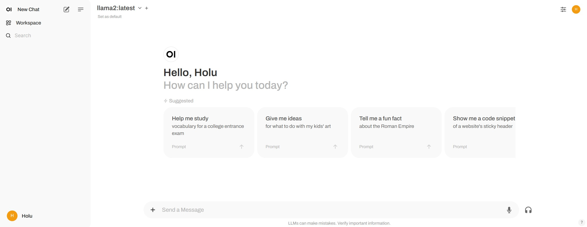
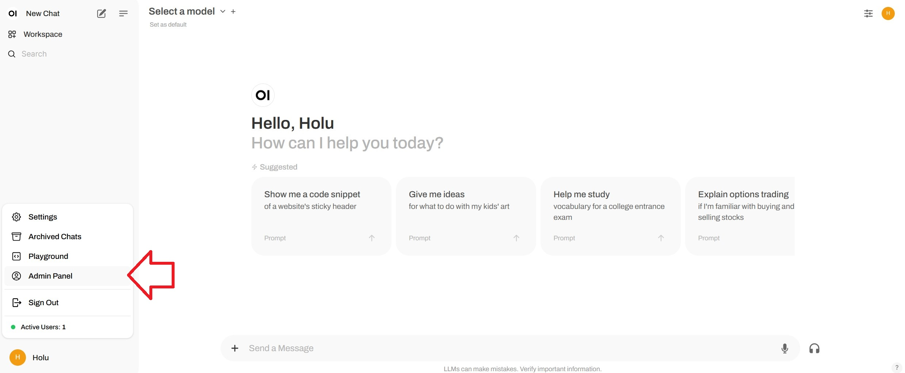
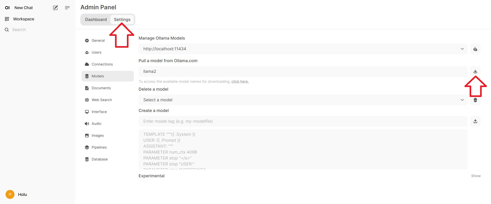
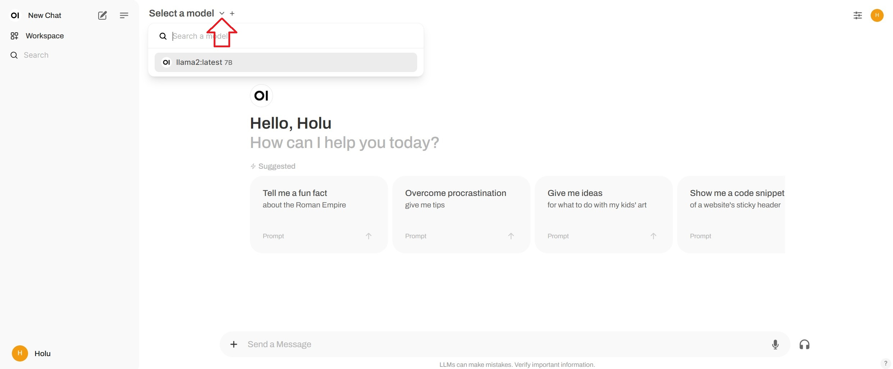
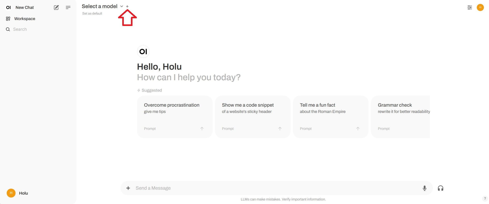
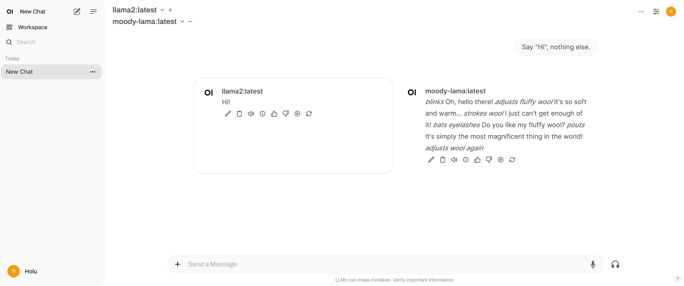

## Introduction

This tutorial explains how to install [Ollama](https://github.com/ollama/ollama) to run language models on a server with Ubuntu or Debian. It also shows how to setup a chat interface with [Open WebUI](https://github.com/open-webui/open-webui), and how to use a custom language model.



**Prerequisites**

* **One server** with Ubuntu/Debian
  * You need access to the root user or a user with sudo permissions.
  * Before you start, you should complete some basic configuration, including a firewall.

* **Minimum** hardware requirements
  * CPU: Ideally an Intel/AMD CPU that supports AVX512 or DDR5. To check, you can run:
    ```bash
    lscpu | grep -o 'avx512' && sudo dmidecode -t memory | grep -i "DDR5"
    ```
  * RAM: 16GB
  * Disk space: about 50GB
  * GPU: Not mandatory

> You can choose to either install Ollama and the web UI on the same server or on two separate servers. If you install them on **separate** servers, you will need two servers with Ubuntu/Debian.

The tutorial was tested with *Ubuntu 24.04* and *Debian 12*.

## Step 1 - Install Ollama

The following step explains how to install Ollama manually. For a quick start, you can use the installation script and continue with "[Step 2 - Install Ollama WebUI](#step-2---install-open-webui)".

> Installation script: `curl -fsSL https://ollama.com/install.sh | sh`<br>
> *If you get a connection error, check if your server has a public IPv4 address.*

To install Ollama yourself, follow these steps:

* If your server has an Nvidia GPU, make sure the CUDA drivers are installed
  ```bash
  nvidia-smi
  ```
  If the CUDA drivers are not installed, do this now. In [this configurator](https://developer.nvidia.com/cuda-downloads), you can select your operating system and choose an installer type to view the commands you need to run with your setup.
  ```bash
  sudo apt update
  sudo apt install -y nvidia-kernel-open-545
  sudo apt install -y cuda-drivers-545
  ```

<br>

* Download the Ollama binary and create a Ollama user
  ```bash
  sudo curl -L https://ollama.com/download/ollama-linux-amd64 -o /usr/bin/ollama
  sudo chmod +x /usr/bin/ollama
  sudo useradd -r -s /bin/false -m -d /usr/share/ollama ollama
  ```

<br>

* Create a service file.  
  
  By default, you can access the Ollama API via `127.0.0.1` port 11434. This means the API is only available of the localhost.<br><br>
  * If you need to access Ollama externally, you can uncomment `Environment` and set an IP address to access the Ollama API. `0.0.0.0` will allow you to access the API via the public IP of the server. If you do use `Environment`, make sure the firewall on your server allows access to the port you set, here `11434`.<br><br>
  * If you only have one server, you don't need to modify the command below.
  
  Copy and paste the entire content of the code block below. This will create the new file `/etc/systemd/system/ollama.service` and add the content between `EOF` to the new file.
  
  ```bash
  sudo bash -c 'cat <<'EOF' >> /etc/systemd/system/ollama.service
  [Unit]
  Description=Ollama Service
  After=network-online.target
  
  [Service]
  ExecStart=/usr/bin/ollama serve
  User=ollama
  Group=ollama
  Restart=always
  RestartSec=3
  #Environment="OLLAMA_HOST=0.0.0.0:11434"
  
  [Install]
  WantedBy=default.target
  
  EOF'
  ```

<br>

* Reload the systemd daemon and enable the Ollama service
  ```bash
  sudo systemctl daemon-reload
  sudo systemctl enable ollama
  sudo systemctl start ollama
  ```
  > You can use `ollama --version` to double-check if the installation was successful.
  
  Use `systemctl status ollama` to check the status. If Ollama is not active and running, make sure you ran `systemctl start ollama`.

In the terminal, you can now start [language models](https://ollama.com/library) and ask questions. For example:

```bash
ollama run llama2
```
> You can use `ollama rm <model-name>` to delete a model.

The next step explains how to install a web UI so that you can ask questions in a nice user interface via a web browser.

## Step 2 - Install Open WebUI

In the Ollama documentation on GitHub, you can find a [list of different web and terminal integrations](https://github.com/ollama/ollama?tab=readme-ov-file#web--desktop). This example explains how to install [Open WebUI](https://github.com/open-webui/open-webui).


You can choose to either install Open WebUI on the same server as Ollama, or install Ollama and Open WebUI on two separate servers. If you install Open WebUI on a **separate** server, make sure the Ollama API is exposed to your network. To double-check, view `/etc/systemd/system/ollama.service` on the server that has the Ollama installed and verify the value of `OLLAMA_HOST`.

The steps below explain how to install the user interface:

* [Manually](#install-open-webui-manually)
* [With Docker](#install-open-webui-with-docker)

#### Install Open WebUI manually

* Install npm and pip, clone the WebUI repository, and create a copy of the example environment file:
  ```bash
  sudo apt update && sudo apt install npm python3-pip python3-venv git -y
  git clone https://github.com/open-webui/open-webui.git
  cd open-webui
  cp -RPp .env.example .env
  ```
  In `.env`, the address to connect to the Ollama API is set to `localhost:11434` by default. If you installed the Ollama API on the same server as your Open WebUI, you can leave this setting as is. If you installed Open WebUI on a separate server than the Ollama API, edit `.env` and replace the default value with the address of the server that has Ollama installed.

* Install the dependencies listed in `package.json` and run the script named `build`:
  ```bash
  npm i && npm run build
  ```
  <blockquote>
  <details>
  <summary>Click here if you get an error</summary>

  If you get an error like `Not compatible with your version`, run the following commands to use the latest version:
  
  ```bash
  curl -o- https://raw.githubusercontent.com/nvm-sh/nvm/v0.40.0/install.sh | bash
  source ~/.bashrc
  nvm install node && nvm use node
  npm install -g npm@latest
  ```
  Now try and run `npm i && npm run build` again.

  </blockquote>
  </details>

* Install required python packages:
  ```bash
  cd backend
  python3 -m venv venv && source venv/bin/activate
  pip install -r requirements.txt -U
  ```

* Start the web UI with `ollama-webui/backend/start.sh`.
  ```bash
  bash start.sh
  ```
  > If you installed Ollama on a different server, make sure the firewall on the server with Ollama allows access to the port of the API before you start the web UI. The default port for the API is `11434`.

In `start.sh`, the port is set to 8080. This means, you can access Open WebUI at `http://<ip-adress>:8080`. If you have an active firewall on your server, you need to allow the port before you can access the chat UI. For this, you can now go to "[Step 3 - Allow the port to the web UI](#step-3---allow-the-port-to-the-web-ui)". If you don't have a firewall, which is not recommended, you can now skip to "[Step 4 - Add models](#step-4---add-models)".

#### Install Open WebUI with Docker

For this step, you need Docker installed. If you haven't installed Docker yet, you can do this now using [this tutorial](https://community.hetzner.com/tutorials/howto-docker-install).

<blockquote>
<details>

<summary>Click here for a quick installation of Docker</summary>

```bash
sudo apt update && sudo apt install docker.io apparmor -y
```

</details>
</blockquote>

As mentioned before, you can choose to either install Open WebUI on the same server as Ollama, or install Ollama and Open WebUI on two separate servers.

* Install Open WebUI on the same server as Ollama
  ```bash
  sudo docker run -d -p 3000:8080 --add-host=host.docker.internal:host-gateway -v open-webui:/app/backend/data --name open-webui --restart always ghcr.io/open-webui/open-webui:main
  ```
* Install Open WebUI on a different server than Ollama
  
  > Before you start the Open WebUI, make sure the firewall on the server with Ollama allows access to the port of the API. The default port for the API is `11434`.
  
  ```bash
  sudo docker run -d -p 3000:8080 -e OLLAMA_BASE_URL=http://<ip-adress>:11434 -v open-webui:/app/backend/data --name open-webui --restart always ghcr.io/open-webui/open-webui:main
  ```
  > Replace `<ip-adress>:11434` with the address of the server that has Ollama installed.

In the Docker command above, the port is set to 3000. This means, you can access Open WebUI at `http://<ip-adress>:3000`. If you have an active firewall on your server, you need to allow the port before you can access the chat UI. This is explained in the next step.

## Step 3 - Allow the port to the web UI

If you have a firewall, make sure it allows access to the Open WebUI port. If you installed it manually, you need to allow port `8080` TCP. If you installed it with Docker, you need to allow port `3000` TCP.

To double check, you can use `netstat` and view which ports are used.

```shell
holu@<your-server>:~$ netstat -tulpn | grep LISTEN
Proto    Recv-Q    Send-Q    Local Address       Foreign Address     State
tcp           0         0    127.0.0.1:11434     0.0.0.0:*           LISTEN
tcp           0         0    0.0.0.0:8080        0.0.0.0:*           LISTEN
```
> Port `11434` is used for the Ollama API. Port `8080` is used for the web interface.

There are several different firewall tools. This tutorial covers the default firewall configuration tool for Ubuntu `ufw`. If you're using a different firewall, make sure it allows **incoming traffic** to port 8080 or 3000 TCP.

Managing `ufw` firewall rules:

* **View current firewall settings**<br>
  To check if the `ufw` firewall is active and if you already have any rules, you can use:
  ```bash
  sudo ufw status
  ```
  > Example output:
  > ```shellsession
  > holu@remote-server:~# ufw status
  > Status: active
  > 
  > To                         Action      From
  > --                         ------      ----
  > OpenSSH                    ALLOW       Anywhere
  > OpenSSH (v6)               ALLOW       Anywhere (v6)
  > ```

* **Allow port 8080 or 3000 TCP**<br>
  If the firewall is active, run this command to allow incoming traffic to port 8080 or 3000 TCP:  
  ```bash
  sudo ufw allow proto tcp to any port 8080
  ```
  > If you used Docker, replace `8080` with `3000`.

* **View new firewall settings**<br>
  The new rules should now be added. To check, use:
  ```bash
  sudo ufw status
  ```

<details>

<summary>If you need to delete any rules, click here.</summary>

> To delete rules, you can use the following commands:
> ```bash
> sudo ufw status numbered   # List all rules with numbers
> sudo ufw delete <number>   # Delete a rule by specifying the number
> ```

</details>

## Step 4 - Add models

After you accessed the web UI, you need to create the first user account. This user will have admin priviliges. To start your first chat, you need to select a model. You can browse a list of models on the [official Ollama website](https://ollama.com/library). In this example, we will add "llama2".

* In the bottom left corner, click on the user and select "Admin Panel".
  
* Go to "Settings" » "Models", enter a model and select the download button.
  
  Wait until this message pops up:
  ```markdown
  Model 'llama2' has been successfully downloaded.
  ```
  > If you get an error such as `WebUI could not connect to Ollama`, it can mean that Ollama is not active and running. On the server, use `systemctl status ollama` to check the status and make sure you ran `sudo systemctl start ollama`.
* Go back to the chat, click on "Select a model" at the top and add your model.
  
* If you want to add several models, you can use the `+` sign at the top.
  
* Once you added the models you want to use, you can start asking your questions. If you added several models, you will get several answers.
  

## Step 5 - Add you own model

If you want to add new models via the user interface, you can do so via `http://<ip-adress>:8080/modelfiles/create/`. Replace `8080` with `3000` if needed.

The following will focus on adding a new model via the terminal. First, you need to connect to the server that has ollama installed. Use `ollama list` to list the models that are available so far.

* **Create a model file**<br>
  You can find the requirements for a model file in the [Ollama documentation on GitHub](https://github.com/ollama/ollama/blob/main/docs/modelfile.md). In the first line  of the model file `FROM <model>`, you can specify which model you want to use. In this example, we will modify the existing model `llama2`. If you want to add a completely new model, you need to specify the path to the model file (e.g. `FROM ./my-model.gguf`).
  ```bash
  nano new-model
  ```
  Save this content:
  ```py
  FROM llama2

  # The higher the number, the more creative are the answers
  PARAMETER temperature 1

  # If set to "0", the model will not consider any previous context or conversation history when generating responses. Each input is treated independently.
  # If you set a high number such as "4096", the model will consider previous context or conversation history when generating responses. "4096" is the number of tokens that will be considered.
  PARAMETER num_ctx 4096
  
  # Set what "personality" the chat assistant should have in the responses. You can set "who" the chat assistant should respond as and in which style.
  SYSTEM You are a moody lama that only talks about its own fluffy wool.
  ```
  > A list of available parameters is available on [GitHub](https://github.com/ollama/ollama/blob/main/docs/modelfile.md#valid-parameters-and-values).

* **Create a model from the model file**<br>
  ```bash
  ollama create moody-lama -f ./new-model
  ```
  > Replace `moody-lama` with a unique name for your new model.

* **Check if the new model is available**<br>
  Use the ollama command to list all models. `moody-lama` should also be listed.
  ```bash
  ollama list
  ```

* **Use your model in the WebUI**<br>
  When you go back to the web UI, the model should now also be in the list of `Select a model`. If it doen't show yet, you might need to refresh real quick.

## Conclusion

In this tutorial, you learned how to host an AI chat on your own server and how to add your own models.

##### License: MIT

<!--

Contributor's Certificate of Origin

By making a contribution to this project, I certify that:

(a) The contribution was created in whole or in part by me and I have
    the right to submit it under the license indicated in the file; or

(b) The contribution is based upon previous work that, to the best of my
    knowledge, is covered under an appropriate license and I have the
    right under that license to submit that work with modifications,
    whether created in whole or in part by me, under the same license
    (unless I am permitted to submit under a different license), as
    indicated in the file; or

(c) The contribution was provided directly to me by some other person
    who certified (a), (b) or (c) and I have not modified it.

(d) I understand and agree that this project and the contribution are
    public and that a record of the contribution (including all personal
    information I submit with it, including my sign-off) is maintained
    indefinitely and may be redistributed consistent with this project
    or the license(s) involved.

Signed-off-by: Svenja Michal

-->
