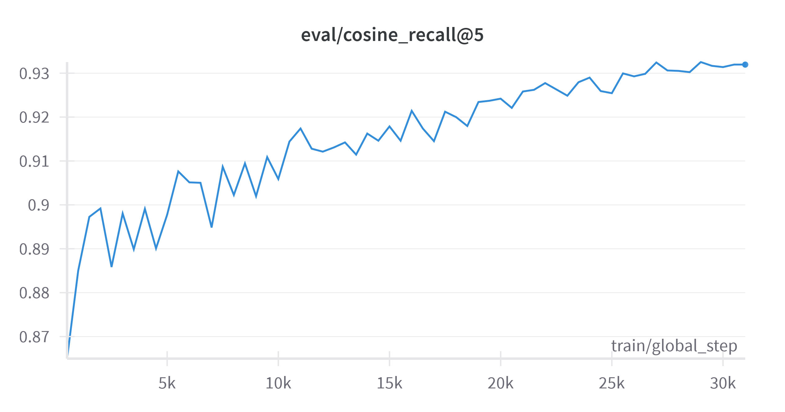

## Introduction

The goal of this tutorial is to demonstrate how to fine-tune a relatively small multilingual embedding model — such as [intfloat/multilingual-e5-base](https://huggingface.co/intfloat/multilingual-e5-base) with just 278M parameters — with a few lines of code. The objective is to adapt the model to a specific **retrieval task**, namely: improving the ability to retrieve relevant answers for given queries in a **multilingual setting**, focusing primarily on **English and German**.

The fine-tuning was performed on our dedicated GPU server **GEX44**, equipped with a **NVIDIA RTX™ 4000 SFF Ada Generation GPU (20 GB vRAM)**:


The project for fine-tuning has the following structure:

```
RETRIEVAL_FINETUNING/
├── .venv/
├── data/
│   ├── qa_data.csv
│   ├── qa_test_set.csv
│   ├── qa_training_set.csv
│   ├── qa_validation_set.csv
├── .env
├── eval.py
├── split_data.py
├── train.py
```

## Step 1 - Preparing the Data

Before fine-tuning an embedding model, you need to split your dataset into at least three parts: **training**, **validation**, and **test** sets.

* The **training set** is used to fine-tune the model.
* The **validation set** is used to monitor the model’s performance during training, typically after a fixed number of steps.
* The **test set** is used to evaluate the model’s final performance after fine-tuning is complete.

You can perform the split using the [train_test_split](https://scikit-learn.org/stable/modules/generated/sklearn.model_selection.train_test_split.html) function from [Scikit-learn](https://scikit-learn.org). In our setup, we first allocated **80%** of the data for training. Then, the remaining **20%** was further split equally into validation and test sets.

The **size of the dataset** plays a significant role in fine-tuning. In our experiment, we used approximately **100,000 examples**, which is generally sufficient for additional fine-tuning. This phase typically requires **much less data** than pretraining or initial task-specific fine-tuning, as the model has already learned both general language patterns and the structure of the task. It only needs to be **further adapted to the task within a specific domain**.

The data preparation can be implemented as follows:

```python
# File: split_data.py

from pathlib import Path
import pandas as pd
from sklearn.model_selection import train_test_split

DATA_DIR = Path("data")
DATA_PATH = DATA_DIR / "qa_data.csv"
TRAIN_PATH = DATA_DIR / "qa_training_set.csv"
VALIDATION_PATH = DATA_DIR / "qa_validation_set.csv"
TEST_PATH = DATA_DIR / "qa_test_set.csv"
VALIDATION_TEST_SIZE = 0.2  # 20% validation and test set from the original dataset
TEST_SIZE = 0.5  # 20% from the original dataset will be split into 50 % validation and 50% test set

def main():
    df = pd.read_csv(DATA_PATH)

    train_df, validation_test_df = train_test_split(df, test_size=VALIDATION_TEST_SIZE, random_state=42, shuffle=True)
    validation_df, test_df = train_test_split(validation_test_df, test_size=TEST_SIZE, random_state=42, shuffle=True)

    train_df.to_csv(TRAIN_PATH, index=False)
    validation_df.to_csv(VALIDATION_PATH, index=False)
    test_df.to_csv(TEST_PATH, index=False)

    print(f"Dataset split into {len(train_df)} training, {len(validation_df)} validation, and {len(test_df)} test examples.")
    print(f"Saved to '{TRAIN_PATH}', '{VALIDATION_PATH}', and '{TEST_PATH}'.")
```

## Step 2 - Fine-Tuning

Fine-tuning a pretrained embedding model can be implemented in just a few lines of code. As mentioned earlier, our goal is to demonstrate the **quickest and simplest way** to fine-tune such a model. More advanced and flexible configurations can be implemented using the [SentenceTransformerTrainer](https://sbert.net/docs/package_reference/sentence_transformer/trainer.html#sentence_transformers.trainer.SentenceTransformerTrainer) along with [SentenceTransformerTrainingArguments](https://sbert.net/docs/package_reference/sentence_transformer/training_args.html#sentence_transformers.training_args.SentenceTransformerTrainingArguments), which expose a wide range of training options.

The following code snippet shows the necessary steps to fine-tune the encoder:

```python
# File: train.py

import gc
import os
from pathlib import Path
import pandas as pd
import torch
from datasets import Dataset
from sentence_transformers import (
    SentenceTransformer,
    SentenceTransformerTrainer,
    SentenceTransformerTrainingArguments,
    evaluation,
    losses,
)

# GPU memory optimization
os.environ["PYTORCH_CUDA_ALLOC_CONF"] = "expandable_segments:True"

DATA_DIR = Path("data")
TRAIN_PATH = DATA_DIR / "qa_training_set.csv"
VALIDATION_PATH = DATA_DIR / "qa_validation_set.csv"
MODEL_NAME = "intfloat/multilingual-e5-base"
OUTPUT_DIR = "output/multilingual-e5-base_fine-tuned"

def main():
    # 1. Garbage collection before fine-tuning
    gc.collect()
    torch.cuda.empty_cache()

    # 2. Load data for fine-tuning
    train_dataset = load_data(TRAIN_PATH)
    validation_dataset = load_data(VALIDATION_PATH)

    # 3. Initialize the model to fine-tune
    model = SentenceTransformer(MODEL_NAME)

    # 4. Define the loss function
    train_loss = losses.MultipleNegativesRankingLoss(model)

    # 5. Prepare evaluator for validation
    validation_evaluator = prepare_evaluator(VALIDATION_PATH)

    # 6. Specify training arguments
    args = SentenceTransformerTrainingArguments(
        output_dir=OUTPUT_DIR,
        num_train_epochs=3,
        per_device_train_batch_size=24,
        per_device_eval_batch_size=24,
        learning_rate=2e-5,
        weight_decay=0.01,
        warmup_ratio=0.1,  # 10% of total steps for warmup
        fp16=True,  # enable mixed precision training
        eval_strategy="steps",
        eval_steps=500,
        save_strategy="epoch",
        logging_steps=500,
    )

    # 7. Create a trainer and fine-tune the model
    trainer = SentenceTransformerTrainer(
        model=model,
        args=args,
        train_dataset=train_dataset,
        eval_dataset=validation_dataset,
        loss=train_loss,
        evaluator=validation_evaluator,
    )
    trainer.train()

    print(f"\n✅ Fine-tuning completed! Checkpoints saved to: {OUTPUT_DIR}")
```

The [MultipleNegativesRankingLoss](https://sbert.net/docs/package_reference/sentence_transformer/losses.html#multiplenegativesrankingloss) is well suited for training data where each example contains a **single positive pair**, and **negative samples** are implicitly taken from other items in the **same batch**.

When fine-tuning the model using the [SentenceTransformerTrainingArguments](https://sbert.net/docs/package_reference/sentence_transformer/training_args.html#sentence_transformers.training_args.SentenceTransformerTrainingArguments), several key training arguments were configured to optimize performance, manage resource usage effectively, and improve evaluation results. These include:

* **Weight decay**: A regularization technique that adds a penalty term to the loss function, helping to prevent overfitting during training. A common starting value for weight decay is `0.01`.

* [Mixed Precision Training](https://huggingface.co/docs/transformers/v4.15.0/performance#fp16): This technique enables speeding up training and reducing GPU memory usage. 

* **Batch size**: When using mixed precision, it is important that the batch size is a multiple of 8 to ensure the efficient use of tensor cores. In our case, we were able to set the batch size to `24`.

* **Evaluation** and **save strategy**: In contrast to the evaluation strategy — which was configured to run every `500` steps—we set the save strategy to `epoch` to avoid excessive disk usage.

During training, the **loss** should **gradually decrease** over time. A **growing gap between the training loss and the evaluation** loss may indicate **overfitting**, where the model performs well on the training data but poorly on unseen data. The **gradient norm** should also remain within a reasonable range — **neither too large** (which may indicate unstable updates), **nor too small** (which could suggest vanishing gradients or training stagnation).

Below are the helper functions used to load training data and initialize the Information Retrieval evaluator:

```python
# File: train.py

def load_data(path):
    df = pd.read_csv(path)
    anchors = []
    positives = []

    for _, row in df.iterrows():
        anchors.append(f"query: {row['Question']}")
        positives.append(f"passage: {row['Answer']}")

    return Dataset.from_dict(
        {
            "anchor": anchors,
            "positive": positives,
        }
    )

def prepare_evaluator(path):
    df = pd.read_csv(path)
    queries = {}
    corpus = {}
    relevant_docs = {}

    for idx, row in df.iterrows():
        qid = f"q{idx}"
        did = f"d{idx}"
        queries[qid] = f"query: {row['Question']}"
        corpus[did] = f"passage: {row['Answer']}"
        relevant_docs[qid] = {did}

    return evaluation.InformationRetrievalEvaluator(queries, corpus, relevant_docs)
```

These functions use the input format recommended for multilingual **E5** models in query-passage (or in this case, query-answer) fine-tuning tasks. For evaluation during training, the [InformationRetrievalEvaluator](https://sbert.net/docs/package_reference/sentence_transformer/evaluation.html#informationretrievalevaluator) provides a simple way to assess model performance on retrieval tasks.

For example, the following plot — created with [Weights & Biases](https://wandb.ai/site) — shows the **cosine_recall@5** metric plotted against training steps. An improvement of approximately **6.5%** can be observed from the beginning to the end of fine-tuning, indicating that the model successfully learned to retrieve more relevant answers.



## Step 3 - Comparing the Base and the Fine-Tuned Model

The [InformationRetrievalEvaluator](https://sbert.net/docs/package_reference/sentence_transformer/evaluation.html#informationretrievalevaluator) evaluates the model by generating embeddings from the test set of queries and their corresponding passages (or answers, in our case).

- For each query in the test set, the top-*k* most similar answers are retrieved using **cosine similarity**. These retrieved answers are then compared against the ground-truth answer.
- Based on this comparison, various evaluation metrics are calculated at the **query level**, including **cosine_accuracy@k**, **cosine_precision@k**, **cosine_recall@k**, **cosine_ndcg@k**, **cosine_map@k**, and **cosine_mrr@k**.
- These metrics are then **averaged across all queries** to provide a final evaluation summary.

While many metrics are available, in our specific setup — where there is only one relevant answer per query — some of them become equivalent:

- **cosine_recall@k** yields a binary score for each query: 0 if the correct answer is *not* retrieved in the top-*k* results, and 1 if it *is*. As a result, **cosine_recall@k** becomes equivalent to **cosine_accuracy@k**.
- For the same reason, **cosine_map@k** and **cosine_mrr@k** yield identical results.

The following script shows the evaluation process:

```python
# File: eval.py

from pathlib import Path
import pandas as pd
from sentence_transformers import SentenceTransformer, evaluation

DATA_DIR = Path("data")
TEST_PATH = DATA_DIR / "qa_test_set.csv"
BASE_MODEL_NAME = "intfloat/multilingual-e5-base"
CHECKPOINT_PATH = "output/multilingual-e5-base_fine-tuned/checkpoint-30000"

def main():
    df = pd.read_csv(TEST_PATH)
    queries, corpus, relevant_docs = prepare_ir_evaluator(df)

    print("Loading models...")
    base_model = SentenceTransformer(BASE_MODEL_NAME)
    finetuned_model = SentenceTransformer(CHECKPOINT_PATH)

    print("\nEvaluating the base model...")
    base_results = evaluate_model(base_model, queries, corpus, relevant_docs)

    print(f"\nEvaluating the fine-tuned checkpoint {CHECKPOINT_PATH} ...")
    finetuned_results = evaluate_model(finetuned_model, queries, corpus, relevant_docs)

    print("\n--- Comparison ---")
    metrics = finetuned_results.keys()
    for metric in metrics:
        base_val = base_results[metric]
        fin_val = finetuned_results[metric]
        print(f"{metric}: base={base_val:.4f} | fine-tuned={fin_val:.4f} | Δ={fin_val - base_val:.4f}")
```

Below are the helper functions used to evaluate the models:

``` python
# File: eval.py

def prepare_ir_evaluator(df):
    queries = {}
    corpus = {}
    relevant_docs = {}

    for idx, row in df.iterrows():
        qid = f"q{idx}"
        did = f"d{idx}"
        queries[qid] = f"query: {row['Question']}"
        corpus[did] = f"passage: {row['Answer']}"
        relevant_docs[qid] = {did}

    return queries, corpus, relevant_docs

def evaluate_model(model, queries, corpus, relevant_docs):
    evaluator = evaluation.InformationRetrievalEvaluator(queries, corpus, relevant_docs)
    result = evaluator(model)
    return result
```

## Conclusion

* The fine-tuning was conducted on a GEX44 server equipped with a **NVIDIA RTX™ 4000 SFF Ada Generation GPU** (20 GB vRAM). A **single GPU** was sufficient, and the entire process completed within a few hours.
* Despite using mostly **default hyperparameters** and training for only **three epochs** on approximately **80,000 examples**, the evaluation metrics showed clear improvements. This demonstrates that fine-tuning is effective, even with minimal effort.

**Additional Resources:**

* [SentenceTransformers Documentation](https://sbert.net/docs/sentence_transformer/training_overview.html#)
* [Hugging Face Tutorial](https://huggingface.co/blog/train-sentence-transformers)

##### License: MIT

<!--

Contributor's Certificate of Origin

By making a contribution to this project, I certify that:

(a) The contribution was created in whole or in part by me and I have
    the right to submit it under the license indicated in the file; or

(b) The contribution is based upon previous work that, to the best of my
    knowledge, is covered under an appropriate license and I have the
    right under that license to submit that work with modifications,
    whether created in whole or in part by me, under the same license
    (unless I am permitted to submit under a different license), as
    indicated in the file; or

(c) The contribution was provided directly to me by some other person
    who certified (a), (b) or (c) and I have not modified it.

(d) I understand and agree that this project and the contribution are
    public and that a record of the contribution (including all personal
    information I submit with it, including my sign-off) is maintained
    indefinitely and may be redistributed consistent with this project
    or the license(s) involved.

Signed-off-by: Hetzner

-->
