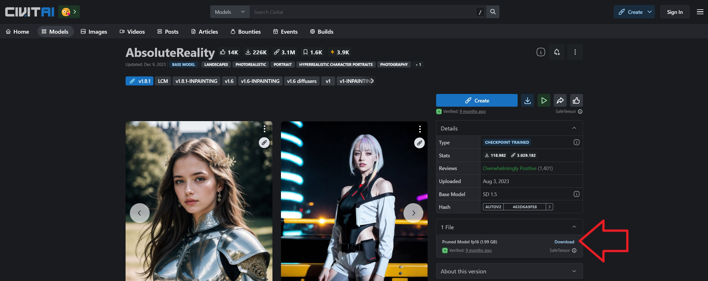
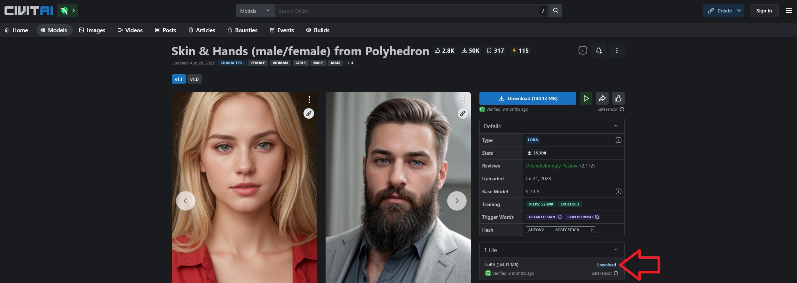
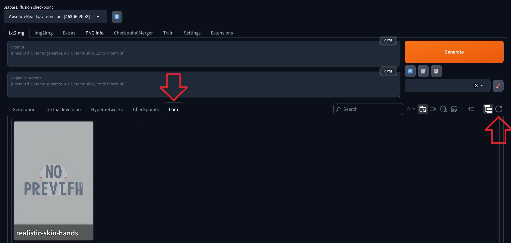
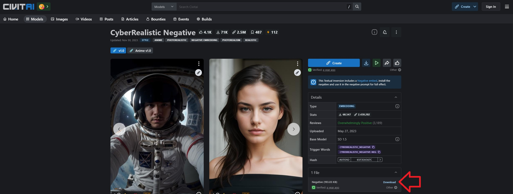
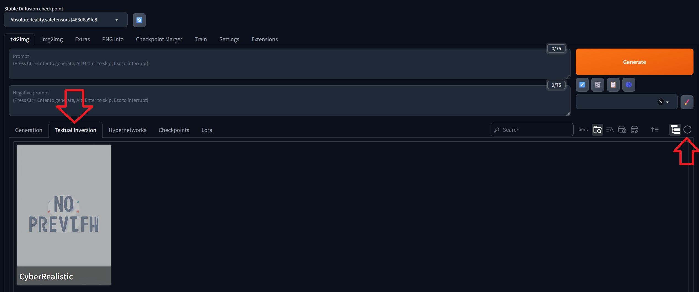
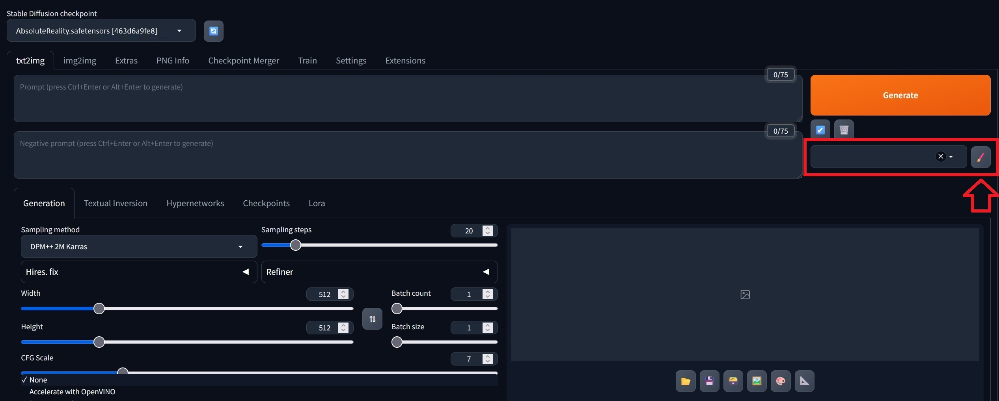
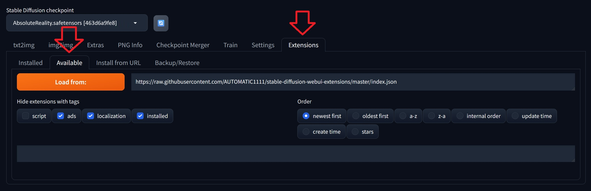
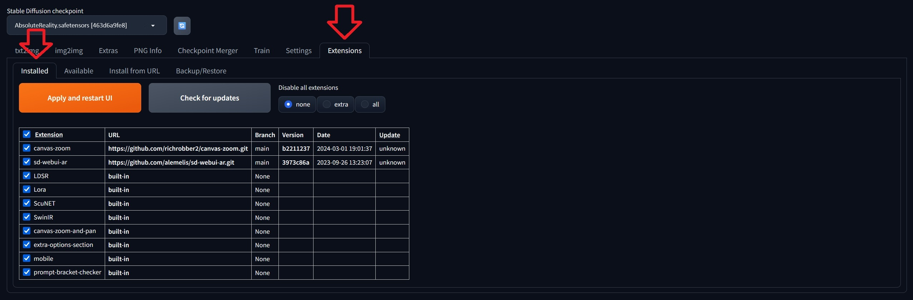
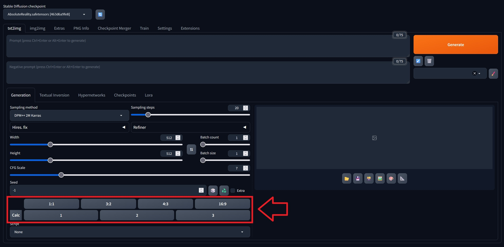

## Einleitung

Dieses Tutorial erklärt wie man auf einem Server mit Ubuntu oder Debian die Stable Diffusion Web UI installiert und wie man mit den folgenden Komponenten das Ergebnis der Bildergenerierung weiter verfeinert:

| Komponenten | Beschreibung |
| ----------- | ------------ |
| Checkpoint  | Modelle werden normalerweise laufend trainiert. Während der Trainingsphase ist es möglich immer wieder mal den aktuellen Zwischenstand zu speichern und diese Datei für Inference zu verwenden. Diese Dateien nennt man "Checkpoints". |
| LoRA        | LoRA-Modelle werden oft zusätzlich zum "vollständigen" Modell genutzt und werden für etwas trainiert, das im Basismodell fehlt. Dafür werden in das Modell zusätzliche Layer eingefügt. Mit LoRA ist es zum Beispiel möglich Bilder von sich selbst zu generieren. |
| Embeddings  | Ähnlich wie LoRA-Modelle werden auch Embeddings (Textual Inversion) für etwas trainiert, das im Basismodell noch fehlt. Mit Textual Inversion wird ein Vektor für den Style, das Gesicht, das Objekt, oder was auch immer trainiert wird, erstellt, durch welchen das Modell genau weiß, wie dieses auszusehen hat. Das bedeutet, anstelle von LoRA, könnte man auch Textual Inversion verwenden, um zum Beispiel Bilder von sich selbst zu generieren. |
| Styles      | Man kann sich selbst Prompts und negative Prompts überlegen und diese als "Style" speichern. Wenn man einen Style auswählt, werden beim Generieren des Bildes alle Prompts und negative Prompts des Styles miteinbezogen. Wenn man ein Bild generiert, muss man dadurch nur angeben, was man sehen möchte (z.B. Tassen). Um das Bild wie Pop Art aussehen zu lassen, kann man zusätzlich schlicht den entsprechenden "Style" auswählen, den man dafür erstellt hat. |

**CPU vs. GPU**

Im Kontext von AI gibt es einen Unterschied darin, wofür sich CPUs und GPUs am Besten eignen:

* **Training:** Wenn das Modell erstellt und mit großen Datenmengen gefüttert wird, werden **GPUs** benötigt.

* **Inference:** Wenn man das Modell nach dem Training verwendet, reichen CPUs oft aus und sind dann die bevorzugte Wahl. Um eine ähnliche Leistung wie mit GPUs zu erzielen, muss man die Modelle allerdings komprimieren.

Da dies ein "Inference Tutorial" ist, kann auch ein Server ohne GPU verwendet werden. Beachte aber, dass dieses Tutorial ausschließlich erklärt, wie man die Stable Diffusion Web UI installiert und verwendet. Es wird nicht erklärt, wie man das Modell komprimieren kann ("Quantization", "Distillation", "Pruning"). Für eine bessere Leistung auf CPU-Servern, musst du die Modelle selbst komprimieren.

**Voraussetzungen**

* **Ein Server** mit Ubuntu/Debian
  * Zugriff auf einen Benutzer mit sudo-Rechten.

Das Tutorial wurde getestet mit *Ubuntu 22.04/24.04* und *Debian 12*.

## Schritt 1 - Stable Diffusion Web UI

Folge diesen Schritten für eine automatische Installation der [Stable Diffusion Web UI](https://github.com/AUTOMATIC1111/stable-diffusion-webui?tab=readme-ov-file#stable-diffusion-web-ui) unter Linux:

* Abhängigkeiten installieren
  
  Beim Installieren von Python muss darauf geachtet werden, dass die Python-Version von PyTorch unterstützt wird. Zur Zeit, als das Tutorial geschrieben wurde, unterstützt PyTorch die Versionen 3.8-3.11 (siehe diese [PyTorch-Dokumentation](https://pytorch.org/get-started/locally/#linux-python)). Mit `apt-cache policy python3` kannst du prüfen, welche Versionen aktuell über den Paket-Manager (apt) verfügbar sind. Wenn dein Paket-Manager beispielsweise nur über Python Version 3.12 verfügt, kannst du erst das `ppa:deadsnakes/ppa`-Repository hinzufügen, bevor du Python installierst. In diesem Beispiel wird Python Version 3.11 installiert:
  
  ```bash
  sudo add-apt-repository ppa:deadsnakes/ppa
  sudo apt update && sudo apt install wget git python3.11 python3-pip python3-venv libgl1 libglib2.0-0 -y
  ```
  Mit `python3.11 --version` kannst du prüfen, ob die richtige Version installiert wurde.

* Stable Diffusion Web UI Repository herunterladen und benutzerdefinierte Einstellungen hinzufügen
  ```bash
  cd ~ && git clone https://github.com/AUTOMATIC1111/stable-diffusion-webui.git
  nano ~/stable-diffusion-webui/webui-user.sh
  ```
  Bei `COMMANDLINE_ARGS` kannst du Flags ergänzen, die genutzt werden sollen, wenn die Web UI gestartet wird. Denke daran das `#`-Symbol am Anfang der Zeile zu entfernen. In diesem Beispiel werden die Flags `--share`, `--theme` und `--enable-insecure-extension-access` hinzugefügt:
  ```sh
  export COMMANDLINE_ARGS="--share --theme dark --enable-insecure-extension-access"
  ```
  
  * <kbd>share</kbd>: Standardmäßig kann man die Web UI nur auf dem Localhost erreichen. Um auf die Web UI über eine öffentliche URL zuzugreifen, muss die "share" Flag mitangegeben werden.
  * <kbd>theme</kbd>: Die Web UI gibt es in: `light` und `dark`. Wenn diese Flag beim Starten der Web UI nicht angegeben wird, wird standardmäßig `light` verwendet.
  * <kbd>enable-insecure-extension-access</kbd>: Damit wird der Extensions-Tab angezeigt, unabhängig von anderen Optionen. Diese Flag wird für "[Schritt 7 - Extensions hinzufügen](#schritt-7---extensions-hinzufügen)" benötigt.
  
  Für weitere Flags, siehe die [Stable Diffusion Web UI Dokumentation](https://github.com/AUTOMATIC1111/stable-diffusion-webui/wiki/Command-Line-Arguments-and-Settings#all-command-line-arguments) auf GitHub.

## Schritt 2 - Modelle hinzufügen

Wenn du die Stable Diffusion Web UI startest, ohne vorher selbst Modelle zu hinterlegen, wird automatisch ein "allgemeines" Modell heruntergeladen. Dieses Modell kann alles ein bisschen, aber nichts besonders gut. Wenn man Bilder in einem ganz bestimmten Stil generieren möchte, z.B. realistisch, Pop Art, oder andere, erhält man bessere Ergebnisse, wenn man ein Modell verwendet, welches speziell für diesen Anwendungsfall trainiert wurde.

Modelle gibt es beispielsweise hier: [civitai.com/search/models?modelType=Checkpoint](https://civitai.com/search/models?modelType=Checkpoint).

Nutze folgende Filteroptionen:

* **Filter by Model Type:** Checkpoint
* **Filter by File Format:** Safe Tensor

Dieses Beispiel verwendet [AbsoluteReality](https://civitai.com/models/81458).

* Wähle die Datei, die du herunterladen möchtest mit einem Rechtsklick aus und klicke auf "Link kopieren".
  
  > Auf Servern ohne GPUs sind "Pruned FP16" Modell-Dateien die bevorzugte Wahl, falls verfügbar. Diese Dateien sind kleiner als FP32, zum Beispiel, und bieten meist dieselbe Qualität.
  
  

* Öffne den `models/Stable-diffusion`-Ordner auf dem Server und lade die Datei herunter. Gib dem Modell einen wiedererkennbaren Namen.
  
  > Ersetze den untenstehenden Link mit dem soeben kopierten Link zu dem Modell deiner Wahl.
  
  ```bash
  cd ~/stable-diffusion-webui/models/Stable-diffusion
  wget "https://civitai.com/api/download/models/132760?type=Model&format=SafeTensor&size=pruned&fp=fp16" -O AbsoluteReality.safetensors
  ```

  Mit der `-O`-Flag kannst du dem Checkpoint einen wiedererkennbaren Namen geben. Achte auch darauf die richtige Dateiendung anzugeben. Zwei weit verbreitete Dateiformate für Modelle sind `.ckpt` und `.safetensors`. `.ckpt`-Dateien können aufgrund der Verwendung von "Pickles" ggfls. bösartigen Code enthalten, wodurch `.safetensors`-Dateien im Vergleich sicherer sind.

## Schritt 3 - Web UI starten

Momentan wird die Web UI automatisch beendet, sobald man die Verbindung zum Server schließt. Eine Möglichkeit die Web UI weiterlaufen zu lassen, ist das `screen`-Tool. Mit **screen** ist es möglich innerhalb einer externen Terminal-Sitzung eine separate virtuelle Terminal-Sitzung zu starten.

Wenn man die externe Terminal-Sitzung beendet, läuft die virtuelle Terminal-Sitzung (screen-Sitzung) trotzdem weiter. Wenn man sich das nächste Mal wieder mit dem Server verbindet, ist die screen-Sitzung weiterhin verfügbar.

<details>

<summary>Screen installieren</summary>

Wenn "screen" noch nicht installiert ist, kann es jetzt installiert werden mit:

```bash
sudo apt update && sudo apt install screen -y
```

---------

</details>

Um die Web UI in einer screen-Sitzung auf dem Server zu starten, muss man:

* **Die Sitzung starten**
  ```bash
  screen -S stable-diffusion-screen
  ```
  > `stable-diffusion-screen` kann mit einem beliebigen Namen ersetzt werden.

* **Den "Stable Diffusion"-Ordner öffnen**<br>
  Öffne den Ordner, in dem Stable Diffusion gespeichert wurde und starte eine virtuelle Umgebung für Python. In diesem Tutorial wurde dieser Pfad verwendet:
  
  ```bash
  cd ~/stable-diffusion-webui
  python3 -m venv venv --system-site-packages
  source venv/bin/activate
  ```

* **Überprüfe die Python-Version**
  
  Bevor die Web UI gestartet wird, sollte zur Sicherheit nochmal geprüft werden, ob standardmäßig die richtige Python-Version verwendet wird. Wenn die Standard-Version nicht mit der übereinstimmt, die zuvor installiert wurde, kann das jetzt noch geändert werden. Dieses Tutorial geht davon aus, dass auf dem Server ausschließlich die Stable Diffusion Web UI gehostet wird. Wenn der Server noch für weitere Anwendungen genutzt wird, sollte die Python-Version nicht unbedacht geändert werden, um Fehlermeldungen zu vermeiden.
  
  * Standard-Version anzeigen
    ```shellsession
    holu@ubuntu-2gb-hel1-3:~$ python3 --version
    Python 3.12.3
    ```
  * Standard-Version ändern
    > Ersetze `3.11` mit der Version, die du standardmäßig verwenden möchtest und `9` mit der Priorität.
    ```bash
    sudo update-alternatives --install /usr/bin/python3 python3 /usr/bin/python3.11 9
    pip install --upgrade setuptools
    ```
  Mit `python3 --version` sollte jetzt die Version angezeigt werden, die du gerade festgelegt hast.

* **Die Web UI starten**
  
  Wenn der Befehl das erste mal ausgeführt wird, kann es etwas dauern bis alles eingerichtet ist.
  
  * NVidia GPUs
    ```bash
    ./webui.sh --xformers
    ```
    > Bei GPUs mit 4 bis 6/8 Gigabite VRAM kann die Flag `--medviram` angegeben werden, um den VRAM-Verbrauch zu verringern.
  
  * Nur CPUs
    ```bash
    ./webui.sh --skip-torch-cuda-test --precision full --no-half
    ```

Die Web UI sollte jetzt unter `http://127.0.0.1:7862` erreichbar sein. Wenn die Flag `--share` mitangegeben wurde, solltest du zusätzlich eine temporäre öffentliche URL angezeigt bekommen, die in etwa so aussieht: `https://<random-string>.gradio.live`.

> Wenn du `--share` verwendet hast, aber keine öffentliche URL erstellt wurde, ist es möglich, dass der Fehler bei gradio liegt (siehe [gradio-Statusseite](https://status.gradio.app/793595965)).

---------

Die screen-Sitzung kann man mit der Tastenkombination `ctrl`+`A` gefolgt von `D` verlassen. Die screen-Sitzung selbst wird damit nicht beendet und die Web UI bleibt weiterhin erreichbar. Die externe Terminal-Sitzung kann jetzt auch beendet werden.

Mit folgenden Befehlen kann man die Stable Diffsion Web UI screen-Sitzung erneut öffnen oder Änderungen vornehmen:

* Alle "Screens" listen
  ```bash
  screen -list
  ```
  > Der Screen, der gerade erstellt wurde, sollte hier auch gelistet werden.

* In eine laufende screen-Sitzung wechseln
  ```bash
  screen -dr stable-diffusion-screen
  ```
  > Wenn ein anderer Name verwendet wurde, muss `stable-diffusion-screen` entsprechend angepasst werden.

* Screen-Sitzung löschen<br>
  ```bash
  screen -X -S stable-diffusion-screen quit
  ```
  > **Hinweis:** Damit wird die Stable Diffusion Web UI beendet und die screen-Sitzung ist anschließend nicht mehr verfügbar.

## Schritt 4 - LoRA hinzufügen

Wie in der "Einleitung" bereits erwähnt, kann man ein LoRA-Modell zusätzlich zum Basismodell verwenden. Diese LoRA-Modelle werden für bestimmte Anwendungsfälle trainiert und dafür genutzt die Fähigkeiten des Basismodells zu erweitern und zu verbessern.

LoRA-Modelle gibt es beispielsweise hier: [civitai.com/search/models?modelType=LORA](https://civitai.com/search/models?modelType=LORA).

Nutze folgende Filteroptionen:

* **Filter by Model Type:** LoRA
* **Filter by File Format:** Safe Tensor

Da LoRA-Modelle normalerweise als "Erweiterung" für ein Basismodell verwendet werden, sind diese meist kleiner als Checkpoints.

Im Beispiel aus "[Schritt 2 - Modelle hinzufügen](#schritt-2---modelle-hinzufügen)" wird ein Modell für realistische Bilder verwendet. Passend zu diesem Thema, wird im folgenden Beispiel ein LoRA-Modell für realistische Haut und Hände heruntergeladen:

* [Skin & Hands (male/female) from Polyhedron](https://civitai.com/models/109043/skin-and-hands-malefemale-from-polyhedron)

--------------------

Nachdem du dich für ein LoRA-Modell entschieden hast, folge diesen Schritten, um es in der Stable Diffusion Web UI hinzuzufügen:

* Wähle die Datei, die du herunterladen möchtest mit einem Rechtsklick aus und klicke auf "Link kopieren".
  
  

* Öffne den `models/Lora`-Ordner auf dem Server und lade die Datei herunter.
  
  > Ersetze den untenstehenden Link mit dem soeben kopierten Link zu dem Modell deiner Wahl.
  
  ```bash
  cd ~/stable-diffusion-webui/models/Lora
  wget "https://civitai.com/api/download/models/122580?type=Model&format=SafeTensor" -O realistic-skin-hands.safetensors
  ```
  
  Mit der `-O`-Flag kannst du dem LoRA-Modell einen wiedererkennbaren Namen geben. Achte auch darauf die richtige Dateiendung anzugeben. Zwei weit verbreitete Dateiformate für Modelle sind `.ckpt` und `.safetensors`. `.ckpt`-Dateien können aufgrund der Verwendung von "Pickles" ggfls. bösartigen Code enthalten, wodurch `.safetensors`-Dateien im Vergleich sicherer sind.

* Öffne die Web UI und wähle "Lora" aus. Wenn du das Symbol zum Aktualisieren auswählst, sollte das LoRA-Modell erscheinen, welches du gerade heruntergeladen hast.
  
  

* Klicke auf das Modell. Das Modell sollte automatisch im folgenden Format im Texteingabefeld hinzugefügt werden:
  
  > Du kannst die Stärke individuell anpassen. Oft reicht `0.8` bereits aus.
  
  ```bash
  <lora:model-name:1>
  ```

  Ob ein Modell nun im "Prompt" oder "Negative prompt" Eingabefeld angegeben werden muss hängt vom LoRA-Modell ab. Wenn du das Beispiel aus diesem Tutorial verwendet hast, musst du `<lora:skin-hands:1>` in das "Negative prompt" Eingabefeld verschieben.

* Du kannst nun wieder zu "Generation" zurückwechseln. Denke daran deine eigenen Schlagwörter anzugeben, und eventuell auch ein paar "Triggerwörter", die in der Beischreibung des Modells auf [civitai.com](https://civitai.com/) angegeben wurden. Klicke anschließend auf "Generate". Beispiel:

  ```bash
  Prompt
  young woman, detailed skin
  
  Negative prompt
  <lora:skin-hands:1>
  ```

## Schritt 5 - Embeddings hinzufügen

In der Web UI kannst du in den "Prompt" und "Negative prompt" Eingabefeldern Schlagwörter angeben, die bestimmen was das generierte Bild enthalten oder eben nicht enthalten soll. In diesen Eingabefeldern können auch Embeddings angegeben werden, die während der Bildgenerierung verwendet werden sollen. Bei Textual Inverion werden oft 20 bis 50 Bilder im Training verwendet. Je nach Anwendungsfall können es aber natürlich auch mal mehr oder weniger sein. Die Dateigröße von Embeddings ist nochmal kleiner als die Dateigröße von LoRA-Modellen.

Embeddings gibt es beispielsweise hier: [civitai.com/search/models?modelType=TextualInversion](https://civitai.com/search/models?modelType=TextualInversion).

Nutze folgende Filteroptionen:

* **Filter by Model Type:** Embedding

Im Beispiel aus "[Schritt 2 - Modelle hinzufügen](#schritt-2---modelle-hinzufügen)" wird ein Modell für realistische Bilder verwendet. Passend zu diesem Thema, wird im folgenden Beispiel ein Embedding für eine noch realistischere Anzeige heruntergeladen:

* [CyberRealistic Negative](https://civitai.com/models/77976/cyberrealistic-negative)

--------------------

Nachdem du dich für ein Embedding entschieden hast, folge diesen Schritten, um es in der Stable Diffusion Web UI hinzuzufügen:

* Wähle die Datei, die du herunterladen möchtest mit einem Rechtsklick aus und klicke auf "Link kopieren".
  
  

* Öffne den `embeddings`-Ordner auf dem Server und lade die Datei herunter.
  
  > Ersetze den untenstehenden Link mit dem soeben kopierten Link zu dem Embedding deiner Wahl.
  
  ```bash
  cd ~/stable-diffusion-webui/embeddings
  wget "https://civitai.com/api/download/models/82745?type=Negative&format=Other" -O CyberRealistic.pt
  ```

* Öffne die Web UI und wähle "Textual Inversion" aus. Wenn du das Symbol zum Aktualisieren auswählst, sollte das Embedding erscheinen, welches du gerade heruntergeladen hast.
  
  

* Embeddings können unterschiedlich verwendet werden, lies also unbedingt vorher die Beschreibung durch.

  Das Embedding, welches in diesem Beispiel verwendet wurde ist ein "Negatives Embedding". Klicke daher zunächst in das "Negative prompt" Eingabefeld. Anschließend kannst du auf das Embedding selbst klicken und es somit automatisch im entsprechenden Eingabefeld hinzufügen.

  Andere Embeddings können beispielsweise bestimmte Schlagwörter verwenden. Ein Beispiel dafür wäre das Embedding "[SCG Emotions Pack](https://civitai.com/models/8860/scg-emotions-pack-simple-embeds-for-easily-controlling-a-variety-of-emotions-for-all-15-models-and-merges)". Es beinhaltet verschiedene Emotionen, welche durch feste Begriffe (z.B. `Happy512` oder `nervous512`) angewendet werden können. Man könnte es so nutzen:
  ```bash
  a portrait of a nervous512 young woman
  ```

* Denke daran deine eigenen Schlagwörter anzugeben, und eventuell auch ein paar "Triggerwörter", die in der Beischreibung des Embeddings auf [civitai.com](https://civitai.com/) angegeben wurden. Klicke anschließend auf "Generate". Beispiel:

  ```bash
  Prompt
  young woman, detailed skin
  
  Negative prompt
  <lora:skin-hands:0.8> CyberRealistic
  ```

## Schritt 6 - Styles hinzufügen

Wie zuvor bereits erwähnt, kann man in den "Prompt" und "Negative prompt" Eingabefeldern Schlagwörter angeben, die bestimmen was das generierte Bild enthalten oder eben nicht enthalten soll. Während sich manche Anforderungen von Bild zu Bild unterscheiden, gibt es Andere, die immer gleich bleiben. Du könntest zum Beispiel ein Ölgemälde von einer Person generieren und bereits jetzt wissen, dass du künftig noch mehr Ölgemälde erstellen möchtest (z.B. von einem Hund oder einem Krieger auf einem Pferd). In so einem Fall, kannst du die entsprechenden Schlagwörter (z.B. "Ölgemälde" oder "verzierter Rahmen") als Style speichern. Wenn du ein neues Bild generierst und diesen Style auswählst, werden automatisch alle Schlagwörter aus den Eingabefeldern und alle Schlagwörter aus dem Style miteinbezogen.

Folge diesen Schritten, um einen neuen Style hinzuzufügen:

* Unter "Generate" kann man Styles hinzufügen. Wähle das Pinsel-Icon aus und erstelle einen neuen Style.
  
  

* Du solltest jetzt einen Titel und Prompts hinzufügen können. Wenn du den Style in Zukunft auswählst, werden die Schlagwörter, die du hier angegeben hast, automatisch angewendet. Es können auch LoRA-Modelle oder Embeddings angegeben werden. In diesem Fall sollte man aber sichergehen, dass diese auch auf dem Server installiert sind.
  
  ```bash
  Style
  Oilpainting

  Prompt
  oilpainting, dark background, soft and warm illuminated foreground, ornate frame

  Negative prompt
  bright colors
  ```
  Sobald alle Schlagwörter hinzugefügt wurden, kannst du deinen neuen Style speichern.

* Einen Style verwenden
  
  Um den Style zu verwenden, öffne das Dropdown-Menü und wähle alle Styles aus, die bei der Bildgenerierung angewendet werden sollen.

* Styles bearbeiten oder löschen

  In der Web UI musst du zunächst nochmal das Pinsel-Icon anklicken. Klicke anschließend in das Textfeld für den Titel und wähle den Style aus, den du bearbeiten möchtest.

  Auf dem Server werden die Styles in der Datei `stable-diffusion-webui/styles.csv` im folgenden Format gespeichert:
  
  ```bash
  title, "<positive-prompts>", "<negative-prompts>"
  ```

  Du kannst die Styles in der Datei nach Bedarf bearbeiten und löschen. Sobald Änderungen in der `styles.csv`-Datei vorgenommen werden, sollte die Web UI direkt neugestartet werden, um die Änderungen zu übernehmen.

## Schritt 7 - Extensions hinzufügen

Extensions ermöglichen es zusätzliche Funktionen zu nutzen; zum Beispiel in der Web UI.

Folge diesen Schritten, um Extensions zu installieren:

* Öffne `Extensions`»`Available` und wähle `Load from:` aus
  

* Scrolle durch die Liste und installiere die Extensions, die du verwenden möchtest. Beispiele:
  
  | Extension   | Beschreibung |
  | ----------- | ------------ |
  | Aspect Ratio selector<br><small>UI related</small> | Auch ohne Extension ist es immer möglich die Höhe und Breite der Bilder manuell anzupassen. Mit dieser Extension werden zusätzlich die gängigsten Bildverhältnissen angezeigt, mit welchen die Höhe und Breite automatisch angepasst wird. Zum Beispiel:<br> `1:1`, `3:2`, `4:3`, `16:9` |
  | sd-webui-controlnet | Hiermit ist es möglich Skizzen und ähnliches in richtige Bilder umzuwandeln (siehe die [Galerie mit Beispielbildern](https://github.com/Mikubill/sd-webui-controlnet?tab=readme-ov-file#gallery) und die [Mindestanforderungen](https://github.com/Mikubill/sd-webui-controlnet?tab=readme-ov-file#minimum-requirements), welche in dem offiziellen GitHub-Repository enthalten sind). |

  Auf dem Server, können alle installierten Extensions in dem Ordner `stable-diffusion-webui/extensions` verwaltet werden.

* Öffne `Extensions`»`Installed` und wähle `Apply and restart UI` aus
  
  > Wenn du die öffentliche URL verwendest, musst du nun die neue URL aus der screen-Sitzung auf dem Server kopieren.
  
  

* Für die `UI related` Extensions kannst du nun zurück auf die Seite zum Bildergenerieren wechseln. Dort sollten die Optionen nun auch die Extensions enthalten.
  

## Ergebnis

In diesem Tutorial wurde erklärt, wie man einen KI-Bildgenerator auf einem eigenen Server hostet und eigene Modelle hinzufügt.

##### License: MIT

<!--

Contributor's Certificate of Origin

By making a contribution to this project, I certify that:

(a) The contribution was created in whole or in part by me and I have
    the right to submit it under the license indicated in the file; or

(b) The contribution is based upon previous work that, to the best of my
    knowledge, is covered under an appropriate license and I have the
    right under that license to submit that work with modifications,
    whether created in whole or in part by me, under the same license
    (unless I am permitted to submit under a different license), as
    indicated in the file; or

(c) The contribution was provided directly to me by some other person
    who certified (a), (b) or (c) and I have not modified it.

(d) I understand and agree that this project and the contribution are
    public and that a record of the contribution (including all personal
    information I submit with it, including my sign-off) is maintained
    indefinitely and may be redistributed consistent with this project
    or the license(s) involved.

Signed-off-by: Svenja Michal

-->
