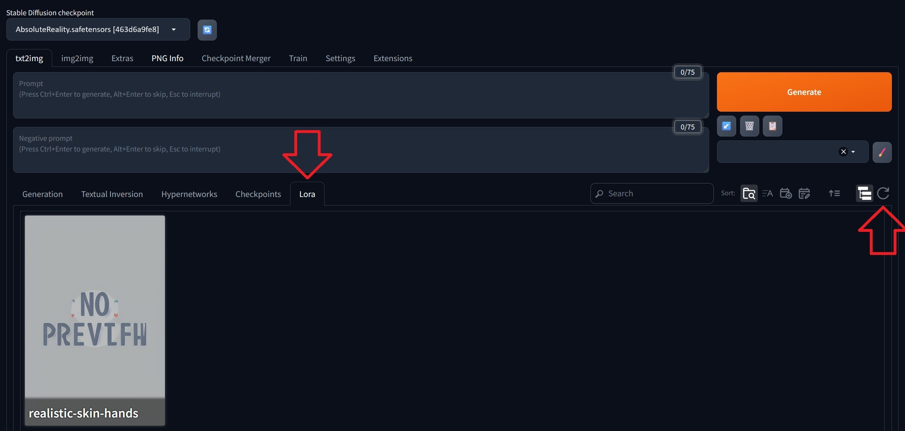
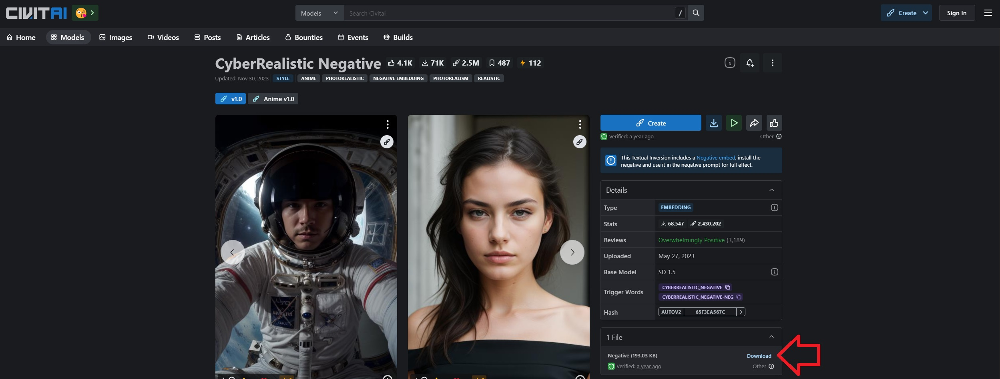
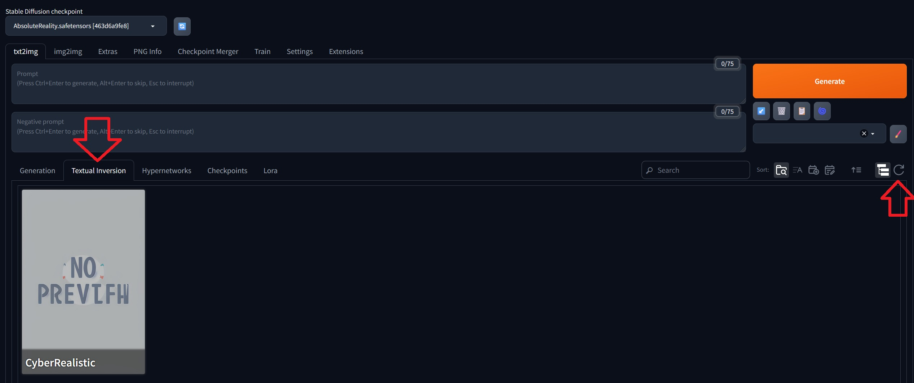
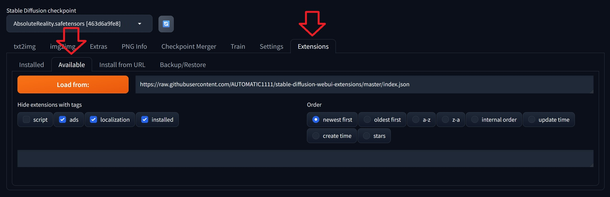
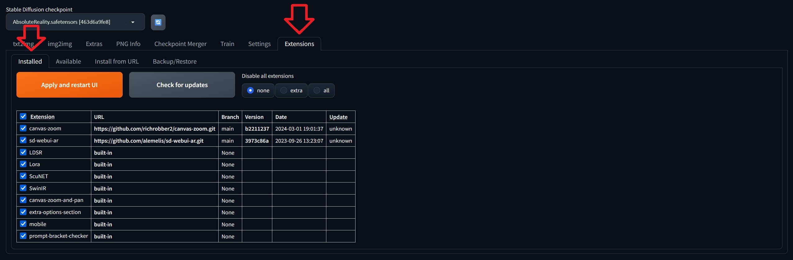
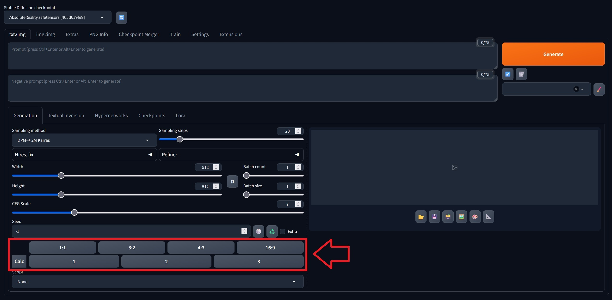

## Introduction

This tutorial explains how to install the Stable Diffusion Web UI on a server with Ubuntu or Debian. It also shows how to add the following components for a more refined image generation:

| Component   | Description |
| ----------- | ----------- |
| checkpoints | Usually, models are trained on an ongoing basis. In between training, you can save the current state and use that file for inference. Those files are called "checkpoints". |
| LoRA        | LoRA is often used in addition to a "full" model and is trained on something that is missing in the base model. For this, it inserts new layers into the model. You could use LoRA, for example, to create images of yourself. |
| embeddings  | Just like LoRA models, embeddings (Textual Inversion) are usually trained on something that is missing in the base model. Textual inversion creates a vector for the style, face, object, or whatever you trained it on, that tells the base model exactly what this should look like. This means, instead of LoRA, you could also use textual inversion to generate images of yourself, for example.  |
| styles      | You can save a set of prompts and negative prompts as "style". Whenever you select a style, all keywords specified as prompt and negative prompt will be applied. When you generate an image, you only need to specify what you want to see in the image (e.g. cups). To make it look like pop art, for example, you can just select the respective "style" you created. |

**CPU vs. GPU**

In the context of AI, CPU and GPU are best suited for two different purposes:

* **Training:** When you build the model and feed it with large datasets, you will need a **GPU**. Training is usually a single big task that can require a lot of memory bandwidth and parallel compute capabilities. GPUs consume more power than CPUs but the training tasks are completed quicker.

* **Inference:** When it comes to actually using the model, CPUs are often sufficient and more efficient. They consume less power and reduce costs. However, you need to compress the models to get a similar performance you'd see with GPUs.

As this is an "inference tutorial", you can use a server with CPU-only. Note, however, that this tutorial only explains how to install and use the Stable Diffusion Web UI. It does not cover model compression techniques (e.g. quantization, distillation, pruning). For better performance on CPU-only servers, you should make sure you compress the models yourself.

**Prerequisites**

* **One server** with Ubuntu/Debian
  * You need access to a user with sudo permissions.

The tutorial was tested with *Ubuntu 22.04/24.04* and *Debian 12*.

## Step 1 - Install Stable Diffusion Web UI

Follow these steps for an automatic installation of the [Stable Diffusion Web UI](https://github.com/AUTOMATIC1111/stable-diffusion-webui?tab=readme-ov-file#stable-diffusion-web-ui) on Linux:

* Install dependencies
  
  You will need to install a Python version that is supported by PyTorch. At the time of writing, PyTorch supports versions 3.8-3.11 (see this [PyTorch documentation](https://pytorch.org/get-started/locally/#linux-python)). You can use `apt-cache policy python3` to check which versions are available on your system via the package manager (apt). If your package manager only comes with Python version 3.12, for example, you can add the `ppa:deadsnakes/ppa` repository before you install Python. This example installs Python version 3.11:
  
  ```bash
  sudo add-apt-repository ppa:deadsnakes/ppa
  sudo apt update && sudo apt install wget git python3.11 python3-pip python3-venv libgl1 libglib2.0-0 -y
  ```
  To check if the version you specified is now installed, you can run `python3.11 --version`, for example.

* Download the Stable Diffusion Web UI repository and add custom settings
  ```bash
  cd ~ && git clone https://github.com/AUTOMATIC1111/stable-diffusion-webui.git
  nano ~/stable-diffusion-webui/webui-user.sh
  ```
  For `COMMANDLINE_ARGS`, you can add flags that will be used when the web UI is started. Make sure you also remove the `#` symbol in the beginning of the line. This example adds the flags `--share`, `--theme`, and `--enable-insecure-extension-access`:
  ```sh
  export COMMANDLINE_ARGS="--share --theme dark --enable-insecure-extension-access"
  ```
  
  * <kbd>share</kbd>: By default, the web UI is only launched on the localhost. To access it via a public URL, you will need to add the "share" flag.
  * <kbd>theme</kbd>: The web UI is available in two different themes: `light` or `dark`. If you don't add this flag, it will use the default theme which is `light`.
  * <kbd>enable-insecure-extension-access</kbd>: Enables the extensions tab regardless of other options. This is needed for "[Step 7 - Add extensions](#step-7---add-extensions)".
  
  For more flags, check out the [Stable Diffusion Web UI documentation](https://github.com/AUTOMATIC1111/stable-diffusion-webui/wiki/Command-Line-Arguments-and-Settings#all-command-line-arguments) on GitHub.

## Step 2 - Add models

When you start your Stable Diffusion Web UI without adding any models, it will automatically download a model for you. This would be a very general model that can do everything a little bit but nothing particularly good. If you want to create very specific images, e.g. realistic, pop art, or other, you will get better results if you use a model that was specifically trained for those results.

You can search models at [civitai.com/search/models?modelType=Checkpoint](https://civitai.com/search/models?modelType=Checkpoint).

Use the following filter options:

* **Filter by Model Type:** Checkpoint
* **Filter by File Format:** Safe Tensor

This example uses [AbsoluteReality](https://civitai.com/models/81458).

* Right-click on the "Download" button of the file you want to download and select "Copy link address"
  
  > If you are using CPU-only, pruned FP16 models would be the preferred option if available. Those files are smaller in size and the quality is usually just as good as compared to FP32, for example.
  
  

* Open the `models/Stable-diffusion` directory on your server and download the file. Give it a recognizable name.
  
  > Replace the link below with the link you just copied to the model of your choice.
  
  ```bash
  cd ~/stable-diffusion-webui/models/Stable-diffusion
  wget "https://civitai.com/api/download/models/132760?type=Model&format=SafeTensor&size=pruned&fp=fp16" -O AbsoluteReality.safetensors
  ```

  Use the `-O` flag to give your checkpoint a recognizable name. You should also make sure you specify the correct file format. Two very common file formats for models are `.ckpt` and `.safetensors`. `.ckpt` files could potentially contain malicious code because of the use of "pickles", making `.safetensors` the "safer" option.

## Step 3 - Start the web UI

If your start the web UI in your current terminal session, it will automatically end as soon as you close the connection to your remote server. One way to keep the web UI running is to use the `screen` tool. **Screen** allows you to start separate virtual terminal sessions in one remote terminal session.

When you end your remote terminal session, the virtual terminal session (screen session) will stay open. When you start a new remote terminal session, you will see that the screen session is still there.

<details>

<summary>Install screen</summary>

If you don't have screen installed yet, you can install it now with:

```bash
sudo apt update && sudo apt install screen -y
```

---------

</details>

To start the web UI in a screen session, do the following:

* **Start the session**
  ```bash
  screen -S stable-diffusion-screen
  ```
  > You can replace `stable-diffusion-screen` with any other name for your screen.

* **Go to the Stable Diffusion directory**<br>
  Open the directory of Stable Diffusion and start a Python virtual environment. If you used the example path from this tutorial, you can open it with:
   
  ```bash
  cd ~/stable-diffusion-webui
  python3 -m venv venv --system-site-packages
  source venv/bin/activate
  ```

* **Double-check the Python version**
  
  Before you start the web UI, make sure the correct Python version is set as default. If the default version is not the one you just installed, you can change it now. This tutorial assumes that the server is exclusively used for the Stable Diffusion Web UI. If you are hosting several different applications on your server, be very careful with changing the Python version to avoid any conflicts.
  
  * View the default version 
    ```shellsession
    holu@ubuntu-2gb-hel1-3:~$ python3 --version
    Python 3.12.3
    ```
  * Change the default version
    > Replace `3.11` with the version you want to set as default and `9` with the priority level.
    ```bash
    sudo update-alternatives --install /usr/bin/python3 python3 /usr/bin/python3.11 9
    pip install --upgrade setuptools
    ```
  When you run `python3 --version` again, you should now see the version you specified.

* **Start the web interface**
  
  The first time you run this command it will take a while to set everything up.
  
  * NVidia GPUs
    ```bash
    ./webui.sh --xformers
    ```
    > If you are on a GPU of 4 to 6/8 gigabites of VRAM, you can add `--medviram` to lower your VRAM usage.
  
  * CPU-only
    ```bash
    ./webui.sh --skip-torch-cuda-test --precision full --no-half
    ```

You should now be able to access the web UI at `http://127.0.0.1:7861`. If you added the flag `--share`, you should also get a temporary public URL that looks something like this: `https://<random-string>.gradio.live`.

> If you used `--share` and you don't get a public URL, there might be an issue with gradio (see [gradio status page](https://status.gradio.app/793595965)).

---------

You can use the key combination `ctrl`+`A` followed by `D` to exit the screen session. This will not end the screen session and the web UI will continue to run. You can also end the remote terminal session if you want.

To go back to the Stable Diffusion screen session or to make any other changes, you can use these commands:

* List all screens
  ```bash
  screen -list
  ```
  > The screen you just created should also be listed here.

* Go back to your running screen session
  ```bash
  screen -dr stable-diffusion-screen
  ```
  > If you used a different name, replace `stable-diffusion-screen` with your screen name.

* Delete the screen session<br>
  ```bash
  screen -X -S stable-diffusion-screen quit
  ```
  > **Note:** This will end the Stable Diffusion Web UI and the screen session will no longer be available.

## Step 4 - Add LoRA

As mentioned in the "Introduction", you can use LoRA models in addition to the base model. These models are trained for specific use cases and are used to enhance or expand the capabilities of the base model.

To search for a LoRA model of your choice, you can browse [civitai.com/search/models?modelType=LORA](https://civitai.com/search/models?modelType=LORA).

Use the following filter options:

* **Filter by Model Type:** LoRA
* **Filter by File Format:** Safe Tensor

Because LoRA models are usually just an "extension" to existing models, they are often smaller in size than checkpoints.

The example in "[Step 2 - Add models](#step-2---add-models)" uses a model for realistic images. To stick to this theme, the example below will download a LoRA model for a more natural look of skin and hands:

* [Skin & Hands (male/female) from Polyhedron](https://civitai.com/models/109043/skin-and-hands-malefemale-from-polyhedron)

--------------------

Once you chose a LoRA model, follow these steps to add it to your Stable Diffusion Web UI installation:

* Right-click on the "Download" button of the LoRA model you want to use and select "Copy link address"
  
  

* Open the `models/Lora` directory on your server and download the file. 
  
  > Replace the link below with the link to the model of your choice that you just copied.
  
  ```bash
  cd ~/stable-diffusion-webui/models/Lora
  wget "https://civitai.com/api/download/models/122580?type=Model&format=SafeTensor" -O realistic-skin-hands.safetensors
  ```
  
  Use the `-O` flag to give your LoRA model a recognizable name. You should also make sure you specify the correct file format. Two very common file formats for models are `.ckpt` and `.safetensors`. `.ckpt` files could potentially contain malicious code because of the use of "pickles", making `.safetensors` the "safer" option.

* Open the web UI and open the "Lora" tab. When you click the refresh button, the LoRA model you just downloaded should appear.
  
  

* Click on the model. This will automatically add it to the prompts text box in the following format:
  
  > You can adapt the strength as needed. Often, `0.8` is enough.
  
  ```bash
  <lora:model-name:1>
  ```

  Whether this has to go into the "Prompt" or the "Negative prompt" text box depends on the LoRA model. If you used the example from this tutorial, make sure to move `<lora:skin-hands:1>` into the "Negative prompt" text box.

* You can now go back to the "Generation" tab. Remember to add your own prompt, maybe also add some of the trigger words mentioned in the description of the model at [civitai.com](https://civitai.com/), and click "Generate". For example:

  ```bash
  Prompt
  young woman, detailed skin
  
  Negative prompt
  <lora:skin-hands:1>
  ```

## Step 5 - Add embeddings

In the web UI, you can enter specific keywords in the "Prompt" and "Negative prompt" text boxes to describe exactly what the generated image should include or not include. In those text boxes, you can also specify embeddings that should be used during image generation. Textual inversions are often trained with about 20 to 50 images, but of cause this varies and some might also use more or less than that. The file size of embeddings is even smaller than the file size of LoRA models.

To search for an embedding of your choice, you can browse [civitai.com/search/models?modelType=TextualInversion](https://civitai.com/search/models?modelType=TextualInversion).

Use the following filter options:

* **Filter by Model Type:** Embedding

The example in "[Step 2 - Add models](#step-2---add-models)" uses a model for realistic images. To stick to this theme, the example below will download an embedding for realistic vision:

* [CyberRealistic Negative](https://civitai.com/models/77976/cyberrealistic-negative)

--------------------

Once you chose an embedding, follow these steps to add it to your Stable Diffusion Web UI installation:

* Right-click on the "Download" button of the embedding you want to use and select "Copy link address"
  
  

* Open the `embeddings` directory on your server and download the file.
  
  > Replace the links below with the link to the embedding of your choice that you just copied.
  
  ```bash
  cd ~/stable-diffusion-webui/embeddings
  wget "https://civitai.com/api/download/models/82745?type=Negative&format=Other" -O CyberRealistic.pt
  ```

* Open the web UI and open the "Textual Inversion" tab. When you click the refresh button, the embedding you just downloaded should appear.
  
  

* The way you use an embedding can differ, so make sure you read the description first.

  The embedding used in this example is a negative embedding. This means, you need to click into the "Negative prompt" text box first. Next, you can click on the embedding itself. This will automatically add the embedding to the prompts text box.

  Other embeddings might use certain keywords. An example for this would be the embedding "[SCG Emotions Pack](https://civitai.com/models/8860/scg-emotions-pack-simple-embeds-for-easily-controlling-a-variety-of-emotions-for-all-15-models-and-merges)". It comes with different emotions that are applied via predefined keywords (e.g. `Happy512`, or `nervous512`). You would use it like this:
  ```bash
  a portrait of a nervous512 young woman
  ```

* Remember to add your own prompt, maybe also add some of the trigger words mentioned in the description of the model at [civitai.com](https://civitai.com/), and click "Generate". For example:

  ```bash
  Prompt
  young woman, detailed skin
  
  Negative prompt
  <lora:skin-hands:0.8> CyberRealistic
  ```

## Step 6 - Add styles

As mentioned before, you can use the "Prompt" and "Negative prompt" text boxes to describe exactly what the generated image should include or not include. While some requirements will be unique for each image, there might be other specifications that don't change. For example, you might want to generate an oil painting of a person and you already know that you want to create more oil paintings in the future (e.g. of a dog or a warrior on a horse). In this case, you can save the keywords that don't change (e.g. "oil painting" or "ornate frame") as a style. When you generate an image and select the style, it will integrate all keywords from the text prompts, and also all keywords from the style.

To add a new style, follow these steps:

* Under the "Generate" button, you can add styles. Click on the pencil icon to create a new style.
  
  

* You should now get the option to add a title and prompts to the style. When you select the style for future image generations, it will automatically apply the keywords you specified. It is also possible to include LoRA models or embeddings. You just need to make sure those are actually installed on your server.
  
  ```bash
  Style
  Oilpainting

  Prompt
  oilpainting, dark background, soft and warm illuminated foreground, ornate frame

  Negative prompt
  bright colors
  ```
  Once you added all prompts, you can save your new style.

* Use a style
  
  To use the style, simply open the dropdown menu and select all the styles you want to apply during image generation.

* Manage your styles

  In the web UI, you need to click on the pencil icon again. Next, click in the text box for the title and select the style you want to edit.
  
  On the server, the styles are saved in the file `stable-diffusion-webui/styles.csv` in the following format:
  
  ```bash
  title, "<positive-prompts>", "<negative-prompts>"
  ```

  You can edit and delete your styles in the file as needed. If you do make any changes to the `styles.csv` file, make sure to reload the web UI right afterwards to apply the changes.

## Step 7 - Add extensions

You can use extensions to add additional functionalities; for example to the web UI.

To install extensions, follow these steps:

* Go to `Extensions`»`Available` and click on `Load from:`
  

* You can browse the list and install any extension you might want to use. Examples:
  
  | Extension   | Description |
  | ----------- | ----------- |
  | Aspect Ratio selector<br><small>UI related</small> | You can always change the height and width of your images manually. This extension adds buttons to quickly switch between common image ratios, e.g.:<br> `1:1`, `3:2`, `4:3`, `16:9` |
  | sd-webui-controlnet | Allows you to turn sketches or similar into actual images (see [gallery with example images](https://github.com/Mikubill/sd-webui-controlnet?tab=readme-ov-file#gallery) and [minimum requirements](https://github.com/Mikubill/sd-webui-controlnet?tab=readme-ov-file#minimum-requirements) provided in the official GitHub repository). | 

  On your server, you can view all installed extensions in the directory `stable-diffusion-webui/extensions`.

* Go to `Extensions`»`Installed` and click on `Apply and restart UI`
  
  > If you used the public URL, you will have to copy the new URL from your screen session on the server.
  
  

* For the `UI related` extensions, you can now go back to the image generation page. There, the options should now include your extensions.
  

## Conclusion

In this tutorial, you learned how to host an AI chat on your own server and how to add your own models.

##### License: MIT

<!--

Contributor's Certificate of Origin

By making a contribution to this project, I certify that:

(a) The contribution was created in whole or in part by me and I have
    the right to submit it under the license indicated in the file; or

(b) The contribution is based upon previous work that, to the best of my
    knowledge, is covered under an appropriate license and I have the
    right under that license to submit that work with modifications,
    whether created in whole or in part by me, under the same license
    (unless I am permitted to submit under a different license), as
    indicated in the file; or

(c) The contribution was provided directly to me by some other person
    who certified (a), (b) or (c) and I have not modified it.

(d) I understand and agree that this project and the contribution are
    public and that a record of the contribution (including all personal
    information I submit with it, including my sign-off) is maintained
    indefinitely and may be redistributed consistent with this project
    or the license(s) involved.

Signed-off-by: Svenja Michal

-->
