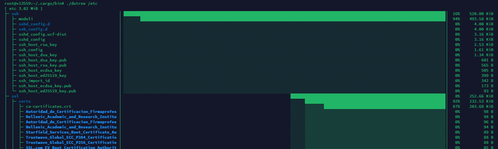
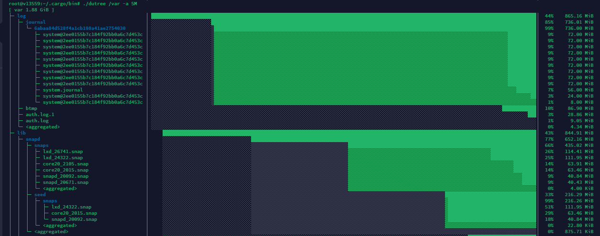

## Introduction

Disk management is a critical aspect of system administration. As a sysadmin, you need to keep an eye on how much storage space is being used and which files or directories are taking up the most space. Linux offers a variety of tools for this purpose, and one of the most user-friendly options is Dutree. This article will guide you through using Dutree to monitor disk usage with a tree-view interface.

## What is Dutree?

Dutree is a command-line utility for Linux that provides a visual representation of disk usage. It's designed to be a more informative and faster alternative to the traditional 'du' command. Dutree displays the disk usage of files and directories in a structured tree format, making it easier to understand where your disk space is going.

## Installing Dutree

Before you can use Dutree, you need to install it. Dutree may not be available in the official repositories of all Linux distributions, but you can usually install it using cargo, the Rust package manager.

First, ensure you have cargo installed. If not, you can typically install it using your distribution's package manager. For example:

```bash
#debian/ubuntu
sudo apt install cargo 
# Arch
sudo pacman -S cargo 
#Almalinux/Rocky/RHEL derivatives
sudo dnf install rust cargo 
```

Once cargo is installed, you can install Dutree by running:

```bash
cargo install dutree
```

## Using Dutree

After installation, using Dutree is straightforward. Open your terminal, and you can start exploring the disk usage of your system.

### Basic Usage

To view the disk usage of your current directory in a tree format, simply type:

```bash
dutree
```

This command will display a list of files and subdirectories along with their sizes. The output is color-coded, making it easy to spot larger items.

### Analyzing Specific Directories

If you want to check the disk usage of a specific directory, you can specify the path as an argument:

```bash
dutree /path/to/directory
```

Replace `/path/to/directory` with the actual path of the directory you want to analyze.



### Controlling the Depth of the Tree

By default, Dutree displays the entire tree structure. However, you can limit the display to a certain depth using the `-d` option:

```bash
dutree -d 2
```

This command will limit the tree view to two levels deep.

#### Aggregating Small Files

To aggregate files smaller than a certain size:

```bash
dutree -a 5M
```

This command aggregates files smaller than 5 megabyte.


#### Displaying a Summary

For a quick summary (equivalent to `-d1 -a1M`):

```bash
dutree -s
```

This will give you a summary of the disk usage with a depth of 1 and aggregating files smaller than 1 megabyte.


#### Printing Sizes in Bytes

To print sizes in bytes without any unit:

```bash
dutree -b
```

#### Skipping Directories for Files-Only Overview

To skip directories and show files only:

```bash
dutree -f
```

#### Excluding Specific Files or Directories

To exclude files or directories that match a certain name:

```bash
dutree -x NAME
```

Replace `NAME` with the actual name of the files or directories you want to exclude.

#### Excluding Hidden Files

To exclude hidden files from the output:

```bash
dutree -H
```

#### Using ASCII Characters Only

For an ASCII-only output with no colors:

```bash
dutree -A
```

## Conclusion

Dutree is an excellent tool for sysadmins who need to keep track of disk usage on Linux systems. Its tree-view interface is intuitive and presents data in an easily digestible format.
By following the simple commands outlined in this article, you can quickly analyze disk usage and identify areas where space can be freed up. Managing disk space effectively is an ongoing process. Regularly checking disk usage with Dutree can help you maintain a healthy and efficient system.


##### License: MIT

<!--
Contributor's Certificate of Origin
By making a contribution to this project, I certify that:
(a) The contribution was created in whole or in part by me and I have
    the right to submit it under the license indicated in the file; or
(b) The contribution is based upon previous work that, to the best of my
    knowledge, is covered under an appropriate license and I have the
    right under that license to submit that work with modifications,
    whether created in whole or in part by me, under the same license
    (unless I am permitted to submit under a different license), as
    indicated in the file; or
(c) The contribution was provided directly to me by some other person
    who certified (a), (b) or (c) and I have not modified it.
(d) I understand and agree that this project and the contribution are
    public and that a record of the contribution (including all personal
    information I submit with it, including my sign-off) is maintained
    indefinitely and may be redistributed consistent with this project
    or the license(s) involved.
Signed-off-by: Faleddo mail@faleddo.com
-->
