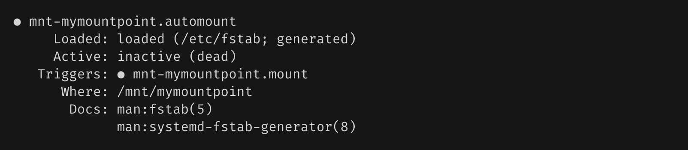
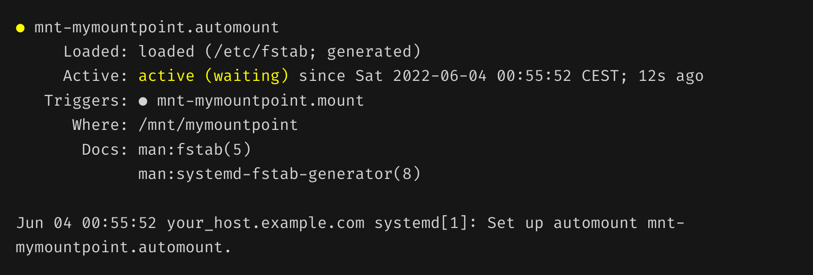
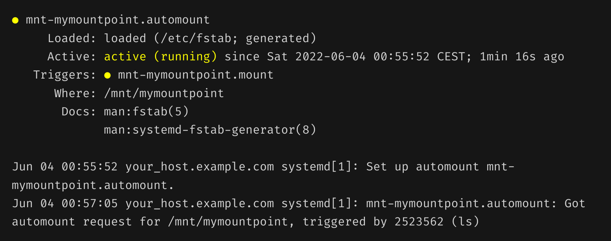

## Introduction

This tutorial will help you to automount local or remote filesystems on _systemd_ Linux distributions. AutoFS is like deprecated (but working) method on a _systemd_ machine. It's a long tutorial compared to the real work needed for the task itself. But I want you to understand the configuration process and be able to go further on your own with _systemd_ mounts. And after this tutorial, maybe you will love the magics of the sometime controversial _systemd_...

"automount" means that a filesystem will be mounted on demand when the mount point directory is accessed (by a user or any system request). After a configurable period of non-use, the filesystem is automatically unmounted.

There are different reasons to use automounting. For example mechanical hard-drives may easily go to sleep when there are not mounted, so that it consumes less power. Remote filesystems mount like [StorageBox](https://www.hetzner.com/storage/storage-box) (using SshFS, WebDAV, Samba, etc) will use network connection just when needed, and will not maintain a perpetual connection with keep alive mechanisms. Welcome in the _eco-friendly computing best practices_!

> In this tutorial I will explain step by step how to mount a SshFs StorageBox drive as an example, because it's a bit more useful and complicated than a local drive. But it works the same way for a local drive, without any adaptation.

**Prerequisites**

You may need to get some basic information about _systemd_, but you can continue safely the tutorial without reading these resources. [_systemd_ wikipedia page](https://en.wikipedia.org/wiki/Systemd) is a good start. To go further, [look at this](https://www.linux.com/training-tutorials/understanding-and-using-systemd/). If you want to experiment _systemd_ commands safely, you can do it online here: [https://systemd-by-example.com](https://systemd-by-example.com/)

At least you have to check if your system runs _systemd_. This page lists [the main distributions that adopted it](https://en.wikipedia.org/wiki/Systemd#Adoption). Most of Linux images provided at [Hetzner](https://www.hetzner.com/) use _systemd_.

The formal way to check it is to run the command `systemctl --version` in a terminal session. It should return something like:

```bash
~$ systemctl --version
systemd 247 (247.3-7)
+PAM +AUDIT +SELINUX +IMA +APPARMOR +SMACK +SYSVINIT +UTMP +LIBCRYPTSETUP +GCRYPT +GNUTLS +ACL +XZ +LZ4 +ZSTD +SECCOMP +BLKID +ELFUTILS +KMOD +IDN2 -IDN +PCRE2 default-hierarchy=unified
```
If you don't have it, you should see:
```bash
~$ systemctl --version
systemctl: command not found

# or if you are a lucky user of the command-not-found package:

Command 'systemctl' not found, but can be installed with:
sudo apt install systemd
```
Installing _systemd_ is totally out of topic of this tutorial, so you can give up now if your system is not _systemd_ ready. DO NOT run the command `apt insta11 systemd`.

If you want to mount a Sshfs drive as shown in this tutorial, you need to have or install _fuse_ and the corresponding filesystem:

```bash
apt install sshfs
```
> __Note__ [bash-completion](https://github.com/scop/bash-completion) works well with all the commands and manipulations that you need in this tutorial. If you enter `systemctl <TAB><TAB>` you should see all commands available. Completion works also for filenames involved in _systemd_ later configuration, so think `<TAB><TAB>` to avoid headache.

> __Note__ In this tutorial commands runnable as unprivileged user start with the `$` prompt. Commands that need to run as root user start with the `#` prompt.

## Step 1 - Ensure that the filesystem to automount is ready

The filesystem we want to automount needs an entry in the file `/etc/fstab`. _systemd_ then parse it and generate a configuration file for us. It's also possible to write a custom configuration file and avoid the _fstab_ definition. But the easy method is to use the existing _fstab_.

First we create and check that the filesystem can be mounted and umounted by hand. Add this one-line in the `/etc/fstab`:

```bash
# /etc/fstab
# .../...

hulo@your_host:/path/on/remote/server /mnt/mymountpoint fuse.sshfs IdentityFile=/home/hulo/.ssh/id_rsa,allow_other,idmap=user,noatime,noauto,workaround=rename,nofail 0 0
```
This is a standard way to declare a Sshfs mount:

* `hulo@your_host`: SSH user and server address.
* `/path/on/remote/server`: the path on the remote system that you want as the root of your local mount.
* `/mnt/mymountpoint`: this is the local path where you want to plug the remote filesystem.

> __Note__ This path has to be an existing directory to mount the filesystem with the `mount` command. But with the _systemd_ automount method, you don't need that this directory exists! It's created and deleted on-the-go by _systemd_ when the automount/auto-umount occurs. After the automount setup is done, you could remove it, __but be sure that the filesystem is NOT mounted__! (else you could erase the files on the mounted filesystem...)

* `IdentityFile`: to avoid any password prompt, use a private key (out of the scope of this tutorial, but search the web for _"ssh login without password"_)

Thus to be clear, after the mount, a file of the remote server located at `/path/on/remote/server/sub-directory/file-example.txt` will be located at `/mnt/mymountpoint/sub-directory/file-example.txt` on the local server.

Now create the mount point (see note above), then mount and umount the filesystem to check that it works well:
```bash
# as root user
cd /mnt
mkdir mymountpoint
mount mymountpoint
df mymountpoint
ls mymountpoint
umount mymountpoint
```
The full workflow could be:

```bash
~# cd /mnt
/mnt# mkdir mymountpoint
mkdir: created directory 'mymountpoint'
/mnt# mount mymountpoint
/mnt# df mymountpoint
Filesystem                                      Type        Size  Used Avail Use% Mounted on
hulo@your_host:/path/on/remote/server fuse.sshfs  455G  308G  124G  72% /mnt/mymountpoint
total                                           -           455G  308G  124G  72% -
/mnt# ls mymountpoint
lost+found  mydir  myfiles  etc
/mnt# umount mymountpoint
/mnt# ### Optional step: remove the mount point. See note above ###
/mnt# rm -ri mymountpoint
```
If you have errors during this workflow, check and recheck, until the mount works well. Try with a local drive as a first test, it's probably less error-prone that a remote connection.

Now that the mount works well by hand, let's go for the _systemd_ machinery.

## Step 2 - Setup the mount for _systemd_ automount

_systemd_ needs to know which _fstab_ entry it has to manage. Edit again `/etc/fstab` and add these parameters to the mount definition:

```bash
x-systemd.automount,x-systemd.idle-timeout=60s
```
These parameters could be applied to any mount entry. They are related to _systemd_ not Sshfs.

The _fstab_ of the above example becomes:
```bash
# /etc/fstab

hulo@your_host:/path/on/remote/server /mnt/mymountpoint fuse.sshfs IdentityFile=/home/hulo/.ssh/id_rsa,allow_other,idmap=user,noatime,noauto,workaround=rename,nofail,x-systemd.automount,x-systemd.idle-timeout=60s 0 0
```
Explanation:
* `x-systemd.automount`: to delegate this mount to _systemd_.
* `x-systemd.idle-timeout=60s`: _Configures an idle timeout. Once the mount has been idle for the specified time, systemd will attempt to unmount._ So after 60 seconds of non-use of the mount point, it will be umounted. Understand that a simple `cd` command in a shell on that mountpoint will avoid the idle timeout, even if no apparent activity occurs. `lsof /mnt/mymountpoint` helps to see what processes are using the mountpoint and make it alive. [See `x-systemd.idle-timeout` in manpage](https://man7.org/linux/man-pages/man5/systemd.mount.5.html) for details.


> __Note__ `noauto` is useless now that _systemd_ manages the mount ([reference](https://www.suse.com/support/kb/doc/?id=000020402)). But you can keep it in case you decide to go back for a manual mount.

Most of the job is done... now profit of the magics.

## Step 3 - Reload the _systemd_ daemon

Reload _systemd_ as root, so that it knows about your mount:

```bash
systemctl daemon-reload
```
Check that the mount is well managed with the `status` command:

```bash
systemctl status mnt-mymountpoint.automount
```
Returns:



> __Note__ You can use shell completion `systemctl status mnt<TAB><TAB>`

If you see more or less the same result, it's ok. Don't be afraid about the line `Active: inactive (dead)`! But if you see:
```bash
Unit mnt-mymountpoint.automount could not be found.
```
...something is wrong.

It's probably that you didn't use the same `/mnt/mymountpoint` as me in this tutorial. No panic. The `mnt-mymountpoint.automount` parameter that we use is called a "unit" in _systemd_ world, and it's created dynamically in this case. The name comes directly from the mount point path `/mnt/mymountpoint` that we had chosen earlier in the _fstab_. If the mount point name changes, this configuration handle will change too. You can easily find what is the proper unit name by browsing the available units:

```bash
~$ systemctl list-unit-files --type=automount
UNIT FILE                         STATE     VENDOR PRESET
mnt-mymountpoint.automount        generated -            
home-hulo-storagebox.automount    generated -            
proc-sys-fs-binfmt_misc.automount static    -            

3 unit files listed.
```
In the example above, you can see the mount point of the tutorial, and another mount point at `/home/hulo/storagebox`.

> __Note__ The `--type=automount` argument used to filter the units type. If you remove it you will dive into the heart of your old loved SysV system...

Now that you know the name of your unit, you can go to the next step. We assume that `mnt-mymountpoint.automount` is the unit name.

### For advanced users (optional section)

_systemd_ creates two units for you with the information grabbed in the _fstab_: `mnt-mymountpoint.mount` and `mnt-mymountpoint.automount`. The first unit manages the mount itself and must be stopped (in automounting use case). The second unit manages the automount feature and has to be started if you want that automount occurs.

Try the `systemctl` command `cat` to look at these files:
```bash
~$ systemctl cat mnt-mymountpoint.mount
# /run/systemd/generator/mnt-mymountpoint.mount
# Automatically generated by systemd-fstab-generator

[Unit]
Documentation=man:fstab(5) man:systemd-fstab-generator(8)
SourcePath=/etc/fstab

[Mount]
Where=/mnt/mymountpoint
What=hulo@your_host:/path/on/remote/server
Type=fuse.sshfs
Options=IdentityFile=/home/hulo/.ssh/id_rsa,allow_other,idmap=user,noatime,noauto,workaround=rename,nofail,x-systemd.automount,x-systemd.idle-timeout=60s

~$ systemctl cat mnt-mymountpoint.automount
# /run/systemd/generator/mnt-mymountpoint.automount
# Automatically generated by systemd-fstab-generator

[Unit]
SourcePath=/etc/fstab
Documentation=man:fstab(5) man:systemd-fstab-generator(8)

[Automount]
Where=/mnt/mymountpoint
TimeoutIdleSec=60s
```

These runtime unit files exist and their paths are `/run/systemd/generator/mnt-mymountpoint.*mount`. Do not modify here, it's _Automatically generated by systemd-fstab-generator_. But you can customize the units this way:

```
# to override some parameters

~# systemctl edit mnt-mymountpoint.automount
~# systemctl edit mnt-mymountpoint.mount

# to replace the full unit file

~# systemctl edit --full mnt-mymountpoint.automount
~# systemctl edit --full mnt-mymountpoint.mount
```

These commands open a editor and save the modifications in `/etc/systemd/system/`.

The `*.mount` unit may be started/stopped with `systemctl` if you want to mount/umount the filesystem manually. It is still possible to use the usual `mount`and `umount` commands to manage the _fstab_ filesystems as usual, event with the _systemd_ options we added.

## Step 4 - Enable and test the mount

Now that your mount is known by the system, you have to activate it, because as seen above it's status is `inactive`.

Run the `start` command as root:

```bash
systemctl start mnt-mymountpoint.automount
```
And now check again it's status:

```bash
systemctl status mnt-mymountpoint.automount
```
Returns:



Note that the first bullet is yellow now, if your terminal supports colors. It was grey when inactive. It means it's active and should work. The second bullet is still grey, because the mount is not currently active. 

Browse the mount to check that automount occurred:

```bash
~$ ls /mnt/mymountpoint
lost+found  mydir  myfiles  etc
```
Great! The Sshfs has been mounted and it works well. Check again the status:

```bash
systemctl status mnt-mymountpoint.automount
```
Returns:



Look at the the result: now all bullets are yellow to show that the mount is active and currently mounted. The command returns also a log of the operations on the mount, with the commands that triggered the automount. Here the `ls` command (with PID number 2523562). The triggers log is shown only to the root user. If you launch the `status` command as a normal user, you will just see the unit status, but not the events log.

So, now you are on your own and you should know what to do in 60 seconds to check that everything is OK :)

If the automount is not required anymore or if you regret this tutorial, just run:

```bash
systemctl stop mnt-mymountpoint.automount
```
... and it will fall again asleep (but not really dead) until you `start` it again. And if you remove the _systemd_ parameters in the _fstab_, it will forget it forever after a daemon reload.

## Conclusion

In this tutorial you learnt how to setup a Sshfs mount to a storagebox, how to setup an automount of this drive managed by the _systemd_ subsystem, and how to do basic operations on units and deal with common problems. You may want to dive deeper into the `systemd` layer of your system, automount being only a small part of its work.

Hope it helps.

J.

##### License: MIT

<!--

Contributor's Certificate of Origin

By making a contribution to this project, I certify that:

(a) The contribution was created in whole or in part by me and I have
    the right to submit it under the license indicated in the file; or

(b) The contribution is based upon previous work that, to the best of my
    knowledge, is covered under an appropriate license and I have the
    right under that license to submit that work with modifications,
    whether created in whole or in part by me, under the same license
    (unless I am permitted to submit under a different license), as
    indicated in the file; or

(c) The contribution was provided directly to me by some other person
    who certified (a), (b) or (c) and I have not modified it.

(d) I understand and agree that this project and the contribution are
    public and that a record of the contribution (including all personal
    information I submit with it, including my sign-off) is maintained
    indefinitely and may be redistributed consistent with this project
    or the license(s) involved.

Signed-off-by: Jej / hetzner-community-content@vbox.trickip.net

-->

