## Introduction

Running multiple WordPress websites typically requires either expensive managed hosting ($15-30/month per site) or complex server administration with terminal commands, nginx configuration, and manual SSL certificate management. For beginners, freelancers, and small agencies, these costs and complexity add up quickly.

**The good news:** You don't need to be a server expert to host your own WordPress sites anymore.

This tutorial walks you through setting up multiple WordPress sites on a single Hetzner Cloud server — step by step, with screenshots. We'll use Server Compass, a desktop app that lets you manage servers visually without typing commands. Each WordPress site runs in its own isolated container with a dedicated database, and SSL certificates are obtained automatically.

**What you'll achieve:**

- 3+ WordPress sites running on a single €4.35/month Hetzner Cloud server (CX12)
- Automatic HTTPS with Let's Encrypt certificates (auto-renewed)
- Isolated environments (one site can't affect another)
- Visual management — click buttons instead of typing commands
- Secure SSH key authentication
- Easy backups and updates

**Architecture overview:**

```
                    ┌─────────────────────────────────────────┐
                    │           Hetzner Cloud VPS             │
Internet ──────────▶│  ┌─────────────────────────────────────┐│
                    │  │     Traefik (Reverse Proxy)         ││
                    │  │   - Routes by domain name           ││
                    │  │   - Auto SSL via Let's Encrypt      ││
                    │  └──────────┬──────────┬───────────────┘│
                    │             │          │                │
                    │      ┌──────▼───┐ ┌────▼─────┐         │
                    │      │ WordPress │ │ WordPress │  ...   │
                    │      │  Site A   │ │  Site B   │         │
                    │      │ + MySQL   │ │ + MySQL   │         │
                    │      └──────────┘ └──────────┘         │
                    └─────────────────────────────────────────┘
```

**Prerequisites**

- A computer running macOS, Windows, or Linux
- A Hetzner Cloud account ([sign up here](https://console.hetzner.cloud/))
- One or more domain names you control (we'll show you how to configure DNS)

**No prior experience required** — this tutorial explains everything from the beginning, including how to set up SSH keys and connect to servers.

**Example terminology**

This tutorial uses example values that you should replace with your own:

| Placeholder | Example | Description |
|-------------|---------|-------------|
| `<server-ip>` | `203.0.113.10` | Your Hetzner server's public IP |
| `<your-domain>` | `example.com` | Your domain name |
| `<db-password>` | `Kx7mP9qR2sT4vW6y` | Generated database password |

## Step 1 - Create SSH Key, Server, and Connect

In this step, we'll set up everything you need: Server Compass on your computer, an SSH key for secure access, a Hetzner cloud server, and connect them together.

**Step 1.1 - Download and install Server Compass**

1. Download Server Compass from [servercompass.app](https://servercompass.app)
2. Install it on your computer (available for macOS, Windows, and Linux)
3. Open the application

**Step 1.2 - Create your SSH key**

An SSH key is like a secure password that your computer uses to connect to servers. Server Compass makes creating one easy.

1. In Server Compass, click **"SSH Keys"** in the left sidebar
2. Click **"+ Generate New Key"** in the top right

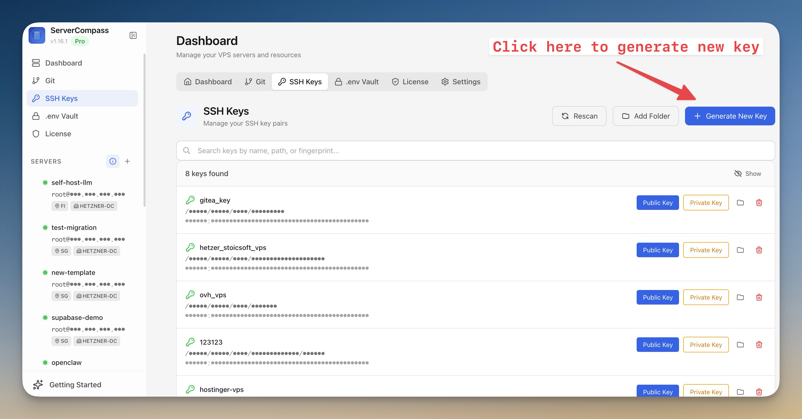

3. Enter a name for your key (e.g., `wordpress-vps`)
4. Click **"Generate Key Pair"**

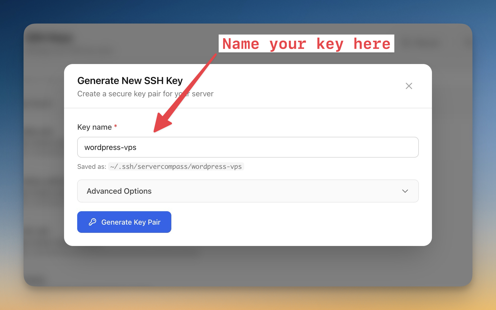

Server Compass generates a key pair and saves it securely on your computer.

5. Find your new key in the list and click **"Public Key"** to copy it to your clipboard

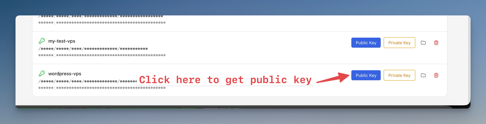

Keep Server Compass open — you'll need it again soon.

**Step 1.3 - Sign up for Hetzner Cloud**

If you don't already have an account:

1. Go to [console.hetzner.cloud](https://console.hetzner.cloud/)
2. Click **"Register"** and create your account
3. Complete the verification process

**Step 1.4 - Choose your server size**

The server size depends on how many WordPress sites you plan to host:

| Sites | Server Type | RAM   | Monthly Cost |
|-------|-------------|-------|--------------|
| 1-3   | CX12        | 4 GB  | €4.35        |
| 4-7   | CX32        | 8 GB  | €7.59        |
| 8-12  | CX42        | 16 GB | €14.64       |

For this tutorial, we'll use CX12 which is perfect for getting started.

**Step 1.5 - Create the server with your SSH key**

1. Log into the [Hetzner Cloud Console](https://console.hetzner.cloud/)
2. Select your project (or create a new one by clicking **"+ New Project"**)
3. Click **"Add Server"**
4. Configure with these settings:

| Setting | Value |
|---------|-------|
| Location | Choose closest to your users (e.g., Falkenstein for Europe) |
| Image | Ubuntu 24.04 |
| Type | CX12 (or higher based on site count) |
| Networking | Public IPv4 ✅ |

5. In the **SSH Keys** section, click **"+ Add SSH key"**

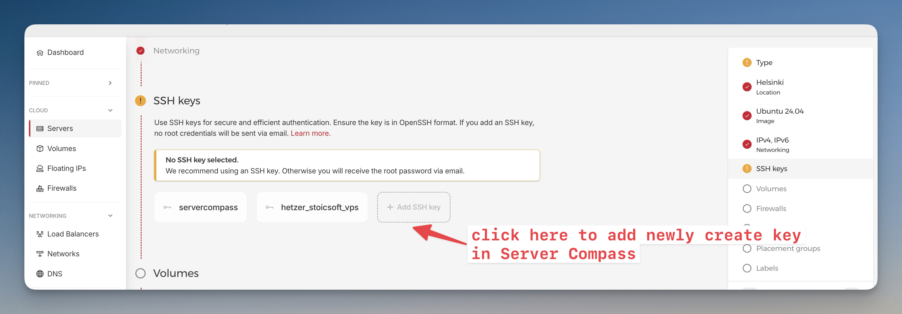

6. Paste the public key you copied from Server Compass into the **SSH key** field
7. Enter a name (e.g., `wordpress-vps`)
8. Click **"Add SSH key"**

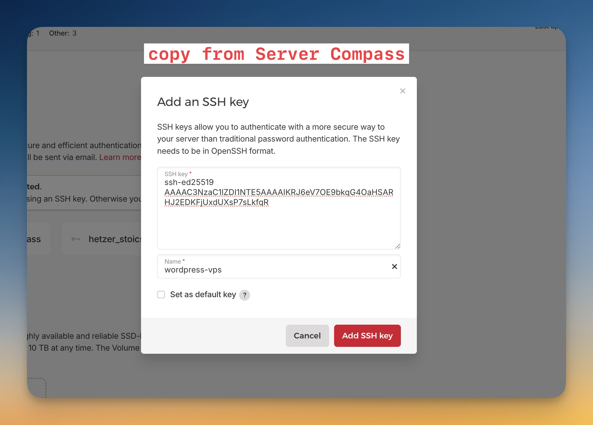

9. Set the server name to `wordpress-production`
10. Click **"Create & Buy Now"**

Your server will be ready in about 30 seconds. **Important:** Note the **IPv4 address** displayed — you'll need this in the next step.

> **Screenshot suggestion:** Hetzner Cloud Console showing the newly created server with IP address highlighted

**Step 1.6 - Connect Server Compass to your server**

1. In Server Compass, click **"Add Server"**

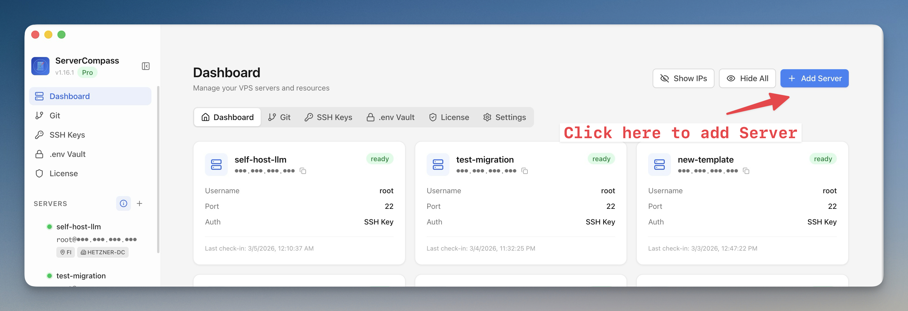

2. Fill in your server details:

| Field | Value |
|-------|-------|
| Display Name | Hetzner Production (or any name you prefer) |
| Server IP / Hostname | Your server's IPv4 address from Step 2.3 |
| Username | root |
| Port | 22 |

3. Under **"Choose your authentication method"**, select **SSH Key**
4. Select the key you created in Step 1.2 from the dropdown

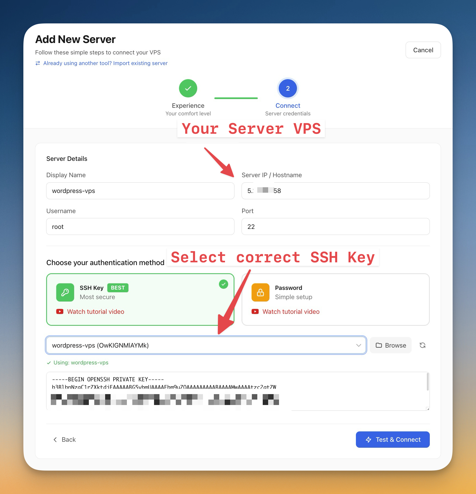

5. Click **"Test & Connect"**

Server Compass will establish a secure connection using your SSH key — no password needed!

**Step 1.7 - Install Docker and Traefik**

When connecting to a fresh server, Server Compass detects that Docker isn't installed and prompts you to set up the required infrastructure.

> **Screenshot suggestion:** Server Compass installation prompt showing Docker and Traefik

1. Server Compass shows: **"This server needs Docker and Traefik to run applications"**
2. Click **"Install"**
3. Watch the progress in the logs panel (takes 1-2 minutes)

**What's being installed:**

| Component | Purpose |
|-----------|---------|
| Docker Engine | Runs your WordPress sites in isolated containers |
| Docker Compose | Manages multiple containers together |
| Traefik | Routes traffic to the right site and handles SSL certificates |

Once complete, you'll see a success message and your server is ready for deployments.

> **Screenshot suggestion:** Server Compass dashboard showing connected server with green status

## Step 2 - Create Your WordPress App

Now for the exciting part — deploying your first WordPress site! Server Compass makes this simple with a built-in WordPress template.

**Step 2.1 - Create the WordPress app**

1. In Server Compass, click on your server to open its detail page
2. Click the **"Apps"** tab
3. Click **"+ New App"** in the top right

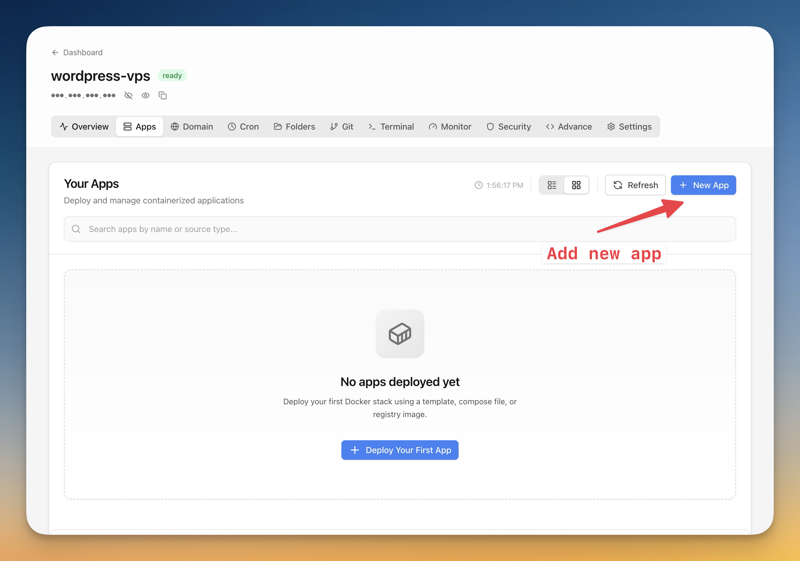

4. Select **"App Template"** to deploy from a curated template

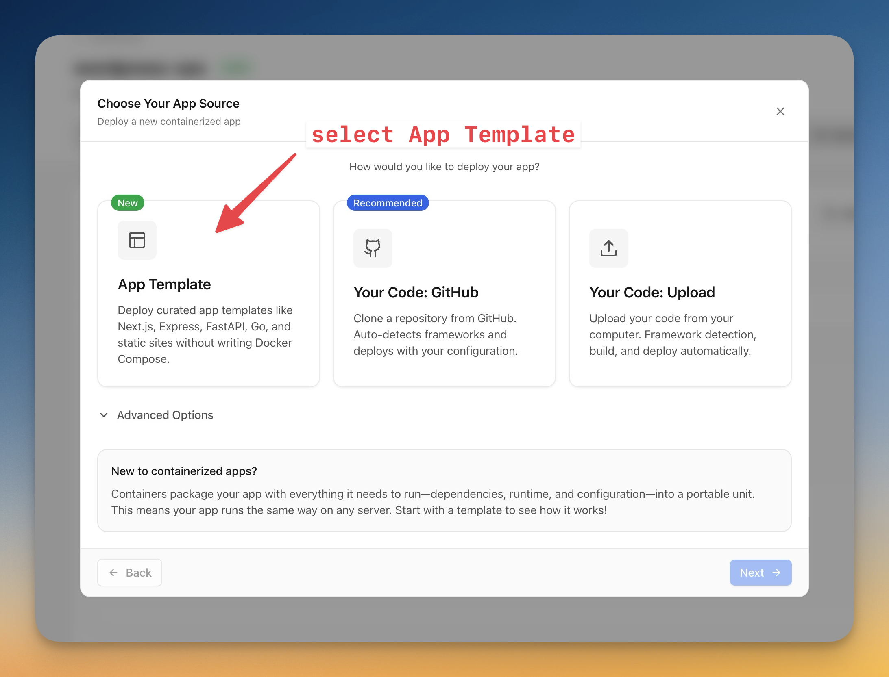

5. Search for **"wordpress"** in the search box
6. Select the **WordPress** template (WordPress CMS with MySQL database)
7. Click **"Next"**

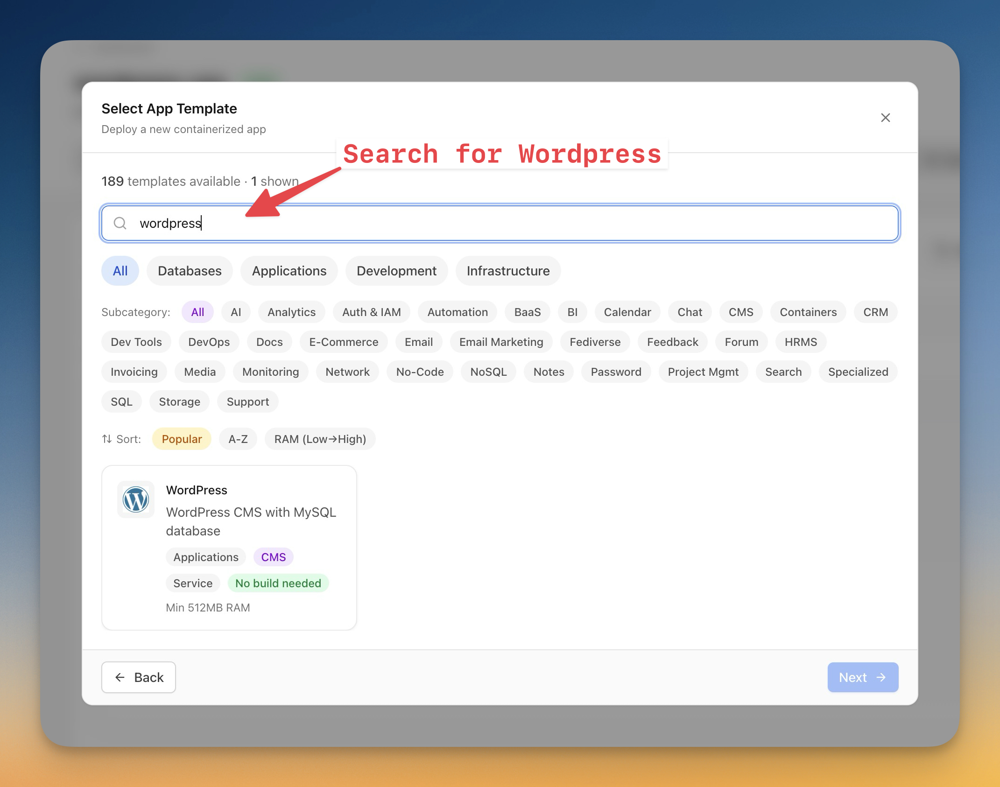

8. Enter your **Project Name** (e.g., `wordpress`)
9. The **Port** will be auto-assigned (default 3000) — you can keep the default
10. Click **"Next"**

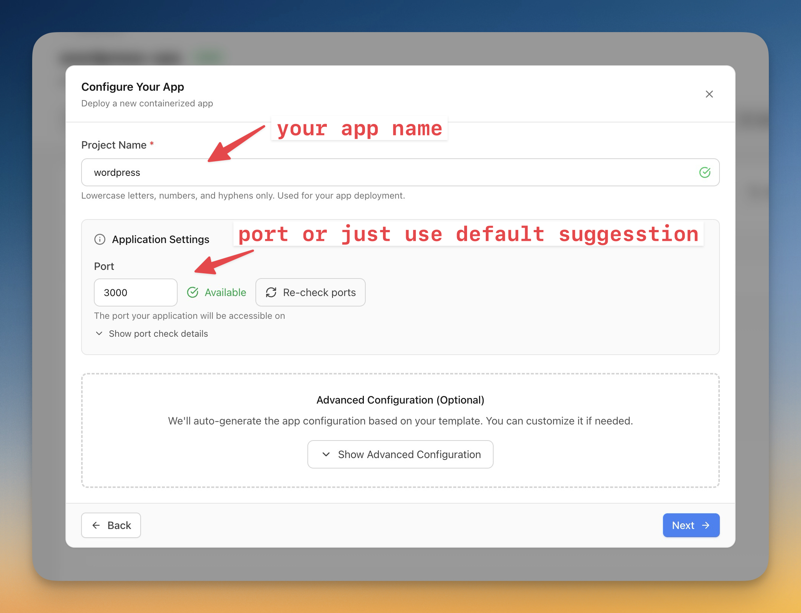

11. Review the **Environment Variables** — you can customize or use the defaults:

| Variable | Description |
|----------|-------------|
| DB_NAME | WordPress database name |
| DB_USER | WordPress database user |
| DB_PASSWORD | Database password (click "Generate Password") |
| DB_ROOT_PASSWORD | MySQL root password (click "Generate Password") |

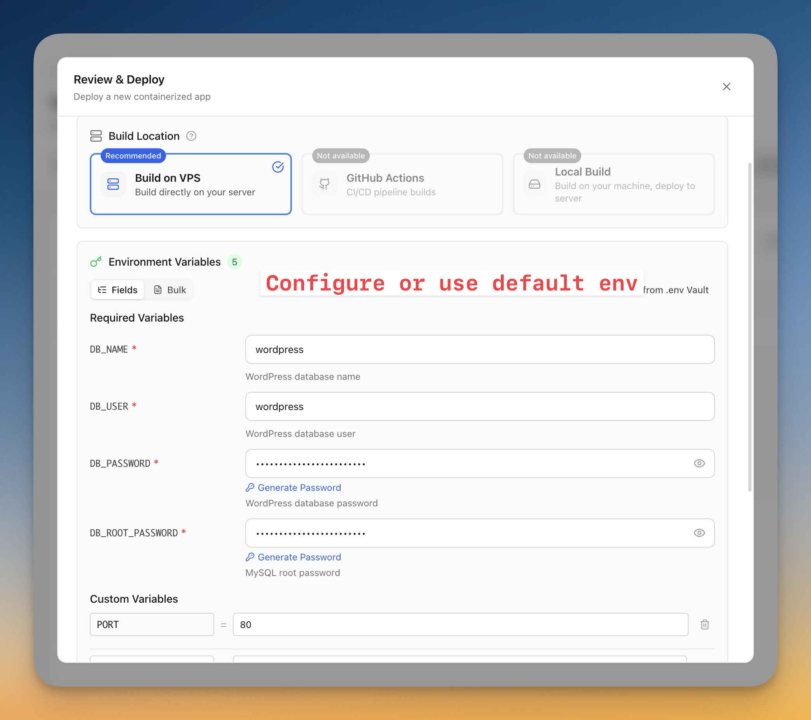

12. Click **"Deploy"** to start the deployment

**Step 2.2 - Watch the deployment progress**

Server Compass shows you exactly what's happening in real-time:

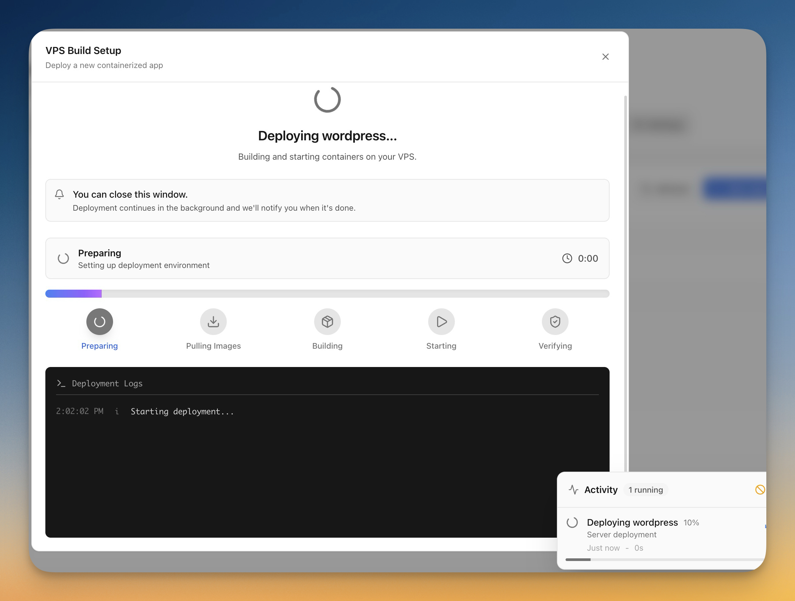

The deployment goes through these steps:
1. **Preparing** — Setting up deployment environment
2. **Pulling Images** — Downloads WordPress and MySQL containers
3. **Building** — Configures the application
4. **Starting** — Launches the containers
5. **Verifying** — Confirms everything is running

The entire process takes 1-3 minutes. You can close this window — Server Compass will notify you when it's done.

Once complete, you'll see your WordPress app with a green **"Running"** status:

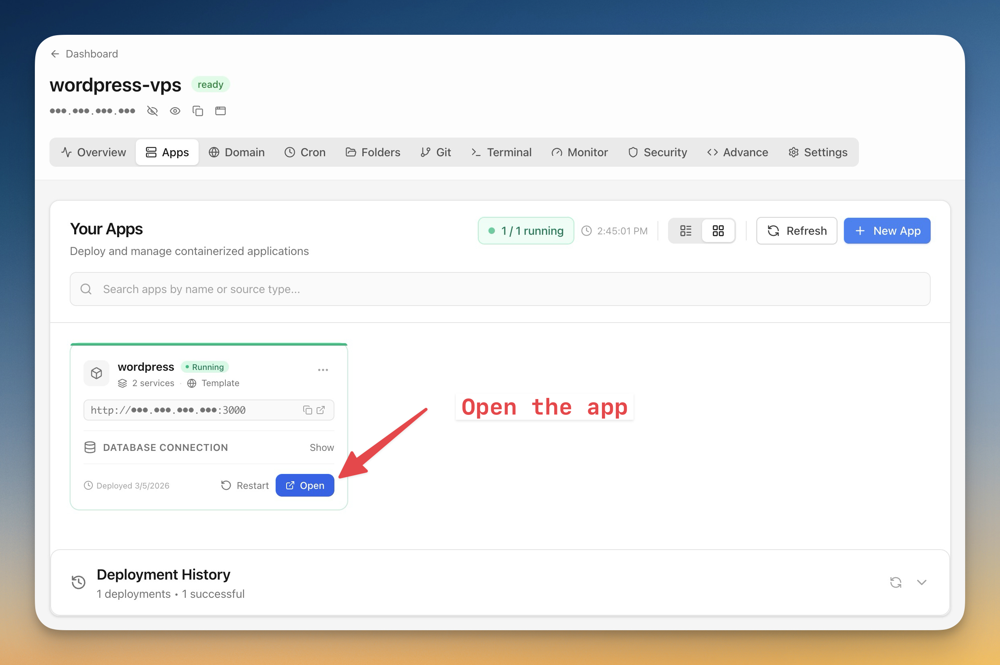

Your WordPress app is now running! But before you can access it with a domain, you need to configure DNS (Step 3).

**What's happening behind the scenes**

Server Compass creates a clean folder structure on your server. If you're curious, you can explore it via the Terminal tab:

```bash
root@demo-vps:~# ls
server-compass

root@demo-vps:~# cd server-compass/apps/
root@demo-vps:~/server-compass/apps# ls
second-wordpress  wordpress  wordpress-site3
```

Each app has its own folder with a `docker-compose.yml` file that Server Compass manages:

```bash
root@demo-vps:~/server-compass/apps/wordpress# cat docker-compose.yml
```

```yaml
services:
  wordpress:
    image: wordpress:latest
    ports:
      - 3000:80
    environment:
      - WORDPRESS_DB_HOST=db:3306
      - WORDPRESS_DB_USER=wordpress
      - WORDPRESS_DB_PASSWORD=Dm8LFDuYsKoQ63ENvLByD4gE
      - WORDPRESS_DB_NAME=wordpress
    volumes:
      - wordpress_data:/var/www/html
    restart: unless-stopped
    depends_on:
      db:
        condition: service_healthy
    labels:
      - traefik.enable=true
      - traefik.http.routers.yourdomain-com.rule=Host(`yourdomain.com`)
      - traefik.http.routers.yourdomain-com.entrypoints=websecure
      - traefik.http.routers.yourdomain-com.tls.certresolver=letsencrypt
      # ... more Traefik labels for HTTPS and www redirect
    networks:
      - default
      - traefik-public

  db:
    image: mysql:8.0
    environment:
      - MYSQL_DATABASE=wordpress
      - MYSQL_USER=wordpress
      - MYSQL_PASSWORD=Dm8LFDuYsKoQ63ENvLByD4gE
      - MYSQL_ROOT_PASSWORD=9QHmK4mGoIJb6etmF9dk0xVo
    volumes:
      - db_data:/var/lib/mysql
    restart: unless-stopped
    healthcheck:
      test: ["CMD-SHELL", "mysqladmin ping -h localhost"]
      interval: 10s
      timeout: 5s
      retries: 5

volumes:
  wordpress_data:
  db_data:

networks:
  traefik-public:
    external: true
```

**Key things Server Compass handles for you:**

| Feature | How it works |
|---------|--------------|
| **SSL Certificates** | Traefik labels automatically request Let's Encrypt certificates |
| **HTTPS Redirect** | HTTP requests are redirected to HTTPS |
| **WWW Redirect** | `www.yourdomain.com` redirects to `yourdomain.com` |
| **Database Health** | MySQL waits until healthy before WordPress starts |
| **Persistent Data** | Docker volumes keep your data safe across restarts |

You don't need to edit these files — Server Compass manages everything. But it's helpful to understand what's running on your server.

**Step 2.3 - Complete the WordPress setup wizard**

After connecting your domain (Step 3), click **"Open"** to visit your WordPress site:

1. You should see a green padlock (HTTPS is working!) and the WordPress installation wizard
2. Select your language and click **"Continue"**
3. Enter your site details:

| Field | Recommendation |
|-------|----------------|
| Site Title | Your website name |
| Username | Something other than "admin" (for security) |
| Password | Use the strong password WordPress suggests |
| Email | Your email address |

4. Click **"Install WordPress"**

Congratulations! Your WordPress site is now live with HTTPS!

## Step 3 - Connect Your Domain

Now let's connect your domain to your WordPress site. Server Compass handles SSL certificates automatically through Traefik and Let's Encrypt.

**Step 3.1 - Open the Domain tab**

1. Click on your server to open its detail page
2. Click the **"Domain"** tab
3. Click **"+ Add Domain"**

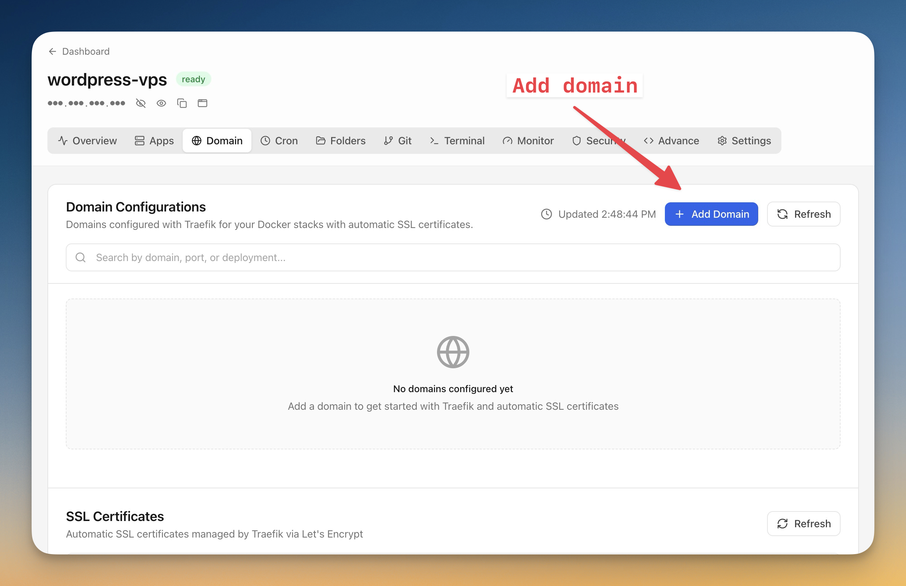

**Step 3.2 - Configure domain settings**

Fill in the domain configuration:

1. **Traefik Setup Required** — Enter your email for Let's Encrypt SSL certificate notifications, then click **"Install Traefik"** (first time only)
2. **Domain Name** — Enter your domain (e.g., `yourdomain.com`)
3. **Application Port** — Select your WordPress container (`wordpress-wordpress-1`) from the list
4. **Enable SSL certificate** — Keep this checked for automatic HTTPS

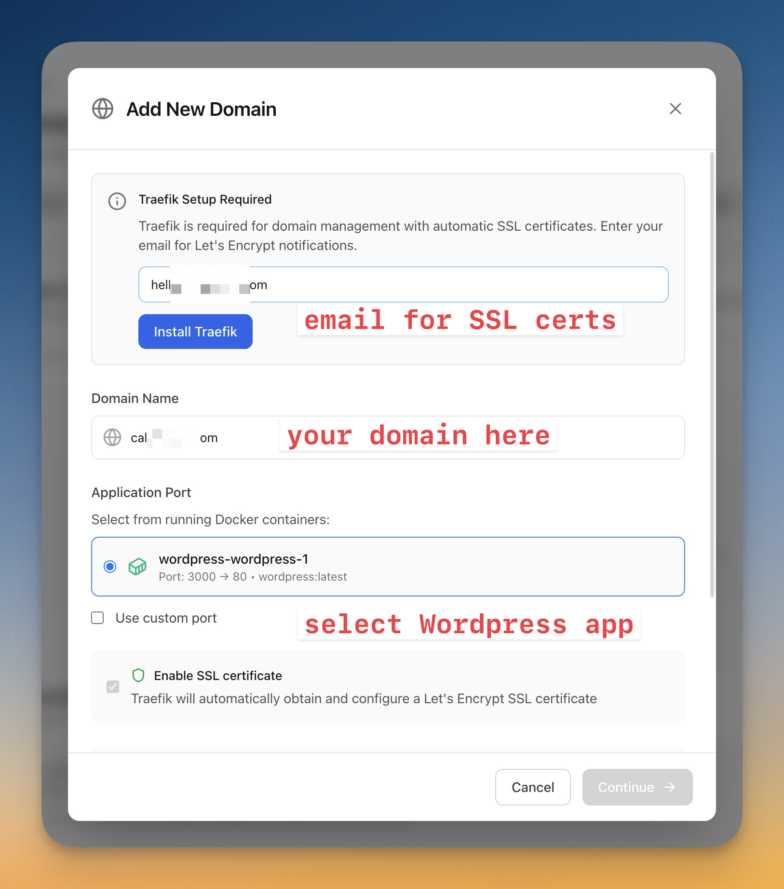

Click **"Continue"** to proceed.

**Step 3.3 - Configure DNS at your registrar**

Server Compass shows you your VPS IP address and verifies your DNS configuration:

1. Copy your **VPS IP address** shown on screen
2. Go to your domain registrar's DNS settings
3. Create an **A record** pointing to your server's IP:

| Type | Host | Value | TTL |
|------|------|-------|-----|
| A | @ | Your VPS IP (shown in Server Compass) | 300 |
| A | www | Your VPS IP | 300 |

> **Important:** If using Cloudflare, turn off the proxy (orange cloud → grey cloud) before verifying. You can enable it again after SSL is configured.

Once DNS is configured correctly, you'll see **"Domain verified successfully"** and **"DNS Configuration Verified!"**:

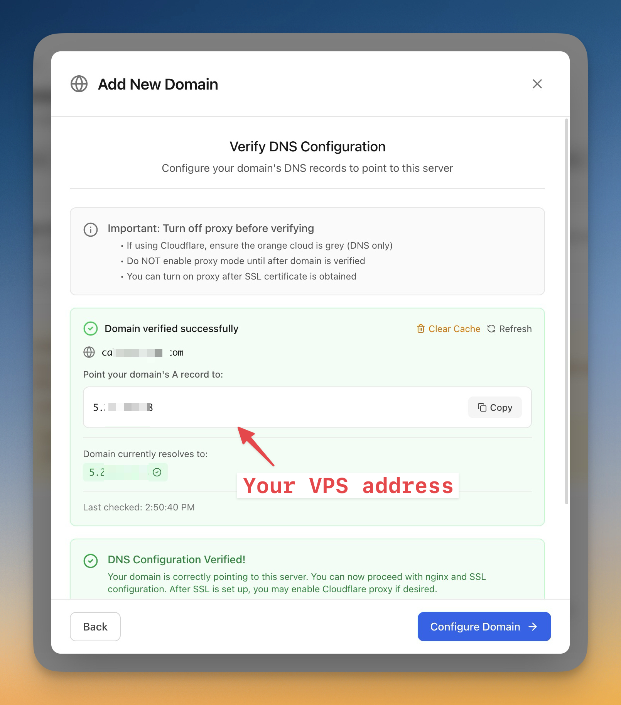

Click **"Configure Domain"** to complete the setup.

**Step 3.4 - Domain connected with SSL**

Your domain is now connected! Back on the **Apps** tab, you'll see your WordPress app now shows the HTTPS domain:

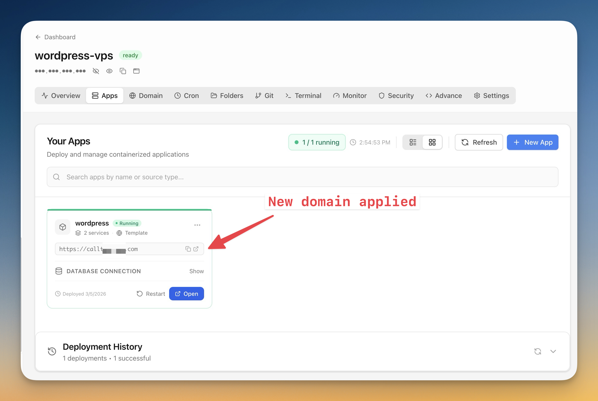

Server Compass automatically:
- Configured Traefik to route traffic to your WordPress app
- Obtained a free SSL certificate from Let's Encrypt
- Enabled HTTPS for your site

Click **"Open"** to visit your WordPress site with HTTPS enabled! You can now complete the WordPress setup wizard (Step 2.3).

## Step 4 - WordPress Database Management & Backup

Server Compass provides tools for managing your WordPress database and creating backups.

**Step 4.1 - Access the database**

1. Click on your WordPress app to open its detail page
2. Click the **"Database"** tab

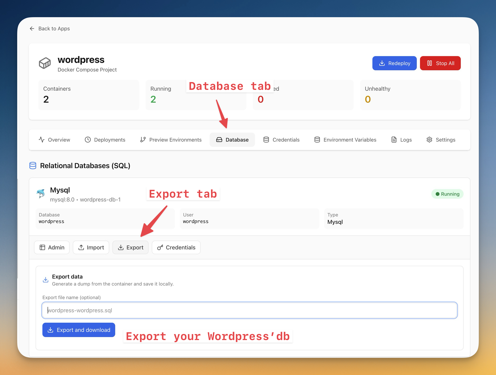

You'll see your MySQL database with these options:

| Button | Function |
|--------|----------|
| **Admin** | Open database admin interface |
| **Import** | Import a SQL dump file |
| **Export** | Export/backup your database |
| **Credentials** | View database connection details |

**Step 4.2 - Export your database (backup)**

To create a database backup:

1. Click the **"Export"** tab
2. Enter a filename (e.g., `wordpress-backup.sql`)
3. Click **"Export and download"**

This downloads a SQL dump file to your computer — save it somewhere safe!

**Step 4.3 - Import a database**

To restore or migrate a database:

1. Click the **"Import"** tab
2. Select your SQL dump file
3. Click **"Import"**

This is useful for:
- Restoring from a backup
- Migrating from another WordPress installation
- Bulk-updating URLs after a domain change

**Step 4.4 - Update WordPress**

To update WordPress to the latest version:

1. Click on your WordPress app
2. Click **"Redeploy"** to pull the latest image

Your data persists because it's stored in Docker volumes, not inside the container.

> **Tip**: Always export your database before updating!

## Step 5 - Host Multiple WordPress Sites

The power of this setup is running multiple sites efficiently on one server. Simply repeat the process!

**Step 5.1 - Add another WordPress site**

1. On your server's **Apps** tab, click **"+ New App"**
2. Select **"App Template"** → search for **WordPress**
3. Configure with a different project name:

| Field | Site 1 | Site 2 |
|-------|--------|--------|
| Project Name | `wordpress` | `portfolio` |

4. Click **"Deploy"**

5. Once deployed, go to the **Domain** tab and add a domain for the new site (same as Step 3)

Server Compass handles everything automatically — Traefik detects the new container, routes traffic for the second domain, and obtains a new SSL certificate.

**Step 5.2 - How multiple sites work together**

Traefik inspects incoming requests and routes them based on the domain:

```
Request to site1.com → WordPress container "wordpress"
Request to site2.com → WordPress container "second-wordpress"
Request to site3.com → WordPress container "wordpress-site3"
```

Each site is completely isolated with its own:
- WordPress installation
- MySQL database
- SSL certificate
- Docker volumes

You can host 10+ sites on a single server (given adequate RAM).

**Step 5.3 - Verify your sites**

In Server Compass, you'll see all your WordPress apps listed with their domains and status:

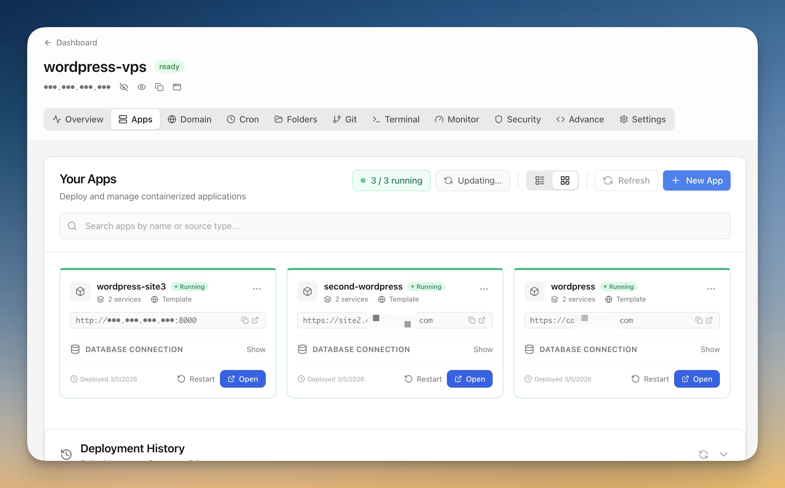

Each app shows:
- **Running** status (green indicator)
- **2 services** (WordPress + MySQL)
- **HTTPS domain** configured
- **Open** button to visit the site

Visit each domain in your browser to confirm HTTPS is working.

## Conclusion

You now have a production-ready setup for hosting multiple WordPress sites on a single Hetzner Cloud server. Each site runs in isolated Docker containers with automatic SSL certificates from Let's Encrypt.

**What you've accomplished:**

- ✅ Set up Server Compass with SSH key authentication
- ✅ Created a Hetzner Cloud server
- ✅ Installed Docker and Traefik with one click
- ✅ Deployed WordPress with automatic SSL
- ✅ Connected your domain
- ✅ Learned how to manage, backup, and host multiple sites

**Cost comparison:**

| Hosting Approach | 3 WordPress Sites | Annual Cost |
|-----------------|-------------------|-------------|
| Managed WordPress Hosting | $15-30/site/month | $540-1,080 |
| This setup (Hetzner CX12) | €4.35/month total | €52.20 (~$57) |

That's roughly **90% savings** while maintaining full control over your infrastructure.

**Next steps:**

- Add more WordPress sites by repeating Step 2
- Set up automated backups
- Configure email sending with an SMTP plugin
- Add uptime monitoring with a service like UptimeRobot

##### License: MIT

<!--
Contributor's Certificate of Origin
By making a contribution to this project, I certify that:
(a) The contribution was created in whole or in part by me and I have
    the right to submit it under the license indicated in the file; or
(b) The contribution is based upon previous work that, to the best of my
    knowledge, is covered under an appropriate license and I have the
    right under that license to submit that work with modifications,
    whether created in whole or in part by me, under the same license
    (unless I am permitted to submit under a different license), as
    indicated in the file; or
(c) The contribution was provided directly to me by some other person
    who certified (a), (b) or (c) and I have not modified it.
(d) I understand and agree that this project and the contribution are
    public and that a record of the contribution (including all personal
    information I submit with it, including my sign-off) is maintained
    indefinitely and may be redistributed consistent with this project
    or the license(s) involved.
Signed-off-by: [Your Name <your@email.com>]
-->
