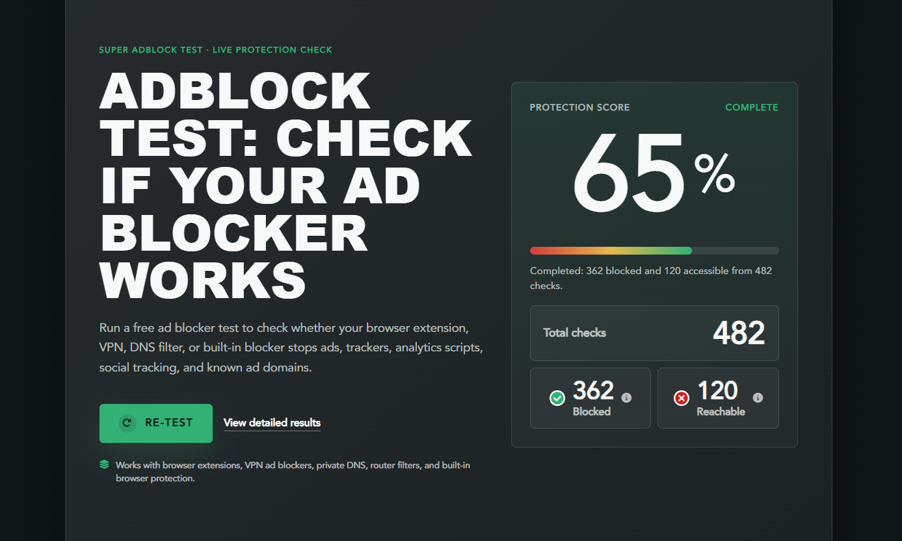

## Introduction

In this tutorial, we install and set up the DNS software "Blocky" on a Hetzner Cloud Server with Debian 13 (trixie). Afterwards, we expose Blocky's DNS-over-HTTPS endpoint (DoH) via Caddy and, finally, we create a WireGuard tunnel so that the DNS server can also be used while on the go.

Tested with these versions:

| Component | Version |
| --- | --- |
| Debian | 13.7 (trixie) |
| Blocky | v0.35.0 |
| Caddy | v2.11.4 |
| wireguard-tools | v1.0.20210914 |

**Prerequisites**

* An activated Hetzner account
* A server of at least type "CX23" with Debian 13 (trixie)
* A public IPv4 address
* Free root or sudo access via SSH
* Optional, but recommended: A (sub)domain whose A and AAAA record point to the server IP. Without a domain, simply skip step 6 (Caddy).

**Example values**

* Server IPv4: `<10.0.0.1>`
* Server IPv6: `<2001:db8:1234::1>`
* (Sub)domain: `<doh.example.com>`
* Mail for Let's Encrypt: `<mail@example.com>`
* SSH user: holu
* WireGuard network: `10.66.0.0/24`

Values in angle brackets like `<10.0.0.1>` are placeholders. Replace them with your real values, the brackets are removed.

**Ports**

| Port | Protocol | Purpose | Open externally? |
| --- | --- | --- | --- |
| 53 | UDP + TCP | DNS for your devices | optional, only for direct DNS |
| 80 | TCP | Caddy: Let's Encrypt challenge and HTTP-to-HTTPS redirect | yes |
| 443 | TCP + UDP | Caddy: HTTPS/DoH (HTTP/2 and HTTP/3) | yes |
| 51820 | UDP | WireGuard | yes |
| 4000 | TCP | Blocky API and metrics | no, listens only on `127.0.0.1` |

Enter the ports in your Hetzner Cloud Firewall if you use one. You only need port 53 if devices should filter directly via the server IP instead of via the WireGuard tunnel.

## Step 1 - Prepare the server

To keep everything up to date, we update the server and install a few more tools that we need:

```bash
apt update -y && apt upgrade -y && apt install -y curl ca-certificates dnsutils
```

## Step 2 - Install the Blocky binary

There is no official Debian package for Blocky, so we download the binary directly from the GitHub release. In the following code block, the CPU used (x86/ARM) is detected automatically and the correct binary is downloaded. In addition, it is checked whether the download is genuine and nothing is damaged.

```bash
cd /tmp
case "$(uname -m)" in
  x86_64)  BARCH="Linux_x86_64" ;;
  aarch64) BARCH="Linux_arm64" ;;
  *) echo "Unsupported architecture: $(uname -m)"; exit 1 ;;
esac
VER="v0.35.0"
curl -fsSL -O "https://github.com/0xERR0R/blocky/releases/download/${VER}/blocky_${VER}_${BARCH}.tar.gz"
curl -fsSL -O "https://github.com/0xERR0R/blocky/releases/download/${VER}/blocky_checksums.txt"
sha256sum -c --ignore-missing blocky_checksums.txt
tar -xzf "blocky_${VER}_${BARCH}.tar.gz"
install -m 0755 blocky /usr/local/bin/blocky
blocky version
```

`sha256sum -c` must report `OK`, otherwise the download is broken! `blocky version` shows the version and the matching architecture at the end.

Blocky should not run as root, because this can pose a risk. Therefore, we create a system user with directories and the correct permissions for port 53.

```bash
useradd --system --no-create-home --shell /usr/sbin/nologin blocky
mkdir -p /etc/blocky /var/cache/blocky/lists /var/log/blocky
chown -R blocky:blocky /var/cache/blocky /var/log/blocky
setcap cap_net_bind_service=+ep /usr/local/bin/blocky
getcap /usr/local/bin/blocky
```

The last line must show `/usr/local/bin/blocky cap_net_bind_service=ep`. In systemd operation, the capability is added again as an ambient capability, more on that in the next step.

## Step 3 - Create the systemd unit with hardening

There is no ready-made unit package, so we have to write our own. Here is a template that can be inserted directly via command.

```bash
cat > /etc/systemd/system/blocky.service <<'EOF'
[Unit]
Description=Blocky DNS Server
Documentation=https://0xerr0r.github.io/blocky/
After=network-online.target
Wants=network-online.target

[Service]
Type=simple
User=blocky
Group=blocky
WorkingDirectory=/etc/blocky
ExecStart=/usr/local/bin/blocky --config /etc/blocky/config.yaml
Restart=on-failure
RestartSec=5s

NoNewPrivileges=true
CapabilityBoundingSet=CAP_NET_BIND_SERVICE
AmbientCapabilities=CAP_NET_BIND_SERVICE
ProtectSystem=strict
ProtectHome=true
PrivateTmp=true
PrivateDevices=true
ProtectKernelTunables=true
ProtectKernelModules=true
ProtectControlGroups=true
RestrictAddressFamilies=AF_INET AF_INET6 AF_NETLINK
RestrictNamespaces=true
LockPersonality=true
RestrictRealtime=true
SystemCallArchitectures=native
ReadWritePaths=/var/cache/blocky /var/log/blocky

[Install]
WantedBy=multi-user.target
EOF
```

Briefly about the most important lines:

* `User`/`Group=blocky`: no root.
* `NoNewPrivileges=true`: The process can no longer gain additional privileges at runtime. This also drops file capabilities on start, which is why systemd grants `NET_BIND_SERVICE` here additionally as an ambient capability. Only `setcap` alone would not be enough under this unit.
* `ProtectSystem=strict`: The file system is mounted read-only, Blocky may only write to `ReadWritePaths`.
* `ProtectHome`, `PrivateTmp`, `PrivateDevices`, `ProtectKernel*`, `ProtectControlGroups`: a common isolation for a network service that needs to touch neither the kernel nor home.
* `RestrictAddressFamilies=AF_INET AF_INET6 AF_NETLINK`: only IPv4/IPv6.

## Step 4 - Choose blocklists and write config.yaml

As upstreams, we use encrypted DoT resolvers such as Cloudflare, Quad9, and Digitalcourage. Blocky queries two of them in parallel and takes the fastest answer.

For the blocklists, we stay with one provider: "HaGeZi". Five lists from five projects hardly help us, because they overlap heavily, and duplicate entries only cost RAM and traffic. "HaGeZi Pro" covers ads, trackers, malware, and scams, `tif.medium` adds fresh phishing and malware domains.

Nothing works without errors. For example, HaGeZi Pro blocks the domain `p.typekit.net`, the font CDN of Adobe Fonts, which is why the domain is in the allowlist, which takes precedence over the denylist.

As the block type, we use `zeroIp`: blocked domains then answer with `0.0.0.0`. We do not use `refused`, because many clients then simply ask the next DNS server and thus bypass the filter.

```bash
cat > /etc/blocky/config.yaml <<'EOF'
# yaml-language-server: $schema=https://raw.githubusercontent.com/0xERR0R/blocky/main/docs/config.schema.json

upstreams:
  init:
    strategy: failOnError
  groups:
    default:
      - tcp-tls:1.1.1.1:853#cloudflare-dns.com
      - tcp-tls:9.9.9.9:853#dns.quad9.net
      - tcp-tls:185.95.218.42:853#fdns1.dismail.de
  strategy: parallel_best
  timeout: 3s

bootstrapDns:
  - https://1.1.1.1/dns-query

blocking:
  denylists:
    ads:
      - https://raw.githubusercontent.com/hagezi/dns-blocklists/main/wildcard/pro.txt
    security:
      - https://raw.githubusercontent.com/hagezi/dns-blocklists/main/wildcard/tif.medium.txt
  allowlists:
    ads:
      - |
        p.typekit.net
  clientGroupsBlock:
    default:
      - ads
      - security
  blockType: zeroIp
  blockTTL: 1m
  loading:
    refreshPeriod: 24h
    strategy: blocking
    concurrency: 4
    downloads:
      timeout: 60s
      attempts: 5
      cachePath: /var/cache/blocky/lists

caching:
  minTime: 5m
  maxTime: 30m

ports:
  dns: 53
  http: 127.0.0.1:4000
  dohPath: /dns-query

prometheus:
  enable: true

queryLog:
  type: sqlite
  target: /var/log/blocky/querylog.db
  logRetentionDays: 7

log:
  level: info
  format: text
EOF
blocky validate --config /etc/blocky/config.yaml
```

`blocky validate` must report `Configuration is valid`!

Here again is what the most important lines do:

* `blocking.denylists`: our two groups, `ads` is HaGeZi Pro, `security` is HaGeZi TIF medium.
* `clientGroupsBlock.default`: all clients get both groups. Without this mapping, the lists would not apply at all!
* `loading.downloads.cachePath`: lists are cached on disk. If GitHub is ever unreachable on start, Blocky uses the last version.
* `ports.dns: 53` listens on all interfaces (including the WireGuard interface later), `ports.http: 127.0.0.1:4000` binds the API, metrics, and DoH endpoint only locally, Caddy can still reach it because both run on the same host.
* `queryLog.type: sqlite`: writes every query to `/var/log/blocky/querylog.db`, so that you can later check what was blocked or allowed.

## Step 5 - Start and test Blocky

Start Blocky and check the status:

```bash
systemctl daemon-reload
systemctl enable --now blocky
systemctl status blocky --no-pager
```

The status MUST show `active (running)`. Blocky then loads the two lists on start, this can take a while (usually max. 1 min.). Check with this command whether they are really loaded.

```bash
curl -s http://127.0.0.1:4000/metrics | grep blocky_denylist_cache_entries
```

Expected output (numbers are the domain count per group):

```text
blocky_denylist_cache_entries{group="ads"} 229915
blocky_denylist_cache_entries{group="security"} 893352
```

Now the actual test, three queries in a row:

```bash
dig @127.0.0.1 example.com A +short
dig @127.0.0.1 googlesyndication.com A +short
dig @127.0.0.1 p.typekit.net A +short
```

`example.com` returns real IPs, `googlesyndication.com` returns `0.0.0.0` (the filter applies), `p.typekit.net` returns real IPs again (the allowlist applies).

## Step 6 - Caddy as reverse proxy for DoH

Blocky can also provide DoH itself, but then you have to take care of your own certificate completely by yourself and then always renew it yourself as well. With Caddy, which we use, this task is done automatically. Blocky then stays restricted to `127.0.0.1:4000` and only Caddy talks to the outside.

Install Caddy and check the version:

```bash
apt install -y debian-archive-keyring apt-transport-https gnupg
curl -1sLf 'https://dl.cloudsmith.io/public/caddy/stable/gpg.key' | gpg --dearmor -o /usr/share/keyrings/caddy-stable-archive-keyring.gpg
curl -1sLf 'https://dl.cloudsmith.io/public/caddy/stable/debian.deb.txt' | tee /etc/apt/sources.list.d/caddy-stable.list
apt update
apt install -y caddy
caddy version
```

`caddy version` should output `v2.11.4`. Before continuing, the A and AAAA record of `<doh.example.com>` must point to the IPv4 and IPv6 address of your server! If you use Cloudflare as your DNS provider, the entry must be set to "DNS only" (grey cloud, not proxied), otherwise Caddy will not get a certificate. Check this briefly:

```bash
dig +short <doh.example.com> A
```

If nothing is returned, the record is not yet active and the test further below will fail. In that case, wait a few minutes and check again.

Now the Caddyfile, again via heredoc (completely overwrites the file, no manual deletion needed):

```bash
cat > /etc/caddy/Caddyfile <<EOF
{
	email <mail@example.com>
}

<doh.example.com> {
	reverse_proxy 127.0.0.1:4000 {
		header_up -Forwarded
	}
}
EOF
caddy validate --config /etc/caddy/Caddyfile
systemctl restart caddy
systemctl status caddy --no-pager
```

In the upper block, you must set your contact mail for Let's Encrypt so that a free SSL certificate can be created for you.

Once you are done with that, we test with kdig (Knot DNS utils) whether DoH works.

```bash
apt install -y knot-dnsutils
kdig @<doh.example.com> +https example.com A +short
kdig @<doh.example.com> +https googlesyndication.com A +short
```

The first query should return a real IP, the second one then `0.0.0.0` again. This proves that the DNS query runs encrypted via Caddy and Blocky filters it. Enter the same URL `https://<doh.example.com>/dns-query` in Firefox, Chrome, or directly in the DNS settings of Android and iOS.

## Step 7 - Set up WireGuard

For on the go, we build a WireGuard tunnel so that you can always use the DNS. The kernel module is already included in the Debian kernel, the tool package is enough.

Install the tool package:

```bash
apt install -y wireguard-tools
```

Now we generate key pairs in order to fill both configuration files directly via heredoc with the keys.

```bash
umask 077
SERVER_KEY=$(wg genkey)
SERVER_PUB=$(echo "$SERVER_KEY" | wg pubkey)
CLIENT_KEY=$(wg genkey)
CLIENT_PUB=$(echo "$CLIENT_KEY" | wg pubkey)

cat > /etc/wireguard/wg0.conf <<EOF
[Interface]
Address = 10.66.0.1/24
ListenPort = 51820
PrivateKey = $SERVER_KEY

[Peer]
PublicKey = $CLIENT_PUB
AllowedIPs = 10.66.0.2/32
EOF

cat > /etc/wireguard/client1.conf <<EOF
[Interface]
Address = 10.66.0.2/24
PrivateKey = $CLIENT_KEY
DNS = 10.66.0.1

[Peer]
PublicKey = $SERVER_PUB
Endpoint = <10.0.0.1>:51820
AllowedIPs = 10.66.0.0/24
PersistentKeepalive = 25
EOF

chmod 600 /etc/wireguard/wg0.conf /etc/wireguard/client1.conf
```

Replace `<10.0.0.1>` in the `Endpoint` with the real IP of your server.

Enable the server:

```bash
systemctl enable --now wg-quick@wg0
wg show
```

`wg show` shows the interface `wg0` and the peer with `allowed ips: 10.66.0.2/32`. The handshake only happens once the client connects.

Thanks to the DNS line (`DNS = 10.66.0.1`), only DNS queries are sent to the server, but your actual traffic (e.g. loading websites) bypasses it and is sent via the connected Wi-Fi or mobile network.

You can transfer the config to your phone most easily via QR code:

```bash
apt install -y qrencode
qrencode -t ansiutf8 < /etc/wireguard/client1.conf
```

Scan the code in the WireGuard app via "Add tunnel" and "Scan from QR code".

For the test from the client (if you have the tools for it), two commands:

```bash
ping -c 2 10.66.0.1
dig @10.66.0.1 example.com A +short
dig @10.66.0.1 googlesyndication.com A +short
```

The first `dig` query returns real IPs, the second one `0.0.0.0`. As soon as `DNS = 10.66.0.1` is active in the profile, every DNS query automatically runs through your filter, even in foreign Wi-Fi.

## Conclusion

Blocky now runs as a hardened systemd service on port 53, it filters via the HaGeZi lists and writes the queries to a SQLite database. Caddy now provides the DoH endpoint at `https://<doh.example.com>/dns-query` with an automatic Let's Encrypt certificate. Via the WireGuard tunnel, you also use the same filter while on the go.

**Next steps:**

* Blocky update: new binary to `/usr/local/bin/blocky`, set `setcap cap_net_bind_service=+ep /usr/local/bin/blocky` again (replacing the binary removes the capability), then `systemctl restart blocky`.
* More HaGeZi lists and formats: https://github.com/hagezi/dns-blocklists
* Domain wrongly blocked? Add it to the `allowlists` of the same group in `/etc/blocky/config.yaml` and restart Blocky.
* Statistics and query log in detail: https://0xerr0r.github.io/blocky/latest/

## How well does it actually filter?

A good tool for checking the filter quality is [superadblocktest.com](https://superadblocktest.com/). As of 19/09/2026, our setup reached 65% there: 362 of 482 checked ad and tracker requests were blocked, 120 got through.



The result strongly depends on the chosen blocklists and changes as soon as HaGeZi adds new domains or the test itself checks new categories. So take the number as a snapshot, not as a fixed guarantee.

##### License: MIT

<!--

Contributor's Certificate of Origin

By making a contribution to this project, I certify that:

(a) The contribution was created in whole or in part by me and I have
    the right to submit it under the license indicated in the file; or

(b) The contribution is based upon previous work that, to the best of my
    knowledge, is covered under an appropriate license and I have the
    right under that license to submit that work with modifications,
    whether created in whole or in part by me, under the same license
    (unless I am permitted to submit under a different license), as
    indicated in the file; or

(c) The contribution was provided directly to me by some other person
    who certified (a), (b) or (c) and I have not modified it.

(d) I understand and agree that this project and the contribution are
    public and that a record of the contribution (including all personal
    information I submit with it, including my sign-off) is maintained
    indefinitely and may be redistributed consistent with this project
    or the license(s) involved.

Signed-off-by: Nikita Siegle <sieglenikita@gmail.com>

-->
