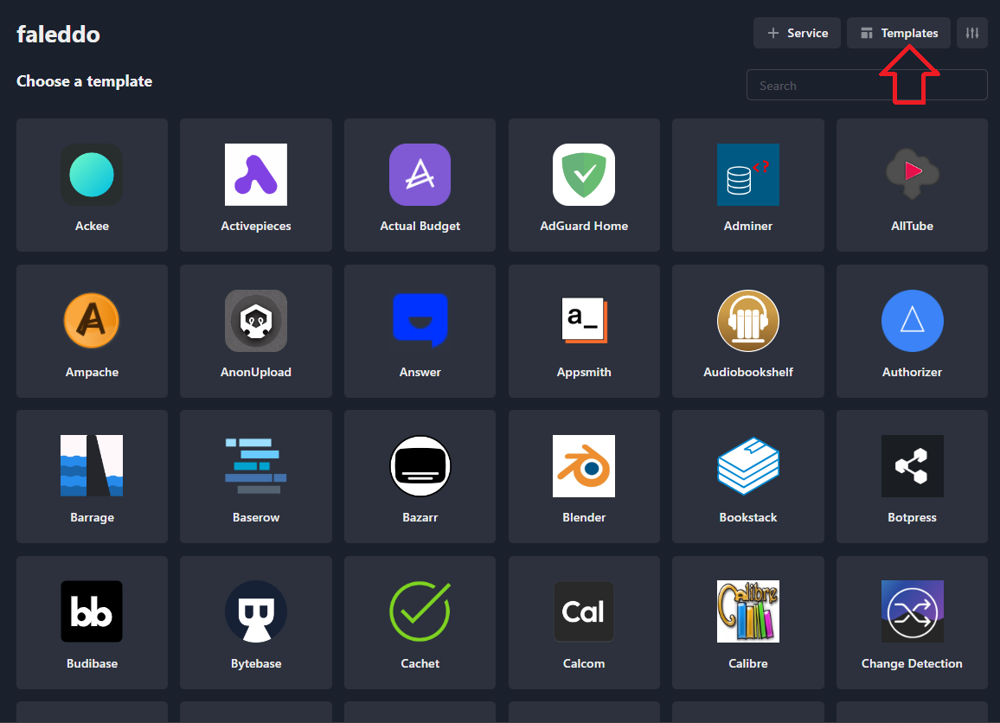

## Introduction

Platform-as-a-Service (PaaS) is a cloud computing model that allows developers to focus on building their applications without the complexity of managing the underlying infrastructure. By building your own PaaS, you can gain control over your environment and potentially reduce costs. In this tutorial, we'll guide you through setting up your own PaaS using EasyPanel and Hetzner Cloud services.

**Why Self-Host Your PaaS?**

Before we dive into the technical steps, let's explore the benefits of self-hosting your PaaS:

- **Control**: You dictate the software stack and configurations, tailoring the environment to your specific needs.
- **Privacy**: Your data remains in your hands, away from third-party providers.
- **Cost-Effectiveness**: Pay only for the resources you use with transparent pricing from providers like Hetzner.
- **Performance**: Optimize the performance of your applications by choosing your server locations and specifications.
- **Learning**: Gain valuable knowledge about server management and cloud services.

**Prerequisites**

- A server
- Basic understanding of cloud services and server management.
- Familiarity with SSH and command-line interfaces.

## Step 1 - Set Up Your Server

Here's how to set up a server with [Hetzner Cloud](https://console.hetzner.cloud/):

1. **Create a New Project**: Click on 'Add a new project' and give it a name.
2. **Add Server**: Within your project, click on 'Add Server' to create a new instance.
3. **Choose Location**: Select the data center location closest to your user base for optimal performance.
4. **Select Image**: Choose a Linux distribution, such as Ubuntu, as your server's operating system.
5. **Choose Type**: Select the server type that fits your needs. You can start small and scale up as necessary.
6. **Additional Features**: You might want to add backups for data protection.
7. **SSH Key**: Add your SSH key for secure access to your server.
8. **Name Your Server**: Give your server a recognizable name.
9. **Create & Buy**: Confirm your selections and create your server.

## Step 2 - Access Your Server

Once your server is up and running, you'll need to access it via SSH. Use the following command from your terminal:

```bash
ssh root@<your_server_ip>
```

> Replace `<your_server_ip>` with the IP address of your server.

## Step 3 - Install EasyPanel

[EasyPanel](https://easypanel.io/) is a simple, web-based control panel that makes it easy to deploy and manage web applications. To install it, run the following command on your server:

```bash
curl -sSL https://get.easypanel.io | bash
```

This script will install Docker, EasyPanel, and all necessary dependencies.

## Step 4 - Configure EasyPanel

After installation, you can access EasyPanel from your web browser:

```bash
http://<your_server_ip>:3000
```

You'll be prompted to create an admin user. Follow the instructions to set up your login credentials.

Make sure your firewall allows access to port 3000. You can setup a domain/subdomain name later to access EasyPanel from HTTP(s) port and close 8080 port.

## Step 5 - Deploy Applications

Once you're logged in, create a new project and open it.

With EasyPanel, you can deploy your applications using:

- **One-Click Apps**: Use the built-in templates to deploy popular applications like WordPress, Drupal, or custom Docker images.
  
- **Custom Apps**: If you have a specific Docker Compose or Dockerfile, you can easily deploy it through EasyPanel's interface. Simply select `+ Service` » `App` in the top right of your project and add the necessary information.
  

To deploy an app:

1. **Go to the 'Applications' tab** in EasyPanel.
2. **Click 'New Application'** and select a one-click app or provide your custom configuration.
3. **Configure the Application**: Set environment variables, persistent storage, and other settings as needed.
4. **Deploy**: Click the deploy button and EasyPanel will handle the rest, setting up your application in a containerized environment.
   

## Conclusion

By following these steps, you've successfully set up your own PaaS using EasyPanel. This setup empowers you with a flexible, cost-effective, and private platform to develop and deploy applications.

Self-hosting your PaaS can be a rewarding journey, providing not just a platform for your applications but also a rich learning experience. As you grow more comfortable with these tools, you'll find yourself capable of fine-tuning your environment to perfection.

Remember, while the initial setup can be straightforward, maintaining a cloud service requires diligence. Keep your software updated, monitor your applications, and always back up your data.

Happy hosting!

##### License: MIT

<!--
Contributor's Certificate of Origin
By making a contribution to this project, I certify that:
(a) The contribution was created in whole or in part by me and I have
    the right to submit it under the license indicated in the file; or
(b) The contribution is based upon previous work that, to the best of my
    knowledge, is covered under an appropriate license and I have the
    right under that license to submit that work with modifications,
    whether created in whole or in part by me, under the same license
    (unless I am permitted to submit under a different license), as
    indicated in the file; or
(c) The contribution was provided directly to me by some other person
    who certified (a), (b) or (c) and I have not modified it.
(d) I understand and agree that this project and the contribution are
    public and that a record of the contribution (including all personal
    information I submit with it, including my sign-off) is maintained
    indefinitely and may be redistributed consistent with this project
    or the license(s) involved.
Signed-off-by: Faleddo mail@faleddo.com
-->
