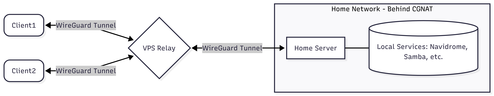

## Introduction

Many internet service providers (ISPs) use Carrier-Grade NAT (CGNAT), which prevents you from directly port-forwarding and accessing your home server from the outside world. This tutorial explains how to bypass CGNAT by using a cloud Virtual Private Server (VPS) with a public IP address as a WireGuard VPN relay. 

By the end of this tutorial, your home server will maintain a persistent connection to the VPS. Your client devices (like a laptop or smartphone) will connect to the VPS, which will securely route your traffic back to your home server. This allows you to access your self-hosted services remotely without exposing them directly to the public internet.

**Prerequisites**

* A cloud server (VPS) running Linux with a public IPv4 address.
* A home server running Linux.
* [WireGuard installed](https://www.wireguard.com/install/) on your VPS, home server, and client devices.

**Example terminology**

* VPS WireGuard IP: `10.0.0.1`
* Home Server WireGuard IP: `10.0.0.2`
* Client1 Device WireGuard IP: `10.0.0.3`
* Client2 Device WireGuard IP: `10.0.0.4`


## Setup Overview



## Step 1 - Generate WireGuard Keypairs

It is generally easiest to generate all WireGuard keypairs on one trusted, secure device, and then securely copy each key to its respective destination device.

Run the following commands to generate private and public keys for your VPS, home server, and remote clients:

```bash
# Generate VPS keys
wg genkey | tee vps_private.key | wg pubkey > vps_public.key

# Generate Home Server keys
wg genkey | tee homeserver_private.key | wg pubkey > homeserver_public.key

# Generate Remote Client 1 keys
wg genkey | tee client1_private.key | wg pubkey > client1_public.key

# Generate Remote Client 2 keys
wg genkey | tee client2_private.key | wg pubkey > client2_public.key
```

You should now have the following files:

```shellsession
holu@secure-device:~$ ls -la
-rw-r--r-- 1 root root   45 May 26 12:09 client1_private.key
-rw-r--r-- 1 root root   45 May 26 12:09 client1_public.key
-rw-r--r-- 1 root root   45 May 26 12:09 client2_private.key
-rw-r--r-- 1 root root   45 May 26 12:09 client2_public.key
-rw-r--r-- 1 root root   45 May 26 12:09 homeserver_private.key
-rw-r--r-- 1 root root   45 May 26 12:09 homeserver_public.key
-rw-r--r-- 1 root root   45 May 26 12:09 vps_private.key
-rw-r--r-- 1 root root   45 May 26 12:09 vps_public.key
```

Keep these files secure. You will need the contents of these files in the upcoming steps.

## Step 2 - Secure the VPS

Before configuring the VPN, it is highly recommended to secure your VPS.

**A Note on VPS Security:** Disabling password authentication is an important first step, but remember that doing so means you **must** have your private SSH key present on any device you use to log into the VPS via SSH. Furthermore, this is just a basic setup. To further harden your server against automated brute-force attacks, consider installing and configuring additional tools like `fail2ban`.

* **Secure SSH Access**
  
  If you haven't already, ensure you are logging into your VPS using an SSH key rather than a password. Harden your SSH configuration by editing the config file:
  
  ```bash
  sudo nano /etc/ssh/sshd_config
  ```
  
  Ensure the following values are set:
  
  ```text
  PasswordAuthentication no
  PubkeyAuthentication yes
  PermitEmptyPasswords no
  ```
  
  Restart the SSH service:
  
  ```bash
  sudo systemctl restart ssh
  ```

<br>

* **Enable IP Forwarding**
  
  To allow the VPS to route traffic between your client devices and your home server, you must enable IPv4 forwarding.
  
  ```bash
  echo "net.ipv4.ip_forward=1" | sudo tee -a /etc/sysctl.conf
  sudo sysctl -p
  ```

<br>

* **Configure the Firewall (UFW)**
  
  Configure your UFW to allow SSH and WireGuard traffic, while denying other incoming connections by default.
  
  ```bash
  sudo ufw default deny incoming
  sudo ufw default allow outgoing
  
  sudo ufw allow OpenSSH
  sudo ufw allow 51820/udp
  
  sudo ufw enable
  ```

## Step 3 - VPS WireGuard Configuration

Now, configure the WireGuard interface on your VPS.

Create and open the WireGuard configuration file:

```bash
sudo nano /etc/wireguard/wg0.conf
```

Add the following configuration, replacing the placeholders with the actual keys generated in Step 1:

```ini
[Interface]
Address = 10.0.0.1/24
ListenPort = 51820
PrivateKey = <INSERT_VPS_PRIVATE_KEY>

# Peer: Home Server
[Peer]
PublicKey = <INSERT_HOMESERVER_PUBLIC_KEY>
AllowedIPs = 10.0.0.2/32

# Peer: Remote Client 1
[Peer]
PublicKey = <INSERT_CLIENT1_PUBLIC_KEY>
AllowedIPs = 10.0.0.3/32

# Peer: Remote Client 2
[Peer]
PublicKey = <INSERT_CLIENT2_PUBLIC_KEY>
AllowedIPs = 10.0.0.4/32
```

**Note on adding multiple devices:** You can add as many `[Peer]` blocks to this VPS configuration as you need. For every additional remote device you want to connect (like an extra tablet, phone, or laptop), simply generate a new key pair on that device, add a new `[Peer]` block here with its `PublicKey`, and assign it a unique IP address in the `AllowedIPs` field (e.g., `10.0.0.5/32`, `10.0.0.6/32`, etc.).

Start the WireGuard interface and enable it to start on boot:

```bash
sudo wg-quick up wg0
sudo systemctl enable wg-quick@wg0
```

## Step 4 - Home Server Peer Configuration

Next, configure your home server. Because this server is behind CGNAT, it cannot accept incoming connections. Instead, it must reach out to the VPS and keep that connection alive.

Create the configuration file on your home server:

```bash
sudo nano /etc/wireguard/wg0.conf
```

Add the following configuration:

```ini
[Interface]
Address = 10.0.0.2/24
PrivateKey = <INSERT_HOMESERVER_PRIVATE_KEY>

[Peer]
PublicKey = <INSERT_VPS_PUBLIC_KEY>
Endpoint = <INSERT_VPS_PUBLIC_IP>:51820
AllowedIPs = 10.0.0.0/24
PersistentKeepalive = 25
```

> **Note:** The `PersistentKeepalive = 25` setting is critical here. Because the home server is behind a strict firewall/CGNAT, it must regularly send a "keepalive" packet to keep the outbound tunnel open so the VPS can route return traffic to it.

Start the WireGuard interface:

```bash
sudo wg-quick up wg0
sudo systemctl enable wg-quick@wg0
```

## Step 5 - Client Device Configuration

Configure your remote devices (e.g., a laptop or smartphone) to connect to the VPN.

This configuration uses **split tunneling**. By setting `AllowedIPs = 10.0.0.0/24`, only traffic destined for your home server and other VPN peers is routed through WireGuard. Your normal internet browsing will continue to use your local internet connection.

Create the configuration file on your client device:

```bash
sudo nano /etc/wireguard/wg0.conf
```

```ini
[Interface]
Address = 10.0.0.3/24
PrivateKey = <INSERT_CLIENT1_PRIVATE_KEY>
DNS = 1.1.1.1

[Peer]
PublicKey = <INSERT_VPS_PUBLIC_KEY>
Endpoint = <INSERT_VPS_PUBLIC_IP>:51820
AllowedIPs = 10.0.0.0/24
PersistentKeepalive = 25
```

Same for other client (different VPN IP and private key):

```ini
[Interface]
Address = 10.0.0.4/24
PrivateKey = <INSERT_CLIENT2_PRIVATE_KEY>
DNS = 1.1.1.1

[Peer]
PublicKey = <INSERT_VPS_PUBLIC_KEY>
Endpoint = <INSERT_VPS_PUBLIC_IP>:51820
AllowedIPs = 10.0.0.0/24
PersistentKeepalive = 25
```

**Client Usage**

* **Linux:** Bring the tunnel up and down with:
  ```bash
  sudo wg-quick up wg0
  sudo wg-quick down wg0
  ```

<!-- img -->

* **Mobile (Android/iOS):** Import the configuration into the official WireGuard app and toggle the tunnel on or off.

<!-- img -->

## Step 6 - Testing Connectivity

You can verify the connection is working by pinging the devices across the VPN tunnel.

You can run `sudo tcpdump -i wg0 -n icmp` on the machine that is getting pinged to verify whether ICMP echo requests are arriving on the WireGuard interface.

* On the VPS
  ```bash
  sudo wg show
  ```

  <blockquote>
  <details><summary>Click here for example output on VPS</summary>
  
  ```shellsession
  holu@vps-relay:~$ sudo wg show
  interface: wg0
    public key: <VPS_PUBLIC_KEY>
    private key: (hidden)
    listening port: 51820
  
  peer:  <homeserver_public_key>
    endpoint: <homeserver_ip>:<port>
    allowed ips: 10.0.0.2/32
    latest handshake: 21 seconds ago
    transfer: 18.67 GiB received, 267.22 MiB sent
  
  peer:  <client1_public_key>
    endpoint: <client1_ip>:<port>
    allowed ips: 10.0.0.3/32
    latest handshake: 4 days, 3 hours, 45 minutes, 25 seconds ago
    transfer: 13.74 GiB received, 648.07 MiB sent
  
  peer:  <client2_public_key>
    endpoint: <client2_ip>:<port>
    allowed ips: 10.0.0.4/32
    latest handshake: 5 days, 8 hours, 49 minutes, 49 seconds ago
    transfer: 250.77 GiB received, 18.02 MiB sent
  ```
  
  </details>
  </blockquote>

<br>

* From the Client Device
  ```bash
  # Ping the VPS
  ping -c 3 10.0.0.1
  
  # Ping the Home Server
  ping -c 3 10.0.0.2
  ```
  
  <blockquote>
  <details><summary>Click here for example output on Client Device</summary>
  
  ```shellsession
  holu@client-device:~$ sudo wg-quick up wg0
  [#] ip link add wg0 type wireguard
  [#] wg setconf wg0 /dev/fd/63
  [#] ip -4 address add 10.0.0.3/24 dev wg0
  [#] ip link set mtu 1420 up dev wg0
  
  holu@client-device:~$ ping -c 3 10.0.0.1
  PING 10.0.0.1 (10.0.0.1) 56(84) bytes of data.
  64 bytes from 10.0.0.1: icmp_seq=1 ttl=64 time=57.9 ms
  64 bytes from 10.0.0.1: icmp_seq=2 ttl=64 time=53.9 ms
  64 bytes from 10.0.0.1: icmp_seq=3 ttl=64 time=54.0 ms
  --- 10.0.0.1 ping statistics ---
  3 packets transmitted, 3 received, 0% packet loss, time 2004ms
  rtt min/avg/max/mdev = 53.915/55.267/57.895/1.858 ms
  
  holu@client-device:~$ ping -c 3 10.0.0.2
  PING 10.0.0.1 (10.0.0.2) 56(84) bytes of data.
  64 bytes from 10.0.0.2: icmp_seq=1 ttl=63 time=109 ms
  64 bytes from 10.0.0.2: icmp_seq=2 ttl=63 time=108 ms
  64 bytes from 10.0.0.2: icmp_seq=3 ttl=63 time=108 ms
  --- 10.0.0.2 ping statistics ---
  3 packets transmitted, 3 received, 0% packet loss, time 2004ms
  rtt min/avg/max/mdev = 107.841/108.150/108.704/0.392 ms
  ```
  
  </details>
  </blockquote>

<br>

* From the Home Server
  ```bash
  # Ping the VPS
  ping -c 3 10.0.0.1
  
  # Ping the Client
  ping -c 3 10.0.0.3
  ```
  
  <blockquote>
  <details><summary>Click here for example output on Home Server</summary>
  
  ```shellsession
  holu@home-server:~$ ping -c 3 10.0.0.3
  PING 10.0.0.3 (10.0.0.3) 56(84) bytes of data.
  64 bytes from 10.0.0.3: icmp_seq=1 ttl=63 time=109 ms
  64 bytes from 10.0.0.3: icmp_seq=2 ttl=63 time=108 ms
  64 bytes from 10.0.0.3: icmp_seq=3 ttl=63 time=108 ms
  --- 10.0.0.3 ping statistics ---
  3 packets transmitted, 3 received, 0% packet loss, time 2004ms
  rtt min/avg/max/mdev = 107.771/108.203/108.868/0.477 ms
  
  holu@home-server:~$ ping -c 3 10.0.0.1
  PING 10.0.0.1 (10.0.0.1) 56(84) bytes of data.
  64 bytes from 10.0.0.1: icmp_seq=1 ttl=64 time=54.3 ms
  64 bytes from 10.0.0.1: icmp_seq=2 ttl=64 time=54.0 ms
  64 bytes from 10.0.0.1: icmp_seq=3 ttl=64 time=54.5 ms
  --- 10.0.0.1 ping statistics ---
  3 packets transmitted, 3 received, 0% packet loss, time 2004ms
  rtt min/avg/max/mdev = 54.042/54.271/54.496/0.185 ms
  ```

  </details>
  </blockquote>

## A Note on Performance and Latency

Routing through a central VPS creates two separate VPN tunnels, which inherently adds extra hops and encryption overhead. To minimize lag, always choose a VPS region physically closest to your local server. While this added latency isn't ideal for real-time applications, this architecture works perfectly for standard self-hosted services like Navidrome, SSH, Immich, Obsidian, and Samba.

## Conclusion

You have successfully set up a WireGuard VPN relay using a cloud VPS. Your home server can now bypass CGNAT restrictions, giving you secure, private remote access to your self-hosted LAN services (like file sharing, media servers, or internal dashboards) from anywhere in the world, without exposing them to the public internet.

##### License: MIT

<!--

Contributor's Certificate of Origin

By making a contribution to this project, I certify that:

(a) The contribution was created in whole or in part by me and I have
    the right to submit it under the license indicated in the file; or

(b) The contribution is based upon previous work that, to the best of my
    knowledge, is covered under an appropriate license and I have the
    right under that license to submit that work with modifications,
    whether created in whole or in part by me, under the same license
    (unless I am permitted to submit under a different license), as
    indicated in the file; or

(c) The contribution was provided directly to me by some other person
    who certified (a), (b) or (c) and I have not modified it.

(d) I understand and agree that this project and the contribution are
    public and that a record of the contribution (including all personal
    information I submit with it, including my sign-off) is maintained
    indefinitely and may be redistributed consistent with this project
    or the license(s) involved.

Signed-off-by: Victor-Daniel Luca daniluca091@gmail.com 

-->
