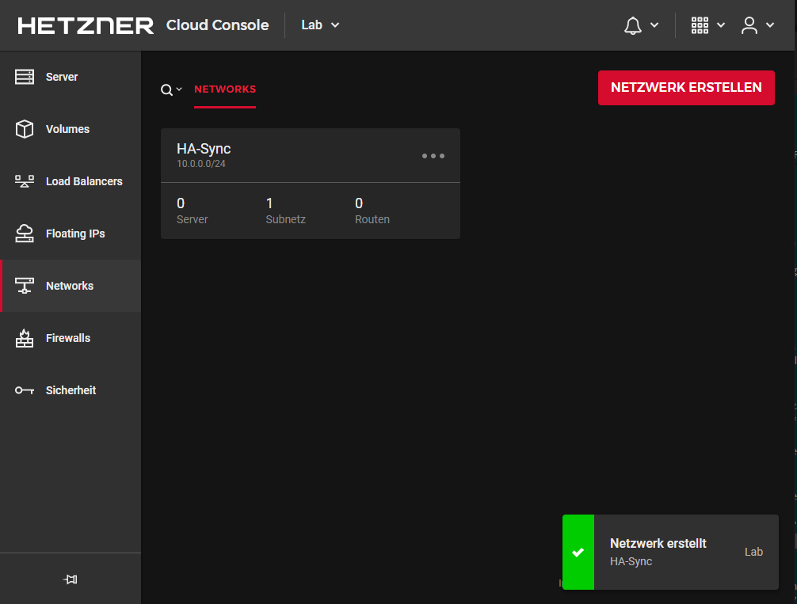
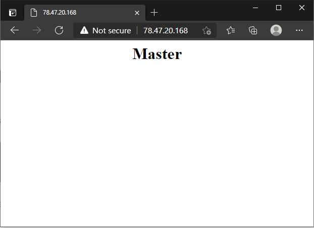

## Einleitung

In diesem Tutorial wird die Einrichtung eines Cloud HA Clusters mithilfe von Keepalived und Floating IPs beschrieben. Das Tutorial wird als Beispiel anhand von zwei Servern erklärt. Sollte der erste (originale) Server nicht mehr erreichbar sein, wird die Floating IP automatisch dem zweiten "Ersatz"-Server zugewiesen. Sobald der originale Server wieder erreichbar ist, wird die Floating IP automatisch wieder diesem zugewiesen. Dadurch bleibt die Anwendung auch dann erreichbar, wenn der Server ausfällt.

Zu beachten ist, dass diese Form der Hochverfügbarkeit nicht von allen Anwendungen unterstützt wird. Dies sollte im ersten Schritt geprüft werden.

**Voraussetzungen**

+ Min. 2 Cloud Server
+ Eine Floating IP

**Empfehlung**

> Für den HA Service sollte ein eigenes Cloud Projekt angelegt werden, da auf den Servern **kritische** Zugangsdaten im **klartext** abgelegt werden müssen.
> Mit einem seperaten Projekt kann bei einer möglichen kompromitierung der Schaden minimiert werden.

## Schritt 1 - Einrichtung des automatischen IP Rerouting

In diesem Schritt geht es um das automatische Failover, dabei soll die Floating IP automatisch dem anderen Server zugewiesen werden, damit dieser unter der gleichen Adresse den ausgefallenen Dienst wieder aufnehmen stellen kann.

### Schritt 1.1 - Erstellung eines Cloud API Tokens

Dieser Token wird benötigt um später vom Server aus die Floating IP Zuweisung zu steuern.

In der Cloud Console muss unter **"Sicherheit"** » **"API-Tokens"** ein **Lese/Schreib** API Token angelegt werden.


> **Hinweis:** Da der Token nur einmal ausgelesen werden kann, empfiehlt es sich diesen zwischenzuspeichern.

### Schritt 1.2 - Anlegen eines Cloud Netzwerks

Für den `VRRP` Heartbeat wird ein privater Netzwerkkanal benötigt. Dieser wird über die Funktion der Cloud Netzwerke realisiert.

Solch ein Cloud Netzwerk kann in der Cloud Console unter "Netzwerke" angelegt werden.

Hier kann ein Netzwerk mit beliebiger Größe (größer 32) angelegt und den beiden Server auch gleich zugewiesen werden.



### Schritt 1.3 - Installation der IP Failover Software

In diesem Schritt wird auf beiden Servern die Software installiert, die für die Provisionierung der Floating IP zuständig ist.

Dabei handelt es sich um die Open Source Software [hcloud-ip](https://github.com/FootprintDev/hcloud-ip). Um die Software zu installieren, kann entweder auf die prebuilt-Binaries zurückgegriffen werden oder man kompiliert die Software selbst.

**Für eine installation mit den prebuilt-Binaries sind folgende Schritte notwendig**

```bash
wget -O /opt/hcloud-ip https://github.com/FootprintDev/hcloud-ip/releases/download/v0.0.1/hcloud-ip-linux64
chmod +x /opt/hcloud-ip
```

**Um die Software selbst zu kompilieren, sind folgende Schritte notwendig**

1. Installation der Abhängigkeiten
   
   Ubuntu / Debian:
   ```bash
   apt install git wget
   ```
   
   CentOS / RHEL:
   ```bash
   yum install git wget
   ```
   
   Fedora:
   ```bash
   dnf instal git wget
   ```
   
   openSUSE / SLES:
   ```bash
   zypper install git wget
   ```

2. Golang Installation
   ```bash
   wget https://go.dev/dl/go1.21.4.linux-amd64.tar.gz
   tar xfvz go1.21.4.linux-amd64.tar.gz
   export PATH=$(pwd)/go/bin:$PATH
   ```

3. Clonen des Repositories
   ```bash
   git clone https://github.com/FootprintDev/hcloud-ip /tmp/hcloud-ip && cd /tmp/hcloud-ip
   ```

4. Projekt Bauen
   ```bash
   go build
   ```

Nun sollte sich im aktuellen Ordner ein Programm mit dem Namen `hcloud-ip` befinden. Dies kann entsprechend ausführbar gemacht und abgespeichert werden.

```bash
chmod +x hcloud-ip
mv hcloud-ip /opt
```

### Schritt 1.4 - Konfiguration der Floating IP

Damit die Floating IP bei einem Failover auf allen Servern funktioniert, muss diese in die Netzwerkkonfiguration aufgenommen werden.
Eine Anleitung hierfür befindet sich auf [docs.hetzner.com](https://docs.hetzner.com/de/cloud/floating-ips/persistent-configuration/)

## Schritt 2 - Einrichtung von Keepalived

Keepalived ist ein Linux Daemon der Systeme oder Dienste überwacht und im Fehlerfall ein Failover anstößt. Keepalived muss auf beiden Servern installiert werden.

### Schritt 2.1 - Installation von Keepalived

Ubuntu / Debian:

```bash
apt install keepalived
```

CentOS / RHEL:

```bash
yum install keepalived
```

Fedora:

```bash
dnf instal keepalived
```

openSUSE / SLES:

```bash
zypper install keepalived
```

### Schritt 2.2 - Keepalived autostart aktivieren

Systemd basierte Systeme:

```bash
systemctl enable keepalived
```

CentOS / RHEL

```bash
chkconfig keepalived on
```

### Schritt 2.3 - Konfiguration von Keepalived

Die hier gezeigte Konfiguration entspricht einem Beispiel anhand eines HA Webservers (nginx).

**Konfiguration auf dem Master Server**

`/etc/keepalived/keepalived.conf`

```conf
vrrp_script chk_nginx {
    script "/usr/bin/pgrep nginx"
    interval 2
    weight -101
}

vrrp_instance VI_1 {
    interface [cloud_private_network_adapter]
    state MASTER
    priority 200

    virtual_router_id 30
    unicast_src_ip [master_private_IP]
    unicast_peer {
        [slave_private_IP]
    }

    authentication {
        auth_type PASS
        auth_pass [random_password]
    }

    track_script {
        chk_nginx
    }

    notify_master /etc/keepalived/failover.sh
}
```

> **Hinweis:** Die umrandeten Werte `[]` sind durch eigene Angaben auszutauschen. Für `auth_pass` kann ein beliebiges Passwort gewählt werden. Für den Master und den Backup sollte aber dasselbe Passwort angegeben werden.

**Konfiguration auf dem Backup Server**

`/etc/keepalived/keepalived.conf`

```conf
vrrp_script chk_nginx {
    script "/usr/bin/pgrep nginx"
    interval 2
}

vrrp_instance VI_1 {
    interface [cloud_private_network_adapter]
    state BACKUP
    priority 100

    virtual_router_id 30
    unicast_src_ip [backup_private_IP]
    unicast_peer {
        [master_private_IP]
    }

    authentication {
        auth_type PASS
        auth_pass [random_password]
    }

    track_script {
        chk_nginx
    }

    notify_master /etc/keepalived/failover.sh
}
```

> **Hinweis:** Die umrandeten Werte `[]` sind durch eigene Angaben auszutauschen. Für `auth_pass` kann ein beliebiges Passwort gewählt werden. Für den Master und den Backup sollte aber dasselbe Passwort angegeben werden.

**Inhalt der `failover.sh` auf beiden Servern**

`/etc/keepalived/failover.sh`

Das Script beinhaltet die Aktionen, die bei einem Failover ausgeführt werden sollen.

```sh
#!/bin/bash
IP='[Floating-IP-Name]'
TOKEN='[CloudToken]'

n=0
while [ $n -lt 10 ]
do
    if [ "$(/opt/hcloud-ip -ip "$IP" -key $TOKEN)" == "Server called $HOSTNAME was found" ]; then
        break
    fi
    n=$((n+1))
    sleep 3
done
```

> **Hinweis:** Die umrandeten Werte `[]` sind durch eigene Angaben auszutauschen.

Die Datei kann nun ausführbar gemacht werden:

```bash
chmod 755 /etc/keepalived/failover.sh
```

Auf systemd basierten Systemen kann Keepalived jetzt gestartet werden:

```bash
systemctl start keepalived
```

## Schritt 3 - Testen der Konfiguration

Im Normalbetrieb übernimmt der Master Webserver alle Anfragen.



Sobald dieser ausfällt gibt es ein Failover auf den Backup Webserver.


Sobald der Master Webserver wieder erreichbar ist wird wieder auf diesen gewechselt.

## Ergebnis

Die High Availability Cloud Umgebung sollte nun erstellt sein.

##### License: MIT

<!--

Contributor's Certificate of Origin

By making a contribution to this project, I certify that:

(a) The contribution was created in whole or in part by me and I have
    the right to submit it under the license indicated in the file; or

(b) The contribution is based upon previous work that, to the best of my
    knowledge, is covered under an appropriate license and I have the
    right under that license to submit that work with modifications,
    whether created in whole or in part by me, under the same license
    (unless I am permitted to submit under a different license), as
    indicated in the file; or

(c) The contribution was provided directly to me by some other person
    who certified (a), (b) or (c) and I have not modified it.

(d) I understand and agree that this project and the contribution are
    public and that a record of the contribution (including all personal
    information I submit with it, including my sign-off) is maintained
    indefinitely and may be redistributed consistent with this project
    or the license(s) involved.

Signed-off-by: Markus<markus@omg-network.de>

-->
