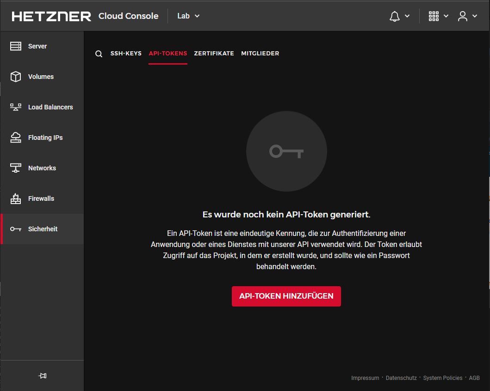
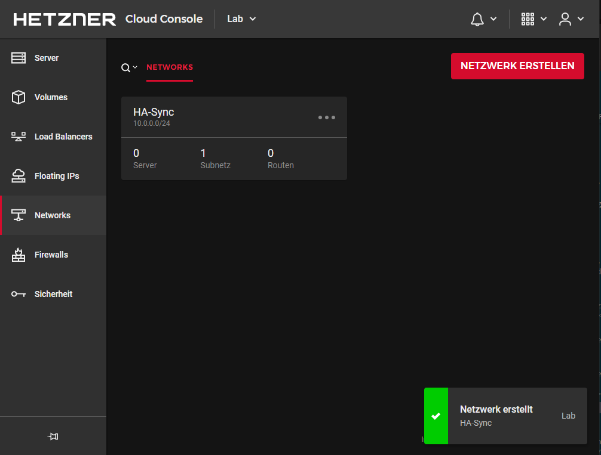
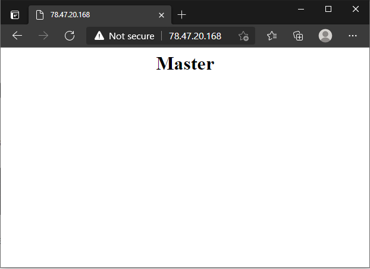
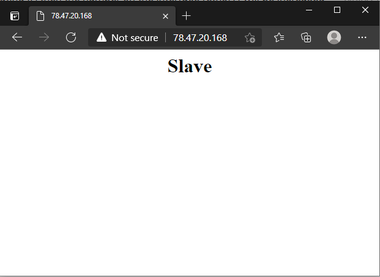

## Introduction

This tutorial describes how to set up a Cloud HA cluster using keepalived and floating IPs.

It should be noted that this form of high availability is not supported by all applications. This should be checked in the first place.

**Requirements**

+ min. 2 Cloud-Server
+ One Floating-IP

**Recommendation**

>A separate cloud project should be created for the HA service, since **critical** access data must be stored in **clear text** on the servers.

>With a separate project, the damage can be minimized in the event of a possible compromise.

## Step 1 - Setting up automatic IP rerouting

This step is about automatic failover, where the floating IP is automatically assigned to the other server. So that the service can operate under the same address.

### Step 1.1 - Creation of a Cloud API token

This token is required to later control the floating IP assignment from the server.
In the Cloud Console, a **read/write** API token must be created under **"Security"** --> **"API tokens"**.



> Note: Since the token can only be read once, it is recommended to store it temporarily.

### Step 1.2 - Create a cloud network

For the `VRRP` Heartbeat a private network channel is needed this is realized via the function of the cloud networks.

Such a cloud network can be created in the Cloud Console under "Networks".

Here a network with arbitrary size (larger 32) can be created and also assigned to the servers.



### Step 1.3 - Installing the IP Failover Software

In this step, the software responsible for provisioning the floating IP is installed.

This is a open source software [hcloud-ip](https://github.com/FootprintDev/hcloud-ip) to install the software, you can either use the prebuilt binaries or compile the software yourself.

**For an installation with the prebuilt binaries the following steps are necessary**

```bash
wget -O /opt/hcloud-ip https://github.com/FootprintDev/hcloud-ip/releases/download/v0.0.1/hcloud-ip-linux64
chmod +x /opt/hcloud
```

**To compile the software yourself the following steps are necessary**

1. Installing the dependencies

Ubuntu / Debian:

```bash
apt install git wget
```

CentOS / RHEL:

```bash
yum install git wget
```

Fedora:

```bash
dnf instal git wget
```

openSUSE / SLES:

```bash
zypper install git wget
```

2. Golang installation

```bash
wget https://golang.org/dl/go1.16.2.linux-amd64.tar.gz
tar xfvz go1.16.2.linux-amd64.tar.gz
export PATH=$(pwd)/go/bin:$PATH
```

3. Cloning the repository

```bash
git clone https://github.com/FootprintDev/hcloud-ip /tmp/hcloud-ip && cd /tmp/hcloud-ip
```

4. Build the Project

```bash
go build
```

Now there should be a program named `hcloud-ip` in the current folder, this can be made executable and saved respectively.

```bash
chmod +x hcloud-ip
mv hcloud-ip /opt
```

### Step 1.4 - Configuring the floating IP

In order for the floating IP to work on all servers in the event of a failover, it must be included in the network configuration.
Instructions for this can be found at [docs.hetzner.com](https://docs.hetzner.com/cloud/floating-ips/persistent-configuration).

## Step 2 - Setting up Keepalived

Keepalived is a Linux daemon that monitors systems or services and triggers a failover in case of an error.

### Step 2.1 - Installing Keepalived

Ubuntu / Debian:

```bash
apt install keepalived
```

CentOS / RHEL:

```bash
yum install keepalived
```

Fedora:

```bash
dnf instal keepalived
```

openSUSE / SLES:

```bash
zypper install keepalived
```

### Step 2.2 - Enable Keepalived autostart

Systemd based systems:

```bash
systemctl enable keepalived
```

CentOS / RHEL

```bash
chkconfig keepalived on
```

### Step 2.3 - Configuration of Keepalived

The configuration shown here corresponds to an example using an HA web server (nginx).

**Configuration of the master server**

`/etc/keepalived/keepalived.conf`

```Console
vrrp_script chk_nginx {
    script "/usr/bin/pgrep nginx"
    interval 2
}

vrrp_instance VI_1 {
    interface [cloud_network_adapter]
    state MASTER
    priority 200

    virtual_router_id 30
    unicast_src_ip [master_private_IP]
    unicast_peer {
        [slave_private_IP]
    }

    authentication {
        auth_type PASS
        auth_pass [password]
    }

    track_script {
        chk_nginx
    }

    notify_master /etc/keepalived/failover.sh
}
```

> Note: The outlined values `[]` are to be replaced by your own specifications.

**Configuration of the slave server**

`/etc/keepalived/keepalived.conf`

```Console
vrrp_script chk_nginx {
    script "/usr/bin/pgrep nginx"
    interval 2
}

vrrp_instance VI_1 {
    interface [cloud_network_adapter]
    state SLAVE
    priority 100

    virtual_router_id 30
    unicast_src_ip [slave_private_IP]
    unicast_peer {
        [master_private_IP]
    }

    authentication {
        auth_type PASS
        auth_pass [password]
    }

    track_script {
        chk_nginx
    }

    notify_master /etc/keepalived/failover.sh
}
```

> Note: The outlined values `[]` are to be replaced by your own specifications.

**Contents of `failover.sh`**

The script contains the actions that are to be executed in the event of a failover.

```bash
#!/bin/bash
IP='[Floating-IP-Name]'
TOKEN='[CloudToken]'

n=0
while [ $n -lt 10 ]
do
    if [ "$(/opt/hcloud-ip -ip $IP -key $TOKEN)" == "Server called $HOSTNAME was found" ]; then
        break
    fi
    n=$((n+1))
    sleep 3
done
```

> Note: The outlined values `[]` are to be replaced by your own specifications.

## Step 3 - Testing the configuration

In normal operation, the master web server handles all requests.



As soon as this fails, there is a failover to the slave web server.



As soon as the master web server is reachable again, it is switched back to.

## Conclusion

In this post we will describe how to create a High Availability Cloud environment using keepalived.

##### License: MIT

<!--

Contributor's Certificate of Origin

By making a contribution to this project, I certify that:

(a) The contribution was created in whole or in part by me and I have
    the right to submit it under the license indicated in the file; or

(b) The contribution is based upon previous work that, to the best of my
    knowledge, is covered under an appropriate license and I have the
    right under that license to submit that work with modifications,
    whether created in whole or in part by me, under the same license
    (unless I am permitted to submit under a different license), as
    indicated in the file; or

(c) The contribution was provided directly to me by some other person
    who certified (a), (b) or (c) and I have not modified it.

(d) I understand and agree that this project and the contribution are
    public and that a record of the contribution (including all personal
    information I submit with it, including my sign-off) is maintained
    indefinitely and may be redistributed consistent with this project
    or the license(s) involved.

Signed-off-by: Markus<markus@omg-network.de>

-->
