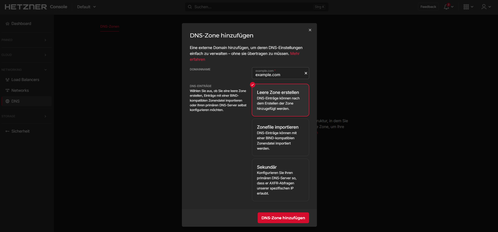
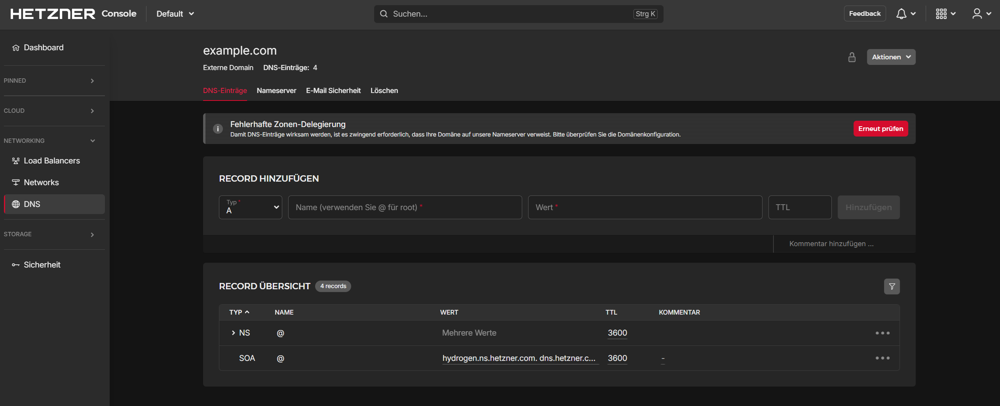
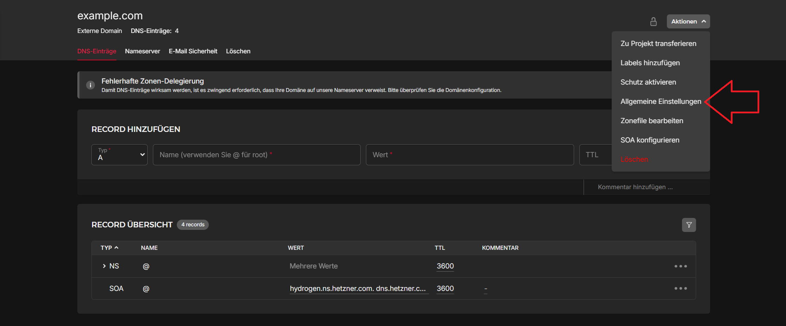
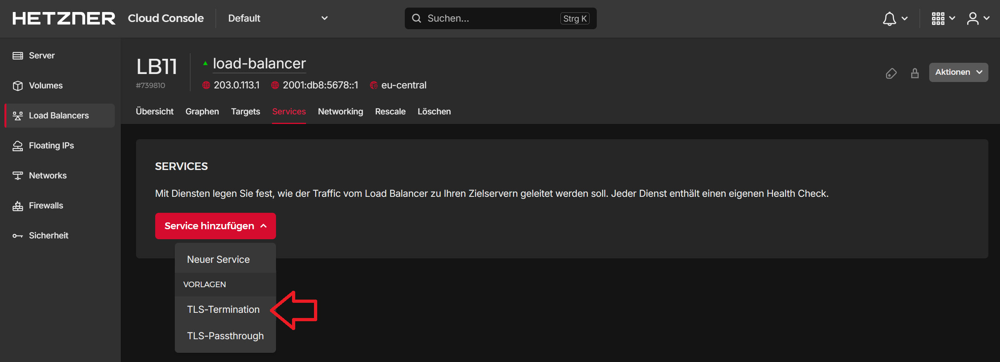
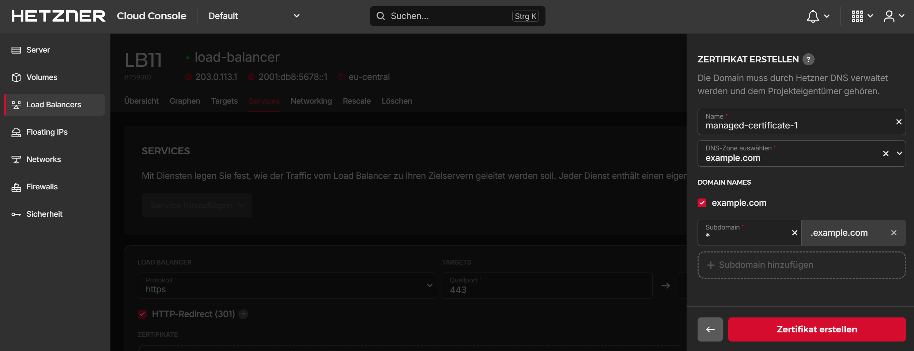

## Einführung

In diesem Beitrag geht es darum auf Cloud Load Balancern die automatische Zertifikatsvergabe auch mit extern bereitgestellten Domains zu nutzen.

**Voraussetzungen**

+ Eine Top-Level-Domain, z.B. `example.com`
+ DNS Hoster mit der Möglichkeit `NS` Records zu erstellen
+ Einen Cloud Load Balancer

## Schritt 1 - Anlegen der Hetzner DNS Zone

In diesem Schritt wird in der Hetzner Console eine DNS Zone für die Domain `example.com` angelegt. Diese wird später vom Load Balancer verwendet, um die `_acme-challenge` zu verarbeiten.

Eine neue DNS Zone kann unter [console.hetzner.com](https://console.hetzner.com/) angelegt werden.



Dazu einfach den Namen der Domain angeben.

Die angelegte DNS Zone sollte nun so aussehen:



Die Zone sollte ausschließlich NS-Records und einen SOA-Record enthalten. A-Records, MX-Records oder ähnliche werden hier nicht benötigt.

Wenn die DNS Zone in einem anderen Projekt liegt als der Load Balancer, muss `Zone mit anderen Projekten teilen` aktiviert werden (siehe die [offiziellen FAQs](https://docs.hetzner.com/de/networking/dns/faq/general#kann-ich-zonen-projektubergreifend-verwenden)).

Um die Option zu aktivieren:

* Klicke oben rechts auf "Aktionen"
* Klicke auf "Allgemeine Einstellungen"
* Aktiviere "Zone mit anderen Projekten teilen"



## Schritt 2 - Externe DNS Konfiguration

Nun geht es darum die DNS Zone `_acme-challenge.example.com` der externen Domain auf die Hetzner DNS Zone umzuleiten.

Um das zu bewerkstelligen müssen bei dem jeweiligen DNS Hoster mehrere `NS` Einträge angelegt werden.

Diese sind wie folgt aufgebaut:

```Console
_acme-challenge.example.com	IN	NS	hydrogen.ns.hetzner.com.
```

> Die DNS Server können der Hetzner DNS Zone entnommen werden.

Es sollte für jeden DNS Server ein `NS` Record bei dem externen DNS Hoster angelegt werden.

Bei Cloudflare sieht die Konfiguration in etwa so aus:


## Schritt 3 - Einrichtung des Load Balancers

Im Load Balancer muss nun ein `TLS-Termination` Service eingerichtet werden.

In der [Hetzner Console](https://console.hetzner.com/) muss dazu der Load Balancer ausgewählt und anschließend zu "Services" navigiert werden. Klicke dort auf `Service hinzufügen` » `TLS-Termination`.



> Zu beachten ist hier, wie der Traffic vom Load Balancer weiter zum Cloud Server gelangt. Die Standardeinstellung ist die **unverschlüsselte** Übertragung über `HTTP` und das öffentliche Interface des Servers. Hier würde es sich dringend anbieten auf dem Service ein Self-Signed Zertifikat zu hinterlegen und den Load Balancer auf `HTTPS` zu `HTTPS` zu konfigurieren. Zusätzlich kann der Traffic auch über ein privates Netzwerk geleitet werden, was zuvor aber konfiguriert werden muss.

Wähle beim Erstellen des Services `Zertifikat` » `+ Zertifikat hinzufügen` aus und klicke auf `Zertifikat erstellen`. Weitere Information bezüglich des Unterschiedes zwischen `Zertifikat erstellen` und `Zertifikat hochladen`, können in diesem [FAQ-Eintrag](https://docs.hetzner.com/de/cloud/load-balancers/faq/#wie-kann-ich-meine-zertifikate-verwalten) nachgelesen werden.

Es können ein Name und eine DNS Zone angegeben werden. Hier wird dann die oben erstellte DNS Zone ausgewählt.



> In der Auswahl können entweder einzele Sub-Domains (`ssl.example.com`) oder Wildcard Zertifikate (`*.example.com`) ausgestellt werden. Im oben gezeigen Beispiel ist es ein Wildcard Zertifikat.

Danach ist die Einrichtung des Zertifikats abgeschlossen. Nun können die DNS-Einträge, die für den jeweiligen Service benötigt werden, in der Hetzner [DNS Console](https://dns.hetzner.com/) angelegt werden. Dafür muss schlicht ein `A` Record hinzugefügt werden, in welchem die (Sub-)Domain auf den Load Balancer zeigt. Beispiel:

| Typ  | Name            | Wert               |
| ---- | --------------- | ------------------ |
| A    | ssl.example.com | <kbd>\<load-balancer-ip></kbd> |

Danach läuft der Service dann unter dem TLS Zertifikat.


## Ergebnis

In diesem Beitrag wurde gezeigt wie man trotz einer externen Domain das Let's Encrypt Feature der Load Balancer verwenden kann, ohne die Domain komplett umziehen zu müssen.

##### License: MIT

<!--

Contributor's Certificate of Origin

By making a contribution to this project, I certify that:

(a) The contribution was created in whole or in part by me and I have
    the right to submit it under the license indicated in the file; or

(b) The contribution is based upon previous work that, to the best of my
    knowledge, is covered under an appropriate license and I have the
    right under that license to submit that work with modifications,
    whether created in whole or in part by me, under the same license
    (unless I am permitted to submit under a different license), as
    indicated in the file; or

(c) The contribution was provided directly to me by some other person
    who certified (a), (b) or (c) and I have not modified it.

(d) I understand and agree that this project and the contribution are
    public and that a record of the contribution (including all personal
    information I submit with it, including my sign-off) is maintained
    indefinitely and may be redistributed consistent with this project
    or the license(s) involved.

Signed-off-by: Markus<markus@omg-network.de>

-->
