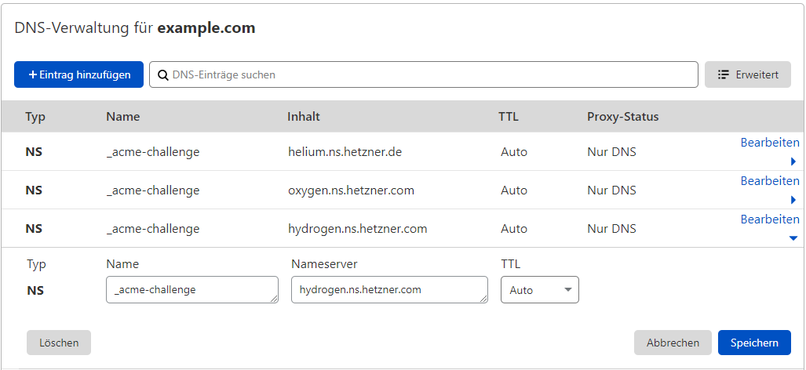

## Introduction

This article is about using automatic certificate allocation on cloud load balancers with externally provided domains.

**Requirements**

+ A top-level domain, e.g. `example.com`
+ DNS hoster with the possibility to create `NS` records
+ A cloud load balancer

## Step 1 - Creating the Hetzner DNS zone

In this step a DNS zone for the domain `example.com` is created in the Hetzner DNS management. This zone will later be used by the load balancer to process the `_acme-challenge`.

A new DNS zone can be created at [dns.hetzner.com](https://dns.hetzner.com).


To do this, simply specify the name of the domain and disable automatic scanning.

The created DNS zone should now look like this:


The marked entries are not needed and should therefore be deleted.

## Step 2 - External DNS configuration

Now we have to redirect the DNS zone `_acme-challenge.example.com` of the external domain to the Hetzner DNS zone.

To do this, several `NS` entries have to be created at the respective DNS hoster.

These are structured as follows:

```Console
_acme-challenge.example.com	IN	NS	hydrogen.ns.hetzner.com.
```

> The DNS servers can be taken from the Hetzner DNS zone.

A `NS` record should be created for each DNS server at the external DNS hoster.

For Cloudflare, the configuration would look something like this:



## Step 3 - Setting up the load balancer

A `TLS termination` service must now be set up in the load balancer.


> Note here how the traffic from the load balancer continues to the cloud server. The default setting here is **unencrypted** transmission via `HTTP` and the public interface of the server. Here it would be urgently advisable to deposit a self-signed certificate on the service and to configure the load balancer to `HTTPS` to `HTTPS`. In addition, the traffic can also be routed over a private network, which must be configured first.

Here you can enter a name and a DNS zone under `Certificate` --> `Create certificate`. The DNS zone created above is then specified here.


> In the selection either single sub-domains or wildcard certificates can be issued. In the example shown above it is a wildcard certificate.

After that, the certificate setup is complete. Now the DNS entries required for the respective service can be created with target on the load balancer.

After that, the service will run under the TLS certificate.


## Summary

In this article we showed how to use the Lets Encrypt feature of the load balancers, despite an external domain, without having to move the domain completely.

##### License: MIT

<!--

Contributor's Certificate of Origin

By making a contribution to this project, I certify that:

(a) The contribution was created in whole or in part by me and I have
    the right to submit it under the license indicated in the file; or

(b) The contribution is based upon previous work that, to the best of my
    knowledge, is covered under an appropriate license and I have the
    right under that license to submit that work with modifications,
    whether created in whole or in part by me, under the same license
    (unless I am permitted to submit under a different license), as
    indicated in the file; or

(c) The contribution was provided directly to me by some other person
    who certified (a), (b) or (c) and I have not modified it.

(d) I understand and agree that this project and the contribution are
    public and that a record of the contribution (including all personal
    information I submit with it, including my sign-off) is maintained
    indefinitely and may be redistributed consistent with this project
    or the license(s) involved.

Signed-off-by: Markus<markus@omg-network.de>

-->
