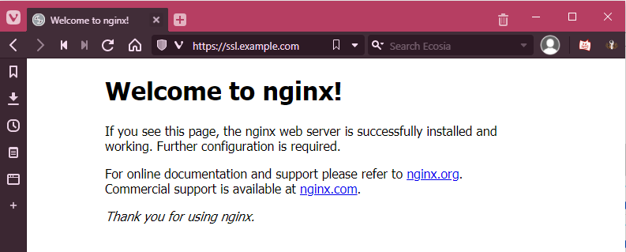

## Introduction

This article is about using automatic certificate allocation on cloud Load Balancers with externally provided domains.

**Prerequisites**

+ A top-level domain, e.g. `example.com`
+ DNS hoster with the possibility to create `NS` records
+ A cloud Load Balancer

## Step 1 - Creating the Hetzner DNS zone

This step explains how to create a DNS zone in Hetzner Console for the domain `example.com`. Later, the Load Balancer will use this zone to process the `_acme-challenge`.

You can create a new DNS zone at [console.hetzner.com](https://console.hetzner.com).


To do this, simply specify the name of the domain.

The created DNS zone should now look like this:


The zone should only contain NS records and a SOA record. You do not need A, MX, or similar records.

If your DNS zone is in a different project than your Load Balancer, you have to enable `Share zone with other projects` (see [official FAQs](https://docs.hetzner.com/networking/dns/faq/general#can-i-use-zones-across-projects)).

To enable this option:

* Click on "Actions" in the top right
* Click on "General settings"
* Enable "Share zone with other projects"


## Step 2 - External DNS configuration

Now we have to redirect the DNS zone `_acme-challenge.example.com` of the external domain to the Hetzner DNS zone.

To do this, you need to create several `NS` entries at the respective DNS hoster.

These are structured as follows:

```Console
_acme-challenge.example.com	IN	NS	hydrogen.ns.hetzner.com.
```

> You can take the DNS servers from the Hetzner DNS zone.

You should create a `NS` record for each DNS server at the external DNS hoster.

For Cloudflare, the configuration would look something like this:


## Step 3 - Setting up the Load Balancer

You must now set up a `TLS termination` service in the Load Balancer.

Open [Hetzner Console](https://console.hetzner.com/), navigate to your Load Balancer and select "Services". Next, click on `Add service` » `TLS Termination`.


> Note how the traffic is forwarded from the Load Balancer to the cloud server. The default setting here is **unencrypted** transmission via `HTTP` and the public interface of the server. Here it would be urgently advisable to deposit a self-signed certificate on the service and to configure the Load Balancer to `HTTPS` to `HTTPS`. In addition, you can also route the traffic over a private network, which must be configured first.

During service creation, select `CERTIFICATES` » `+ Add certificates` and click on `Create certificate`. For more information about the difference between `Create certificate` and `Upload cerificate`, you can see this [FAQ entry](https://docs.hetzner.com/cloud/load-balancers/faq#how-can-i-manage-my-certificates).

Next, enter a name and select your DNS zone. Select the DNS zone created above.


> You can issue either single sub-domains (`ssl.example.com`) or wildcard certificates (`*.example.com`). In the example above, it is a wildcard certificate.

After that, the certificate setup is complete. Now, you can go back to [Hetzner Console](https://console.hetzner.com/) and create the DNS entries required for the respective service. To do this, simply create a new `A` record that points your (sub-)domain at the Load Balancer. For example:

| Type | Name            | Value              |
| ---- | --------------- | ------------------ |
| A    | ssl.example.com | <kbd>\<load-balancer-ip></kbd> |

After that, the service will run under the TLS certificate.



## Conclusion

This article showed how to use the Let's Encrypt feature of the Load Balancers with an external domain, without having to move the domain completely.

##### License: MIT

<!--

Contributor's Certificate of Origin

By making a contribution to this project, I certify that:

(a) The contribution was created in whole or in part by me and I have
    the right to submit it under the license indicated in the file; or

(b) The contribution is based upon previous work that, to the best of my
    knowledge, is covered under an appropriate license and I have the
    right under that license to submit that work with modifications,
    whether created in whole or in part by me, under the same license
    (unless I am permitted to submit under a different license), as
    indicated in the file; or

(c) The contribution was provided directly to me by some other person
    who certified (a), (b) or (c) and I have not modified it.

(d) I understand and agree that this project and the contribution are
    public and that a record of the contribution (including all personal
    information I submit with it, including my sign-off) is maintained
    indefinitely and may be redistributed consistent with this project
    or the license(s) involved.

Signed-off-by: Markus<markus@omg-network.de>

-->
