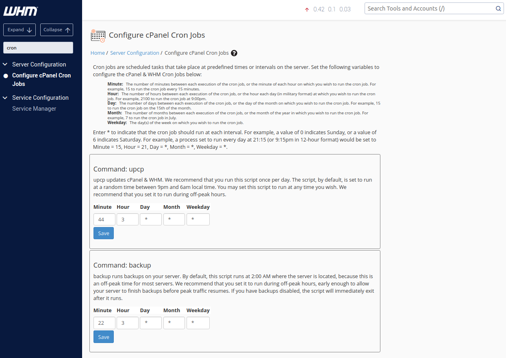
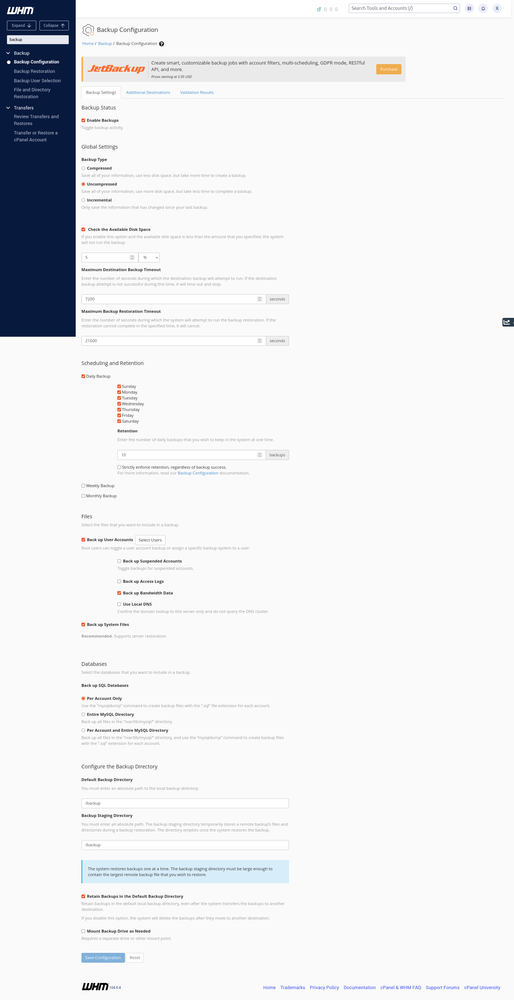
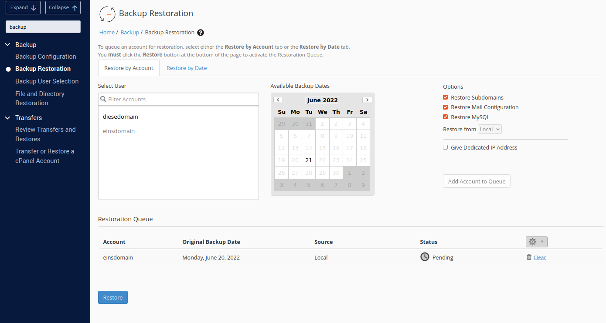
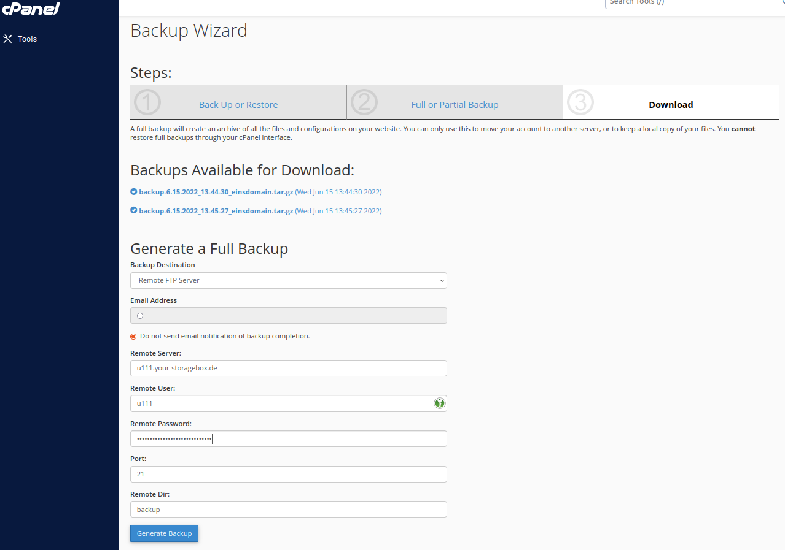

## Introduction

In this tutorial you will learn how to configure a new cron job on your cPanel account to automatically create backups. Additionally, a new storage destination will be added for the backups. In this example, a Hetzner Storage Box will be used as storage destination. Lastly, we will take a look at how to restore backups of an entire account or a single file.

> When you create a new Hetzner Dedicated Server, you can also choose from selected operating systems which are [automatically preinstalled with cPanel](https://docs.hetzner.com/robot/dedicated-server/operating-systems/cpanel/#automatic). For existing dedicated servers, you can do this via the cPanel tab of the server on Robot.

**Prerequisites**

* Server with [installed](https://docs.cpanel.net/installation-guide/install/) and [licensed](https://www.cpanel.net/pricing/) cPanel (see [free trial](https://www.cpanel.net/products/trial/))
* Hetzner Storage Box

**Example terminology**

* Hostname: `whm-test`
* Storage Box: `u111.your-storagebox.de`
* Storage Box user: `u111`
* WHM: `https://whm-test:2087`
* cPanel: `https://whm-test:2083`

## Step 1 - WHM Backups

### Step 1.1 Configure Cron job

To configure the cron job, you first have to open WHM and login on your account:

```
https://<server-ip-address>:2087
```

> Make sure you add the port of the WHM control panel (default: `2087`) at the end of the URL.

Once you’re logged in, select `Tools` > `Server Configuration` > `Configure cPanel Cron Jobs`. There, you can configure the time and interval in which the backups should be made. Save the new settings.



### Step 1.2 - Configure backup options

Next to the cron job, you will also have to configure the backup options. To do this, go to `Tools` > `Backup` > `Backup Configuration`.

The following image shows settings for daily backups of all existing user accounts:



### Step 1.3 - Back up user accounts

To back up user account data, you have to select the users separately.


Click on `Select Users`. This takes you to a full list of all cPanel user accounts. For enabled users, the WHM will back up the account's information as set in the configurations.

### Step 1.4 - Change the backup destination

When you open the `Additional Destination` tab, you can add the Storage Box as the new backup destination.


To transfer the backups from WHM to the Storage Box, you can use rsync, for example.


If you would like to authenticate via an SSH key instead of a password, you can select "Key Authentication". You can add an existing key, or generate a new one. For more information about [SSH key authentication for Storage Boxes](https://docs.hetzner.com/storage/storage-box/backup-space-ssh-keys), go to docs.hetzner.com.

You can validate the destination while saving, and check whether all configurations were set correctly and successfully.

## Step 2 - WHM Restore Backup

### Step 2.1 - Account restoration

To restore backups of an entire account, go to `Tools` > `Backup` > `Backup Restoration`.

Before you select a backup, you can choose between the options "Restore by Account" and "Restore by Date". 

- "**Restore by Account**" allows you to select a certain account from a list of all accounts with backups. When you select one of the accounts, it will show you the dates from which backups are available.
- "**Restore by Date**" allows you to select a certain date. You will then get a list of those accounts only which have backups from that date.


When you're happy with the selected account and date, click on "Add Account to Queue". This will add the account to the "Restoration Queue".

You can add several accounts at the same time to the "Restoration Queue". As soon as you're done with the queue, you can select "Restore".



### Step 2.2 - File and Directory restoration

To restore backups of a file or directory, go to `Tools` > `Backup` > `File and Directory Restoration`. This will take you to a list of all user accounts. Select the user account on which the file or directory to restore was saved.

To select files or directories, you can choose between the options "Enter a path" and "Browse files and directories".

- "**Enter a path**"

  This option will restore the backup of an entire directory. In this example, the directory with the name `logs` and all its contents will be restored. When you enter the directory on the left, you will get a list on the right of all backups that are available for that directory.

  

- "**Browse files and directories**"

  This option will restore the backup of a single file within a directory. In this example, the file with the name `diese-domain.test-Jun-2022.gz` from the directory `logs` will be restored. When you click on one of the files and select "Show Backups", you will get a list on the right of all backups that are available for that file.

  

## Step 3 - cPanel Backup

cPanel is the account-level interface. You can use the cPanel to move your account to another server, or to download a copy of your account. You cannot use the cPanel interface to restore full backups.

Open the cPanel interface and login on your account:

```
https://<server-ip-address>:2083
```

> Make sure you add the port of the cPanel interface (default: `2083`) at the end of the URL.

### Step 3.1 - Backup Wizard

On the `Tools` page, scroll to `Files` and select `Backup Wizard`. This is where you can choose to "Back Up" or "Restore" your website.

To download a full backup of your website, select first "Back Up", and then "Full Backup". 

- In the example below, two existing backups are available for download.
- As backup destination, you can choose from "home directory", "FTP server", "passive FTP server", and "SCP".

Before you generate the backup, select "Remote FTP Server" to transfer the backup to the Storag Box. Remember to also enter the login credentials of your Storage Box. Next, generate the backup.



### Step 3.2 - Backup

On the `Tools` page, scroll to `Files` and select `Backup`.

Here, it is also possible to download already existing backups.

- "**Full Backup**" - Redirects you to `Backup Wizard`.
- "**Account Backups**" - You can download an existing backup to the local computer.
- "**Partial Backups**" - You can choose from "Home Directory Backup", "Database Backup", "Email Forwarders", and "Email Filters".

### Step 3.3 - Restore

On the `Tools` page, scroll to `Files` and select `Backup Wizard`. This is where you can choose to "Back Up" or "Restore" your website.

To "restore" a user account or parts of it, you will have to upload an existing backup which you have previously saved yourself.

Select the file and click on "Upload". This will automatically upload and restore information saved in the backup file. 

## Conclusion

In the previous steps you learned how to configure daily backups of your cPanel accounts and how to store them on a Hetzner Storage Box.

The Storage Box can be accessed with FTP and rsync.

> Note: cPanel Backup does not work with SCP and a Storage Box.

##### License: MIT

<!--
Contributor's Certificate of Origin
By making a contribution to this project, I certify that:
(a) The contribution was created in whole or in part by me and I have
    the right to submit it under the license indicated in the file; or
(b) The contribution is based upon previous work that, to the best of my
    knowledge, is covered under an appropriate license and I have the
    right under that license to submit that work with modifications,
    whether created in whole or in part by me, under the same license
    (unless I am permitted to submit under a different license), as
    indicated in the file; or
(c) The contribution was provided directly to me by some other person
    who certified (a), (b) or (c) and I have not modified it.
(d) I understand and agree that this project and the contribution are
    public and that a record of the contribution (including all personal
    information I submit with it, including my sign-off) is maintained
    indefinitely and may be redistributed consistent with this project
    or the license(s) involved.
Signed-off-by: [Beatrice Richter beatrice.richter@hetzner.com]
-->
