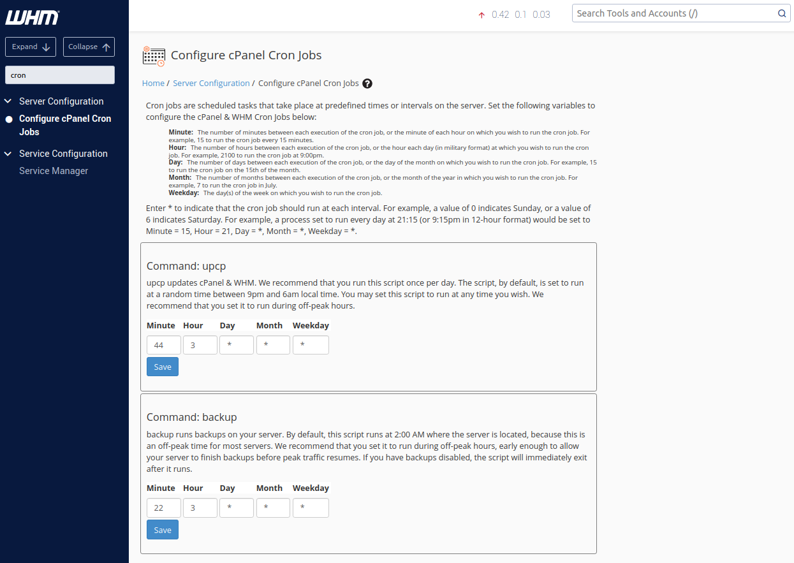
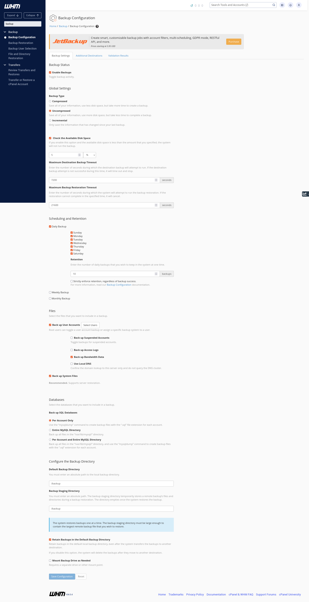
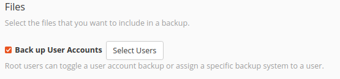
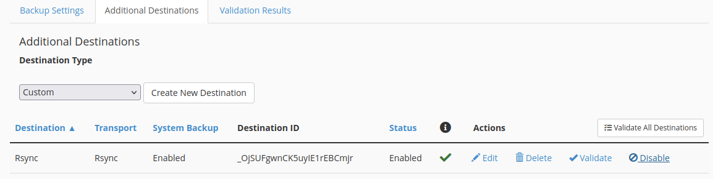
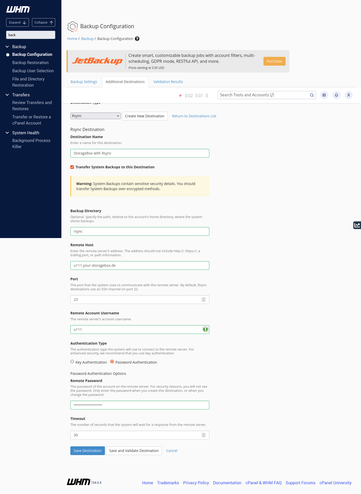
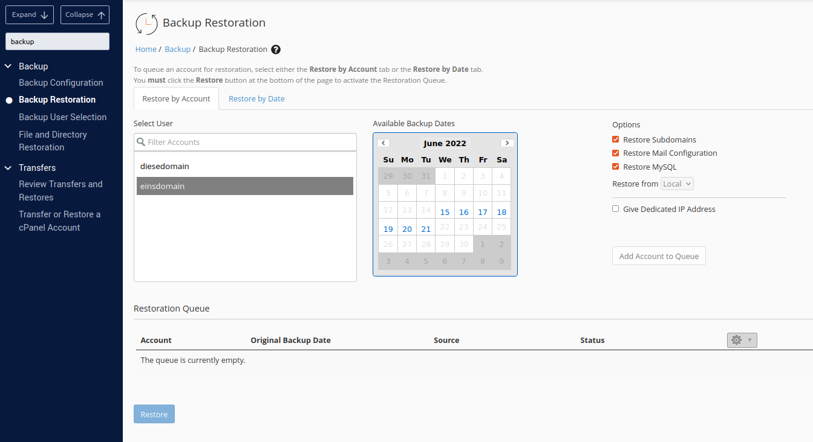
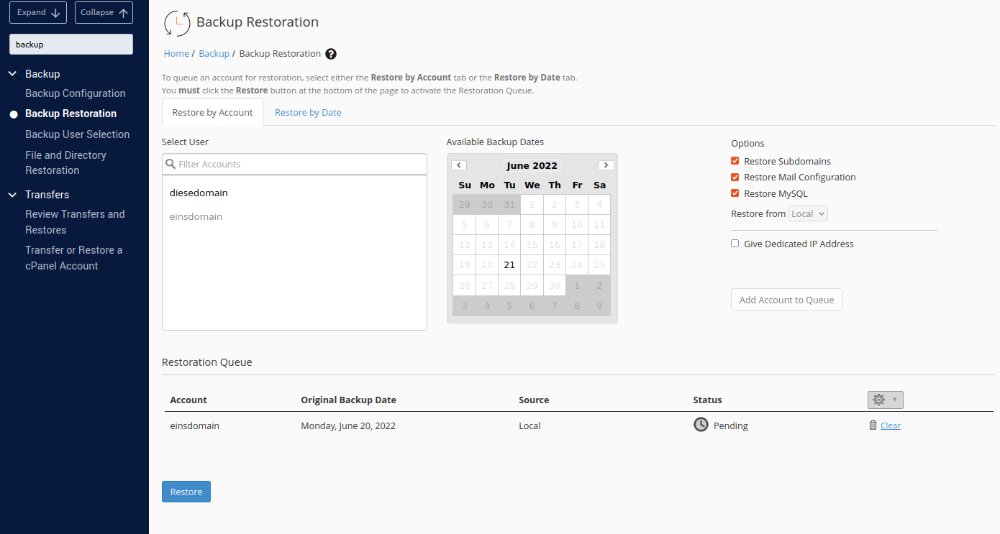
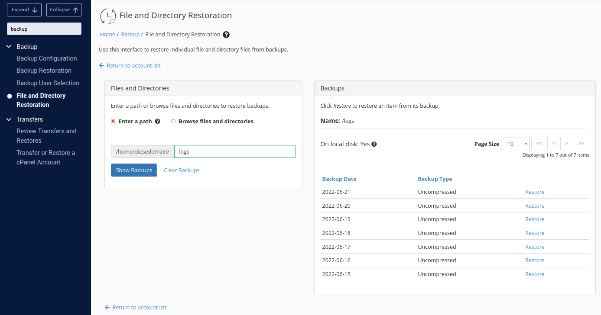
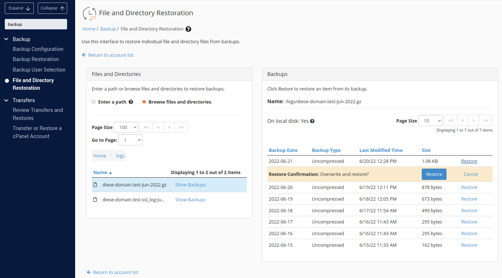
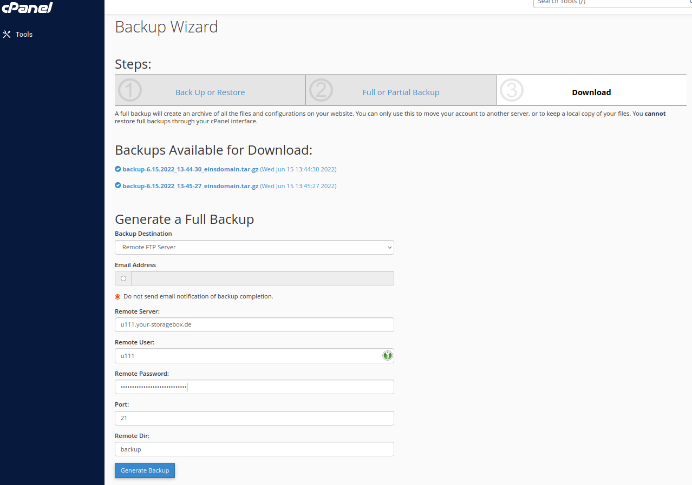

## Introduction

The first paragraph or paragraphs are there for you to explain what your tutorial will do. Please don't simply list the steps you will be following, a table of contents (TOC) with the steps will be automatically added.
Make sure users know exactly what they will end up with if they follow your tutorial, and let them know if they need any specific prerequisites.
You can link to other tutorials that your tutorial builds on, and add recommendations for what users should know.

In this tutorial we will set up an automatic backup via cronjob for cPanel Accounts. We will also take a look how to restore backups for an entire account or single files. 

**Prerequisites**

We need a server with installed and licensed cPanel and a Storage Box.
When ordering a new server, you can select an operating system which is then pre-installed on the server. If the server is already online, cPanel can be activated and installed automatically (along with an OS) via the cPanel tab of the server on Robot. Once you have restarted the server, the installation will be automatically performed. You will get an email with the login details of both the OS and cPanel once the installation is complete.

* Hostname: `whm-test`
* StorageBox: `u111.your-storagebox.de`
* StorageBox-User: `u111`
* WHM: `https://whm-test:2087`
* cPanel: `https://whm-test:2083`

## Step 1 - WHM Backup

### Step 1.1 Configure Cronjob

At first we need to login the WHM account to configure the cronjob for interval backup. We select the category "Tools > Server Configuration > Configure cPanel Cron Jobs". Here we can configure the time and interval in which our backup should be done. Save the new settings.

### Step 1.2 - Configure Backup Options

After configuring the cronjob we need to configure the backup options. We go to "Tools > Backup > Backup Configuration".
In the following picture we can see settings for a daily backup for every existing user account: 

### Step 1.3 - Back up user accouns

To backup user account data we need to select the users. 

Click on "Select Users".
Here we get listed all cPanel user accounts. If the user is enabled, the WHM will backup everything for this account, like configured.

### Step 1.4 - Additional Destination

Within the "Additional Destination" tab we can create a new destination to add our Storage Box as backup destination.

As example we will set up the connection via Rsync:

If we want to authenticate with a SSH key instead of a password, we can choose "Key Authentication".
We can us an already existing key or generate a new one. 
A tutorial about how to use SSH key for Storage Box exist in our Hetzner Docs:
https://docs.hetzner.com/robot/storage-box/backup-space-ssh-keys

To check if all is successfully configured, we can validate the destination while saving. 

## Step 2 - WHM Restore Backup

### Step 2.1 - Account restoration
To restore a backup we can select between restore by acount and restore by date. 
"Restore by account" gives us a list of accounts. After selected an account we will get shown all available backup dates. 
At "Restore by date" we first select the date and then we will get a list of accounts, for which a backup exist.

After we selected the right date and clicked "Add Account to Queue", the account was added to the Restoration Queue. 
If all accounts are selected which needs an backup restore we can start with the button "Restore".

### Step 2.1 - File and Directory restoration

At the category "File and Directory Restoration" we can also choose between all existing user accounts. 
We can select files or directories by enter a path or browse all backuped directories.

By selecting a path we would restore the whole directory. The list of available backups for this directory is shown
on the right side. 

By selecting via "Browse files and directories" we can restore a single file within an directory.
Select the correct file and klick "show backups". On the right side we will get shown a list of available backups for the file.

## Step 3 - cPanel Backup

cPanel is the account-level interface.
This feature is only to move your account to another server or to download a copy of your account. You cannot restore Full Backups through your cPanel interface.  

### Step 3.1 - Backup Wizard

On the Tools page at the Files category we can find the "Backup Wizard". Here we can back up and restore our website. 
For this tutorial we choose the full backup option. As backup destination we can select home directory, FTP server, passive FTP server or SCP.

For this account there are two existing backup listed. We can download them to our local computer. 
To generate a backup and send it to our StorageBox we select the "Remote FTP Server" option. Enter the login credentials of your Storage Box and generate the backup.

### Step 3.2 - Backup

The "Backup" page we can also find at the Files category. Here we can also download already existing backup.
Full Backup - redirected us to the Backup Wizard.
Account Backups - here we can select an existing backup and download it to our local computer.
Partial Backups - choose between Home Directory Backup, MySQL Database Backup, Email Forwarders and Email Filters.

### Step 3.2 - Restore

At the right side of the Backup section we can find the corresponding restore option. 
To restore the user account or parts of it, we can only use local existing backup files. 
Select the file and klick on upload. This will automatic upload and restore the backup file. 

## Conclusion

With this tutorial we have configured a daily running backup including a Storage Box as backup target in our WHM account. 
Additionaly we 
The Storage Box can be accessed with FTP and Rsync.

Note: cPanel Backup does not work with SCP and a Storage Box.

##### License: MIT

<!--

Contributor's Certificate of Origin

By making a contribution to this project, I certify that:

(a) The contribution was created in whole or in part by me and I have
    the right to submit it under the license indicated in the file; or

(b) The contribution is based upon previous work that, to the best of my
    knowledge, is covered under an appropriate license and I have the
    right under that license to submit that work with modifications,
    whether created in whole or in part by me, under the same license
    (unless I am permitted to submit under a different license), as
    indicated in the file; or

(c) The contribution was provided directly to me by some other person
    who certified (a), (b) or (c) and I have not modified it.

(d) I understand and agree that this project and the contribution are
    public and that a record of the contribution (including all personal
    information I submit with it, including my sign-off) is maintained
    indefinitely and may be redistributed consistent with this project
    or the license(s) involved.

Signed-off-by: [Beatrice Richter beatrice.richter@hetzner.com]

-->
