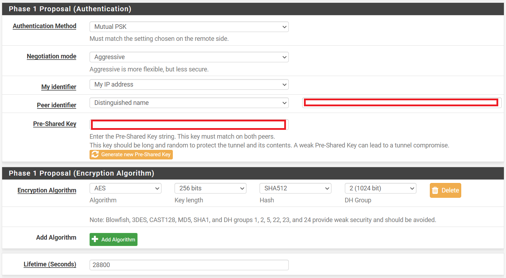

## Introduction

This tutorial will go through the steps of connecting an AVM FritzBox router to a pre-existing pfSense machine.

The pfSense instance on hcloud will have a static public IP assigned, however a residential connection will likely change its IP address once a day. Since IPSec very much prefers static endpoints we can "bypass" this requirement by utilizing a dynamic dns service to keep track of our non-static public IP.

There are many free and paid providers, I personally can recommend [DynDNS Service](https://ddnss.de/) as it's a German company and their free service is sufficient for the requirements. Please select a service that suits your needs, create a account and follow the providers tutorial on how to configure it with your router.

**Prerequisites**

* hcloud machine with pfSense (2.4.5-RELEASE-p1) installed (ISO is available within hcloud)
* Dynamic DNS service

## Step 1 - Setup FritzBox with DynDNS

AVM allows to select a custom (ger.: "Benutzerdefiniert") DnyDNS provider. This utilizes a string replacement method to custom build the string. Wether or not this is a useful function is up for debate but has to be kept in mind.

For DynDNS Service (ddnss.de) use the following configuration:

<!--
THE UI OF AVM REQUIRES THE UPDATE URL STRING WITH ITS CHEVRONS JUST THE WAY THEY ARE HERE!
-->

```bash
DynDNS Provider: Custom
Update URL: https://www.ddnss.de/upd.php?user=<username>&pwd=<pass>&host=<domain>
Domain name: ENTER YOUR DOMAIN HERE (i.e. yoursubdomain.ddnss.de)
Username: Your Username
Password: Your Password
```

The following image shows this setup (in German):


## Step 2 - Setup IPSec configuration on pfSense

Navigate to the admin interface of your pfSense instance, log in and go to `VPN -> IPSec -> Add P1`.

AVM does not provide very secure configuration options but they should be sufficient for personal information.

The configuration has to be set to these settings:

```bash
Key exchange version:   IKEv1
Internet protocol:      IPv4
Interface:              WAN
Remote Gateway:         yourdomain.ddnss.de

=== Phase 1 Proposal (Authentication) ===
Authentication Method:  Mutual PSK
Negotiation mode:       Aggressive
My identifier:          My IP address
Peer identifier:        Distinguished name      yourdomain.ddnss.de
Pre shared key:         CLICK ON Generate

=== Phase 1 Proposal (Encryption Algorithm) ===
Algorithm:              AES
Key length:             256 bits
Hash:                   SHA512
DH Group:               2 (1024 bit)
Lifetime (Seconds):     28800
```



The rest can be left as is.

Next the Phase 2 has to be configured for actual network connection.

Click on `Show Phase 2 Entries (0)`, then `Add P2` and configure the second phase as follows:

```bash
Mode:                   tunnel
Local network:          [10.0.1.0 /24]      *1
NAT/BINAT translation:  None
Remote network:         [192.168.178.0 /24] *2
```


```bash
=== Phase 2 Proposal (SA/Key Exchange) ===
Protocol:               ESP
Encryption Algorithms:  AES     256 bits
                        !!REST UNCHECKED!!
Hash Algorithms:        SHA512
PFS key group:          2 (1024 bit)
Lifetime:               3600                        
```


Save and click `Apply changes ✔`

The completed configuration should render the VPN -> IPSec -> Tunnels page like this:


*NOTES:*

`*1` This is the private IP of your hcloud internal network. Please refer to this [excellent tutorial](https://community.hetzner.com/tutorials/how-to-route-cloudserver-over-private-network-using-pfsense-and-hcnetworks).

`*2` This is the private network of your FritzBox, which usually defaults to `192.168.178.0/24`. If you changed this, you will need to update this accordingly.

### Step 2.1 - pfSense Firewall considerations (optional)

In order to secure the publicly available pfSense instance there are several good steps to be taken.

1. Only allow access to management interfaces (WebUi, ssh, ...) via tunnel or access only via hcloud console.
1. Install snort, and enable on WAN interface in blocking mode.
1. Do not allow any ingress on WAN. IPSec is automatically detected and sorted via the IPSec chain.

For further hardening please refer to to [this thread on the netgate forum](https://forum.netgate.com/topic/113685/hardening-securing-and-privacy-configuration/7).

## Step 3 - Connect FritzBox to pfSense

Open the FritzBox Admin UI and navigate to `Internet -> Permit Access -> VPN` and choose `Add VPN connection`. Select `Connect your home network with another FRITZ!Box network (LAN-LAN linkup)` and continue.

Configure the VPN as follows:

```bash
VPN password (pre-shared key):      [THE PASSWORD CHOSEN IN Phase 1 Proposal]
Name of the VPN connection:         Chose whatever
Web address of the remote site:     Enter the public IP of the pfSense device
Remote network:                     10.0.1.0
Subnet mask:                        255.255.255.0
Hold VPN connection permanently:    Check
```

Please note that the FritzBox only pushes the defined network (10.0.1.0) onto its internal routing tables. In order to map multiple cloud subnets over the pfSense instance on your private network you have to manually add IPv4 routes.

To do so go to `Home Network -> Network -> Network Settings -> Additional Settings -> IPv4 Routes -> New IPv4 Route` and add the additional hcloud subnet e.g. 10.0.2.0/24 like this:

```bash
IPv4 Network:       10.0.2.0
Subnet mask:        255.255.255.0
Gateway:            10.0.1.1 <- IP of pfSense instance
```

## Conclusion

You have now conntected an AVM FritzBox router to a pre-existing pfSense server.

##### License: MIT

<!--

Contributor's Certificate of Origin

By making a contribution to this project, I certify that:

(a) The contribution was created in whole or in part by me and I have
    the right to submit it under the license indicated in the file; or

(b) The contribution is based upon previous work that, to the best of my
    knowledge, is covered under an appropriate license and I have the
    right under that license to submit that work with modifications,
    whether created in whole or in part by me, under the same license
    (unless I am permitted to submit under a different license), as
    indicated in the file; or

(c) The contribution was provided directly to me by some other person
    who certified (a), (b) or (c) and I have not modified it.

(d) I understand and agree that this project and the contribution are
    public and that a record of the contribution (including all personal
    information I submit with it, including my sign-off) is maintained
    indefinitely and may be redistributed consistent with this project
    or the license(s) involved.

Signed-off-by: Markus Hupfauer <markus@hupfauer.one>

-->
