## Einführung

In der heutigen schnelllebigen digitalen Welt sind Sicherheit und Zugänglichkeit zwei wichtige Anliegen für Unternehmen und Privatpersonen gleichermaßen. Angesichts der zunehmenden Zahl von Cyber-Bedrohungen und der Notwendigkeit des Fernzugriffs auf Server ist es unerlässlich, sichere Verbindungen zu Servern herzustellen und gleichzeitig einen einfachen Zugriff zu gewährleisten. Dieses Tutorial führt durch den Prozess der Verbindung zu einem Server über ein privates Netzwerk mit Cloudflare Access, einem leistungsstarken Tool, das Sicherheit und Komfort kombiniert.

### Warum privater Netzzugang?

Ein Auszug aus `/var/log/auth.log` von meinem Server, der dem öffentlichen Internet ausgesetzt ist:

```bash
holu@<your_host>:~$ sudo grep -R "Failed password for root from" /var/log/auth.log  | wc -l
24780
```

Diese Fehler werden innerhalb weniger Stunden aufgezeichnet, in denen ich eine VM bereitgestellt habe. Dies zeigt, dass es im Internet bösartige Akteure gibt, die versuchen, mit einer großen Liste zufälliger Passwörter in dein Netzwerk einzubrechen. Die meisten von ihnen könnten bei einer der früheren Datenschutzverletzungen durchgesickert sein.

Traditionell wurde der Serverzugriff über das öffentliche Internet abgewickelt, was Sicherheitsrisiken wie unbefugten Zugriff, Datenverletzungen und DDoS-Angriffe (Distributed Denial of Service) birgt. Private Netze hingegen bieten eine sicherere Umgebung, da sie den Zugriff nur auf autorisierte Benutzer beschränken.

### Unterschiede im Vergleich zu einem herkömmlichen VPN

* **Sicherheit**: Cloudflare Access ist eine Zero-Trust-Plattform, was bedeutet, dass sie nur Benutzern Zugang gewährt, die authentifiziert und autorisiert wurden. Dies steht im Gegensatz zu einem traditionellen VPN, das einfach den gesamten Datenverkehr zwischen dem Benutzer und dem Unternehmensnetzwerk tunnelt, unabhängig von der Identität oder Autorisierung des Benutzers. Dasselbe gilt für die Anwendung, auf die du über ein privates Netzwerk zugreifst, im Gegensatz zum Zugriff auf verschiedene Anwendungen in einem Subnetz mit einem herkömmlichen VPN.
* **Performance**: Cloudflare Access ist so konzipiert, dass es leichtgewichtig ist und minimale Auswirkungen auf die Leistung hat. Das liegt daran, dass die Benutzer keine Software installieren oder ihre Routing-Tabellen ändern müssen. Im Gegensatz dazu kann ein traditionelles VPN die Latenz erhöhen und die Bandbreite reduzieren, insbesondere für Benutzer, die sich von einem entfernten Standort aus verbinden.
* **Skalierbarkeit**: Cloudflare Access ist ein Cloud-basierter Service, was bedeutet, dass er skalierbar ist, um die Anforderungen jeder Organisation zu erfüllen. Dies steht im Gegensatz zu einem traditionellen VPN, bei dem die Organisation möglicherweise ihre eigene Hardware und Software kaufen und verwalten muss.
* **Benutzerfreundlichkeit**: Cloudflare Access ist einfach einzurichten und zu verwalten. Es kann in bestehende Identitätsanbieter wie Okta, Azure Active Directory und viele andere integriert werden. Im Gegensatz dazu kann ein herkömmliches VPN komplexer einzurichten und zu verwalten sein, insbesondere für große Organisationen.

In der folgenden Tabelle sind die wichtigsten Unterschiede zwischen Cloudflare Access und einem herkömmlichen VPN zusammengefasst:

| Feature                | Cloudflare Access                     | Traditionelles VPN                                        |
| ---------------------- | ------------------------------------- | --------------------------------------------------------- |
| Sicherheit             | Zero Trust                            | Tunnelt den gesamten Verkehr                              |
| Performance            | Minimale Auswirkungen                 | Kann die Latenzzeit erhöhen und die Bandbreite verringern |
| Skalierbarkeit         | Cloud-basiert                         | On-premises                                               |
| Benutzerfreundlichkeit | Einfach einzurichten und zu verwalten | Die Einrichtung und Verwaltung kann komplex sein          |

-----------

**Voraussetzungen**

Bevor wir mit der Bereitstellung beginnen, solltest du sicherstellen, dass die folgenden Voraussetzungen erfüllt sind:

1. **Cloudflare-Konto**: Du solltest ein Konto bei Cloudflare haben. Wenn du noch keines hast, kannst du eines [hier](https://www.cloudflare.com/zero-trust/products/access/) erstellen. Cloudflare bietet viele Dienste als Teil ihres kostenlosen Angebots an. [Cloudflare Access](https://www.cloudflare.com/zero-trust/products/access/) ist ebenfalls ein solches Angebot.

2. **Server**: Ein Server oder eine virtuelle Linux-Maschine.

3. **WARP-Client**: Du musst einen WARP-Client auf deinem lokalen Rechner installiert haben. Du kannst den Client für dein Betriebssystem vom offiziellen Cloudflare-Portal [hier](https://developers.cloudflare.com/cloudflare-one/connections/connect-devices/warp/download-warp/) herunterladen.

**Beispiel-Benennungen**

* Benutzername: `holu`
* E-Mail: `mail@example.com`
* Server
  * Hostname: `<your_host>`
  * IP-Adresse: `<10.0.0.2>`

## Schritt 1 - Erstellen des Tunnels im Cloudflare Dashboard

Cloudflare Tunnel bietet eine sichere Möglichkeit, Ressourcen mit Cloudflare zu verbinden, ohne eine öffentlich routbare IP-Adresse zu haben. Mit Tunnel sendest du keinen Datenverkehr an eine externe IP-Adresse — stattdessen erstellt ein leichtgewichtiger Daemon in deiner Infrastruktur (`cloudflared`) ausschließlich ausgehende Verbindungen zum globalen Netzwerk von Cloudflare. Cloudflare Tunnel kann HTTP-Webserver, [SSH-Server](https://developers.cloudflare.com/cloudflare-one/connections/connect-networks/use-cases/ssh/), [Remote-Desktops](https://developers.cloudflare.com/cloudflare-one/connections/connect-networks/use-cases/rdp/) und andere Protokolle sicher mit Cloudflare verbinden. Auf diese Weise können deine Ursprünge den Datenverkehr über Cloudflare leiten, ohne anfällig für Angriffe zu sein, die Cloudflare umgehen.

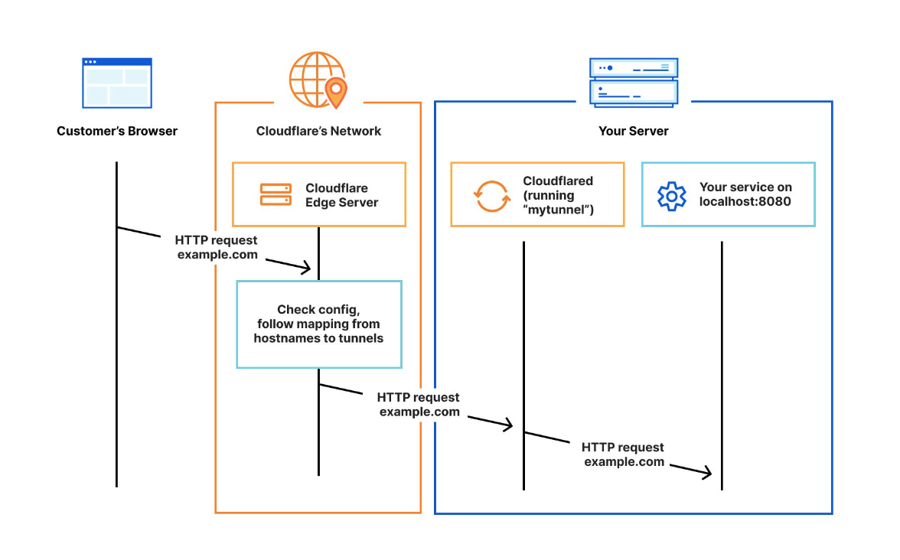

### Schritt 1.1 - Einen Tunnel erstellen

Du kannst einen Tunnel mit einem Namen deiner Wahl erstellen, wie unten gezeigt.

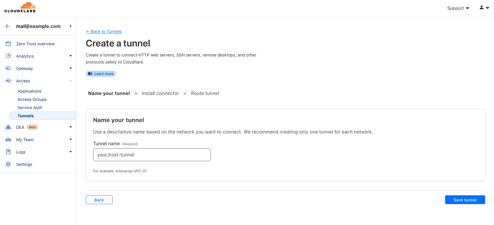

### Schritt 1.2 - Auswahl der Umgebung für cloudflared

Wenn du einen Namen gewählt und auf "Speichern" geklickt hast, siehst du einige Optionen unter "Wählen Sie Ihre Umgebung". Hier musst du ein Betriebssystem und die CPU-Architektur auswählen. 
Basierend auf diesen Attributen erstellt "Cloudflare" die entsprechenden Installationsbefehle, die direkt auf dem Zielhost ausgeführt werden können. Der folgende Screenshot ist ein Beispiel für einen Server mit Arm64-Architektur und Debian als Betriebssystem.

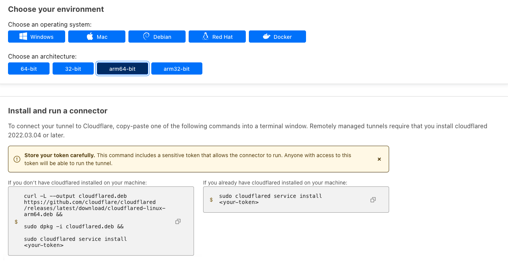

### Schritt 1.3 - Privates Netzwerk einrichten

In der nächsten Phase wirst du weitere Optionen wie "Öffentlicher Hostname" und "Privates Netzwerk" sehen. Da es in dieser Demo um den Zugriff auf private Dienste über das Internet via Cloudflare-Zugang geht, lassen wir den "öffentlichen Hostnamen" unverändert und konzentrieren uns auf das "private Netzwerk". Hier müssen wir die CIDR des privaten Netzwerks eingeben, in dem die VM vorhanden ist. Ein Beispiel ist unten dargestellt.

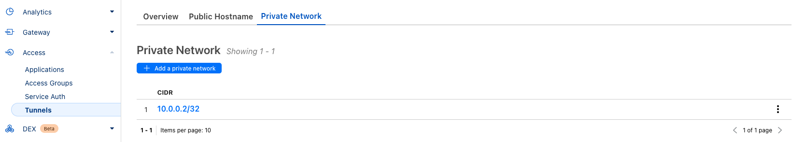

----------------

## Schritt 2 - Installation und Konfiguration von cloudflared

Nun, da wir die Installations- und Konfigurationsbefehle generiert haben, die für unseren Host erforderlich sind, um sich mit dem Cloudflare-Tunnel zu verbinden, beginnen wir mit der Ausführung der im obigen Schritt generierten Befehle. 

Stelle sicher, dass die SSH-Unterstützung für deinen Host aktiviert ist, wenn es sich um einen Linux-Host handelt.

### Schritt 2.1 - Ausführen der Befehle

Führe die zuvor generierten Befehle aus:

```bash
wget -O cloudflared.deb https://github.com/cloudflare/cloudflared/releases/latest/download/cloudflared-linux-amd64.deb
sudo dpkg -i cloudflared.deb
sudo cloudflared service install <your-token>
```

> **Hinweis:** In den obigen Screenshots und Bash-Befehlen gibt es ein Token am Ende des Befehls "sudo cloudflared service install", für das der Platzhalter `<your-token>` verwendet wurde. Das eigene Token das hier verwendet wird muss geheim gehalten werden.

### Schritt 2.2 - Überprüfen des Cloudflared-Dienstes auf dem Zielhost

Du kannst überprüfen, ob der Dienst `cloudflared` läuft, indem du den Befehl `systemctl status cloudflared` ausführst.

```bash
holu@<your_host>:~$ systemctl status cloudflared
● cloudflared.service - cloudflared
     Loaded: loaded (/etc/systemd/system/cloudflared.service; enabled; vendor preset: enabled)
     Active: active (running) since Tue 2023-08-29 12:26:07 UTC; 3min 38s ago
   Main PID: 3223 (cloudflared)
      Tasks: 8 (limit: 4625)
     Memory: 27.9M
     CGroup: /system.slice/cloudflared.service
             └─3223 /usr/bin/cloudflared --no-autoupdate tunnel run --token <your-token>

Aug 29 12:26:07 <your_host> cloudflared[3223]: 2023-08-29T12:26:07Z INF ICMP proxy will use 10.48.138.201 as source for IPv4
Aug 29 12:26:07 <your_host> cloudflared[3223]: 2023-08-29T12:26:07Z INF ICMP proxy will use fe80::222:48ff:fe85:d275 in zone eth0 as source for IPv6
[...]
```

### Schritt 2.3 - Zustand des Agenten auf dem Cloudflare-Dashboard prüfen

Nun, da der Cloudflared-Daemon läuft, überprüfen wir, ob der Agent mit dem Cloudflared-Edge-Netzwerk verbunden ist. Dies wird unter derselben Registerkarte "Tunnel" angezeigt.


Wenn du eine Firewall im Pfad hast, die ausgehenden Datenverkehr filtert, musst du möglicherweise cloudflared URLs über das `https`-Protokoll auf die Whitelist setzen, damit der Agent die Kommunikation mit dem cloudflare-Edge-Netzwerk herstellen kann.

## Schritt 3 - WARP-Client einrichten

Mit dem Cloudflare WARP-Client kannst du Unternehmensgeräte schützen, indem du den Datenverkehr von diesen Geräten sicher und privat an das globale Netzwerk von Cloudflare sendest, wo Cloudflare Gateway erweiterte Webfilterung anwenden kann. Der WARP-Client ermöglicht auch die Anwendung fortschrittlicher Zero-Trust-Richtlinien, die den Zustand eines Geräts überprüfen, bevor es sich mit Unternehmensanwendungen verbindet.

Vereinfacht ausgedrückt, ist er analog zu einem VPN-Client.

### Schritt 3.1 - Installation des Clients

Wie oben in den "Voraussetzungen" bereits erwähnt, kannst du den Client für dein Betriebssystem vom offiziellen Cloudflare-Portal [hier](https://developers.cloudflare.com/cloudflare-one/connections/connect-devices/warp/download-warp/) herunterladen und installieren. In dieser Demo verwende ich MacOS.

### Schritt 3.2 - Bei Cloudflare Zero Trust anmelden

Wenn du auf die "WARP"-App und dann auf das Symbol "Einstellungen" klickst, siehst du "Einstellungen". Sobald du auf "Einstellungen" klickst, siehst du die Registerkarte "Konto". Dort siehst du die Schaltfläche "Anmelden bei Cloudflare Zero Trust", wie im folgenden Screenshot gezeigt:

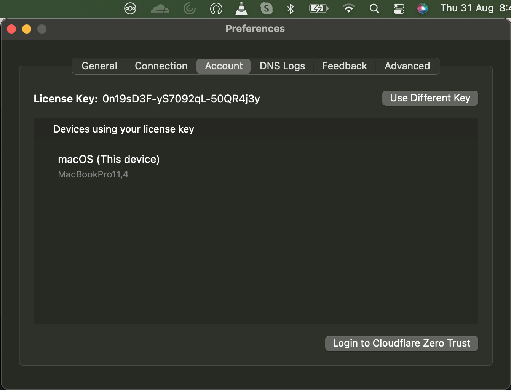

### Schritt 3.3 - Authentifizierung mit Cloudflare Access

Wenn du auf die Schaltfläche "Login to Cloudflare Zero Trust" klickst, erscheint ein Popup, in dem du aufgefordert wirst deinen Cloudflare-Teamnamen einzugeben. Wenn du den Teamnamen angibst, den du im Cloudflare-Dashboard erstellt hast, wirst du zum Cloudflare-Dashboard weitergeleitet, um die Authentifizierung herauszufordern. Wenn die Authentifizierungsanfrage erfolgreich ist, ist dein `WARP`-Client mit Cloudflare Edge verbunden und alles ist gut.

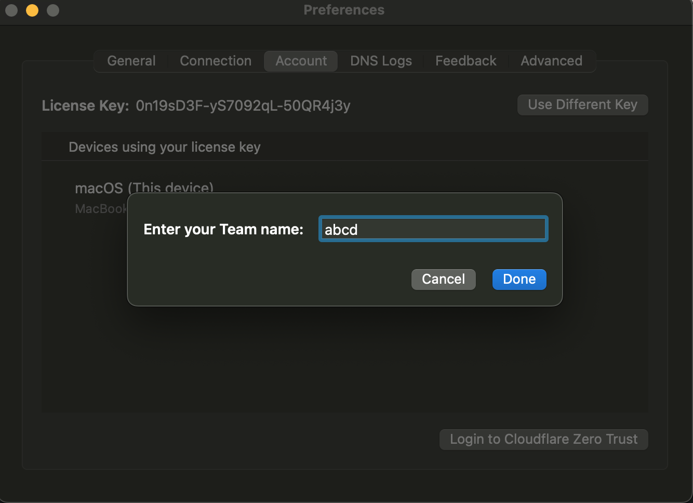

### Schritt 3.4 - Überprüfen des WARP-Geräts auf dem Cloudflare-Dashboard

In dem Moment, in dem WARP-Geräte mit Cloudflare Edge verbunden sind, sollten wir sie auf dem Cloudflare-Dashboard sehen, wie unten gezeigt:

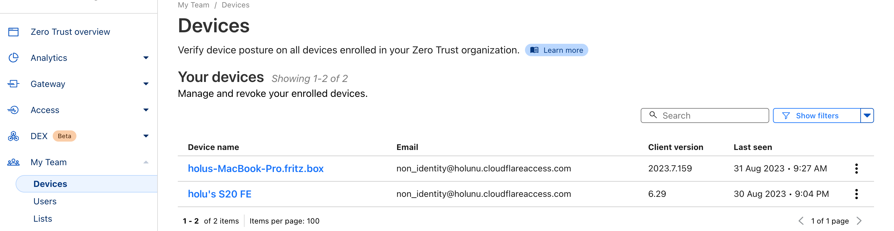

### Schritt 3.5 - Verbinden mit dem Zielhost über eine private IP

Jetzt ist es an der Zeit, unsere Konfiguration zu testen! Im Rahmen dieser Demo haben wir das gesamte Subnetz auf eine Whitelist gesetzt, so dass wir in der Lage sein müssen, eine Reihe von Prüfungen durchzuführen.

- `SSH`: **Zugriff über Login prüfen**
  
  ```bash
  ABC-MBP:Projects hello$ ssh holu@10.0.0.2
  ...
  Last login: Wed Aug 23 06:12:45 2023 from 10.0.0.2
  holu@<your_host>:~$ 
  ```

<br>

- `ICMP`: **Zugriff mit "ping" prüfen**
  
  In der nächsten Phase verwenden wir `ping` wie unten gezeigt:
  
  ```bash
  Hello-MBP:Projects hello$ ping 10.0.0.2
  PING 10.0.0.2 (10.0.0.2): 56 data bytes
  64 bytes from 10.0.0.2: icmp_seq=0 ttl=253 time=248.381 ms
  64 bytes from 10.0.0.2: icmp_seq=1 ttl=253 time=30.464 ms
  64 bytes from 10.0.0.2: icmp_seq=2 ttl=253 time=30.477 ms
  64 bytes from 10.0.0.2: icmp_seq=3 ttl=253 time=29.127 ms
  ^C
  --- 10.0.0.2 ping statistics ---
  4 packets transmitted, 4 packets received, 0.0% packet loss
  round-trip min/avg/max/stddev = 29.127/84.612/248.381/94.554 ms
  ```

<br>

- `HTTP`: **Zugriff mit NGINX prüfen**
  
  Ein weiterer Test wäre, einen Webserver wie NGINX zu installieren und zu versuchen, von einem WARP-Client-Browser aus darauf zuzugreifen.
  
  ```bash
  sudo apt update && sudo apt install nginx
  sudo systemctl status nginx
  ```
  
  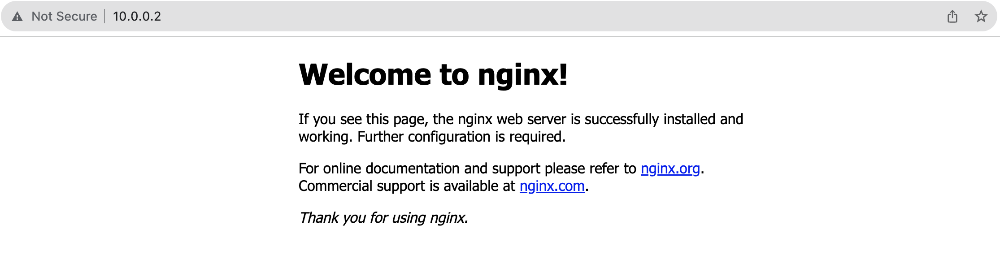
  
Wir haben die Protokolle `SSH`, `ICMP` und `HTTP` getestet und alle haben wie erwartet funktioniert. Wenn du möchtest, kannst du auch `UDP` Protokolle testen, aber es ist standardmäßig nicht aktiviert. Du musst es also im `Cloudflare Access` Dashboard aktivieren.

### Schritt 3.6 - Zusätzliche Prüfungen (Optional)

Falls einer der Tests in Schritt 3.5 fehlschlägt, musst du die folgenden Prüfungen durchführen.

- **Überprüfung des Ausschlusses des privaten Netzwerks**
  
  Stelle sicher, dass dein privates Netzwerk nicht lokal von `WARP` ausgeschlossen ist. Bestimmte private IP-Netzwerke sind lokal ausgeschlossen, damit sie dein lokales Heimnetzwerk nicht beeinträchtigen. Du kannst solche Netzwerke jedoch außer Kraft setzen und sie zwingen, über den "Cloudflare Tunnel" zu gehen. In der folgenden Abbildung ist der CIDR 192.168.0.0/16 ausgeschlossen. Die Standardkonfiguration von "WARP" überschreibt auch den CIDR "10.0.0.0/8". Wenn dein privates Netzwerk in eines der oben genannten CIDRs fällt, musst du diesen Ausschluss möglicherweise entfernen.
  
  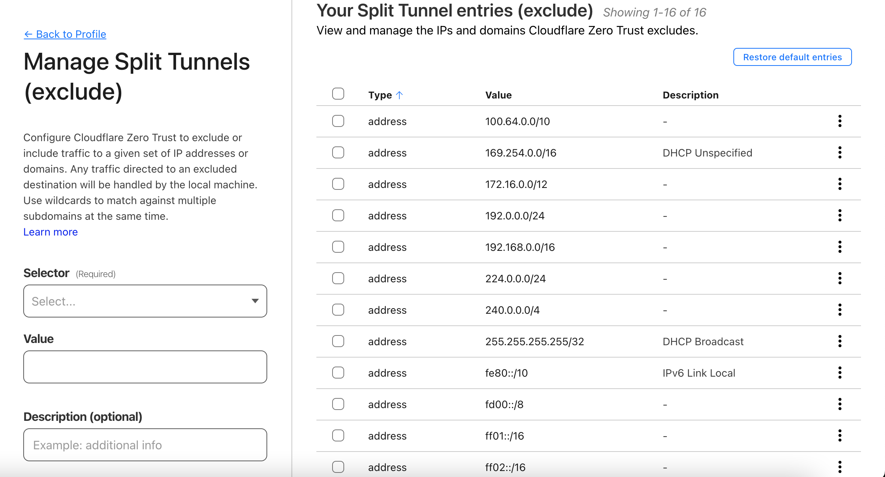

<br>

- **Protokoll-Ausschluss prüfen**
  
  Standardmäßig wird nur das TCP-Protokoll getunnelt. `ICMP` und `UDP` werden fehlschlagen, es sei denn, es ist im Portal wie unten gezeigt aktiviert.
  
  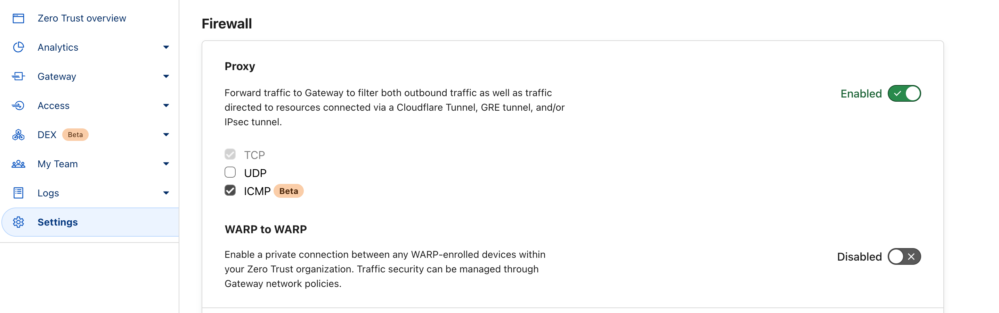
  
Die obigen Überprüfungen sind nicht erschöpfend, aber sie sind in der Absicht aufgeführt, den Betrachtern zu helfen, nicht viel Zeit mit der Untersuchung zu verbringen, warum das Tunneln nicht wie gewünscht funktioniert.

## Schritt 4 - Verschärfung der Hetzner Firewall-Regeln

Wenn du einen Server bei Hetzner Cloud hast, kannst du eine Hetzner Firewall einrichten. Da wir uns erfolgreich über ein privates Netzwerk mit unserem Server verbunden haben, können wir die nicht benötigten Ports in der Firewall deaktivieren. Im folgenden Screenshot deaktiviere ich den `SSH(22)` Port.

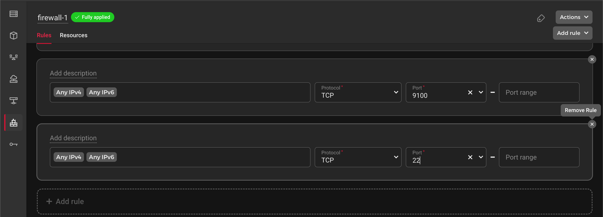

## Ergebnis

Die Absicherung eines Servers mit Cloudflare Access über ein privates Netzwerk ist eine kluge Investition in die Sicherheit und Erreichbarkeit des Servers. Durch die Implementierung eines Zero-Trust-Ansatzes kannst du sicherstellen, dass nur autorisierte Benutzer auf deine Serverressourcen zugreifen können, während du gleichzeitig von der Leistung und Zuverlässigkeit von Cloudflare profitierst. Probiere es aus und genieße den Seelenfrieden, der mit einer robusten Sicherheitslösung wie Cloudflare Access einhergeht.

##### License: MIT

<!--

Contributor's Certificate of Origin

By making a contribution to this project, I certify that:

(a) The contribution was created in whole or in part by me and I have
    the right to submit it under the license indicated in the file; or

(b) The contribution is based upon previous work that, to the best of my
    knowledge, is covered under an appropriate license and I have the
    right under that license to submit that work with modifications,
    whether created in whole or in part by me, under the same license
    (unless I am permitted to submit under a different license), as
    indicated in the file; or

(c) The contribution was provided directly to me by some other person
    who certified (a), (b) or (c) and I have not modified it.

(d) I understand and agree that this project and the contribution are
    public and that a record of the contribution (including all personal
    information I submit with it, including my sign-off) is maintained
    indefinitely and may be redistributed consistent with this project
    or the license(s) involved.

Signed-off-by: Harshavardhan Musanalli<harshavmb@gmail.com>

-->
