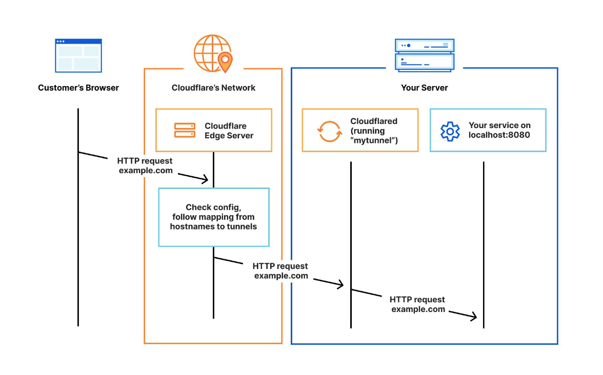
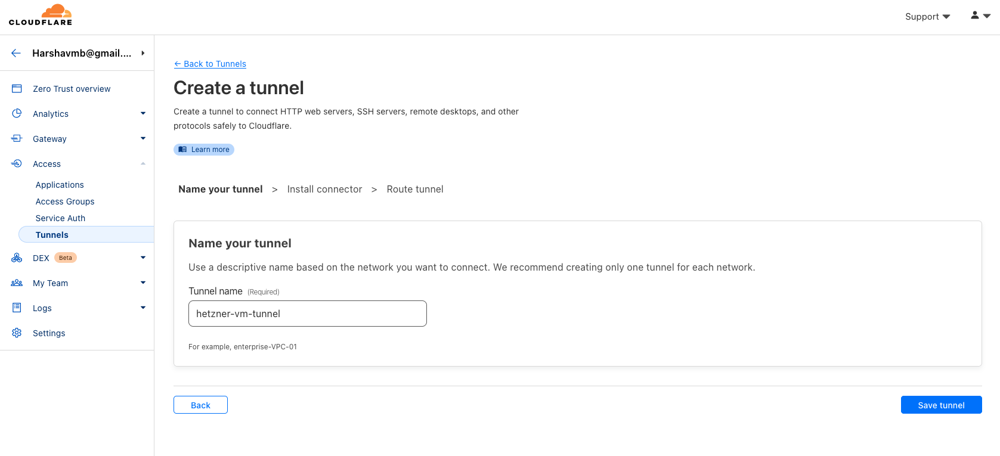
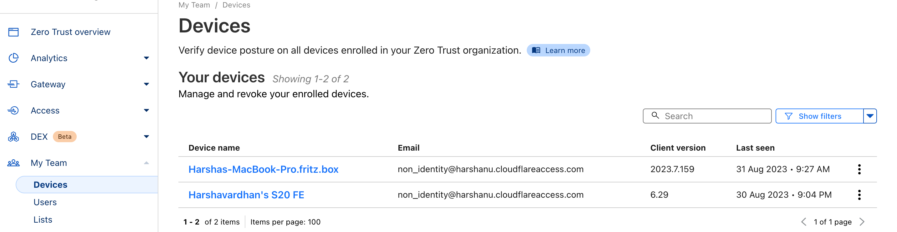

## Einführung

In der heutigen schnelllebigen digitalen Welt sind Sicherheit und Zugänglichkeit zwei wichtige Anliegen für Unternehmen und Privatpersonen gleichermaßen. Angesichts der zunehmenden Zahl von Cyber-Bedrohungen und der Notwendigkeit des Fernzugriffs auf Server ist es unerlässlich, sichere Verbindungen zu Ihren Servern herzustellen und gleichzeitig einen einfachen Zugriff zu gewährleisten. Dieser Blog führt Sie durch den Prozess der Verbindung zu einem Hetzner-Server über ein privates Netzwerk mit Cloudflare Access, einem leistungsstarken Tool, das Sicherheit und Komfort kombiniert.

## Warum privater Netzzugang?

Ein Auszug aus `/var/log/auth.log` von meinem Server, der dem öffentlichen Internet ausgesetzt ist.

```bash
hetzneruser@hetzner-vm:~$ sudo grep -R "Failed password for root from" /var/log/auth.log  | wc -l
24780
```

Diese Fehler werden innerhalb weniger Stunden aufgezeichnet, in denen ich eine VM bereitgestellt habe. Dies zeigt, dass es im Internet bösartige Akteure gibt, die versuchen, mit einer großen Liste zufälliger Passwörter in Ihr Netzwerk einzubrechen. Die meisten von ihnen könnten bei einer der früheren Datenschutzverletzungen durchgesickert sein.

Traditionell wurde der Serverzugriff über das öffentliche Internet abgewickelt, was Sicherheitsrisiken wie unbefugten Zugriff, Datenverletzungen und DDoS-Angriffe (Distributed Denial of Service) birgt. Private Netze hingegen bieten eine sicherere Umgebung, da sie den Zugriff nur auf autorisierte Benutzer beschränken.

## Unterschiede im Vergleich zu einem herkömmlichen VPN

* **Sicherheit**: Cloudflare Access ist eine Zero-Trust-Plattform, was bedeutet, dass sie nur Benutzern Zugang gewährt, die authentifiziert und autorisiert wurden. Dies steht im Gegensatz zu einem traditionellen VPN, das einfach den gesamten Datenverkehr zwischen dem Benutzer und dem Unternehmensnetzwerk tunnelt, unabhängig von der Identität oder Autorisierung des Benutzers. Dasselbe gilt für die Anwendung, auf die Sie über ein privates Netzwerk zugreifen, im Gegensatz zum Zugriff auf verschiedene Anwendungen in einem Subnetz mit einem herkömmlichen VPN.
**Performance**: Cloudflare Access ist so konzipiert, dass es leichtgewichtig ist und minimale Auswirkungen auf die Leistung hat. Das liegt daran, dass die Benutzer keine Software installieren oder ihre Routing-Tabellen ändern müssen. Im Gegensatz dazu kann ein traditionelles VPN die Latenz erhöhen und die Bandbreite reduzieren, insbesondere für Benutzer, die sich von einem entfernten Standort aus verbinden.
**Skalierbarkeit**: Cloudflare Access ist ein Cloud-basierter Service, was bedeutet, dass er skalierbar ist, um die Anforderungen jeder Organisation zu erfüllen. Dies steht im Gegensatz zu einem traditionellen VPN, bei dem die Organisation möglicherweise ihre eigene Hardware und Software kaufen und verwalten muss.
* **Benutzerfreundlichkeit**: Cloudflare Access ist einfach einzurichten und zu verwalten. Es kann in bestehende Identitätsanbieter wie Okta, Azure Active Directory und viele andere integriert werden. Im Gegensatz dazu kann ein herkömmliches VPN komplexer einzurichten und zu verwalten sein, insbesondere für große Organisationen.

In der folgenden Tabelle sind die wichtigsten Unterschiede zwischen Cloudflare Access und einem herkömmlichen VPN zusammengefasst:

| Feature                   | Cloudflare Access                        | Traditionelles VPN                                         |
| ------------------------- | ---------------------------------------- | ---------------------------------------------------------- |
| Sicherheit                | Zero trust                               | Tunnelt den gesamten Verkehr                               |
| Performance               | Minimale Auswirkungen                    | Kann die Latenzzeit erhöhen und die Bandbreite verringern  |
| Skalierbarkeit            | Cloud-based                              | On-premises                                                |
| Benutzerfreundlichkeit    | Einfach einzurichten und zu verwalten    | Die Einrichtung und Verwaltung kann komplex sein           |

-----------

**Voraussetzungen**

Bevor wir mit der Bereitstellung beginnen, sollten Sie sicherstellen, dass die folgenden Voraussetzungen erfüllt sind:

1. **Cloudflare-Konto**: Sie sollten ein Konto bei Cloudflare haben. Wenn Sie noch keines haben, können Sie eines [hier](https://www.cloudflare.com/zero-trust/products/access/) erstellen. Cloudflare bietet viele Dienste als Teil ihres kostenlosen Angebots an. [Cloudflare Access](https://www.cloudflare.com/zero-trust/products/access/) ist ebenfalls ein solches Angebot.

2. **Server**: Ein Server oder eine virtuelle Linux-Maschine. Wenn Sie das noch nicht getan haben, melden Sie sich für ein Hetzner Cloud-Konto an. Sobald Sie eingeloggt sind, erstellen Sie eine virtuelle Maschine (VM) oder wählen Sie einen bestehenden Server, den Sie mit Cloudflare Access sichern möchten.

3. **Warp-Client**: Sie müssen einen Warp-Client auf Ihrem lokalen Rechner installiert haben. Sie können den Client für Ihr Betriebssystem vom offiziellen Cloudflare-Portal [hier](https://developers.cloudflare.com/cloudflare-one/connections/connect-devices/warp/download-warp/) herunterladen.

## Schritt 1 - Erstellen des Tunnels im Cloudflare Dashboard

Cloudflare Tunnel bietet Ihnen eine sichere Möglichkeit, Ihre Ressourcen mit Cloudflare zu verbinden, ohne eine öffentlich routbare IP-Adresse zu haben. Mit Tunnel senden Sie keinen Datenverkehr an eine externe IP-Adresse - stattdessen erstellt ein leichtgewichtiger Daemon in Ihrer Infrastruktur (`cloudflared`) ausschließlich ausgehende Verbindungen zum globalen Netzwerk von Cloudflare. Cloudflare Tunnel kann HTTP-Webserver, [SSH-Server](https://developers.cloudflare.com/cloudflare-one/connections/connect-networks/use-cases/ssh/), [Remote-Desktops](https://developers.cloudflare.com/cloudflare-one/connections/connect-networks/use-cases/rdp/) und andere Protokolle sicher mit Cloudflare verbinden. Auf diese Weise können Ihre Ursprünge den Datenverkehr über Cloudflare leiten, ohne anfällig für Angriffe zu sein, die Cloudflare umgehen.


### Schritt 1.1 - Einen Tunnel erstellen
Sie können einen Tunnel mit einem Namen Ihrer Wahl erstellen, wie unten gezeigt.


### Schritt 1.2 - Auswahl der Umgebung für cloudflared
Wenn Sie einen Namen gewählt und auf "Speichern" geklickt haben, sehen Sie einige Optionen unter "Wählen Sie Ihre Umgebung". Hier müssen Sie die Betriebssystemvarianten und die CPU-Architektur auswählen. 
Basierend auf diesen Attributen erstellt "Cloudflare" die entsprechenden Installationsbefehle, die direkt auf dem Zielhost ausgeführt werden können. Der folgende Screenshot ist für Debian arm64 Variante.
Debian ARM64 Variante](images/cloudflared-connector.png)

### Schritt 1.3 - Privates Netzwerk einrichten
In der nächsten Phase werden Sie weitere Optionen wie "Öffentlicher Hostname" und "Privates Netzwerk" sehen. Da es in dieser Demo um den Zugriff auf private Dienste über das Internet via Cloudflare-Zugang geht, lassen wir den "öffentlichen Hostnamen" unverändert und konzentrieren uns mehr auf das "private Netzwerk". Hier müssen wir die CIDR des privaten Netzwerks eingeben, in dem die VM vorhanden ist. Ein Beispiel ist unten dargestellt.

----------------

## Schritt 2 - Installation und Konfiguration von cloudflared
Nun, da wir die Installations- und Konfigurationsbefehle generiert haben, die für unseren Host erforderlich sind, um sich mit dem Cloudflare-Tunnel zu verbinden, beginnen wir mit der Ausführung der im obigen Schritt generierten Befehle. 

Stellen Sie sicher, dass die SSH-Unterstützung für Ihren Host aktiviert ist, wenn es sich um einen Linux-Host handelt.

### Schritt 2.1 - Ausführen der Befehle

```bash
hetzneruser@hetzner-vm:~$ curl -L --output cloudflared.deb https://github.com/cloudflare/cloudflared/releases/latest/download/cloudflared-linux-amd64.deb && 
> 
> sudo dpkg -i cloudflared.deb && 
> 
> sudo cloudflared service install eyJhIjoiZGM2YjY3ODg2ZjMwZjJlZDBkOGVmNDY2NDM3YTNiMzQiLCJ0IjoiYmEyNTk5ZmQtMjEyNC00NGE0LWJhYjktN2UxNGFlZjI3N2MzIiwicyI6Ik9HWmtZbVU0T1dZdE5XRTRZeTAwTnpWbUxUa3haamd0WW1Oak5UZGhaV1l6TkRVeCJ9
  % Total    % Received % Xferd  Average Speed   Time    Time     Time  Current
                                 Dload  Upload   Total   Spent    Left  Speed
  0     0    0     0    0     0      0      0 --:--:-- --:--:-- --:--:--     0
  0     0    0     0    0     0      0      0 --:--:-- --:--:-- --:--:--     0
100 16.8M  100 16.8M    0     0  40.8M      0 --:--:-- --:--:-- --:--:-- 40.8M
Selecting previously unselected package cloudflared.
(Reading database ... 58849 files and directories currently installed.)
Preparing to unpack cloudflared.deb ...
Unpacking cloudflared (2023.8.1) ...
Setting up cloudflared (2023.8.1) ...
Processing triggers for man-db (2.9.1-1) ...
2023-08-29T12:26:06Z INF Using Systemd
2023-08-29T12:26:07Z INF Linux service for cloudflared installed successfully
```
> **Hinweis:** In den obigen Screenshots und Bash-Befehlen gibt es ein Token am Ende des Befehls "sudo cloudflared service install", das geheim gehalten werden muss. Es ist hier im Klartext, nur um der Demo willen.

### Schritt 2.2 - Überprüfen des Cloudflared-Dienstes auf dem Zielhost

Sie können überprüfen, ob der Dienst `cloudflared` läuft, indem Sie den Befehl `systemctl status cloudflared` ausführen.

```bash
hetzneruser@hetzner-vm:~$ systemctl status cloudflared
● cloudflared.service - cloudflared
     Loaded: loaded (/etc/systemd/system/cloudflared.service; enabled; vendor preset: enabled)
     Active: active (running) since Tue 2023-08-29 12:26:07 UTC; 3min 38s ago
   Main PID: 3223 (cloudflared)
      Tasks: 8 (limit: 4625)
     Memory: 27.9M
     CGroup: /system.slice/cloudflared.service
             └─3223 /usr/bin/cloudflared --no-autoupdate tunnel run --token eyJhIjoiZGM2YjY3ODg2ZjMwZjJlZDBkOGVmNDY2NDM3YTNiMzQiLCJ0IjoiYmEyNTk5ZmQtMjEyNC00NGE0LWJhYjktN2UxNGFlZjI3N2MzIiwicyI6Ik9HWmtZbVU0T1dZdE5XRTRZeTAwTnpWbUxUa3haamd>

Aug 29 12:26:07 hetzner-vm cloudflared[3223]: 2023-08-29T12:26:07Z INF ICMP proxy will use 10.48.138.201 as source for IPv4
Aug 29 12:26:07 hetzner-vm cloudflared[3223]: 2023-08-29T12:26:07Z INF ICMP proxy will use fe80::222:48ff:fe85:d275 in zone eth0 as source for IPv6
Aug 29 12:26:07 hetzner-vm cloudflared[3223]: 2023-08-29T12:26:07Z INF Starting metrics server on 127.0.0.1:41713/metrics
Aug 29 12:26:07 hetzner-vm cloudflared[3223]: 2023/08/29 12:26:07 failed to sufficiently increase receive buffer size (was: 208 kiB, wanted: 2048 kiB, got: 416 kiB). See https://github.com/quic-go/quic-go/wiki/UDP-Receive-Buffer-Size f>
Aug 29 12:26:07 hetzner-vm cloudflared[3223]: 2023-08-29T12:26:07Z INF Registered tunnel connection connIndex=0 connection=aaa7ec8f-b934-45ec-ba11-c6c9d2c6031b event=0 ip=198.41.200.53 location=man03 protocol=quic
Aug 29 12:26:07 hetzner-vm systemd[1]: Started cloudflared.
Aug 29 12:26:08 hetzner-vm cloudflared[3223]: 2023-08-29T12:26:08Z INF Registered tunnel connection connIndex=1 connection=0e711d5c-1cde-4f4e-8765-53fe3878d1c3 event=0 ip=198.41.192.77 location=AMS protocol=quic
Aug 29 12:26:09 hetzner-vm cloudflared[3223]: 2023-08-29T12:26:09Z INF Updated to new configuration config=null version=0
Aug 29 12:26:09 hetzner-vm cloudflared[3223]: 2023-08-29T12:26:09Z INF Registered tunnel connection connIndex=2 connection=1ba32394-99f4-4cd5-81f3-80c53611a1cb event=0 ip=198.41.192.167 location=ams07 protocol=quic
Aug 29 12:26:09 hetzner-vm cloudflared[3223]: 2023-08-29T12:26:09Z INF Registered tunnel connection connIndex=3 connection=9abe8d6f-5587-4294-8afb-050cea9e4a1f event=0 ip=198.41.200.73 location=man01 protocol=quic
```

### Schritt 2.3 - Prüfen Sie den Zustand des Agenten auf dem Cloudflare-Dashboard

Nun, da der Cloudflared-Daemon läuft, überprüfen wir, ob der Agent mit dem Cloudflared-Edge-Netzwerk verbunden ist. Dies wird auf der gleichen Registerkarte "Tunnel" angezeigt.
. 

Wenn Sie eine Firewall im Pfad haben, die ausgehenden Datenverkehr filtert, müssen Sie möglicherweise cloudflared URLS über das `https`-Protokoll auf die Whitelist setzen, damit der Agent die Kommunikation mit dem cloudflare-Edge-Netzwerk herstellen kann.

### Schritt 2.4 - nginx installieren (optional)

Zu Demonstrationszwecken installieren wir den Webserver nginx. Standardmäßig läuft er auf Port 80, was für uns ein guter Test wäre, um eine Verbindung zum Webserver über ein privates Netzwerk herzustellen.

```bash
hetzneruser@hetzner-vm:~$ sudo apt install nginx
Reading package lists... Done
Building dependency tree       
Reading state information... Done
The following additional packages will be installed:
  fontconfig-config fonts-dejavu-core libfontconfig1 libgd3 libjbig0 libjpeg-turbo8 libjpeg8 libnginx-mod-http-image-filter libnginx-mod-http-xslt-filter libnginx-mod-mail libnginx-mod-stream libtiff5 libwebp6 libxpm4 nginx-common
  nginx-core
Suggested packages:
  libgd-tools fcgiwrap nginx-doc ssl-cert
.... blah-blah-blah....

hetzneruser@hetzner-vm:~$ sudo systemctl status nginx
● nginx.service - A high performance web server and a reverse proxy server
     Loaded: loaded (/lib/systemd/system/nginx.service; enabled; vendor preset: enabled)
     Active: active (running) since Tue 2023-08-29 12:39:55 UTC; 9s ago
       Docs: man:nginx(8)
   Main PID: 3702 (nginx)
      Tasks: 3 (limit: 4625)
     Memory: 6.0M
     CGroup: /system.slice/nginx.service
             ├─3702 nginx: master process /usr/sbin/nginx -g daemon on; master_process on;
             ├─3703 nginx: worker process
             └─3704 nginx: worker process

Aug 29 12:39:55 hetzner-vm systemd[1]: Starting A high performance web server and a reverse proxy server...
Aug 29 12:39:55 hetzner-vm systemd[1]: Started A high performance web server and a reverse proxy server.
```

## Schritt 3 - Warp-Client einrichten

Mit dem Cloudflare WARP-Client können Sie Unternehmensgeräte schützen, indem Sie den Datenverkehr von diesen Geräten sicher und privat an das globale Netzwerk von Cloudflare senden, wo Cloudflare Gateway erweiterte Webfilterung anwenden kann. Der WARP-Client ermöglicht auch die Anwendung fortschrittlicher Zero-Trust-Richtlinien, die den Zustand eines Geräts überprüfen, bevor es sich mit Unternehmensanwendungen verbindet.

Vereinfacht ausgedrückt, ist er analog zu einem VPN-Client.

### Schritt 3.1 - Installation des Clients

Wie bereits erwähnt, können Sie den Client für Ihr Betriebssystem vom offiziellen Cloudflare-Portal [hier](https://developers.cloudflare.com/cloudflare-one/connections/connect-devices/warp/download-warp/) herunterladen und installieren. In dieser Demo verwende ich MacOS.

### Schritt 3.2 - Melden Sie sich bei Ihrem Cloudflare Zero Trust an.

Wenn Sie auf die "Warp"-App und dann auf das Symbol "Einstellungen" klicken, sehen Sie "Einstellungen". Sobald Sie auf "Einstellungen" klicken, sehen Sie die Registerkarte "Konto". Dort sehen Sie die Schaltfläche "Anmelden bei Cloudflare Zero Trust", wie im folgenden Screenshot gezeigt
Anmeldung bei Cloudflare Zero Trust](images/register-warp.png)

### Schritt 3.3 - Authentifizierung mit Cloudflare Access

Wenn Sie auf die Schaltfläche "Login to Cloudflare Zero trust" klicken, erscheint ein Popup, in dem Sie aufgefordert werden, Ihren Cloudflare-Teamnamen einzugeben. Wenn Sie den Teamnamen angeben, den Sie im Cloudflare-Dashboard erstellt haben, werden Sie zum Cloudflare-Dashboard weitergeleitet, um die Authentifizierung herauszufordern. Wenn die Authentifizierungsanfrage erfolgreich ist, ist Ihr `WARP`-Client mit Cloudflare Edge verbunden und alles ist gut.
Authentifizierung mit Cloudflare Access](images/login-to-cloudflare-team.png)

### Schritt 3.4 - Überprüfen des Warp-Geräts auf dem Cloudflare-Dashboard

In dem Moment, in dem WARP-Geräte mit Cloudflare Edge verbunden sind, müssen wir sie auf dem Cloudflare-Dashboard sehen, wie unten gezeigt:


### Schritt 3.5 - Verbinden mit dem Zielhost über eine private IP

#### SSH testen
Jetzt ist es an der Zeit, unsere Konfiguration zu testen! Im Rahmen dieser Demo haben wir das gesamte Subnetz auf eine Whitelist gesetzt, so dass wir in der Lage sein müssen, eine Reihe von Prüfungen durchzuführen. Zuerst beginnen wir mit `SSH`.
```bash
ABC-MBP:Projects hello$ ssh hetzneruser@10.0.0.2
Welcome to Ubuntu 22.04.2 LTS (GNU/Linux 5.15.0-79-generic aarch64)

 * Documentation:  https://help.ubuntu.com
 * Management:     https://landscape.canonical.com
 * Support:        https://ubuntu.com/advantage

  System information as of Thu Aug 31 07:33:47 AM UTC 2023

  System load:                      0.11279296875
  Usage of /:                       16.4% of 74.79GB
  Memory usage:                     26%
  Swap usage:                       0%
  Processes:                        185
  Users logged in:                  0
  IPv4 address for br-06e39e94bb28: 172.18.0.1
  IPv4 address for br-775b154ececb: 172.19.0.1
  IPv4 address for docker0:         172.17.0.1
  IPv4 address for enp7s0:          10.0.0.2
  IPv4 address for eth0:            <hidden>
  IPv6 address for eth0:            <hidden>

Last login: Wed Aug 23 06:12:45 2023 from 10.0.0.2
hetzneruser@hetzner-vm:~$ 
```
#### Test ping
In der nächsten Phase verwenden wir `ping` wie unten gezeigt:
```bash
Hello-MBP:Projects hello$ ping 10.0.0.2
PING 10.0.0.2 (10.0.0.2): 56 data bytes
64 bytes from 10.0.0.2: icmp_seq=0 ttl=253 time=248.381 ms
64 bytes from 10.0.0.2: icmp_seq=1 ttl=253 time=30.464 ms
64 bytes from 10.0.0.2: icmp_seq=2 ttl=253 time=30.477 ms
64 bytes from 10.0.0.2: icmp_seq=3 ttl=253 time=29.127 ms
^C
--- 10.0.0.2 ping statistics ---
4 packets transmitted, 4 packets received, 0.0% packet loss
round-trip min/avg/max/stddev = 29.127/84.612/248.381/94.554 ms
```
#### Test nginx
Ein weiterer Test wäre, einen Webserver wie `nginx` zu installieren und zu versuchen, von einem `WARP`-Client-Browser aus auf ihn zuzugreifen, wie unten gezeigt:
.png)

Wir haben also die Protokolle `ssh`, `icmp` und `http` getestet und alle haben wie erwartet funktioniert. Wenn Sie möchten, können Sie auch `udp` Protokolle testen, aber es ist standardmäßig nicht aktiviert. Sie müssen es also im `Cloudflare Access` Dashboard aktivieren.

### Schritt 3.6 - Zusätzliche Prüfungen (optional und nur wenn einer der Schritte 3.5 fehlschlägt)

Falls einer der Tests in Schritt 3.5 fehlschlägt, müssen Sie die folgenden Prüfungen durchführen.

#### Überprüfung des Ausschlusses des privaten Netzwerks
Stellen Sie sicher, dass Ihr privates Netzwerk nicht lokal von `Warp` ausgeschlossen ist. Bestimmte private IP-Netzwerke sind lokal ausgeschlossen, damit sie Ihr lokales Heimnetzwerk nicht beeinträchtigen. Sie können solche Netzwerke jedoch außer Kraft setzen und sie zwingen, über den "Cloudflare Tunnel" zu gehen. In der folgenden Abbildung ist der CIDR 192.168.0.0/16 ausgeschlossen. Die Standardkonfiguration von "Warp" überschreibt auch den CIDR "10.0.0.0/8". Wenn Ihr privates Netzwerk in eines der oben genannten CIDRs fällt, müssen Sie diesen Ausschluss möglicherweise entfernen.
Lokale IP CIDR ausschließen](images/exclude-local-ip-cidr.png)

#### Protokoll-Ausschluss prüfen
Standardmäßig wird nur das TCP-Protokoll getunnelt. Picmp" und "UDP" werden fehlschlagen, es sei denn, es ist im Portal wie unten gezeigt aktiviert.


Die obigen Überprüfungen sind nicht erschöpfend, aber sie sind in der Absicht aufgeführt, den Betrachtern zu helfen, nicht viel Zeit mit der Untersuchung zu verbringen, warum das Tunneln nicht wie gewünscht funktioniert. 

### Schritt 4 - Verschärfung der Hetzner Firewall-Regeln

Nun, da wir uns erfolgreich über ein privates Netzwerk mit unserer Hetzner-VM verbunden haben, können wir die nicht benötigten Ports in der Firewall deaktivieren. Im folgenden Screenshot deaktiviere ich den `SSH(22)` Port.


## Fazit

Die Absicherung Ihres Hetzner-Servers mit Cloudflare Access über ein privates Netzwerk ist eine kluge Investition in die Sicherheit und Erreichbarkeit Ihres Servers. Durch die Implementierung eines Zero-Trust-Ansatzes können Sie sicherstellen, dass nur autorisierte Benutzer auf Ihre Serverressourcen zugreifen können, während Sie gleichzeitig von der Leistung und Zuverlässigkeit von Cloudflare profitieren. Probieren Sie es aus und genießen Sie den Seelenfrieden, der mit einer robusten Sicherheitslösung wie Cloudflare Access einhergeht.

##### License: MIT

<!--

Contributor's Certificate of Origin

By making a contribution to this project, I certify that:

(a) The contribution was created in whole or in part by me and I have
    the right to submit it under the license indicated in the file; or

(b) The contribution is based upon previous work that, to the best of my
    knowledge, is covered under an appropriate license and I have the
    right under that license to submit that work with modifications,
    whether created in whole or in part by me, under the same license
    (unless I am permitted to submit under a different license), as
    indicated in the file; or

(c) The contribution was provided directly to me by some other person
    who certified (a), (b) or (c) and I have not modified it.

(d) I understand and agree that this project and the contribution are
    public and that a record of the contribution (including all personal
    information I submit with it, including my sign-off) is maintained
    indefinitely and may be redistributed consistent with this project
    or the license(s) involved.

Signed-off-by: Harshavardhan Musanalli<harshavmb@gmail.com>

-->
