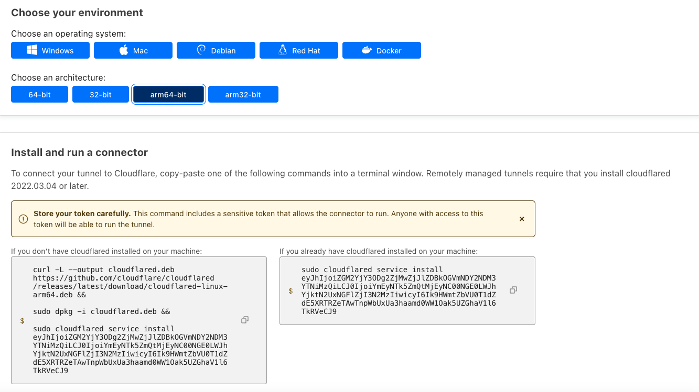

## Introduction

In today's fast-paced digital world, security and accessibility are two critical concerns for businesses and individuals alike. With the increasing number of cyber threats and the need for remote access to servers, it's essential to establish secure connections to your servers while maintaining ease of access. This blog will guide you through the process of connecting to a Hetzner server over a private network using Cloudflare Access, a powerful tool that combines security and convenience.

## Why Private Network Access?

An excerpt from `/var/log/auth.log` of my server exposed to public internet.

```bash
pi@hetzner-vm:~$ sudo grep -R "Failed password for root from" /var/log/auth.log  | wc -l
24780
```

These failures are recorded in a span of few hours I provisioned a VM. This tells there are bad actors out there on internet trying to break into your network with a big list of random passwords. Most of them could have been leaked in one of the previous data breaches.

Traditionally, server access has relied on the public internet, which poses security risks such as unauthorized access, data breaches, and distributed denial of service (DDoS) attacks. Private networks, on the other hand, provide a more secure environment by restricting access to authorized users only.

## Differences wrt., a traditional VPN

* **Security**: Cloudflare Access is a zero trust platform, which means that it only grants access to users who have been authenticated and authorized. This is in contrast to a traditional VPN, which simply tunnels all traffic between the user and the corporate network, regardless of the user's identity or authorization. The same applies to the application you access over a private network rather accessing various applications on a subnet with traditional VPN.
* **Performance**: Cloudflare Access is designed to be lightweight and have minimal impact on performance. This is because it does not require users to install any software or change their routing tables. In contrast, a traditional VPN can add latency and reduce bandwidth, especially for users who are connecting from a remote location.
* **Scalability**: Cloudflare Access is a cloud-based service, which means that it is scalable to meet the needs of any organization. This is in contrast to a traditional VPN, which may require the organization to purchase and manage its own hardware and software.
* **Ease of use**: Cloudflare Access is easy to set up and manage. It can be integrated with existing identity providers, such as Okta, Azure Active Directory and many others. In contrast, a traditional VPN can be more complex to set up and manage, especially for large organizations.

Here is a table summarizing the key differences between Cloudflare Access and a traditional VPN:

| Feature       | Cloudflare Access            | Traditional VPN                        |
| ------------- | ---------------------------- | -------------------------------------- |
| Security      | Zero trust                   | Tunnels all traffic                    |
| Performance   | Minimal impact               | Can add latency and reduce bandwidth   |
| Scalability   | Cloud-based                  | On-premises                            |
| Ease of use   | Easy to set up and manage    | Can be complex to set up and manage    |

-----------

**Prerequisites**

Before we dive into the deployment process, make sure you have the following prerequisites in place:

1. **Cloudflare account**: You should have an account with Cloudflare. If you don't have yet, you could create one [here](https://www.cloudflare.com/zero-trust/products/access/). Cloudflare offers many services as part of their free tier. [Cloudflare Access](https://www.cloudflare.com/zero-trust/products/access/) is also one such offering.

2. **Server**: A  server or Linux virtual machine. If you haven't already, sign up for a Hetzner Cloud account. Once you're logged in, create a virtual machine (VM) or choose an existing server you want to secure with Cloudflare Access.

3. **Warp Client**: You need to have a warp client installed on your local machine. You can download the client for your operating system from official Cloudflare portal [here](https://developers.cloudflare.com/cloudflare-one/connections/connect-devices/warp/download-warp/).

## Step 1 - Creating the Tunnel in Cloudflare dashboard

Cloudflare Tunnel provides you with a secure way to connect your resources to Cloudflare without a publicly routable IP address. With Tunnel, you do not send traffic to an external IP — instead, a lightweight daemon in your infrastructure (`cloudflared`) creates outbound-only connections to Cloudflare’s global network. Cloudflare Tunnel can connect HTTP web servers, [SSH servers](https://developers.cloudflare.com/cloudflare-one/connections/connect-networks/use-cases/ssh/), [remote desktops](https://developers.cloudflare.com/cloudflare-one/connections/connect-networks/use-cases/rdp/), and other protocols safely to Cloudflare. This way, your origins can serve traffic through Cloudflare without being vulnerable to attacks that bypass Cloudflare.

### Step 1.1 - Create a tunnel
You can create a tunnel by name of your choice as shown below.


### Step 1.2 - Choosing environment for cloudflared
When you choose a name & hit `Save`, you will see few options of `Choose your environment`. Here you need to select OS flavors & CPU architecture. 
Based on these attributes, `Cloudflare` constructs the install commands accordingly which can be run directly on the target host. Below screenshot is for Debian arm64 variant.


### Step 1.3 - Setting up Private Network
In the next phase, you will see other options such as `Public Hostname` & `Private Network`. As this demo is about accessing private services over internet via Cloudflare access, we leave `Public Hostname` as is & focus more on `Private Network`. Here we would need to input the CIDR of private network where the VM is present. An example is shown below.

----------------

## Step 2 - Installing & configuring cloudflared
Now that we have generated installation & configuration commands required for our host to connect to cloudflare tunnel, we will start executing the commands generated in above step. 

Make sure the SSH support setting for your host is enabled if it's linux.

### Step 2.1 - Executing commands

```bash
hetzneruser@hetzner-vm:~$ curl -L --output cloudflared.deb https://github.com/cloudflare/cloudflared/releases/latest/download/cloudflared-linux-amd64.deb && 
> 
> sudo dpkg -i cloudflared.deb && 
> 
> sudo cloudflared service install eyJhIjoiZGM2YjY3ODg2ZjMwZjJlZDBkOGVmNDY2NDM3YTNiMzQiLCJ0IjoiYmEyNTk5ZmQtMjEyNC00NGE0LWJhYjktN2UxNGFlZjI3N2MzIiwicyI6Ik9HWmtZbVU0T1dZdE5XRTRZeTAwTnpWbUxUa3haamd0WW1Oak5UZGhaV1l6TkRVeCJ9
  % Total    % Received % Xferd  Average Speed   Time    Time     Time  Current
                                 Dload  Upload   Total   Spent    Left  Speed
  0     0    0     0    0     0      0      0 --:--:-- --:--:-- --:--:--     0
  0     0    0     0    0     0      0      0 --:--:-- --:--:-- --:--:--     0
100 16.8M  100 16.8M    0     0  40.8M      0 --:--:-- --:--:-- --:--:-- 40.8M
Selecting previously unselected package cloudflared.
(Reading database ... 58849 files and directories currently installed.)
Preparing to unpack cloudflared.deb ...
Unpacking cloudflared (2023.8.1) ...
Setting up cloudflared (2023.8.1) ...
Processing triggers for man-db (2.9.1-1) ...
2023-08-29T12:26:06Z INF Using Systemd
2023-08-29T12:26:07Z INF Linux service for cloudflared installed successfully
```
> **Note:** In above screenshots and bash commands, there is a token at the end of `sudo cloudflared service install` command which must be kept as a secret. It's in plain text here just for the sake of demo.

### Step 2.2 - Verifying the cloudflared service on target host

You could verify whether the `cloudflared` service is running by running `systemctl status cloudflared` command.

```bash
hetzneruser@hetzner-vm:~$ systemctl status cloudflared
● cloudflared.service - cloudflared
     Loaded: loaded (/etc/systemd/system/cloudflared.service; enabled; vendor preset: enabled)
     Active: active (running) since Tue 2023-08-29 12:26:07 UTC; 3min 38s ago
   Main PID: 3223 (cloudflared)
      Tasks: 8 (limit: 4625)
     Memory: 27.9M
     CGroup: /system.slice/cloudflared.service
             └─3223 /usr/bin/cloudflared --no-autoupdate tunnel run --token eyJhIjoiZGM2YjY3ODg2ZjMwZjJlZDBkOGVmNDY2NDM3YTNiMzQiLCJ0IjoiYmEyNTk5ZmQtMjEyNC00NGE0LWJhYjktN2UxNGFlZjI3N2MzIiwicyI6Ik9HWmtZbVU0T1dZdE5XRTRZeTAwTnpWbUxUa3haamd>

Aug 29 12:26:07 hetzner-vm cloudflared[3223]: 2023-08-29T12:26:07Z INF ICMP proxy will use 10.48.138.201 as source for IPv4
Aug 29 12:26:07 hetzner-vm cloudflared[3223]: 2023-08-29T12:26:07Z INF ICMP proxy will use fe80::222:48ff:fe85:d275 in zone eth0 as source for IPv6
Aug 29 12:26:07 hetzner-vm cloudflared[3223]: 2023-08-29T12:26:07Z INF Starting metrics server on 127.0.0.1:41713/metrics
Aug 29 12:26:07 hetzner-vm cloudflared[3223]: 2023/08/29 12:26:07 failed to sufficiently increase receive buffer size (was: 208 kiB, wanted: 2048 kiB, got: 416 kiB). See https://github.com/quic-go/quic-go/wiki/UDP-Receive-Buffer-Size f>
Aug 29 12:26:07 hetzner-vm cloudflared[3223]: 2023-08-29T12:26:07Z INF Registered tunnel connection connIndex=0 connection=aaa7ec8f-b934-45ec-ba11-c6c9d2c6031b event=0 ip=198.41.200.53 location=man03 protocol=quic
Aug 29 12:26:07 hetzner-vm systemd[1]: Started cloudflared.
Aug 29 12:26:08 hetzner-vm cloudflared[3223]: 2023-08-29T12:26:08Z INF Registered tunnel connection connIndex=1 connection=0e711d5c-1cde-4f4e-8765-53fe3878d1c3 event=0 ip=198.41.192.77 location=AMS protocol=quic
Aug 29 12:26:09 hetzner-vm cloudflared[3223]: 2023-08-29T12:26:09Z INF Updated to new configuration config=null version=0
Aug 29 12:26:09 hetzner-vm cloudflared[3223]: 2023-08-29T12:26:09Z INF Registered tunnel connection connIndex=2 connection=1ba32394-99f4-4cd5-81f3-80c53611a1cb event=0 ip=198.41.192.167 location=ams07 protocol=quic
Aug 29 12:26:09 hetzner-vm cloudflared[3223]: 2023-08-29T12:26:09Z INF Registered tunnel connection connIndex=3 connection=9abe8d6f-5587-4294-8afb-050cea9e4a1f event=0 ip=198.41.200.73 location=man01 protocol=quic
```

### Step 2.3 - Check the agent health on Cloudflare dashboard

Now that the cloudflared daemon is running, we verify whether agent is connected to cloudflared edge network. It is shown in the same `Tunnels` tab.
. 

If you have a firewall in the path filtering outbound traffic you may need to whitelist cloudflared URLS over `https` protocol for the agent to establish communication with cloudflare edge network.

### Step 2.4 - Install nginx (optional)

For the sake of demo, we install nginx web server. By default it runs on port 80 which would be a good test for us to connect to the webserver over private network.

```bash
hetzneruser@hetzner-vm:~$ sudo apt install nginx
Reading package lists... Done
Building dependency tree       
Reading state information... Done
The following additional packages will be installed:
  fontconfig-config fonts-dejavu-core libfontconfig1 libgd3 libjbig0 libjpeg-turbo8 libjpeg8 libnginx-mod-http-image-filter libnginx-mod-http-xslt-filter libnginx-mod-mail libnginx-mod-stream libtiff5 libwebp6 libxpm4 nginx-common
  nginx-core
Suggested packages:
  libgd-tools fcgiwrap nginx-doc ssl-cert
.... blah-blah-blah....

hetzneruser@hetzner-vm:~$ sudo systemctl status nginx
● nginx.service - A high performance web server and a reverse proxy server
     Loaded: loaded (/lib/systemd/system/nginx.service; enabled; vendor preset: enabled)
     Active: active (running) since Tue 2023-08-29 12:39:55 UTC; 9s ago
       Docs: man:nginx(8)
   Main PID: 3702 (nginx)
      Tasks: 3 (limit: 4625)
     Memory: 6.0M
     CGroup: /system.slice/nginx.service
             ├─3702 nginx: master process /usr/sbin/nginx -g daemon on; master_process on;
             ├─3703 nginx: worker process
             └─3704 nginx: worker process

Aug 29 12:39:55 hetzner-vm systemd[1]: Starting A high performance web server and a reverse proxy server...
Aug 29 12:39:55 hetzner-vm systemd[1]: Started A high performance web server and a reverse proxy server.
```

## Step 3 - Setting up warp client

The Cloudflare WARP client allows you to protect corporate devices by securely and privately sending traffic from those devices to Cloudflare’s global network, where Cloudflare Gateway can apply advanced web filtering. The WARP client also makes it possible to apply advanced Zero Trust policies that check for a device’s health before it connects to corporate applications.

In simple terms, it is analogous to a VPN client.

### Step 3.1 - Install the client

### Step 4 - Tightening Hetzner Firewall rules


## Conclusion

Securing your Hetzner server with Cloudflare Access over a private network is a wise investment in your server's security and accessibility. By implementing a Zero Trust approach, you can ensure that only authorized users can access your server resources, all while benefiting from Cloudflare's performance and reliability. Give it a try and enjoy the peace of mind that comes with a robust security solution like Cloudflare Access.

##### License: MIT

<!--

Contributor's Certificate of Origin

By making a contribution to this project, I certify that:

(a) The contribution was created in whole or in part by me and I have
    the right to submit it under the license indicated in the file; or

(b) The contribution is based upon previous work that, to the best of my
    knowledge, is covered under an appropriate license and I have the
    right under that license to submit that work with modifications,
    whether created in whole or in part by me, under the same license
    (unless I am permitted to submit under a different license), as
    indicated in the file; or

(c) The contribution was provided directly to me by some other person
    who certified (a), (b) or (c) and I have not modified it.

(d) I understand and agree that this project and the contribution are
    public and that a record of the contribution (including all personal
    information I submit with it, including my sign-off) is maintained
    indefinitely and may be redistributed consistent with this project
    or the license(s) involved.

Signed-off-by: Harshavardhan Musanalli<harshavmb@gmail.com>

-->
