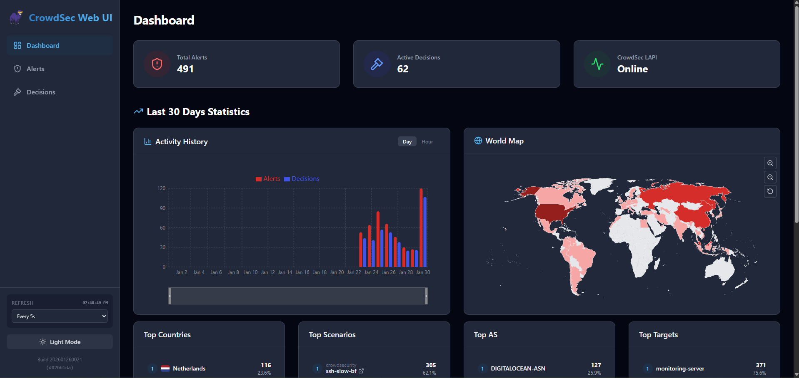
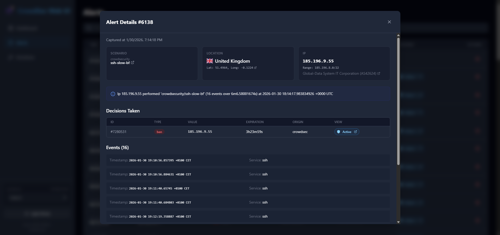

## Introduction

When managing multiple servers with CrowdSec, each instance operates independently by default — detecting threats and making ban decisions in isolation. This means an attacker blocked on one server can still access your other servers until they trigger detection there too.

A centralized LAPI (Local API) architecture solves this by:

- **Sharing threat intelligence**: A ban on one server immediately protects all servers
- **Unified management**: Single Web UI to view alerts and manage decisions across your infrastructure
- **Centralized notifications**: All security events flow to one place for monitoring
- **Simplified maintenance**: Update configurations and collections in one location

**Architecture overview:**

> Note: This tutorial assumes you have followed my previous guide of [Centralized Security Monitoring with Prometheus and Grafana](https://community.hetzner.com/tutorials/coolify-crowdsec-prometheus-grafana-monitoring)

```
┌─────────────────────────────────────────────────────────────────────┐
│                      Monitoring Server                              │
│  ┌─────────────┐  ┌──────────────┐  ┌─────────────┐  ┌───────────┐  │
│  │  CrowdSec   │  │  PostgreSQL  │  │  CrowdSec   │  │ Victoria  │  │
│  │   (LAPI)    │◄─┤   Database   │  │   Web UI    │  │  Metrics  │  │
│  └──────┬──────┘  └──────────────┘  └─────────────┘  └───────────┘  │
│         │                                                           │
└─────────┼───────────────────────────────────────────────────────────┘
          │ Port 8080
          │
    ┌─────┴─────┬─────────────────┐
    │           │                 │
    ▼           ▼                 ▼
┌─────────┐  ┌─────────┐       ┌─────────┐
│Supabase │  │  Apps   │  ...  │ Server  │
│ Server  │  │ Server  │       │   N     │
│         │  │         │       │         │
│   Log   │  │   Log   │       │   Log   │
│Processor│  │Processor│       │Processor│
│   +     │  │   +     │       │   +     │
│Bouncers │  │Bouncers │       │Bouncers │
└─────────┘  └─────────┘       └─────────┘
```

This tutorial covers:

1. Adding PostgreSQL to your monitoring stack for CrowdSec
2. Configuring the monitoring server as central LAPI
3. Deploying CrowdSec Web UI with authentication
4. Converting existing CrowdSec instances to log processors
5. Centralizing VictoriaMetrics notifications
6. Migrating historical data (optional)

**Prerequisites**

- A monitoring server with CrowdSec installed (see "[Centralized Security Monitoring with Prometheus and Grafana](https://community.hetzner.com/tutorials/coolify-crowdsec-prometheus-grafana-monitoring)")
- One or more servers with CrowdSec running (see "[Protect Self-Hosted Services with CrowdSec and Traefik](https://community.hetzner.com/tutorials/coolify-crowdsec-traefik-supavisor-protection)")
- All servers communicating over public IPs or private network
- Basic familiarity with Docker and Linux command line

**Example terminology**

| Placeholder              | Example                | Description                        |
| ------------------------ | ---------------------- | ---------------------------------- |
| `<MONITORING_SERVER_IP>` | `12.34.56.78`          | Your monitoring server's public IP |
| `<SUPABASE_SERVER_IP>`   | `123.45.67.89`         | Your Supabase server's public IP   |
| `<APPS_SERVER_IP>`       | `12.34.56.90`          | Your apps server's public IP       |
| `<your-domain>`          | `selfhost.example.com` | Your domain name                   |

## Step 1 - Add PostgreSQL for CrowdSec

By default, CrowdSec uses SQLite. For a multi-server setup, PostgreSQL provides better concurrent read/write handling and stability.

SSH into your **monitoring server**:

```bash
ssh root@<MONITORING_SERVER_IP>
```

**Step 1.1 - Generate database password**

```bash
DBPASS=$(openssl rand -hex 16)
echo "CROWDSEC_DB_PASSWORD=${DBPASS}" >> /opt/monitoring/.env
```

**Step 1.2 - Add PostgreSQL to docker-compose**

Edit your monitoring stack:

```bash
nano /opt/monitoring/docker-compose.yml
```

Add the PostgreSQL service:

```yaml
# ... existing services ...
crowdsec-db:
  image: postgres:16-alpine
  container_name: crowdsec-db
  restart: unless-stopped
  ports:
    - "127.0.0.1:5432:5432"
  environment:
    POSTGRES_USER: crowdsec
    POSTGRES_PASSWORD: ${CROWDSEC_DB_PASSWORD}
    POSTGRES_DB: crowdsec
  volumes:
    - crowdsec_db_data:/var/lib/postgresql/data
  networks:
    - monitoring
  healthcheck:
    test: ["CMD-SHELL", "pg_isready -U crowdsec"]
    interval: 10s
    timeout: 5s
    retries: 5
# ... existing services ...
```

Add the volume to your `volumes:` section:

```yaml
volumes:
  # ... existing volumes ...
  crowdsec_db_data:
```

**Step 1.3 - Start PostgreSQL**

```bash
cd /opt/monitoring
docker compose up -d crowdsec-db

# Verify it's running
docker compose ps crowdsec-db
```

Wait for the health check to show "healthy".

## Step 2 - Configure Central LAPI

**Step 2.1 - Backup current configuration**

```bash
cp /etc/crowdsec/config.yaml /etc/crowdsec/config.yaml.backup
```

**Step 2.2 - Generate auto-registration token**

This token allows remote CrowdSec instances to register automatically:

```bash
AUTO_REG_TOKEN=$(openssl rand -hex 32)
echo "Auto-registration token: ${AUTO_REG_TOKEN}"
```

Save this token — you'll need it when configuring child servers.

**Step 2.3 - Update CrowdSec configuration**

Edit the main configuration:

```bash
nano /etc/crowdsec/config.yaml
```

Find and update the `db_config` section:

```yaml
db_config:
  type: postgres
  host: 127.0.0.1
  port: 5432
  user: crowdsec
  password:
  db_name: crowdsec
  sslmode: disable
```

Find the `api.server` section and update it:

```yaml
api:
  server:
    listen_uri: 0.0.0.0:8080
    trusted_ips:
      - 127.0.0.1
      - ::1
      - 172.16.0.0/12
    auto_registration:
      enabled: true
      token: "<AUTO_REG_TOKEN>"
      allowed_ranges:
        - "<MONITORING_SERVER_IP>"/32
        - "<SUPABASE_SERVER_IP>"/32
        - "<APPS_SERVER_IP>"/32
```

Replace the placeholders with your actual values.

**Step 2.4 - Re-register the local machine**

Switching to PostgreSQL creates a new empty database. Re-register the monitoring server:

```bash
# Remove old credentials
cp /etc/crowdsec/local_api_credentials.yaml /etc/crowdsec/local_api_credentials.yaml.backup
rm /etc/crowdsec/local_api_credentials.yaml

# Register new machine
cscli machines add monitoring-server --auto --force

# Restart CrowdSec
systemctl restart crowdsec

# Verify
systemctl status crowdsec
cscli machines list
```

## Step 3 - Update Firewall Rules

Allow the LAPI port (8080) from your child servers and Docker networks:

```bash
# Allow LAPI from child servers
ufw allow from <SUPABASE_SERVER_IP> to any port 8080 proto tcp comment 'CrowdSec LAPI - Supabase'
ufw allow from <APPS_SERVER_IP> to any port 8080 proto tcp comment 'CrowdSec LAPI - Apps'

# Allow Docker networks to access LAPI
ufw allow from 172.17.0.0/16 to any port 8080 comment 'Docker to CrowdSec LAPI'
ufw allow from 172.18.0.0/16 to any port 8080 comment 'Docker Compose to CrowdSec LAPI'

ufw reload
```

## Step 4 - Deploy CrowdSec Web UI

The CrowdSec Web UI provides a browser-based interface for managing alerts and decisions.

> **Security Note**: The Web UI has no built-in authentication. We'll add Traefik Basic Auth to protect it.

|                                   |                                   |
| --------------------------------- | --------------------------------- |
|  |  |

**Step 4.1 - Register machine account for Web UI**

```bash
UIPASS=$(openssl rand -hex 16)
cscli machines add crowdsec-web-ui --password "${UIPASS}" -f /dev/null
echo "CROWDSEC_UI_PASSWORD=${UIPASS}" >> /opt/monitoring/.env
```

**Step 4.2 - Generate Basic Auth credentials**

```bash
# Install htpasswd utility
apt install apache2-utils -y

# Generate credentials (you'll be prompted for a password, change 'admin' if desired)
htpasswd -n admin
```

This outputs something like: `admin:$apr1$xyz123$hashedpasswordhere`

Add to your `.env` file (escape `$` with `$$`):

```bash
# Example: if htpasswd gave you admin:$apr1$xyz$hash
# Write it as admin:$$apr1$$xyz$$hash
echo 'CROWDSEC_UI_BASICAUTH=admin:$$apr1$$xyz123$$hashedpasswordhere' >> /opt/monitoring/.env
```

**Step 4.3 - Add Web UI to docker-compose**

Edit your monitoring stack:

```bash
nano /opt/monitoring/docker-compose.yml
```

Add the Web UI service:

```yaml
# ... existing services ...
crowdsec-web-ui:
  image: ghcr.io/theduffman85/crowdsec-web-ui:latest
  container_name: crowdsec-web-ui
  restart: unless-stopped
  extra_hosts:
    - "host.docker.internal:host-gateway"
  environment:
    - CROWDSEC_URL=http://host.docker.internal:8080
    - CROWDSEC_USER=crowdsec-web-ui
    - CROWDSEC_PASSWORD=${CROWDSEC_UI_PASSWORD}
    - CROWDSEC_LOOKBACK_PERIOD=30d
  volumes:
    - crowdsec_webui_data:/app/data
  labels:
    - "traefik.enable=true"
    - "traefik.http.routers.crowdsec-ui.rule=Host(`crowdsec.${DOMAIN}`)"
    - "traefik.http.routers.crowdsec-ui.entrypoints=https"
    - "traefik.http.routers.crowdsec-ui.tls=true"
    - "traefik.http.routers.crowdsec-ui.tls.certresolver=letsencrypt"
    - "traefik.http.services.crowdsec-ui.loadbalancer.server.port=3000"
    - "traefik.http.routers.crowdsec-ui.middlewares=crowdsec-ui-auth"
    - "traefik.http.middlewares.crowdsec-ui-auth.basicauth.users=${CROWDSEC_UI_BASICAUTH}"
  networks:
    - monitoring
# ... existing services ...
```

Add the volume:

```yaml
volumes:
  # ... existing volumes ...
  crowdsec_webui_data:
```

**Step 4.4 - Ensure DOMAIN is set**

Note the `DOMAIN` variable is used in the Traefik rule above. Make sure it's set in your `.env`. The final domain will be `crowdsec.<your-domain>`.

```bash
grep DOMAIN /opt/monitoring/.env || echo "DOMAIN=<your-domain>" >> /opt/monitoring/.env
```

**Step 4.5 - Deploy the updated stack**

```bash
cd /opt/monitoring
docker compose up -d
```

**Step 4.6 - Verify Web UI**

```bash
docker logs crowdsec-web-ui --tail 20
```

You should see successful login messages. Access the UI at `https://crowdsec.<your-domain>`.

## Step 5 - Configure Child Servers as Log Processors

Now convert your existing CrowdSec instances to report to the central LAPI. Repeat this section for each server.

### Step 5.1 - Supabase Server

SSH into your **Supabase server**:

```bash
ssh root@<SUPABASE_SERVER_IP>
```

**Register with central LAPI:**

Get the auto-registration token from Step 2.2 and run:

```bash
docker exec crowdsec cscli lapi register \
  --machine "supabase-1-server" \
  --url http://<MONITORING_SERVER_IP>:8080 \
  --token "<AUTO_REG_TOKEN>"
```

**On the Monitoring Server**, verify registration:

```bash
cscli machines list
```

You should see `supabase-1-server` listed.

**Create bouncer keys on Monitoring Server:**

```bash
cscli bouncers add supabase-1-firewall-bouncer
cscli bouncers add supabase-1-traefik-bouncer
```

Save both API keys.

**Back on Supabase Server**, update docker-compose:

```bash
nano /opt/crowdsec/docker-compose.yml
```

Update the environment section:

```yaml
services:
  crowdsec:
    image: crowdsecurity/crowdsec:latest
    container_name: crowdsec
    restart: unless-stopped
    ports:
      - "0.0.0.0:6060:6060" # Metrics only
    security_opt:
      - no-new-privileges:true
    environment:
      - GID=1000
      - COLLECTIONS=crowdsecurity/traefik crowdsecurity/http-cve crowdsecurity/whitelist-good-actors crowdsecurity/base-http-scenarios crowdsecurity/sshd crowdsecurity/linux
      - DISABLE_LOCAL_API=true
      - LOCAL_API_URL=http://<MONITORING_SERVER_IP>:8080
    volumes:
      - /opt/crowdsec/data:/var/lib/crowdsec/data
      - /opt/crowdsec/config:/etc/crowdsec
      - /var/log/traefik:/var/log/traefik:ro
      - /var/log/auth.log:/var/log/auth.log:ro
      - /var/log/syslog:/var/log/syslog:ro
      - /var/run/docker.sock:/var/run/docker.sock:ro
    networks:
      - coolify

networks:
  coolify:
    external: true
```

**Update firewall bouncer:**

```bash
nano /etc/crowdsec/bouncers/crowdsec-firewall-bouncer.yaml
```

Copy the API key from Monitoring Server "supabase-1-firewall-bouncer" to use here:

```yaml
api_url: http://<MONITORING_SERVER_IP>:8080/
api_key: "<SUPABASE_1_FIREWALL_BOUNCER_API_KEY>"
```

**Update Traefik bouncer:**

```bash
nano /data/coolify/proxy/dynamic/crowdsec.yml
```

Copy the API key from Monitoring Server "supabase-1-traefik-bouncer" to use here:

```yaml
http:
  middlewares:
    crowdsec:
      plugin:
        crowdsec:
          enabled: true
          crowdsecMode: live
          crowdsecLapiKey: "<SUPABASE_1_TRAEFIK_BOUNCER_API_KEY>"
          crowdsecLapiHost: "<MONITORING_SERVER_IP>:8080"
          crowdsecLapiScheme: http
          forwardedHeadersTrustedIPs:
            - 10.0.0.0/8
            - 172.16.0.0/12
            - 192.168.0.0/16
          clientTrustedIPs:
            - 10.0.0.0/8
            - 172.16.0.0/12
            - 192.168.0.0/16
```

**Restart services:**

```bash
cd /opt/crowdsec
docker compose down
docker compose up -d

systemctl restart crowdsec-firewall-bouncer
```

**Verify connection:**

```bash
docker exec crowdsec cscli lapi status
systemctl status crowdsec-firewall-bouncer
```

### Step 5.2 - Apps Server (and additional servers)

Repeat Step 5.1 for each additional server, using unique names:

- Machine name: `apps-server`
- Bouncer names: `apps-firewall-bouncer`, `apps-traefik-bouncer`

## Step 6 - Centralize VictoriaMetrics Notifications

With all alerts flowing through the central LAPI, configure notifications in one place.

**On the Monitoring Server:**

**Step 6.1 - Create notification handler**

```bash
mkdir -p /etc/crowdsec/notifications

cat > /etc/crowdsec/notifications/victoriametrics.yaml << 'EOF'
type: http
name: http_victoriametrics
log_level: info
format: >
  {{- range $Alert := . -}}
  {{- range .Decisions -}}
  {"metric":{"__name__":"cs_lapi_decision","instance":"{{ $Alert.MachineID }}","country":"{{$Alert.Source.Cn}}","asname":"{{$Alert.Source.AsName}}","asnumber":"{{$Alert.Source.AsNumber}}","latitude":"{{$Alert.Source.Latitude}}","longitude":"{{$Alert.Source.Longitude}}","iprange":"{{$Alert.Source.Range}}","scenario":"{{.Scenario}}","type":"{{.Type}}","duration":"{{.Duration}}","scope":"{{.Scope}}","ip":"{{.Value}}"},"values": [1],"timestamps":[{{now|unixEpoch}}000]}
  {{- end }}
  {{- end -}}
url: http://localhost:8428/api/v1/import
method: POST
headers:
  Content-Type: application/json
EOF
```

> **Note**: The `instance` field uses `{{ $Alert.MachineID }}` to identify which server detected the threat.

**Step 6.2 - Update profiles**

```bash
cat > /etc/crowdsec/profiles.yaml << 'EOF'
name: default_ip_remediation
filters:
  - Alert.Remediation == true && Alert.GetScope() == "Ip"
decisions:
  - type: ban
    duration: 4h
notifications:
  - http_victoriametrics
on_success: break
---
name: default_range_remediation
filters:
  - Alert.Remediation == true && Alert.GetScope() == "Range"
decisions:
  - type: ban
    duration: 4h
notifications:
  - http_victoriametrics
on_success: break
EOF
```

**Step 6.3 - Restart CrowdSec**

```bash
systemctl restart crowdsec
```

**Step 6.4 - Verify notifications are active**

```bash
cscli notifications list
```

Expected output shows `http_victoriametrics` as active.

**Step 6.5 - Remove old notification configs from child servers**

On each child server (Supabase, Apps, etc.):

```bash
rm -f /opt/crowdsec/config/notifications/victoriametrics.yaml
rm -f /opt/crowdsec/config/profiles.yaml
docker restart crowdsec
```

## Step 7 - Verify Complete Setup

**On the Monitoring Server:**

**Step 7.1 - Check all machines**

```bash
cscli machines list
```

Expected output:

```
 Name               IP Address            Status  Version  Last Heartbeat
 monitoring-server  127.0.0.1             ✔️      v1.x.x   10s
 supabase-server    <SUPABASE_SERVER_IP>  ✔️      v1.x.x   15s
 apps-server        <APPS_SERVER_IP>      ✔️      v1.x.x   12s
 crowdsec-web-ui    172.18.0.x            ✔️      1.0.0    -
```

**Step 7.2 - Check all bouncers**

```bash
cscli bouncers list
```

Expected output shows all bouncers with recent "Last API pull" timestamps.

**Step 7.3 - Test shared decisions**

Create a test ban on the monitoring server:

```bash
cscli decisions add --ip 192.0.2.1 --duration 1m --reason "Test ban"
```

Verify it's visible on a child server:

```bash
# On Supabase server
docker exec crowdsec cscli decisions list
```

The test ban should appear on all servers.

Remove the test ban:

```bash
# On Monitoring server
cscli decisions delete --ip 192.0.2.1
```

## Step 8 - Migrate Historical Data (Optional)

If you have existing alerts and decisions in the old SQLite database, you can migrate them to PostgreSQL.

**Step 8.1 - Check existing data**

```bash
sqlite3 /var/lib/crowdsec/data/crowdsec.db "SELECT COUNT(*) FROM alerts;"
sqlite3 /var/lib/crowdsec/data/crowdsec.db "SELECT COUNT(*) FROM decisions;"
```

**Step 8.2 - Stop CrowdSec**

```bash
systemctl stop crowdsec
```

**Step 8.3 - Export data from SQLite**

```bash
# Export alerts
sqlite3 -header -csv /var/lib/crowdsec/data/crowdsec.db \
  "SELECT id, created_at, updated_at, scenario, bucket_id, message, events_count, started_at, stopped_at, source_ip, source_range, source_as_number, source_as_name, source_country, source_latitude, source_longitude, source_scope, source_value, capacity, leak_speed, scenario_version, scenario_hash, simulated, uuid, remediation FROM alerts;" > /tmp/alerts.csv

# Export decisions
sqlite3 -header -csv /var/lib/crowdsec/data/crowdsec.db \
  "SELECT id, created_at, updated_at, until, scenario, type, scope, value, origin, simulated, uuid, alert_decisions FROM decisions;" > /tmp/decisions.csv
```

**Step 8.4 - Clear PostgreSQL tables**

```bash
docker exec crowdsec-db psql -U crowdsec -d crowdsec -c "TRUNCATE decisions, alerts, events, meta CASCADE;"
```

**Step 8.5 - Import data**

```bash
# Copy files to container
docker cp /tmp/alerts.csv crowdsec-db:/tmp/alerts.csv
docker cp /tmp/decisions.csv crowdsec-db:/tmp/decisions.csv

# Import alerts
docker exec crowdsec-db psql -U crowdsec -d crowdsec -c "
COPY alerts (id, created_at, updated_at, scenario, bucket_id, message, events_count, started_at, stopped_at, source_ip, source_range, source_as_number, source_as_name, source_country, source_latitude, source_longitude, source_scope, source_value, capacity, leak_speed, scenario_version, scenario_hash, simulated, uuid, remediation)
FROM '/tmp/alerts.csv'
WITH (FORMAT csv, HEADER true, NULL '');
"

# Import decisions
docker exec crowdsec-db psql -U crowdsec -d crowdsec -c "
COPY decisions (id, created_at, updated_at, until, scenario, type, scope, value, origin, simulated, uuid, alert_decisions)
FROM '/tmp/decisions.csv'
WITH (FORMAT csv, HEADER true, NULL '');
"

# Fix foreign keys and sequences
docker exec crowdsec-db psql -U crowdsec -d crowdsec -c "
UPDATE alerts SET machine_alerts = 1 WHERE machine_alerts IS NULL;
SELECT setval('alerts_id_seq', (SELECT MAX(id) FROM alerts));
SELECT setval('decisions_id_seq', (SELECT MAX(id) FROM decisions));
"
```

**Step 8.6 - Start CrowdSec**

```bash
systemctl start crowdsec
systemctl status crowdsec
```

## Quick Reference - CrowdSec Commands

| Command                                          | Description                  |
| ------------------------------------------------ | ---------------------------- |
| `cscli machines list`                            | List all connected machines  |
| `cscli bouncers list`                            | List all registered bouncers |
| `cscli decisions list`                           | List active bans             |
| `cscli decisions add --ip X.X.X.X --duration 4h` | Manually ban an IP           |
| `cscli decisions delete --ip X.X.X.X`            | Unban an IP                  |
| `cscli alerts list`                              | List recent alerts           |
| `cscli notifications list`                       | List notification plugins    |
| `cscli metrics`                                  | View detection metrics       |

## Troubleshooting

**Child server can't connect to LAPI:**

1. Check firewall allows port 8080 from child server IP
2. Verify the auto-registration token matches
3. Check CrowdSec logs: `journalctl -u crowdsec -n 50`

**Web UI shows "Request timeout":**

1. Verify Docker networks can reach host port 8080:
   ```bash
   ufw allow from 172.17.0.0/16 to any port 8080
   ufw allow from 172.18.0.0/16 to any port 8080
   ```
2. Restart the Web UI: `docker restart crowdsec-web-ui`

**Bouncers show no "Last API pull":**

1. Check bouncer configuration has correct LAPI URL and API key
2. Restart the bouncer service
3. Traefik bouncers only pull when processing requests

**Database migration fails:**

1. Ensure CrowdSec is stopped before migration
2. Check PostgreSQL container is healthy
3. Verify CSV files exported correctly: `head -5 /tmp/alerts.csv`

## Conclusion

You now have a centralized CrowdSec architecture with:

- ✅ Single LAPI server handling all decisions
- ✅ PostgreSQL backend for reliability
- ✅ Web UI for visual management
- ✅ Shared threat intelligence across all servers
- ✅ Centralized notifications to VictoriaMetrics
- ✅ Historical data preserved with geo-location

**Benefits of this architecture:**

- An attacker blocked on one server is immediately blocked everywhere
- Single pane of glass for security management
- Simplified configuration and updates
- Better visibility into infrastructure-wide threats

##### License: MIT

<!--

Contributor's Certificate of Origin

By making a contribution to this project, I certify that:

(a) The contribution was created in whole or in part by me and I have
    the right to submit it under the license indicated in the file; or

(b) The contribution is based upon previous work that, to the best of my
    knowledge, is covered under an appropriate license and I have the
    right under that license to submit that work with modifications,
    whether created in whole or in part by me, under the same license
    (unless I am permitted to submit under a different license), as
    indicated in the file; or

(c) The contribution was provided directly to me by some other person
    who certified (a), (b) or (c) and I have not modified it.

(d) I understand and agree that this project and the contribution are
    public and that a record of the contribution (including all personal
    information I submit with it, including my sign-off) is maintained
    indefinitely and may be redistributed consistent with this project
    or the license(s) involved.

Signed-off-by: Yusuf Khasbulatov khashashin@proton.me

-->
