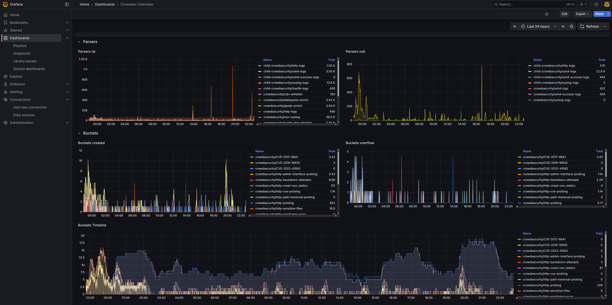
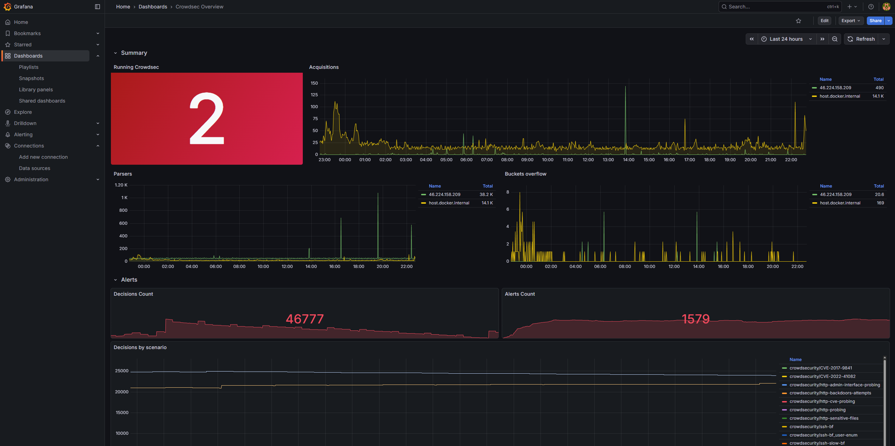
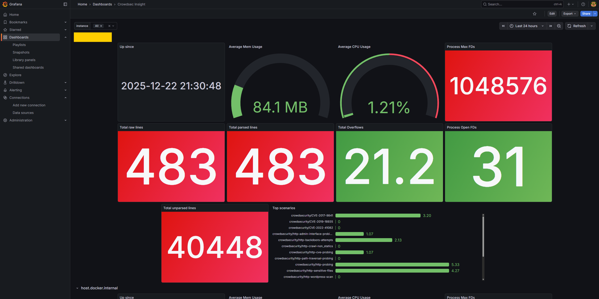

## Introduction

When managing multiple servers with CrowdSec, you need a centralized view of security events. This tutorial deploys a monitoring stack on a dedicated server that:

- Collects CrowdSec metrics from all your servers via Prometheus
- Stores security decision data (bans, alerts) in VictoriaMetrics
- Visualizes everything with Grafana dashboards including geo-location maps

**Architecture overview:**

```
┌─────────────────┐     ┌─────────────────┐     ┌─────────────────┐
│   Supabase-1    │     │   Supabase-2    │     │   Supabase-N    │
│   (CrowdSec)    │     │   (CrowdSec)    │     │   (CrowdSec)    │
└────────┬────────┘     └────────┬────────┘     └────────┬────────┘
         │ :6060                 │ :6060                 │ :6060
         └───────────────────────┼───────────────────────┘
                                 │
                                 ▼
                    ┌────────────────────────┐
                    │   Monitoring Server    │
                    │  ┌──────────────────┐  │
                    │  │    Prometheus    │  │
                    │  │  VictoriaMetrics │  │
                    │  │      Grafana     │  │
                    │  └──────────────────┘  │
                    └────────────────────────┘
```

|                                   |                                   |
| --------------------------------- | --------------------------------- |
|  |  |

|                                   |                                   |
| --------------------------------- | --------------------------------- |
|  |  |

**Prerequisites:**

- A separate Hetzner Cloud server for monitoring
- CrowdSec running on servers you want to monitor (see "[Protect Self-Hosted Services with CrowdSec and Traefik](https://community.hetzner.com/tutorials/coolify-crowdsec-traefik-supavisor-protection)")
- A domain for Grafana access (e.g., `monitoring.example.com`)

## Step 1 - Provision Monitoring Server

**Step 1.1 - Create server in Hetzner**

In Hetzner Cloud Console:

1. Click **Add Server**
2. Configure:

| Setting  | Value                      |
| -------- | -------------------------- |
| Location | Same as your other servers |
| Image    | Apps → **Docker CE**       |
| Type     | CX23 (2 vCPU, 4GB RAM)     |
| Name     | `monitoring`               |

**Step 1.2 - Initial setup**

SSH into the server:

```bash
ssh root@<monitoring-server-ip>

# Update system
apt update && apt upgrade -y

# Set timezone
timedatectl set-timezone Europe/Zurich

# Create directory structure
mkdir -p /opt/monitoring/{prometheus,loki,grafana/provisioning/datasources}
```

## Step 2 - Deploy Monitoring Stack

**Step 2.1 - Create environment file**

```bash
cat > /opt/monitoring/.env << 'EOF'
GRAFANA_PASSWORD=<your-strong-password>
EOF

chmod 600 /opt/monitoring/.env
```

**Step 2.2 - Create Docker Compose file**

Replace `<your-email@example.com>` and `<your-domain>` with your values.

```bash
cat > /opt/monitoring/docker-compose.yml << 'EOF'
services:
  traefik:
    image: traefik:v3.6
    container_name: traefik
    restart: unless-stopped
    ports:
      - "80:80"
      - "443:443"
    command:
      - "--accesslog=true"
      - "--accesslog.filepath=/var/log/traefik/access.log"
      - "--accesslog.format=json"
      - "--api.insecure=false"
      - "--providers.docker=true"
      - "--providers.docker.exposedbydefault=false"
      - "--entrypoints.http.address=:80"
      - "--entrypoints.https.address=:443"
      - "--entrypoints.http.http.redirections.entrypoint.to=https"
      - "--entrypoints.http.http.redirections.entrypoint.scheme=https"
      - "--certificatesresolvers.letsencrypt.acme.tlschallenge=true"
      - "--certificatesresolvers.letsencrypt.acme.email=<your-email@example.com>"
      - "--certificatesresolvers.letsencrypt.acme.storage=/letsencrypt/acme.json"
    volumes:
      - /var/run/docker.sock:/var/run/docker.sock:ro
      - traefik_certs:/letsencrypt
      - /var/log/traefik:/var/log/traefik
    networks:
      - monitoring

  prometheus:
    image: prom/prometheus:latest
    container_name: prometheus
    restart: unless-stopped
    extra_hosts:
      - "host.docker.internal:host-gateway"
    volumes:
      - /opt/monitoring/prometheus:/etc/prometheus:ro
      - prometheus_data:/prometheus
    command:
      - "--config.file=/etc/prometheus/prometheus.yml"
      - "--storage.tsdb.path=/prometheus"
      - "--storage.tsdb.retention.time=30d"
      - "--web.enable-lifecycle"
    networks:
      - monitoring

  victoriametrics:
    image: victoriametrics/victoria-metrics:latest
    container_name: victoriametrics
    restart: unless-stopped
    ports:
      - "0.0.0.0:8428:8428"
    volumes:
      - vmdata:/storage
    command:
      - "--storageDataPath=/storage"
      - "--httpListenAddr=:8428"
    networks:
      - monitoring

  loki:
    image: grafana/loki:latest
    container_name: loki
    restart: unless-stopped
    volumes:
      - /opt/monitoring/loki:/etc/loki
      - loki_data:/loki
    command: -config.file=/etc/loki/loki-config.yml
    networks:
      - monitoring

  grafana:
    image: grafana/grafana:latest
    container_name: grafana
    restart: unless-stopped
    environment:
      - GF_SECURITY_ADMIN_USER=admin
      - GF_SECURITY_ADMIN_PASSWORD=${GRAFANA_PASSWORD}
      - GF_USERS_ALLOW_SIGN_UP=false
      - GF_USERS_ALLOW_ORG_CREATE=false
      - GF_SECURITY_STRICT_TRANSPORT_SECURITY=true
      - GF_SECURITY_COOKIE_SECURE=true
      - GF_SECURITY_COOKIE_SAMESITE=strict
      - GF_AUTH_ANONYMOUS_ENABLED=false
      - GF_ANALYTICS_REPORTING_ENABLED=false
      - GF_SERVER_ROOT_URL=https://monitoring.<your-domain>
    volumes:
      - grafana_data:/var/lib/grafana
      - /opt/monitoring/grafana/provisioning:/etc/grafana/provisioning
    labels:
      - "traefik.enable=true"
      - "traefik.http.routers.grafana.rule=Host(`monitoring.<your-domain>`)"
      - "traefik.http.routers.grafana.entrypoints=https"
      - "traefik.http.routers.grafana.tls=true"
      - "traefik.http.routers.grafana.tls.certresolver=letsencrypt"
      - "traefik.http.services.grafana.loadbalancer.server.port=3000"
    networks:
      - monitoring
    env_file:
      - ./.env

  watchtower:
    image: containrrr/watchtower:latest
    container_name: watchtower
    restart: unless-stopped
    volumes:
      - /var/run/docker.sock:/var/run/docker.sock
    command: --cleanup
    networks:
      - monitoring

volumes:
  traefik_certs:
  prometheus_data:
  vmdata:
  loki_data:
  grafana_data:

networks:
  monitoring:
    driver: bridge
EOF
```

## Step 3 - Configure Prometheus

```bash
cat > /opt/monitoring/prometheus/prometheus.yml << 'EOF'
global:
  scrape_interval: 15s
  evaluation_interval: 15s

scrape_configs:
  - job_name: "prometheus"
    static_configs:
      - targets: ["localhost:9090"]

  - job_name: "crowdsec"
    static_configs:
      - targets:
          - "host.docker.internal:6060"  # Local monitoring server CrowdSec
          # Add your server IPs here:
          # - "<SUPABASE-1-IP>:6060"
          # - "<SUPABASE-2-IP>:6060"
    relabel_configs:
      - source_labels: [__address__]
        regex: "([^:]+):.*"
        target_label: instance
        replacement: "${1}"
EOF
```

> **Note**: Prometheus will be started in Step 8. If you need to update this configuration later, reload Prometheus with: `docker restart prometheus`

## Step 4 - Configure Loki

```bash
cat > /opt/monitoring/loki/loki-config.yml << 'EOF'
auth_enabled: false

server:
  http_listen_port: 3100
  grpc_listen_port: 9096

common:
  instance_addr: 127.0.0.1
  path_prefix: /loki
  storage:
    filesystem:
      chunks_directory: /loki/chunks
      rules_directory: /loki/rules
  replication_factor: 1
  ring:
    kvstore:
      store: inmemory

query_range:
  results_cache:
    cache:
      embedded_cache:
        enabled: true
        max_size_mb: 100

schema_config:
  configs:
    - from: 2020-10-24
      store: tsdb
      object_store: filesystem
      schema: v13
      index:
        prefix: index_
        period: 24h

limits_config:
  reject_old_samples: true
  reject_old_samples_max_age: 168h
EOF
```

## Step 5 - Configure Grafana Datasources

```bash
cat > /opt/monitoring/grafana/provisioning/datasources/datasources.yml << 'EOF'
apiVersion: 1

datasources:
  - name: Prometheus
    type: prometheus
    access: proxy
    url: http://prometheus:9090
    isDefault: true
    editable: false

  - name: Loki
    type: loki
    access: proxy
    url: http://loki:3100
    editable: false

  - name: VictoriaMetrics
    type: prometheus
    access: proxy
    url: http://victoriametrics:8428
    editable: false
EOF
```

## Step 6 - Configure Firewall

```bash
# Reset and set defaults
ufw --force reset
ufw default deny incoming
ufw default allow outgoing

# Allow required ports
ufw allow 22/tcp comment 'SSH'
ufw allow 80/tcp comment 'HTTP'
ufw allow 443/tcp comment 'HTTPS'

# Allow metrics from monitored servers
# Replace with your actual server IPs:
# ufw allow from <SUPABASE-1-IP> to any port 6060 proto tcp comment 'CrowdSec metrics'
# ufw allow from <SUPABASE-1-IP> to any port 8428 proto tcp comment 'VictoriaMetrics'

# Allow Docker networks to access host CrowdSec
ufw allow from 172.17.0.0/16 to any port 6060 comment 'Docker to CrowdSec'
ufw allow from 172.18.0.0/16 to any port 6060 comment 'Docker Compose to CrowdSec'

# Disable IPv6 if not used
sed -i 's/IPV6=yes/IPV6=no/' /etc/default/ufw

# Enable firewall
ufw --force enable
```

## Step 7 - Install CrowdSec on Monitoring Server

The monitoring server itself should be protected:

```bash
# Add CrowdSec repository
apt update && apt upgrade -y
curl -s https://install.crowdsec.net | sudo sh

# Install CrowdSec
apt install crowdsec -y

# Install collections
cscli collections install crowdsecurity/linux
cscli collections install crowdsecurity/sshd
cscli collections install crowdsecurity/base-http-scenarios
cscli collections install crowdsecurity/http-cve
cscli collections install crowdsecurity/whitelist-good-actors

# Install firewall bouncer
apt install crowdsec-firewall-bouncer-nftables -y
systemctl enable crowdsec-firewall-bouncer
systemctl start crowdsec-firewall-bouncer
```

Configure CrowdSec to expose metrics for Prometheus:

Add or update the prometheus section in `/etc/crowdsec/config.yaml`:

```yaml
prometheus:
  enabled: true
  level: full
  listen_addr: 0.0.0.0
  listen_port: 6060
```

Restart CrowdSec:

```bash
systemctl restart crowdsec
```

> **Note**: The default CrowdSec installation includes a prometheus section that listens on `127.0.0.1`. The commands above remove it and add a new configuration that listens on `0.0.0.0` to allow Prometheus to scrape metrics.

Create log directory for Traefik:

```bash
mkdir -p /var/log/traefik
chmod 755 /var/log/traefik
```

Add Traefik log acquisition:

```bash
cat > /etc/crowdsec/acquis.d/traefik.yaml << 'EOF'
---
filenames:
  - /var/log/traefik/*.log
labels:
  type: traefik
EOF

systemctl restart crowdsec
```

## Step 8 - Start the Monitoring Stack

```bash
cd /opt/monitoring
docker compose up -d
```

Wait for all containers to start:

```bash
docker compose ps
```

All services should show as "running" or "healthy".

## Step 9 - Configure CrowdSec Servers to Report

On each **monitored server** (Supabase instances), create a notification handler to send decision data to VictoriaMetrics.

**Step 9.1 - Create notification handler**

Replace:

- `<INSTANCE-NAME>` with a unique identifier (e.g., `supabase-1`)
- `<MONITORING-SERVER-IP>` with your monitoring server's IP

```bash
cat > /opt/crowdsec/config/notifications/victoriametrics.yaml << 'EOF'
type: http
name: http_victoriametrics
log_level: info
format: >
  {{- range $Alert := . -}}
  {{- $traefikRouters := GetMeta . "traefik_router_name" -}}
  {{- range .Decisions -}}
  {"metric":{"__name__":"cs_lapi_decision","instance":"<INSTANCE-NAME>","country":"{{$Alert.Source.Cn}}","asname":"{{$Alert.Source.AsName}}","asnumber":"{{$Alert.Source.AsNumber}}","latitude":"{{$Alert.Source.Latitude}}","longitude":"{{$Alert.Source.Longitude}}","iprange":"{{$Alert.Source.Range}}","scenario":"{{.Scenario}}","type":"{{.Type}}","duration":"{{.Duration}}","scope":"{{.Scope}}","ip":"{{.Value}}","traefik_routers":{{ printf "%q" ($traefikRouters | uniq | join ",")}}},"values": [1],"timestamps":[{{now|unixEpoch}}000]}
  {{- end }}
  {{- end -}}
url: http://<MONITORING-SERVER-IP>:8428/api/v1/import
method: POST
headers:
  Content-Type: application/json
EOF
```

**Step 9.2 - Update CrowdSec profiles**

```bash
cat > /opt/crowdsec/config/profiles.yaml << 'EOF'
name: default_ip_remediation
filters:
  - Alert.Remediation == true && Alert.GetScope() == "Ip"
decisions:
  - type: ban
    duration: 4h
notifications:
  - http_victoriametrics
on_success: break
---
name: default_range_remediation
filters:
  - Alert.Remediation == true && Alert.GetScope() == "Range"
decisions:
  - type: ban
    duration: 4h
notifications:
  - http_victoriametrics
on_success: break
EOF
```

**Step 9.3 - Install GeoIP enrichment**

```bash
docker exec crowdsec cscli parsers install crowdsecurity/geoip-enrich
docker restart crowdsec
```

## Step 10 - Import Grafana Dashboards

Access Grafana at `https://monitoring.<your-domain>` and log in:

* User: `admin`
* Password: set in `/opt/monitoring/.env`

**Step 10.1 - Import CrowdSec dashboards**

Go to **Dashboards** → **Import** and import these dashboards:

1. Download and import the official CrowdSec dashboards from:
   - https://raw.githubusercontent.com/crowdsecurity/grafana-dashboards/master/dashboards_v5/Crowdsec%20Overview.json
   - https://raw.githubusercontent.com/crowdsecurity/grafana-dashboards/master/dashboards_v5/Crowdsec%20Insight.json
   - https://raw.githubusercontent.com/crowdsecurity/grafana-dashboards/master/dashboards_v5/Crowdsec%20Details%20per%20Machine.json

2. For the CTI (Cyber Threat Intelligence) dashboard with geo-mapping:
   - Go to **Dashboards** → **Import**
   - Enter Dashboard ID: `21689`
   - Select `VictoriaMetrics` as the data source

## Step 11 - Configure Log Rotation

```bash
cat > /etc/logrotate.d/traefik-monitoring << 'EOF'
/var/log/traefik/*.log {
    daily
    rotate 14
    compress
    delaycompress
    missingok
    notifempty
    create 0644 root root
    postrotate
        docker kill --signal="USR1" traefik 2>/dev/null || true
    endscript
}
EOF
```

## Step 12 - Verify Setup

**Step 12.1 - Check Prometheus targets**

```bash
docker exec prometheus wget -qO- 'http://localhost:9090/api/v1/targets' | jq '.data.activeTargets[] | {instance: .labels.instance, health: .health}'
```

All targets should show `"health": "up"`.

**Step 12.2 - Check CrowdSec metrics**

```bash
curl http://localhost:6060/metrics | head -5
```

**Step 12.3 - Verify Grafana dashboards**

Open Grafana and check that dashboards display data.

## Troubleshooting

**Prometheus can't reach targets:**

1. Check firewall rules on monitored servers allow port 6060 from monitoring server
2. Verify CrowdSec is exposing metrics: `curl http://<server-ip>:6060/metrics`

**VictoriaMetrics not receiving data:**

1. Check firewall allows port 8428 from monitored servers
2. Verify notification handler URL is correct
3. Check CrowdSec logs: `docker logs crowdsec`

**Docker networking issues after firewall changes:**

Restart Docker to rebuild iptables rules:

```bash
systemctl restart docker
cd /opt/monitoring
docker compose up -d
```

## Conclusion

You now have centralized security monitoring with:

- ✅ Prometheus collecting CrowdSec metrics from all servers
- ✅ VictoriaMetrics storing detailed decision data with geo-location
- ✅ Grafana dashboards for visualization
- ✅ Automatic container updates via Watchtower
- ✅ The monitoring server itself protected by CrowdSec

This gives you a single pane of glass to monitor security events across your entire infrastructure.

##### License: MIT

<!--

Contributor's Certificate of Origin

By making a contribution to this project, I certify that:

(a) The contribution was created in whole or in part by me and I have
    the right to submit it under the license indicated in the file; or

(b) The contribution is based upon previous work that, to the best of my
    knowledge, is covered under an appropriate license and I have the
    right under that license to submit that work with modifications,
    whether created in whole or in part by me, under the same license
    (unless I am permitted to submit under a different license), as
    indicated in the file; or

(c) The contribution was provided directly to me by some other person
    who certified (a), (b) or (c) and I have not modified it.

(d) I understand and agree that this project and the contribution are
    public and that a record of the contribution (including all personal
    information I submit with it, including my sign-off) is maintained
    indefinitely and may be redistributed consistent with this project
    or the license(s) involved.

Signed-off-by: Yusuf Khasbulatov khashashin@proton.me

-->
