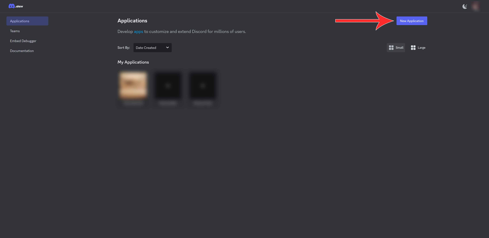
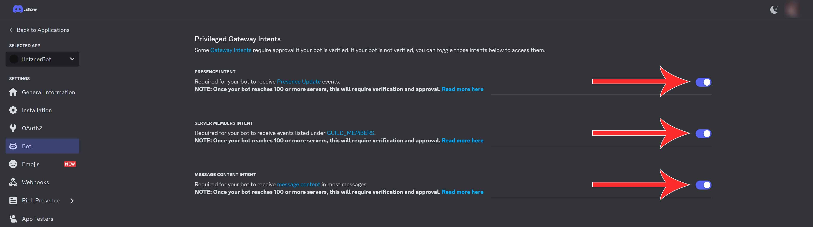
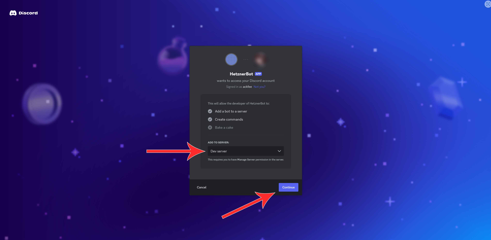

## Introduction

This tutorial explains how to run a Discord bot on a Linux server. A Discord bot is an excellent way to learn the principles of back-end web development while having fun with your friends. With the recent proliferation of Discord for more general and public use, learning to make and set up Discord bots can also become a fun side job. Making your own Discord bot is not difficult, but requires a specific set of steps which you need to do in order to keep your Discord bot secure and operational. 

Since Discord bots execute code and can do very complex interactions with Discord servers, they have to be hosted on a server. Even though you can get paid services which will host your Discord bot on the internet, it’s really easy to host one yourself, as this tutorial will show. 

This tutorial will use Python with the discord.py library. Discord bots are primarily written in Python (the discord.py library) or JavaScript (the discord.js library), with both being mature ecosystems which can work together with all the other libraries written in that language. Consequently, most of the steps are identical for both (apart from the language-specific ones). However, the Python library is slightly easier to get started with, which is why it was chosen for this tutorial.

The example Discord bot in this library will be a simple spelling correction bot, which illustrates some of the most important commands of the discord.py library.

**Prerequisites**

* A VPS or dedicated server
  * If you don’t have many users or your bot does a simple task, there are practically no minimum hardware requirements - all you need to be able to do, is run Python
* Any 64-bit Linux OS (x86-64 or Arm64)
  * This tutorial will assume you’re running Ubuntu, but the same steps will work on other Linux distributions and Windows with slight changes
* A Discord account with a Discord server where you have administrator privileges
* Basic or intermediate Python knowledge

## Step 1 - Set up a virtual environment

Before you start developing, it’s recommended to use a Python virtual environment (venv), which allows each project to have specific versions of libraries for that project only, in order to not have any incompatibilities between projects which might require specific versions of libraries. For Discord bots running on Python, this is highly recommended, since you can make sure your bot always works and you can easily transfer it to another server.

Open the terminal in your Linux distribution or connect to your server through SSH and run the following commands:

```bash
apt update && apt install python3.10-venv
mkdir discord-bot && cd discord-bot/
python3 -m venv discord-bot-env
source discord-bot-env/bin/activate
```

This will install the Python package needed to create virtual environments, create a directory for your Discord bot and activate the Python virtual environment. Your terminal should now show `(discord-bot-env)` before your username. Next, install the discord.py library:

```bash
python3 -m pip install --upgrade discord.py
```

>  You can use `python3 -m pip show discord.py` to view some information about the version you just installed.

## Step 2 - Register your bot with Discord

Before you run any scripts, you need to register your Discord bot with Discord itself and obtain a token which your bot will use to authenticate with Discord. This is a simple, albeit long process. Just follow these steps:

1. Open a web browser.
2. Log in on the [Discord website](https://discord.com/).
3. Go to the [Discord Developer Portal](https://discord.com/developers/applications).
4. Click on “New Application”.
   
5. In the “Create an Application” section, name your bot.
   
6. Click on the bot and go to the Bot section.
7. Make sure “Public Bot” is selected and “Requires OAuth2 Code Grant” is not selected.
8. Click on “Reset Token” and write down your token. Make sure to not lose this token. If you do, you need to click the button again, get a new token again and update the token in your code to the new token.
   
9. Scroll down and turn on all the “Privileged Gateway Intents”. This will allow the bot to function. Since your bot has no code yet, the conditions for over 100 servers don’t apply.
   
10. Go to the OAuth2 section and then the URL Generator subsection. The URL will allow you and any other person who wants to use your bot, to easily add your bot to their server with only those permissions and functionalities they want the bot to have.
11. In the “Scopes” section click on “bot”. You’re making a bot after all!
    
12. In the “Bot Permissions” section, click on all the permissions you want to allow the bot you want to have. This will depend on what you want your bot to be able to do. For the simple bot in this example, the permissions below should be sufficient.
13. In the “Generated URL” section, click on "Copy".
    
14. Paste this URL in the search bar and go to the link.
15. Read the information presented about what the bot will be able to do and add it to a server. You can only add the bot to a server where you have administrative privileges. 
16. Click "Continue".
    
17. Select which permissions you want your bot to have on the server you’re adding it to. Try to give the bot the least permissions you can while keeping it fully functional. Giving it additional permissions can be a security risk if someone malicious gets your bot token.
    

## Step 3 - Write the code for your bot

Now that the bot is registered with Discord, you need to write the code behind it. Luckily, creating a simple Discord bot is really easy, and the documentation for discord.py is similarly excellent, which will be discussed later.

In the same folder where you ran the commands in "Step 1", create a file called `discord_bot_script.py` with your preferred text editor. In this example, I’ll be using Nano.

```bash
nano discord_bot_script.py
```

Copy and paste the code below, replacing the token in the final line with your token.

```python
import discord


intents = discord.Intents.default()
intents.message_content = True


client = discord.Client(intents=intents)


words = [["youre", "you're"], ["im", "i'm"], ["Im", "I'm"], ["hes", "he's"], ["shes", "she's"]]


@client.event
async def on_ready():
    print("Bot successfully logged in as " + client.user)


@client.event
async def on_message(message):
    if message.author == client.user:
        return
    for word in words:
        if word[0] in message.content:
            await message.channel.send(str(message.author) + ", you misspelled " + word[1] + " as " + word[0], reference=message)


client.run('<YOUR-TOKEN-HERE>')
```

I won’t go line per line, but this simple bot demonstrates most of what you need to know to start creating your own Discord bots in Python. It starts by declaring intents, which are essentially filters which your bot uses to judge which events it logs and responds to. For example, if you have a spellchecker bot, you will only respond to message events, but will ignore events such as people joining the server or playing specific games. [You can read more about intents on the discord.py documentation page](https://discordpy.readthedocs.io/en/latest/intents.html).

Then, the code declares a small list of words it will correct. You can edit the list to replace any word with any other word.

Then, the code defines two specific types of events which it will respond to:

* `on_ready`, which is when the bot’s script loads and the bot connects to its servers.
* `on_message`, which is when anyone writes a new message in any server the bot is connected to. This event also has an argument which passes the content and metadata of the message to the function.

For the `on_ready` function, the code simply makes the bot write a message to the terminal. You can use the print function to log events during development.

For the `on_message` function, the code first checks if the message author is the bot itself, and if it is, it returns from the function. If it didn’t do this check, the bot could accidentally get stuck in a loop responding to its own messages forever. Then, the code checks if any of the words from the list is in the received message. If it is, it replies to the sent message using the send function. This is one of the most important and powerful functions in discord.py and learning to use its full potential will let you make interesting and complex bots.

Now that you wrote your bot, save the code and run it with the following function:

```bash
python3 discord_bot_script.py
```

After going through the connection process, the script should output `Bot successfully logged in as <YOUR-BOT-NAME>`.

## Conclusion

That’s it! You now have a fully functional Discord bot. Reading through the [documentation](https://discordpy.readthedocs.io/en/latest/api.html) will show you the enormous number of functions a Discord bot can do. You can also integrate your Discord bot with other external APIs and have it generate AI images based on messages and send them, implement games like tic-tac-toe, schedule server events and send reminders for them, and many other applications. If you can do it in Python, your bot can do it too!

Another area to explore related to Discord bots is Discord Webhooks, which allow you to only send messages to a Discord server without setting up a bot or requiring authentication. With this you can make a whole other interesting number of projects such as having embedded devices send messages when an event in the real world happens or connecting Discord to another communication method such as IRC to enable bidirectional real-time communication between users using different methods.

##### License: MIT

<!--

Contributor's Certificate of Origin

By making a contribution to this project, I certify that:

(a) The contribution was created in whole or in part by me and I have
    the right to submit it under the license indicated in the file; or

(b) The contribution is based upon previous work that, to the best of my
    knowledge, is covered under an appropriate license and I have the
    right under that license to submit that work with modifications,
    whether created in whole or in part by me, under the same license
    (unless I am permitted to submit under a different license), as
    indicated in the file; or

(c) The contribution was provided directly to me by some other person
    who certified (a), (b) or (c) and I have not modified it.

(d) I understand and agree that this project and the contribution are
    public and that a record of the contribution (including all personal
    information I submit with it, including my sign-off) is maintained
    indefinitely and may be redistributed consistent with this project
    or the license(s) involved.

Signed-off-by: Stefan Nikolaj stefannikolaj@gmail.com

-->
