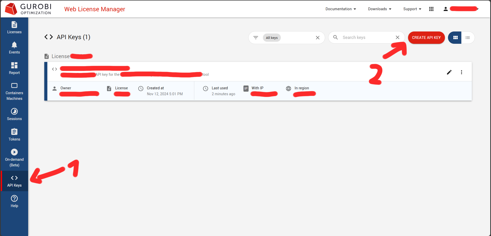
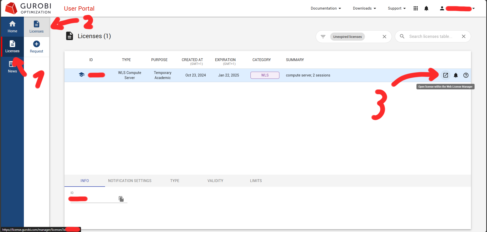

## Introduction
Gurobi Optimizer is an incredibly powerful mathematical optimization tool used in academia and industry to solve linear programming, mixed-integer programming, quadratic programming, and even more complex optimization problems. Generally, if you can think of and describe an optimization problem, Gurobi can solve it. This article will assume that you are a member of an academic institution and thus have access to an Academic WLS license. This article will first show you how to install Gurobi locally to test your license and get acquainted with the software, and then will show you how to deploy Gurobi through Docker to create a remote compute server.  
Running Gurobi on a remote server is much more convenient than running it on your local machine, and it allows you to solve much more complex problems, since you can use the full power of the server. You can also offload the computational load to the server, so that you can continue working on other tasks while the calculations are done.  

## Prerequisites:
* A Unix-compatible system (Linux, MacOS, WSL).
    * The tutorial works for both desktop and headless variants.
    * Ideally, you want a very computationally capable system because solving models can take time. Single-core performance is a priority.
    * This tutorial will use Ubuntu, but the steps are identical for other operating systems.
* An email address associated with an academic institution.
* VPN access to your university network (can also be done on a local machine).
* A web browser.
* Python installed with conda or pip.
* A Docker installation.

## Step 1 - Obtain Academic WLS license
As an academic, you have the ability to get a Gurobi license for free (with limitations) for 90 days, which you can renew as long as you maintain your status as an academic. This means that as long as you’re in a university, you have access to the Academic WLS license. Unlike most mathematics libraries, which are free and open-source, Gurobi is paid and closed-source but is also a much more extensive piece of software.

To obtain a license, connect to your university’s network through a VPN. Alternatively, you can also go there and connect to the WiFi. You only need to do this once to create the license. Register an account [on the Gurobi website](https://www.gurobi.com/academia/academic-program-and-licenses/) with your academic email and navigate to the [Gurobi User Portal](https://portal.gurobi.com/iam/home/). Then, go to the licenses page and navigate to `Licenses -> Request -> WLS Academic`. Click the “Generate now!” button on the Academic WLS license. You don’t need to be connected to a university network from now on.


> Note that you could also choose the Named-User Academic license, but the WLS license is much more convenient because it can be deployed on various operating systems and even on remote locations so that you can run your program locally while the calculations get done on a more powerful compute server. With the WLS license, you can run Gurobi on a powerful, dedicated Hetzner compute server from the comfort of any device so that computing models takes minutes instead of days.

## Step 2 - Generate API key and download license
Now that you have a license, go to the `Licenses -> Licenses` page, go to your license, and click the “Open license within the Web License Manager” button. In the Web License Manager, go to API Keys and click on the “Create API Key” button in the top right of the screen. 


After you’ve filled out the details, make sure to save the API key name locally so that you don’t lose it. Then, download the license (`gurobi.lic`). You now are allowed to use Gurobi.


## Step 3 - Download and set up Gurobi
You can install Gurobi using either conda or pip. Both procedures will be included, but make sure to install Gurobi from only one source. Due to its association with the Python mathematics ecosystem, conda is generally preferred. Additionally, installing with conda gives you additional command-line tools to test your installation. This step will mainly be to for you to test your license and get acquainted with Gurobi.

### Step 3.1 - conda
To install the latest version of Gurobi, run:
```bash
conda config --add channels https://conda.anaconda.org/gurobi
conda install gurobi
```
or
```bash
conda install -c gurobi gurobi
```

After you’ve installed Gurobi, you can test your installation by running:
```bash
gurobi_cl --version
```

You should get an output that looks like:
```bash
Gurobi Optimizer version <YOUR_VERSION> build <YOUR_BUILD> (linux64 - <YOUR_LINUX_DISTRIBUTION>)
Copyright (c) 2024, Gurobi Optimization, LLC
```

### Step 3.2 - pip
To install the latest version through pip, run:
```bash
python3 -m pip install gurobipy
```

### Step 3.3 - Download and place API key
Get the API key (`gurobi.lic`) from the previous step and copy it to the default license file location, which is usually `/opt/gurobi/gurobi.lic` or `~/gurobi.lic`. Verify that the license file is valid by running 
```bash
gurobi_cl --license
```  
This should output something like:
```bash
Set parameter WLSAccessID
Set parameter WLSSecret
Set parameter LicenseID to value <LICENSE_ID>
Set parameter LogFile to value "gurobi.log"
Using license file <LICENSE_FOLDER>/gurobi.lic
Academic license <LICENSE_ID> - for non-commercial use only - registered to <YOUR_ACADEMIC_EMAIL>
```

You won’t be able to test your installation through the CLI, but you can test it by running a test script.

## Step 4 - Test Gurobi
Below is a simple script to test Gurobi that should result in the solution “Total profit: 780$”:
```python
import gurobipy as gp
from gurobipy import GRB
import numpy as np

# Example of a simple optimization problem where a factory produces chairs and tables
# The factory has 40 hours of wood and 24 hours of labor available
# The factory needs to produce at least 2 chairs and 2 tables
# The profit is 30$ per chair and 80$ per table
chairs = model.addVar(name="chairs", vtype=GRB.INTEGER)
tables = model.addVar(name="tables", vtype=GRB.INTEGER)

# Profit: 30$ per chair, 80$ per table
model.setObjective(30 * chairs + 80 * tables, GRB.MAXIMIZE)

# Constraints
model.addConstr(2 * chairs + 4 * tables <= 40, "wood")    # Wood limit (hours)
model.addConstr(1 * chairs + 2 * tables <= 24, "labor")   # Labor limit (hours)
model.addConstr(chairs >= 2, "min_chairs")                # Minimum chairs needed
model.addConstr(tables >= 2, "min_tables")                # Minimum tables needed

# Optimize and print
model.optimize()
print(f"Optimal production plan:")
print(f"Chairs: {int(chairs.X)}")
print(f"Tables: {int(tables.X)}")
print(f"Total profit: {model.ObjVal}$")
```

## Step 5 - Set up and install Gurobi on Docker
There are many ways to configure Gurobi to work on a compute server, but the simplest one requires only one command. Assuming you have Docker installed, the command to run Gurobi is:
```bash
sudo docker run -p <YOUR_PORT>:<YOUR_PORT>
-v <LOCAL_PATH_TO_LICENSE>/gurobi.lic:/opt/gurobi/gurobi.lic 
--hostname <YOUR_HOSTNAME> 
-e "<YOUR_SERVER_NAME>=http://<YOUR_HOSTNAME>:<YOUR_PORT>" 
gurobi/compute:latest
```

You can also write the Gurobi environment variables in the gurobi.lic file in the exact way you write it as a command. Example:
In gurobi.lic - `USERNAME=holu`  
In Docker command - `-e "USERNAME=holu"`  
In Python script - `env.setParam(GRB.Param.UserName, "holu")`  
Note that every setting in the Python script must be matched by the Gurobi server, otherwise it won’t work. Here are some other important parameters with example settings:
```python
# Connection Parameters
env.setParam(GRB.Param.ComputeServer, "http://server:port")     # Server address
env.setParam(GRB.Param.ServerPassword, "password")              # Server password
env.setParam(GRB.Param.UserName, "username")                    # Username
env.setParam(GRB.Param.CSRouter, "router_address")             # Router address
env.setParam(GRB.Param.CSGroup, "group_name")                  # Server group
env.setParam(GRB.Param.CSPriority, 1)                          # Job priority (0-100)

# Performance Parameters
env.setParam(GRB.Param.ServerTimeout, 30)                      # Connection timeout (seconds)
env.setParam(GRB.Param.CSIdleTimeout, 3600)                   # Idle timeout
env.setParam(GRB.Param.CSManagerTimeout, 30)                  # Manager timeout
env.setParam(GRB.Param.CSClientTimeout, 30)                   # Client timeout
env.setParam(GRB.Param.TokenServer, "token_server")           # License token server

# Resource Management
env.setParam(GRB.Param.CSAPIAccessID, "id")                   # API access ID
env.setParam(GRB.Param.CSAPISecret, "secret")                 # API secret
env.setParam(GRB.Param.CSBatchMode, 1)                        # Batch mode (0/1)
env.setParam(GRB.Param.CSQueueTimeout, 3600)                  # Queue timeout
```

## Step 6 - Set up communication method
Gurobi allows the administrator four ways to set up communication to the server:
### No authentication
The simplest and least safe method. Anyone who knows the hostname and port can access the compute server and run a script. Use this only if you’re running Gurobi on your system only (e.g. running it on Docker on WSL and accessing through Windows) or in a local network where you can trust all of the devices. This method is the default one.
### Username and password
This classic method is ideal for classrooms or small university departments. With named users, you can also track who used Gurobi for how long and when. You can also prioritize some users over others. You can either set a single username and password (example for gurobi.lic file):
```bash
USERNAME="holu"
SERVERPASSWORD="password"
```
Or by creating a JSON file (e.g. called auth.json) with the following structure: 
```json
{
    "users": [
        {
            "username": "<YOUR_USERNAME>",
            "password": "<YOUR_PASSWORD>"
        },
        {
            "username": "<ANOTHER_USERNAME>",
            "password": "<ANOTHER_PASSWORD>"
        }
    ]
}
```

And running the Gurobi container with the additional setting `--auth-file=/opt/gurobi/auth.json`
However, you would need to put additional effort into keeping the JSON file safe.
### API key
By just setting the variables:
```bash
CSAPIACCESSID="<YOUR_ACCESS_ID>"
CSAPISECRET="<YOUR_SECRET>"
```
You can limit the access to select users who have the API key. This is ideal when you have scripts connecting to your compute server and offers good security as long as you keep your API key safe.
### JWT authentication
This is the best method for existing on-campus deployments with SSO (single sign-on). This offers very good security and convenience. However, it is the most difficult to set up and is not recommended for individual users or small teams.


In most cases, particularly if you don’t expose your server to the outside world, the best method to use is username and password authentication. It works with both humans and scripts (by setting the appropriate variables in the Python script).

## Step 7 - Test your compute server
We can take the same script from Step 4 and run it on the compute server with slight modifications. This example assumes that the username and password method communication method is used with the username and password defined in the gurobi.lic file. It looks like this:
```python
import gurobipy as gp
from gurobipy import GRB, Env
import numpy as np


env = Env(empty=True)
env.setParam(GRB.Param.ComputeServer, "http://<YOUR_HOSTNAME>:<YOUR_PORT>")
env.setParam(GRB.Param.UserName, "<YOUR_USERNAME>")
env.setParam(GRB.Param.ServerPassword, "<YOUR_PASSWORD>")
env.start()

model = gp.Model(env=env)

# Example of a simple optimization problem where a factory produces chairs and tables
# The factory has 40 hours of wood and 24 hours of labor available
# The factory needs to produce at least 2 chairs and 2 tables
# The profit is 30$ per chair and 80$ per table
chairs = model.addVar(name="chairs", vtype=GRB.INTEGER)
tables = model.addVar(name="tables", vtype=GRB.INTEGER)

# Profit: 30$ per chair, 80$ per table
model.setObjective(30 * chairs + 80 * tables, GRB.MAXIMIZE)

# Constraints
model.addConstr(2 * chairs + 4 * tables <= 40, "wood")    # Wood limit (hours)
model.addConstr(1 * chairs + 2 * tables <= 24, "labor")   # Labor limit (hours)
model.addConstr(chairs >= 2, "min_chairs")                # Minimum chairs needed
model.addConstr(tables >= 2, "min_tables")                # Minimum tables needed

# Optimize and print
model.optimize()
print(f"Optimal production plan:")
print(f"Chairs: {int(chairs.X)}")
print(f"Tables: {int(tables.X)}")
print(f"Total profit: {model.ObjVal}$")
```

## Step 8 - Troubleshooting
Common error codes: [Error Codes - Gurobi Optimizer Reference Manual](https://docs.gurobi.com/projects/optimizer/en/current/reference/numericcodes/errors.html#secerrorcodes)  
In-depth information about compute server settings: [Using Remote Services - Gurobi Remote Services Guide](https://docs.gurobi.com/projects/remoteservices/en/current/content/using-remote-services.html)

## Conclusion
You now have a fully functional Gurobi Compute Server running on Docker on a remote machine. It's ready to solve the optimization problems of you and anyone else you give access to! While the initial setup is a bit difficult, it's worth it for the convenience, performance, and capabilities of Gurobi.

##### License: MIT

<!--

Contributor's Certificate of Origin

By making a contribution to this project, I certify that:

(a) The contribution was created in whole or in part by me and I have
    the right to submit it under the license indicated in the file; or

(b) The contribution is based upon previous work that, to the best of my
    knowledge, is covered under an appropriate license and I have the
    right under that license to submit that work with modifications,
    whether created in whole or in part by me, under the same license
    (unless I am permitted to submit under a different license), as
    indicated in the file; or

(c) The contribution was provided directly to me by some other person
    who certified (a), (b) or (c) and I have not modified it.

(d) I understand and agree that this project and the contribution are
    public and that a record of the contribution (including all personal
    information I submit with it, including my sign-off) is maintained
    indefinitely and may be redistributed consistent with this project
    or the license(s) involved.

Signed-off-by: Stefan Nikolaj stefannikolaj@gmail.com

-->