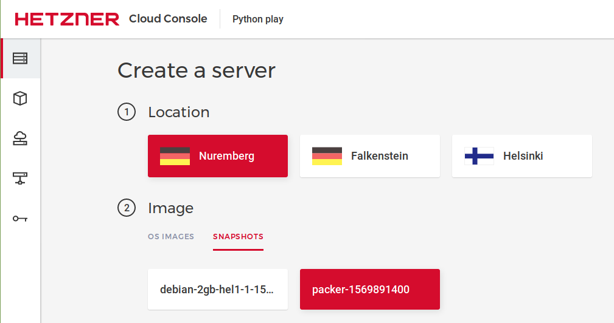

## Introduction

Security is a challenge to implement properly. This tutorial shows how to leverage [Hashicorp Packer](https://www.packer.io/), [Chef](https://www.chef.sh/) and [Inspec](https://www.inspec.io/) to create a snapshot of baseline Ubuntu 18.04 that adheres to the [DevSec Hardening Framework](https://dev-sec.io/) in Hetzner Cloud. This snapshot can be used to create new secured servers in Hetzner Cloud for your use.  

**Prerequisites**

To follow the steps in this tutorial, you will need the following:

* A basic understanding of Hetzner Cloud. You should know what a server and snapshot are and how they relate to each other.
* You should have an active Hetzner Cloud account and an API token generated on your Hetzner project.
* A local system where you can install Hashicorp Packer, Chef and Inspec. Some basic knowledge of these tools is useful but not essential as we will go through the tutorial step-by-step.
* You will also need access to Git so you can download files from GitHub.
* You should review https://community.hetzner.com/tutorials/howto-hcloud-cli if you don't have an understanding of Hetzner Cloud CLI.

This tutorial was written using an Ubuntu 16.04 system. If you are working on a different Linux variant or Windows, the details will differ but the basic steps are the same.

## Step 1 - Install Hashicorp Packer

First, [download](https://www.packer.io/downloads.html) the appropriate package for your system. Packer is provided as a zip file.

Unzip the downloaded package into a directory where Packer will be installed. On Linux, ~/packer or /usr/local/bin is generally good, depending on whether you want to restrict the install to just your user or install it system-wide. On Windows systems, you can put it wherever you'd like. The packer (or packer.exe for Windows) binary is all that is necessary to run Packer.

The final step to installation is to make sure the directory you installed Packer to is on the PATH.

To set the path on Linux, run the following:

`export PATH="$PATH:/usr/local/bin"`

or

`export PATH="$PATH:~/packer"`

depending on where you installed the application.

If you have updated your PATH, you should update your .profile or .bash_profile file with the updated PATH statement that you used. If you don't, Packer will no longer be in the path if you logout and back in.

Test your install by opening a command line and typing:

`packer --version`

If you get a version number returned, you have successfully installed Packer.

## Step 2 - Install Chef Workstation

First, [download](https://downloads.chef.io/chef-workstation/stable) the appropriate Chef Workstation files for your system. Chef Workstation contains both Chef Infra and Inspec that are used for this tutorial.

The Chef Workstation download will be in an installer format appropriate for the selected system. Install it as you would any .rpm or .deb on Linux or any .msi file on Windows.

Test your install by opening a command line and typing:

`chef --version`

If you get a result, you have successfully installed Chef Workstation.


## Step 3 - Git Packer Script and Chef Cookbooks

To create our secure snapshot, we are going to use Packer with the Inspec and Chef provisioners. We will use Chef to harden the default image to comply with the DevSec Linux Security Baseline. The DevSec Linux Security Baseline establishes some basic Linux hardening practices. These include attack surface reduction, secure configuration and core component configuration. Inspec tests the snapshot after it has been hardened to ensure that it conforms to the given security specification.

The necessary files to create the hardened server are available on GitHub. Download them by running the following command:

`
git clone https://github.com/rericsson/hcloud-ubuntu-snapshot.git
`

This will create a new directory under the current directory with the files. Let's take a look at the files to understand how this works.

The first file to look at is hcloud-ubuntu-snapshot.json. This is the Packer template file and it contains the definition of the build to be run on Hetzer Cloud to create the image.

```
{
  "variables": {
    "hcloud_token": "{{env `HCLOUD_TOKEN`}}"
  },
  "provisioners": [
    {
        "type": "chef-solo",
          "cookbook_paths": ["cookbooks"],
          "run_list": [
            "recipe[server::haveged]",
            "recipe[server::auditd]",
            "recipe[os-hardening::default]"
          ]
    },
    {
       "type": "inspec",
       "profile": "https://github.com/dev-sec/linux-baseline",
       "extra_arguments": ["--no-distinct-exit"]
    }
 ],

  "builders": [{
    "type": "hcloud",
    "token": "{{user `hcloud_token`}}",
    "image": "ubuntu-18.04",
    "location": "nbg1",
    "server_type": "cx11",
    "ssh_username": "root"
  }]
}
```

Briefly, the Packer template reads the environment variable HCLOUD_TOKEN and puts it in a local variable. The next section outlines the provisioners used to configure and validate the server. The chef-solo provisioner loads the Chef cookbooks and runs them to harden the server. The bulk of the work is done by the os-hardening cookbook which is from the Chef Supermarket. You can find more details about what it does at https://supermarket.chef.io/cookbooks/os-hardening.

The server cookbook is simple and configures a few items (haveged and auditd) that are required by the DevSec Linux Baseline but not covered by the os-hardening cookbook.

Before you do anything else, set an environment variable with your Hetzner API token so that Packer can access your account to create the snapshot. To do this, use the following command:

`
export HCLOUD_TOKEN=<your Hetzner API token>
`

Test the token by running the echo command to check the value:

`
echo $HCLOUD_TOKEN
`

You can make sure the Packer script is valid using the command:

```
packer validate example.json
```

You should see that the template validated successfully and you are ready to run it and create a snapshot.

## Step 4 - Create Hetzner Snapshot

After checking the validity of the template, you can run it to create the snapshot on Hetzner Cloud. Run the template with:

`
packer build example.json
`

While the template is running, you should see output that follows along with the steps being executed. An instance is created, then the Chef recipies are run to configure the instance and finally Inspec is called to verify the server configuration using the DevSec specification at https://github.com/dev-sec/linux-baseline.

After you have successfully run the Packer script, you will have a new snapshot created on Hetzner Cloud. The snapshot will have the name Packer followed by a sequence of digits. You should now be ready to create a new server.

## Step 5 - Start Server From Snapshot

Now, start a server from the snapshot. This can be done by creating a server in Hetzner Cloud and picking the snapshot you just created as the image.



After the snapshot has started, you can login using the method you specified on server creation (either password or SSH key) and use it as you would any Ubuntu 18.04 server with the confidence that it complies with the Dev Sec Baseline.

## Conclusion

There is more to secure computing practice than just hardening. You need to apply the latest patches, monitor the systems and proactively reduce vulnerabilities. After going through this tutorial, you now have an Ubuntu 18.04 snapshot in your Hetzner project that can be used to create servers that comply with the Dev Sec Linux Security Baseline. You can use this snapshot as the foundation for any Ubunutu 18.04 servers you create on Hetzner Cloud with the knowledge that the servers are hardened against attack and can serve as a starting point for secure computing practices.

##### License: MIT

<!--

Contributor's Certificate of Origin

By making a contribution to this project, I certify that:

(a) The contribution was created in whole or in part by me and I have
    the right to submit it under the license indicated in the file; or

(b) The contribution is based upon previous work that, to the best of my
    knowledge, is covered under an appropriate license and I have the
    right under that license to submit that work with modifications,
    whether created in whole or in part by me, under the same license
    (unless I am permitted to submit under a different license), as
    indicated in the file; or

(c) The contribution was provided directly to me by some other person
    who certified (a), (b) or (c) and I have not modified it.

(d) I understand and agree that this project and the contribution are
    public and that a record of the contribution (including all personal
    information I submit with it, including my sign-off) is maintained
    indefinitely and may be redistributed consistent with this project
    or the license(s) involved.

Signed-off-by: Rob Ericsson rob@l10systems.com

-->
