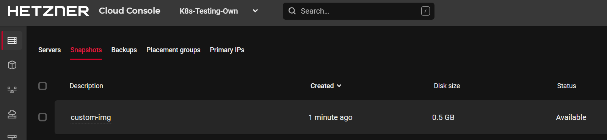

## Einführung

Hetzner Cloud bietet eine Reihe verschiedener Betriebssystem-Images, aus denen man bei der Erstellung einer neuen virtuellen Maschine wählen kann. Diese Images bilden die Basis, um eigene Dienste aufzubauen, sind aber selten bereits für die jeweiligen Anforderungen konfiguriert. Vielleicht möchten Sie eine Datenbank oder einen Webserver installieren, einen Wartungsbenutzer hinzufügen oder einfach die Systemeinstellungen optimieren, um die Leistung und Sicherheit zu verbessern. Es gibt zwar Tools, die dies automatisch für jede neue VM erledigen, aber dies kostet Zeit und ist nicht immer reproduzierbar. Wäre es nicht einfacher, ein eigenes, gut funktionierendes, persönliches konfiguriertes Betriebssystem-Image zu haben, das für jede neue VM verwendet werden kann?

Dieses kann mit HashiCorp Packer erreicht werden.

Dieser Artikel zeigt, wie Sie mit Packer eigene Images für Ihre Hetzner-VMs mit Infrastructure as Code (IaC) erstellen können. Es ermöglicht sogar die Erstellung von VMs mit Betriebssystemen, die nicht offiziell von Hetzner unterstützt werden.

**Voraussetzungen**

Um diesem Tutorial zu folgen, benötigen Sie:

 * Hetzner Cloud [API-Token](https://docs.hetzner.com/de/cloud/api/getting-started/generating-api-token) aus der Cloud-Konsole
 * Zugang zum Internet

## Schritt 1 - Installieren von Packer

Besuchen Sie [Hashicorp Packer](https://developer.hashicorp.com/packer/install) und installieren Sie Packer entsprechend Ihres Betriebssystems.  
Auf einem Debian-basierten Linux, muss folgendes ausgeführt werden:

```bash
> wget -O- https://apt.releases.hashicorp.com/gpg | sudo gpg --dearmor -o /usr/share/keyrings/hashicorp-archive-keyring.gpg
> echo "deb [signed-by=/usr/share/keyrings/hashicorp-archive-keyring.gpg] https://apt.releases.hashicorp.com $(lsb_release -cs) main" | sudo tee /etc/apt/sources.list.d/hashicorp.list
> sudo apt update && sudo apt install packer
```

> Sie können `packer --version` ausführen, um die Version anzuzeigen und zu prüfen, ob die Installation erfolgreich war.

## Schritt 2 - Erstellen eines benutzerdefinierten Images

Erstellen Sie einen Projektordner mit `mkdir my-hetzner-img` und wechseln Sie in das Verzeichnis.  
Ähnlich wie Terraform verwendet Packer Provider, um mit dem benötigten Build-System zu kommunizieren. Die Verwendung verschiedener Provider ermöglicht es Packer, eine große Auswahl an verschiedenen Zielsystemen anzubieten. Es ermöglicht Nutzern, Software- oder Betriebssystempakete für alle wichtigen Cloud-Anbieter, On-Prem-Systeme und sogar Docker-Images zu erstellen.  
Um einen Provider zu verwenden, erstellen Sie eine Datei namens `provider.pkr.hcl` und fügen Sie die Provider-Konfiguration hinzu:

```hcl
# packer.pkr.hcl
packer {
  required_plugins {
    hcloud = {
      source  = "github.com/hetznercloud/hcloud"
      version = ">= 1.2.0"
    }
  }
}
```

Packer verwendet die HashiCorp Konfigurationssprache (HCL), um den gewünschten Zustand zu deklarieren, genau wie Terraform.

Um ein personalisiertes, benutzerdefiniertes Image zu erstellen, benötigt Packer eine Basis, von der aus es startet. Diese wird als "source" bezeichnet:

```hcl
# custom-img-v1.pkr.hcl
source "hcloud" "base-amd64" {
  image         = "debian-12"
  location      = "nbg1"
  server_type   = "cx22"
  ssh_keys      = []
  user_data     = ""
  ssh_username  = "root"
  snapshot_name = "custom-img"
  snapshot_labels = {
    base    = "debian-12",
    version = "v1.0.0",
    name    = "custom-img"
  }
}
```

Damit wird Packer mitgeteilt, wo es beginnen soll. Im Fall von Hetzner muss Packer das Basis-Image, den Servertyp und den Standort der für die Erstellung verwendet werden soll, kennen. Außerdem werden der Name des Snapshots, welches erstellt wird, und die Tags, die auf dieses angewendet werden sollen, angegeben.

Der nächste Schritt besteht darin, die eigenen Anpassungen vorzunehmen. Damit ist der eigentliche Build-Schritt gemeint.

```hcl
# custom-img-v1.pkr.hcl
build {
  sources = ["source.hcloud.base-amd64"]
  provisioner "shell" {
    inline = [
      "apt-get update",
      "apt-get install -y wget fail2ban cowsay",
      "/usr/games/cowsay 'Hi Hetzner Cloud' > /etc/motd",
    ]
    env = {
      BUILDER = "packer"
    }
  }
}
```

Man verwendet die zuvor angegebene Quelle und gibt dann z.B den `shell`-Parameter an. Jede Zeile in `inline` wird dann auf dem Server ausgeführt. In diesem Fall wird `fail2ban` installiert, um den Server abzusichern und es wird eine kleine Meldung in die `motd`-Datei einfügt.

> **Hinweis**: Wenn Sie `packer build .` ausführen, wird Packer automatisch einen neuen Server und einen neuen Snapshot in Ihrem Hetzner Cloud Projekt erstellen. Beide sind kostenpflichtig. Der Server wird **automatisch** gelöscht, sobald entweder der Snapshot erstellt wurde oder die Erstellung fehlgeschlagen ist.

Um das Image zu erstellen, führen Sie die folgenden Befehle aus:

```bash
# Set your Hetzner API Token
> export HCLOUD_TOKEN="XXX"
# Initialize the project - only needed once
> packer init .
# Build
> packer build .
```

Jetzt baut Packer den angegebenen Server mit allen Anweisungen und überträgt alle Ausgaben auf das aktuelle Terminal. Überprüfen Sie, ob das neue Image in der [Cloud Console](https://console.hetzner.cloud/) verfügbar ist:



## Schritt 3 - Konfigurierbare Images

Wenn man alle Befehle in die HCL einträgt, kann es schnell unübersichtlich werden. Es ist auch nicht sinnvoll, den Code für jede Variante eines Images, das Sie erstellen möchten, zu kopieren und einzufügen. Um die Dinge allgemeiner zu gestalten, kann Packer Variablen verwenden:

```hcl
# custom-img-v2.pkr.hcl
variable "base_image" {
  type    = string
  default = "debian-12"
}
variable "output_name" {
  type    = string
  default = "snapshot"
}
variable "version" {
  type    = string
  default = "v1.0.0"
}
variable "user_data_path" {
  type    = string
  default = "cloud-init-default.yml"
}

source "hcloud" "base-amd64" {
  image         = var.base_image
  location      = "nbg1"
  server_type   = "cx22"
  ssh_keys      = []
  user_data     = file(var.user_data_path)
  ssh_username  = "root"
  snapshot_name = "${var.output_name}-${var.version}"
  snapshot_labels = {
    base    = var.base_image,
    version = var.version,
    name    = "${var.output_name}-${var.version}"
  }
}

build {
  sources = ["source.hcloud.base-amd64"]
  provisioner "shell" {
    scripts = [
      "os-setup.sh",
    ]
    env = {
      BUILDER = "packer"
    }
  }
}
```

Jetzt können wir das Basis-Image zur Laufzeit angeben und überschreiben, indem wir `packer build -var bas_image=ubuntu-22.04 -var version=v1.1.0 .` verwenden. Diese Version verwendet auch den `scrips`-Parameter, anstatt alle Befehle direkt anzugeben. Dies ermöglicht viel komplexere Setups. Außerdem wird auch [cloud-init](https://cloudinit.readthedocs.io/en/latest/) verwendet, um einige Einstellungen deklarativ zu konfigurieren.

Hetzner unterstützt auch [Arm64 basierte Server](https://www.hetzner.com/de/press-release/arm64-cloud), die ein hervorragendes Preis-Leistungs-Verhältnis und eine beeindruckende Effizienz bieten. Aufgrund der anderen Architektur von Arm muss die Software für diese Architektur kompiliert werden und alle Konfigurationen müssen auch für diese angewendet werden. Glücklicherweise erlaubt Packer die Wiederverwendung beliebiger Build-Skripte für Arm.

Fügen Sie einfach eine weitere "source" zu Ihrem Code hinzu und aktualisieren Sie den Build-Schritt, um diese Quelle einzubeziehen:

```hcl
# custom-img-v2.pkr.hcl
source "hcloud" "base-arm64" {
  image         = var.base_image
  location      = "nbg1"
  server_type   = "cax11"
  ssh_keys      = []
  user_data     = file(var.user_data_path)
  ssh_username  = "root"
  snapshot_name = "${var.output_name}-${var.version}"
  snapshot_labels = {
    base    = var.base_image,
    version = var.version,
    name    = "${var.output_name}-${var.version}"
  }
}
...
build {
-  sources = ["source.hcloud.base-amd64"]
+  sources = ["source.hcloud.base-amd64", "source.hcloud.base-arm64"]
  provisioner "shell" {
...
```

In dieser Version werden nun automatisch Images für Arm64-basierte Server erstellt.

## Schritt 4 - Tipps und fortgeschrittene Verwendung:

**Über die Festplattengröße:**<br>
Sie haben vielleicht bemerkt, dass der obige Code die kleinsten auf Hetzner verfügbaren Instanzen verwendet. Dies dient nicht nur der Kostenreduzierung, sondern ermöglicht auch, dass der erstellte Snapshot für jede VM eingesetzt werden kann. Aufgrund der Art und Weise, wie Festplatten bei Hetzner verwaltet werden, muss eine neue VM über eine Festplatte verfügen, die mindestens so groß ist wie diejenige, von der der Snapshot erstellt wurde. Die Verwendung eines Servers mit acht Kernen könnte etwas schneller sein als die Verwendung eines kleineren Servers, aber das würde die Server, die Sie mit diesem Image bereitstellen können, auf VMs mit mindestens 240 GB Festplatten beschränken.

**Über Tags:**<br>
Tags sind Metadaten, die einem Snapshot hinzufügt werden können. Sie sind nützlich, um Informationen über die Herkunft des Abbilds und dessen Verwendungszweck bereitzustellen. Außerdem sind Tags die einzige Möglichkeit, einen vorhandenen Snapshot in Terraform auszuwählen, um eine neue VM bereitzustellen. Sie sollten definitiv verwendet werden.

**Über cloud-init:**<br>
Sie können `cloud-init` verwenden, um einige frühe Einstellungen beim Erstellen von Images mit Packer vorzunehmen, aber Sie möchten `cloud-init` vielleicht auch verwenden, wenn Sie Ihr benutzerdefiniertes Image für eine neue VM verwenden. Standardmäßig wird `cloud-init` nur einmal ausgeführt, daher muss es zurückgesetzt werden.  
Fügen Sie die folgenden Zeilen in Ihr Bash-Skript ein, um auf die Fertigstellung von `cloud-init` zu warten und um es abschließend zurück zu setzen.

```bash
# os-setup.sh
#!/bin/bash
set -e -o pipefail

echo "Waiting for cloud-init to finish..."
cloud-init status --wait

echo "Installing packages..."
apt-get update
apt-get install --yes --no-install-recommends wget fail2ban

# My setup...

echo "Cleanup..."
cloud-init clean --machine-id --seed --logs
rm -rvf /var/lib/cloud/instances /etc/machine-id /var/lib/dbus/machine-id /var/log/cloud-init*
```

Dies ermöglicht es den Benutzern, `cloud-init` ein zweites Mal auszuführen.

**Verschiedene Betriebssysteme:**<br>
Sie können auch andere Betriebssysteme erstellen und booten und mit Packer eigene Images für diese erstellen. Durch Booten in den Hetzner-*rescue* Modus kann man die gesamte Disk einer VM überschreiben:

```hcl
build {
  sources = ["source.hcloud.myvm"]
  provisioner "shell" {
    inline = [
      "apt-get install -y wget",
      "wget https://github.com/siderolabs/talos/releases/download/v1.5.5/hcloud-amd64.raw.xz",
      "xz -d -c hcloud-amd64.raw.xz | dd of=/dev/sda && sync",
    ]
  }
}
```

Mein persönlicher Anwendungsfall für Packer ist die Erstellung vorkonfigurierter Kubernetes-Images mit fein abgestimmten Systemparametern und vorgeladenen Container-Images. Der horizontale Autoscaler kann diese Images verwenden, um neue Worker Nodes schnell und zuverlässig bereitzustellen. Aber es gibt noch viele andere Anwendungsfälle.


Weitere Informationen zur Konfiguration finden Sie in der [Packer Dokumentation](https://developer.hashicorp.com/packer/tutorials) und in der Dokumentation zum [Hetzner Packer-Builder](https://developer.hashicorp.com/packer/integrations/hetznercloud/hcloud/latest/components/builder/hcloud).  
Der gesamte Code, der in diesem Artikel verwendet wurde, ist auf [GitHub](https://gist.github.com/hegerdes/deb361b1383c76e9dabbe030c607ac51) zu finden.

## Ergebnis

Dieser Artikel gab eine umfassende Anleitung zur Installation und Verwendung von HashiCorp Packer. Er lieferte ein Basisprojekt, wie man Packer verwendet, um benutzerdefinierte Betriebssystem-Images für Hetzner Cloud VMs zu erstellen und dabei Infrastructure as Code Praktiken zu nutzen. Es wurde auch auf die fortgeschrittene Verwendung von Variablen und cloud-init eingegangen. Dieser Ansatz ermöglicht die Erstellung von maßgeschneiderten, vorkonfigurierten Betriebssystem-Images und bietet einen effizienteren und schlankeren Prozess für die Bereitstellung von VMs mit benutzerdefinierten Einstellungen und Anwendungen.

##### License: MIT

<!--

Contributor's Certificate of Origin

By making a contribution to this project, I certify that:

(a) The contribution was created in whole or in part by me and I have
    the right to submit it under the license indicated in the file; or

(b) The contribution is based upon previous work that, to the best of my
    knowledge, is covered under an appropriate license and I have the
    right under that license to submit that work with modifications,
    whether created in whole or in part by me, under the same license
    (unless I am permitted to submit under a different license), as
    indicated in the file; or

(c) The contribution was provided directly to me by some other person
    who certified (a), (b) or (c) and I have not modified it.

(d) I understand and agree that this project and the contribution are
    public and that a record of the contribution (including all personal
    information I submit with it, including my sign-off) is maintained
    indefinitely and may be redistributed consistent with this project
    or the license(s) involved.

Signed-off-by: hegerdes@outlook.de

-->
