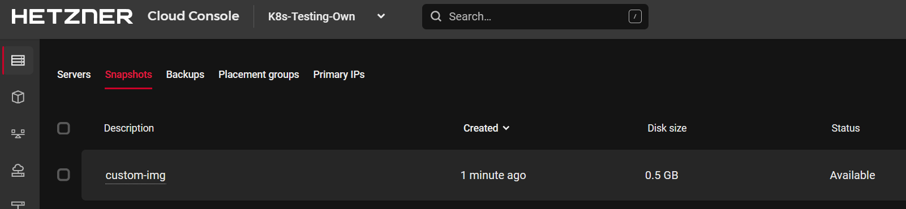
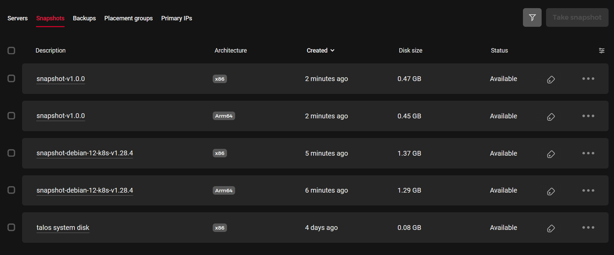

## Introduction

The Hetzner Cloud provides a number of different operating system images to select from when creating a new virtual machine. These images provide the basic ground to get started with your service, but they are rarely configured according to your specific needs. You may want a database to be installed or a web-server, want a maintenance user to be present, or just tweak system settings to improve performance and security.  While there are tools to do this automatically for every new VM, this takes time and may not always be reproducible. Wouldn't it be easier to have your own known good personal pre-configured OS image that can be used for every new VM?

This can be archived with HashiCorp Packer.  

This article demonstrates how to use Packer to create custom images for your Hetzner VMs using Infrastructure as Code (IaC). It even allows users to create VMs with operating systems that are not officially supported by Hetzner.

**Prerequisites**

To follow this tutorial you need:

* Hetzner Cloud [API token](https://docs.hetzner.com/cloud/api/getting-started/generating-api-token) in the [Cloud Console](https://console.hetzner.cloud/)
* A computer with internet access

## Installing Packer
Visit [Hashicorp Packer](https://developer.hashicorp.com/packer/install) and install Packer according to your OS.  
On Debian based Linux, do:
```bash
> wget -O- https://apt.releases.hashicorp.com/gpg | sudo gpg --dearmor -o /usr/share/keyrings/hashicorp-archive-keyring.gpg
> echo "deb [signed-by=/usr/share/keyrings/hashicorp-archive-keyring.gpg] https://apt.releases.hashicorp.com $(lsb_release -cs) main" | sudo tee /etc/apt/sources.list.d/hashicorp.list
> sudo apt update && sudo apt install packer
```

## Creating a custom image
Create a project folder with `mkdir my-hetzner-img` and enter the folder.  
Similar to Terraform, Packer uses providers to communicate with the needed build system. The usage of different providers allows Packer to offer a vast verity of different target systems. It allows users to create software or OS packages for all major cloud providers, on-prem systems and even Docker images.  
To use a provider, create a file called `provider.pkr.hcl` and add the provider config:
```hcl
# packer.pkr.hcl
packer {
  required_plugins {
    hcloud = {
      source  = "github.com/hetznercloud/hcloud"
      version = ">= 1.2.0"
    }
  }
}
```

Packer uses the HashiCorp configuration language (HCL) for declaring the desired state, just like Terraform.

To create a personalized custom image, Packer needs a base form where it starts from. This is called the `source`:

```hcl
# custom-img-v1.pkr.hcl
source "hcloud" "base-amd64" {
  image         = "debian-12"
  location      = "nbg1"
  server_type   = "cx11"
  ssh_keys      = []
  user_data     = ""
  ssh_username  = "root"
  snapshot_name = "custom-img"
  snapshot_labels = {
    base    = "debian-12",
    version = "v1.0.0",
    name    = "custom-img"
  }
}
```

This tells Packer where to start. In the case of Hetzner, Packer needs to know the base image, the server type to use for building, and the location of that server. It also specifies the output name of the snapshot to create and the tags that should be applied to that server.

The next step is to provide your customization. Meaning the actual build step.

```hcl
# custom-img-v1.pkr.hcl
build {
  sources = ["source.hcloud.base-amd64"]
  provisioner "shell" {
    inline = [
      "apt-get update",
      "apt-get install -y wget fail2ban cowsay",
      "/usr/games/cowsay 'Hi Hetzner Cloud' > /etc/motd",
    ]
    env = {
      BUILDER = "packer"
    }
  }
}
```

It uses the source specified before and specifies a `shell` provisioner. Every line in `inline` will be executed on that server. In this case, it installs `fail2ban` to harden the server by slowing down the 1000s of SSH login attacks that happen regularly and adding a little message to the `motd` file.

To create that image run the following commands:
```bash
# Set your Hetzner API Token
> export HCLOUD_TOKEN="XXX"
# Initialize the project - only needed once
> packer init .
> packer build .
```

Now Packer builds that server and streams all the logs to your current terminal. Verify the new image in the Hetzer Web UI:



## Taking it to the next level
Putting all commands in HCL can quickly get crowded. It is also not reasonable to copy-past the code for every variant of an images you might want to build. To make things more generic Packer can use variables:
```hcl
# custom-img-v2.pkr.hcl
variable "base_image" {
  type    = string
  default = "debian-12"
}
variable "output_name" {
  type    = string
  default = "snapshot"
}
variable "version" {
  type    = string
  default = "v1.0.0"
}
variable "user_data_path" {
  type    = string
  default = "cloud-init-default.yml"
}

source "hcloud" "base-amd64" {
  image         = var.base_image
  location      = "nbg1"
  server_type   = "cx11"
  ssh_keys      = []
  user_data     = file(var.user_data_path)
  ssh_username  = "root"
  snapshot_name = "${var.output_name}-${var.version}"
  snapshot_labels = {
    base    = var.base_image,
    version = var.version,
    name    = "${var.output_name}-${var.version}"
  }
}

build {
  sources = ["source.hcloud.base-amd64"]
  provisioner "shell" {
    scripts = [
      "os-setup.sh",
    ]
    env = {
      BUILDER = "packer"
    }
  }
}
```

Now, we can specify and override the base image at runtime by using `packer build -var bas_image=ubuntu-22.04 -var version=v1.1.0 .`. This version also uses the `scripts` parameter rather than in-lining all the commands. This allows for much more complex setups. It also uses [cloud-init](https://cloudinit.readthedocs.io/en/latest/) to configure some settings declarativle.

Since the second half of 2023, Hetzner also supports [ARM Servers](https://www.hetzner.com/press-release/arm64-cloud) which offer a great price-to-performance ratio and impressive efficacy. Due to the different nature of ARM, software needs to be compiled for this architecture and all configurations also need to be applied for this architecture. Fortunately, Packer allows to reuse any build scripts also for ARM.

Just add another source to your code and update the build step to include that source:
```hcl
# custom-img-v2.pkr.hcl
source "hcloud" "base-arm64" {
  image         = var.base_image
  location      = "nbg1"
  server_type   = "cax11"
  ssh_keys      = []
  user_data     = file(var.user_data_path)
  ssh_username  = "root"
  snapshot_name = "${var.output_name}-${var.version}"
  snapshot_labels = {
    base    = var.base_image,
    version = var.version,
    name    = "${var.output_name}-${var.version}"
  }
}
...
build {
-  sources = ["source.hcloud.base-amd64"]
+  sources = ["source.hcloud.base-amd64", "source.hcloud.base-arm64"]
  provisioner "shell" {
...
```

This version now automatically builds images for ARM servers.

## Tips and advanced usage:
**About disk size:**
You may have noticed that the code above uses the smallest instances available on Hetzner. This is not only to reduce cost but also allows for the created snapshot to be deployed for every VM. Due to the way disks are managed at Hetzner, a new VM must have a disk that is at least the same size as the one where the snapshot was created. So using an eight-core server might be a little faster rather than using a smaller one, but it would limit the amount of servers that can be deployed form this image to VMs with at least 240GB disks.

**About Tags:**
Tags are metadata that can be added to a snapshot. These are useful to provide information about the origin of an image and what it is used for. Also tags are the only way to select an existing snapshot image in Terraform to deploy a new VM. They should definitely be used.

**About cloud-init:**
You can use `cloud-init` to do some early setup while building images with Packer, but maybe you also want to use `cloud-init` when deploying your custom image. But by default, `cloud-init` only runs once. So it needs to be reset.  
Consider adding the following lines to your bash script to wait and reset `cloud-init`.
```bash
# os-setup.sh
#!/bin/bash
set -e -o pipefail

echo "waiting for cloud-init to finish..."
cloud-init status --wait

echo "installing packages..."
apt-get update
apt-get install --yes --no-install-recommends wget fail2ban

# My setup...

echo "cleanup..."
cloud-init clean --machine-id --seed --logs
rm -rvf /var/lib/cloud/instances /etc/machine-id /var/lib/dbus/machine-id /var/log/cloud-init*
```

This allows users to run `cloud-init` a second time.

**Different operating systems:**
You can create and boot completely different operating systems and create your own images for them using Packer. By booting into Hetzner's *rescue*  mode, you can override the entire disk image of a VM:
```hcl
build {
  sources = ["source.hcloud.myvm"]
  provisioner "shell" {
    inline = [
      "apt-get install -y wget",
      "wget https://github.com/siderolabs/talos/releases/download/v1.5.5/hcloud-amd64.raw.xz",
      "xz -d -c hcloud-amd64.raw.xz | dd of=/dev/sda && sync",
    ]
  }
}
```
My personal use case for Packer is to create preconfigured Kubernetes images with fine tuned system parameters and preloaded container images. These images can be consumed by the vertical autoscaler to provision new worker nodes fast and reliable. But there are plenty of other use cases.




For further configuration look at the [Packer documentation](https://developer.hashicorp.com/packer/tutorials) and the [Hetzner Packer builder documentation](https://developer.hashicorp.com/packer/integrations/hetznercloud/hcloud/latest/components/builder/hcloud).  
The entire code can be found used in this article can be found on [GitHub](https://gist.github.com/hegerdes/deb361b1383c76e9dabbe030c607ac51).


## Conclusion

A short conclusion summarizing what the user has done, and maybe suggesting different courses of action they can now take.

##### License: MIT

<!--

Contributor's Certificate of Origin

By making a contribution to this project, I certify that:

(a) The contribution was created in whole or in part by me and I have
    the right to submit it under the license indicated in the file; or

(b) The contribution is based upon previous work that, to the best of my
    knowledge, is covered under an appropriate license and I have the
    right under that license to submit that work with modifications,
    whether created in whole or in part by me, under the same license
    (unless I am permitted to submit under a different license), as
    indicated in the file; or

(c) The contribution was provided directly to me by some other person
    who certified (a), (b) or (c) and I have not modified it.

(d) I understand and agree that this project and the contribution are
    public and that a record of the contribution (including all personal
    information I submit with it, including my sign-off) is maintained
    indefinitely and may be redistributed consistent with this project
    or the license(s) involved.

Signed-off-by: [submitter's name and email address here]

-->
