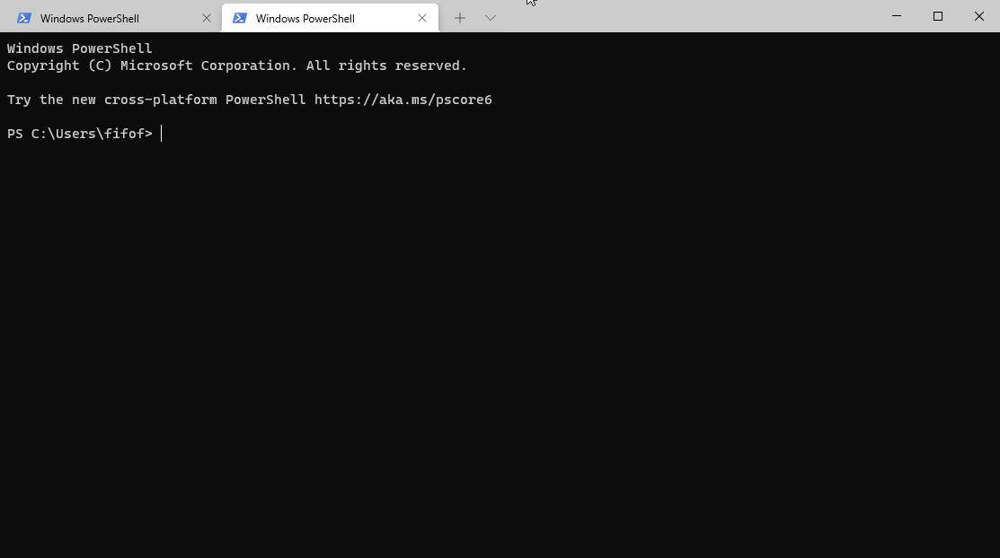
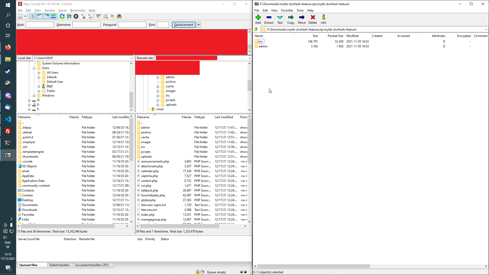

## Introduction

We will be installing [Mybb](https://mybb.com/), which is an open-source software made for running a forums board, from complete beginning, even helping you setting up the server and your [DNS](https://en.wikipedia.org/wiki/Domain_Name_System) records and nameservers. This means there are almost no prerequisites, other than having internet access and a terminal that can [SSH](https://en.wikipedia.org/wiki/Secure_Shell) into a remote server. Usually your included terminal with your OS (operating system) will do fine. For example Konsole on KDE Linux, Windows Terminal on Windows or Terminal on Apple devices.

**Prerequisites**

* Hetzner account and your preferred payment method added, very preferred will be navigating it, creating a server, and basic knowledge of the options
* Get friendly with your [domain name registrar](https://en.wikipedia.org/wiki/Domain_name_registrar) dashboard
* Terminal that can use SSH
* FTP client, like FileZilla
* Not needed, but preferred is setting up your own SSH key, for example with [this tutorial](https://community.hetzner.com/tutorials/howto-ssh-key)

What should you know before we start:

* Username: `root` (Your user, root is default)
* Hostname: `<your_host>`
* Domain: `<example.com>`
* Subdomain: `<sub.example.com>`
* IPv4 of your server: `192.0.2.1` (This is the standard IP address for your VPS)

## Step 1 - Renting a server at Hetzner (Skip if you already have a server)

### Choosing a project


Choose a Hetzner project or create a new one in your [Cloud dashboard](https://console.hetzner.cloud/projects)

### Entering server setup


Then, click on "ADD SERVER" in the top-right corner.

### Choosing a location


You have to choose a location. You can choose any location, but some of them might not offer certain types of servers. The preferred one should be the closest one to a location where most of your future clients will be. Usually closest one to you. The closer the server is to people using it, the better latency they get, however, this will not be a problem in hosting a MyBB board.

### Choosing the operating system

"Image" is basically the operating system that will be installed on your server. I will go for Ubuntu 20.04. That is the current long time supported version. If you are reading this and your newest available is different, choose that one. If you want to choose any other OS and still install Cyberpanel with Openlightspeed, make sure your OS is supported by them. Currently supported images are:

* Centos 7.x
* Centos 8.x
* Ubuntu 18.04
* Ubuntu 20.04
* AlmaLinux 8

### Selecting a type of the server


If you are a Hetzner user, you probably know what the difference is, if not, it is explained well under the title of the option.
I will be setting up a VPS (standard), just because that is more than enough for a Forums board with not that much of a traffic.
You also need to choose how powerful your server will be. I chose the lowest option, since I do not need a powerful machine and even the cheapest one can handle our forums board well. If you think you will have a lot of traffic, host something alongside your website or need a larger storage choose a stronger one.

### Other settings


These last options are usually fin
 left on default options, however, if you for example want to setup a SSH key from the linked tutorial, your might look differently. These are explained if you hover over the "?" label just next right to the title of the option.

## Step 2 - Connecting to your server and installing CyberPanel

I am currently on Windows 10, however I have several Linux machines with Kubuntu so if you are interested, I can update this step later, however I think GNU users are usually know how to SSH into a remote server.

### SSH client and the connection to your server (Skip this, if you know how to SSH into your server)




Prepare your SSH client (Terminal, Putty, whatever you chose earlier.). I chose Windows Terminal. It already supports SSH, so it is all I need for connecting to my server. Grab your IPv4 from the Hetzner cloud dashboard or if you did not setup a SSH key, look at the e-mail delivered to you, your password will also be there. Make sure you know your SSH password. The command for SSH is `ssh user@host`. It can have many more parameters, but we will not use any, unless you are using a SSH key or know what you are doing.


Write `ssh root@youripv4` and press enter. You will be asked for your password, so paste or write it there and press enter again. If you are using a password that was generated for you for the first time, you will be asked to change it, so enter it again and write your new one twice.
If there is no error displayed, we have successfully gained access to our server.

### Installing CyberPanel

Write:
```sh <(curl https://cyberpanel.net/install.sh || wget -O - https://cyberpanel.net/install.sh)```
This is a command that first downloads install.sh from cyberpanel.net and then runs it after it has been downloaded. After few seconds, you will be greeted with this message.

```
CyberPanel installer Vx.x.x
1. Install
2. Exit
```

If you see this message, everything is OK. Just write 1 - install it.

```
CyberPanel Installer v2.1.2

RAM check : 184/981MB (18.76%)

Disk check : 7/30GB (27%) (Minimal 10GB free space)

1. Install CyberPanel with OpenLiteSpeed.

2. Install Cyberpanel with LiteSpeed Enterprise.

3. Exit.


  Please enter the number[1-3]:
```

Choose OpenLiteSpeed (option 1)

Next steps are basically going to be easy, as we just choose the default settings provided to us, by clicking RETURN (or ENTER).
`Full installation` - press ENTER
`Remote Mysql` - ENTER (No)
`Version` - Enter (latest)

Then the installer script will ask you how would you like to setup a password, set, random or default. Just choose whatever like, but I would advise against using the default one.

`Memcached` - Yes (ENTER)
`Redis` - Yes
`Watchdog`- Yes

Wait for a few minutes, it will take roughly 8-10 minutes on the VPS.
After it installs, it will print out all the info you need for using CyberPanel, just copy it from your terminal into a safe space on your storage. There is your password there. If you close it by accident and you chose a random password, it is located in `/usr/local/CyberCP/plogical/adminPass.py`. You can either SSH to it, or use SFTP.

### Accessing CyberPanel with your IPv4


From the file you saved by copying your credentials, copy the http://<youripv4>:8090 address into your browser. You might get a SSL warning if you copied it with HTTPS instead, but that is totally fine, you can still access it, just ignore the warning and continue.

Now, login with your credentials, the default username is admin.


This is how everything looks when you login. This will be your dashboard.

### Setting up DNS


I will be using Hetzner DNS for this, but you can use any service you want (probably HETZNER DNS, your domain name registrar DNS' service or host your own nameservers).
Switch from your cloud dashboard to DNS dashboard (top-right corner, 9 squares button) and add a new DNS zone. Please read through the HETZNER's [get started with DNS guide](https://docs.hetzner.com/dns-console). You do not have to go really into detail.
Write your domain where it asks you to and proceed to the "Name server" tab. Here you find 3 domains. Copy everyone of them, each at a time to your domain name registar's dashboard. I am using Namecheap.


Namecheap has this settings located in Account -> Dashboard -> Domain List -> Manage -> Domain -> Nameservers -> Custom DNS -> Add the fist 2 nameservers -> ADD NAMESERVER -> Add the third one -> Save.

Changing your nameservers can take from few seconds, to few hours, however some users experience even 24-48 hour delays. Do not worry. You can check if it is done by using [whatsmydns.net](https://www.whatsmydns.net/), writing your domain and changing the A record to NS record, which stands for nameserver.

#### A records


While this is taking effect, go back to the HETZNER DNS dashboard and switch to "records". Your records will probably be empty. In the "Create Record" section of the site, choose A record and set the name to @ (root). Value should be your IPv4 of your VPS, if you click, HETZNER will show the IP address of all your instances, so just click the corresponding one. Leave the TTL on default. This is the setting which affects how quickly will DNS changes take effect, however changing it now will not do anything, you would have to do it few hours before making the change.


After adding the first A record, add these next ones. What A records do, as you read in the HETZNER guide is connect your domain name to your IPv4. Whenever you write your domain name, for example domain.com, it will get translated to your IPv4, but your browser will still show the domain name.

#### CNAME records


CNAME records on the other hand are only aliases for your domain. Create one with a name of "www.yourdomain.tld." and set the value to "yourdomain.tld". You can do this step reversed, that means setting the A record with the name "www.yourdomain.tld" and making an alias, CNAME record, from "yourdomain.tld." to "www.yourdomain.tld". This is just your prefference. You can also add 2 A records, one with the WWWW, one without and not have any CNAME records.

Now, if you go to "www.yourdomain.tld" you will see your browser shows "yourdomain.tld" as it redirected you to the alias.

#### MX records (or e-mail records)


If you want to send and receive e-mails in the future, set a root (@) record to "mail.yourdomain.tld." The lower the priority, the higher it is in fact. (lower number = high priority). 10 is default in HETZNER I think, if you have just one MX record, it will work fine.

You might also want to setup some TXT records for your e-mail. This will be provided by Cyberpanel when you are going to set it up.

## Step 3 - Adding a new site to Cyberpanel, setting up your SSL by Let's Encrypt

In your CyberPanel, visit "Websites" and go to "Create website". Select the default package, set the owner to admin, set the domain name to your domain (without the www), input your e-mail (a personal one probably), the PHP version officially supported is 7.3, but I found no issues running 7.4. Check all the options available and click on Create.


After it is created, go to SSL on the left panel, choose Hostname SSL, select your website and Issue a [SSL](https://cs.wikipedia.org/wiki/Secure_Sockets_Layer) certificate for it.

## Step 4 - Creating a database and connecting to FTP with FileZilla


On the left panel in Cyberpanel, go to databases and switch to PHPMyadmin. In PHPMyadmin you can easily manage all of your databases. In the top left corner, click on "New", choose a name and crate it. You can leave the utf8_general_ci as is. Your settings should look like this:


Now open FileZilla, and in the four fields you see, input your details. The host is either your hostname, or your IPv4 address, the user is root and with the password we set up earlier and port 22, you can connect. You will be located in the "root" directory of your server, double click on the 3 dots to go one level up and you should be now in the main directory of the server. Go to home and this is where Cyberpanel sets up all of your websites. Go to the one you set up earlier (yourdomain.tld) and visit the public_html subdirectory.


## Step 5 - Installing MyBB software


Visit the MyBB website and go to the [Downloads page](https://mybb.com/download/). Download MyBB. It should be a zipped file. Inside it, there are 2 folders. For a more in-depth tutorial on installing and possibly even setting-up, please read the documentation provided. Now open up the Upload folder. You see a lot of subdirectories and files. Take all of these files and copy them.

Now return to your FileZilla where you have the public_html of your website opened. Delete the index.html file inside it and paste all the files you have copied from the MyBB downloaded zip. If it asks you to replace any files, replace them. Now you can visit your website on yourdomain.tld (without the 8090 port). You should be located on a MyBB installation page.


Click next, read the License agreement and continue. Now to the requirements check. You might see some errors and you will need to make some folders or files writeable. Follow [this link](https://docs.mybb.com/1.8/administration/security/file-permissions/) for a good guide on how to change perms. You can do it very easily via SSH. Just use the `cd` command to navigate into your website folder (`cd /home/yourdomain.tld/yourdomain.tld`). Then you can use the chmod command to change the permissions manually, or use filezilla, right click the files, go to their permissions and change it there. You might to rename the `config_default.php` to `config.php`.

When you set everything correctly, they all should turn green:


On the next slide we need to link our database to MyBB. Leave the hostname as localhost and set the username to root. Then input your password you set before. You can create a new user if you go to "User Accounts", "Add user account" and set the all Global privileges to it.


For the Database name, use the name of the database we created, I used test_db there. You can use any prefix that you want, but staying the default "mybb_" will be easier when following some guides in the future.


Now make sure all the database tables have been created successfully. Click Next, next and then Next again.
Setting up the name and Forums info is easy. This is where you change everything to your needs.

Forum name will be the title of the website, Forum URL should be autocompleted just fine and correctly. It should be the address you have in your browser, minus the trailing slash and the stuff after it.

Also change your Website name and your contact e-mail if you need. That one was imported from the website setup on cyberpanel.

You will be prompted to create yourself an account. This will be an account you will use for logging into your site.
Choose a strong password, so nobody can infiltrate your website and possibly ruin your site. You can use the same e-mail as you did for contacting the website, or use your personal one.


We now have successfully installed MyBB on our website.


**Now go, and delete /install/ directory from your website, using your FTP client or SSH!**


## Step 6 - Installing DvzHash (Optional)

MyBB for some reason still uses MD5 encryption which you totally should not use. We should therefore install a plugin that will use something much stronger, for example DvzHash. Visit their GitHub [here](https://github.com/dvz/mybb-dvzHash). Download it as a zip



Move these files into your directory, where you have MyBB installed.


Go to your admin panel, login with your account and go to configuration -> plugins. Install DVZHASH. You might also need to install some needed libraries. After that go to configuration -> settings.


Scroll down and click on "DVZ Hash" and use some other encryption algorithm than mybb. Enable "Update on the fly" and save the settings. Now logout from both the admin panel and your site. Login back in. Your password is now updated. Go back to the plugin settings and disable "Update on the fly" again. All the new passwords will be encrypted using the selected method.

## Conclusion

Thank you for following my tutorial. While reading this, you should already be happy with your MyBB installation. Now you just have to learn how themes, templates, and managing a forum works. There are tons of great resources on the official MyBB website and their own forums. I would also totally suggest you to grab some more skills with SSH, linux commands and cyberpanel. The free version of cyberpanel includes a lot of features you might want to use. Get creative with your DNS records, maybe try cloudflare. There is a lot you can do now.

##### License: MIT

<!--

Contributor's Certificate of Origin

By making a contribution to this project, I certify that:

(a) The contribution was created in whole or in part by me and I have
    the right to submit it under the license indicated in the file; or

(b) The contribution is based upon previous work that, to the best of my
    knowledge, is covered under an appropriate license and I have the
    right under that license to submit that work with modifications,
    whether created in whole or in part by me, under the same license
    (unless I am permitted to submit under a different license), as
    indicated in the file; or

(c) The contribution was provided directly to me by some other person
    who certified (a), (b) or (c) and I have not modified it.

(d) I understand and agree that this project and the contribution are
    public and that a record of the contribution (including all personal
    information I submit with it, including my sign-off) is maintained
    indefinitely and may be redistributed consistent with this project
    or the license(s) involved.

Signed-off-by: Filip Furár filip.f2261@gmail.com

-->
