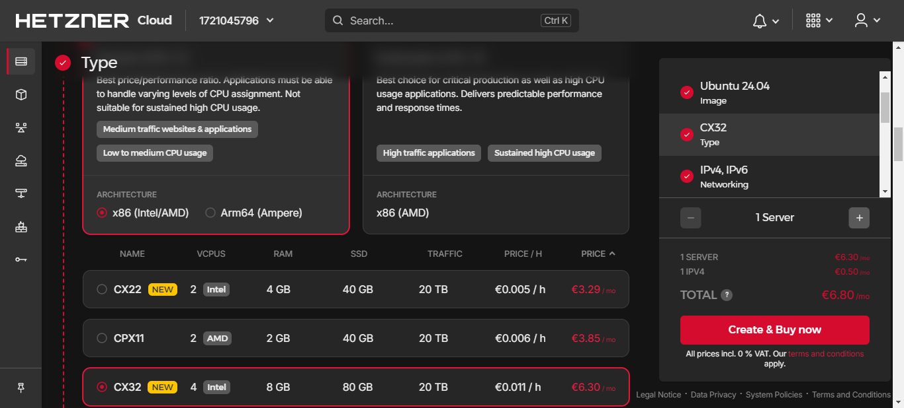
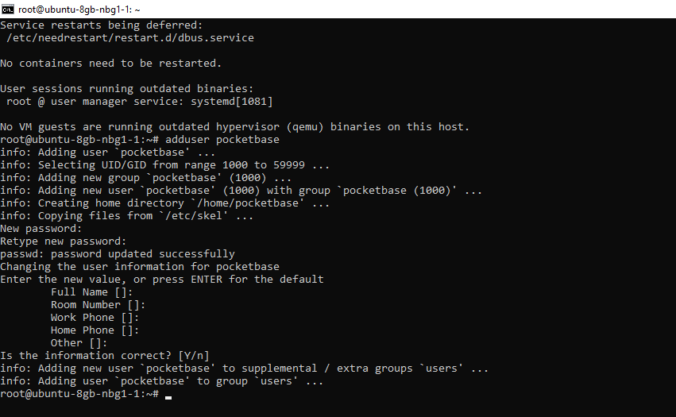
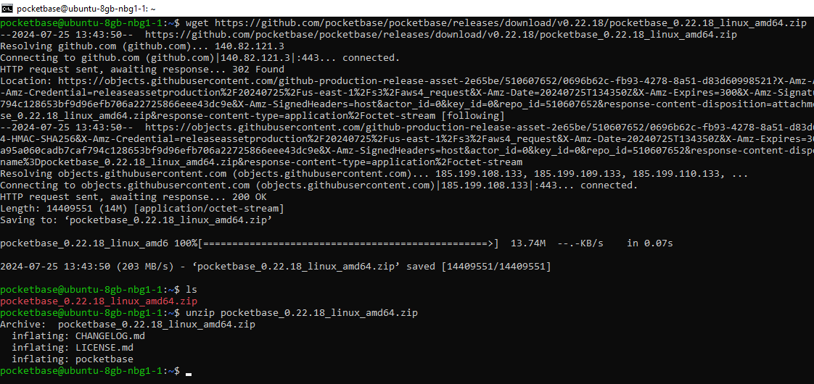
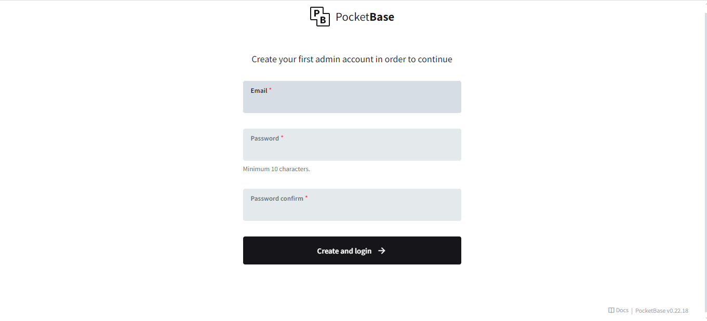

## Introduction

PocketBase is a powerful and flexible backend solution that offers real-time data synchronization, built-in authentication, and a robust API, making it an excellent choice for various applications. This tutorial provides a detailed, step-by-step guide to help you navigate through the deployment process. Whether you are a seasoned developer or just getting started, this guide will equip you with the knowledge and tools necessary to deploy a reliable and scalable PocketBase instance for your application.

**Prerequisites**

Before you begin, ensure you have the following:

* A Hetzner Account: [Sign up](https://accounts.hetzner.com/signUp) at Hetzner.
* Basic Knowledge of Linux Command Line.

## Step 1 - Deploy a New Server

Log in to the [Hetzner Cloud Console](https://console.hetzner.cloud).

Create a new project if needed.

Click on "Add Server" and choose the server type (CX22 or higher recommended).

**Note**: If you are comfortable with using ARM64 architecture, you can choose ARM64 instances to get better performance for the same price compared to traditional x86 instances.

Choose a data center location.

Select the image (Ubuntu 24.04 LTS is highly recommended).



Configure server specs and SSH keys.

Click "Create & Buy Now".

## Step 2 - Connect to Your Server

Use an SSH client (PuTTY or Terminal) to connect:

```console
ssh root@<your_server_ip>
```

## Step 3 - Prepare Your Server

Start by updating your server with the following commands:

```console
apt update && apt upgrade -y && apt install -y unzip
```

Next, create a user for PocketBase with this command:

```console
adduser pocketbase
```

You'll be prompted to enter a secure [password](https://www.random.org/passwords). Follow the on-screen instructions to complete the setup.



Now, switch to the new user by running:

```console
su - pocketbase
```

## Step 4 - Download PocketBase

Visit the [PocketBase releases page](https://github.com/pocketbase/pocketbase/releases) and select the latest release. Choose the appropriate build for your instance - either linux_amd64 or linux_arm64. Copy the download URL, and use wget to download the file.

```console
wget <url>
```

To unzip the downloaded archive, use the following command:

```console
unzip <filename>
```

**Tip**: If you need to check the filename, you can list the files in the directory with:

```console
ls
```



## Step 5 - Configure and Create a Service

First, switch back to the root user by running:

```console
exit
```

To enable the binary to bind to ports below 1024, use the following command:

```console
setcap CAP_NET_BIND_SERVICE=+eip /home/pocketbase/pocketbase
```

To create a systemd service, use the following command:

```console
bash -c 'cat <<EOF > /etc/systemd/system/pocketbase.service
[Unit]
Description=PocketBase
After=network-online.target

[Service]
User=pocketbase
WorkingDirectory=/home/pocketbase
ExecStart=/home/pocketbase/pocketbase serve --http=0.0.0.0:80
Restart=always
RestartSec=5

[Install]
WantedBy=multi-user.target
EOF
systemctl daemon-reload
systemctl enable pocketbase.service
systemctl restart pocketbase.service'
```

## Step 6 - Set Up an Admin Account

Open `<your_server_ip>/_` in your browser, and you will see the following screen:



Enter your email and [password](https://www.random.org/passwords) in the respective fields.

Then, click **Create and Login**.

## Conclusion

Congratulations! You've successfully deployed and configured PocketBase on your server.

For further customization and advanced features, refer to the [PocketBase documentation](https://pocketbase.io/docs). If you encounter any issues or have questions, the PocketBase community and support resources are available to help.

Thank you for using this guide, and best of luck with your PocketBase deployment!

##### License: MIT

<!--

Contributor's Certificate of Origin

By making a contribution to this project, I certify that:

(a) The contribution was created in whole or in part by me and I have
    the right to submit it under the license indicated in the file; or

(b) The contribution is based upon previous work that, to the best of my
    knowledge, is covered under an appropriate license and I have the
    right under that license to submit that work with modifications,
    whether created in whole or in part by me, under the same license
    (unless I am permitted to submit under a different license), as
    indicated in the file; or

(c) The contribution was provided directly to me by some other person
    who certified (a), (b) or (c) and I have not modified it.

(d) I understand and agree that this project and the contribution are
    public and that a record of the contribution (including all personal
    information I submit with it, including my sign-off) is maintained
    indefinitely and may be redistributed consistent with this project
    or the license(s) involved.

Signed-off-by: Illia Shmelov <shmelevilia@gmail.com>

-->