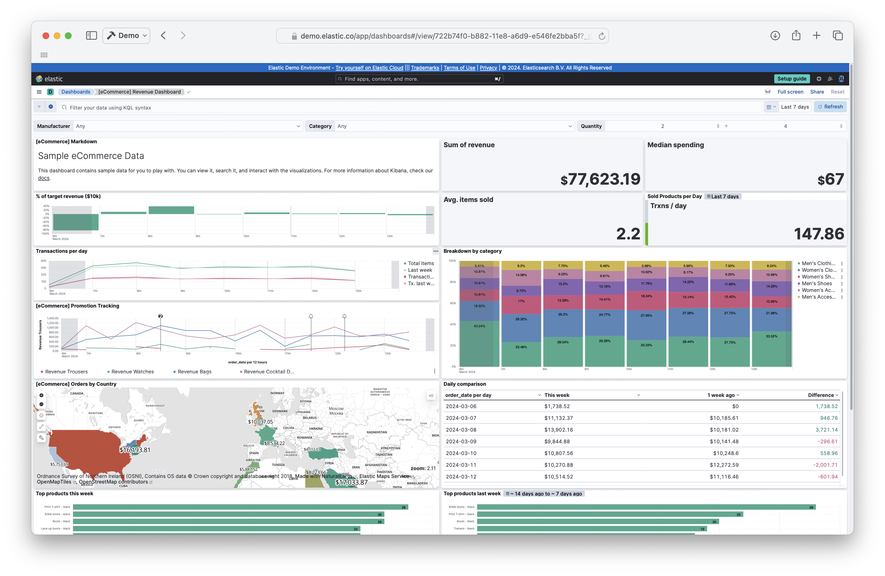
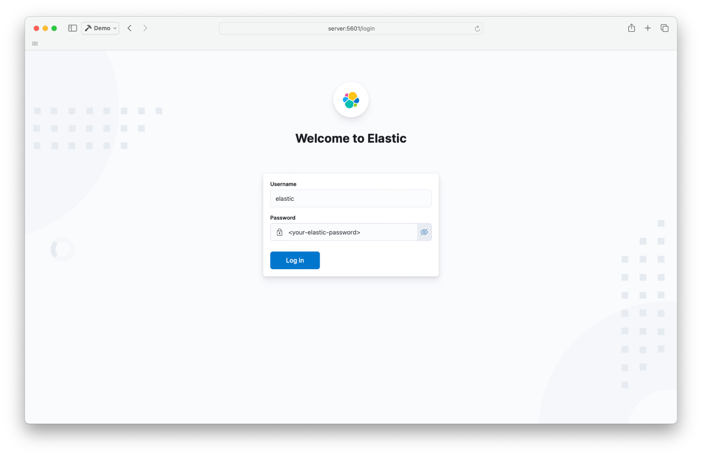
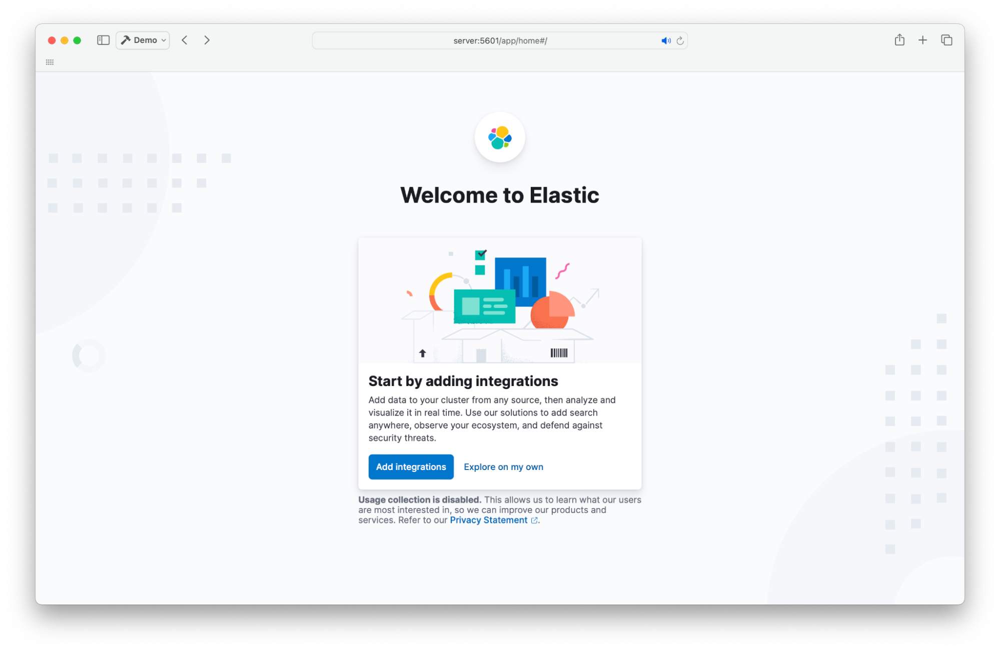
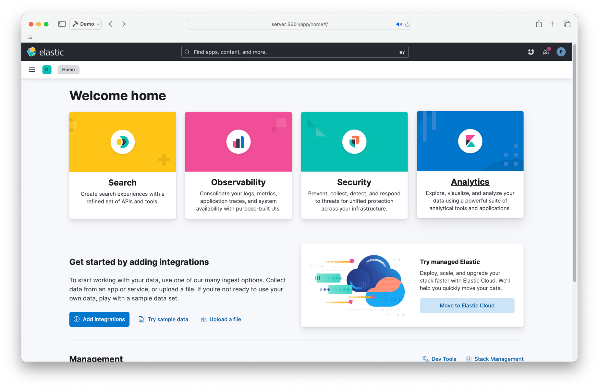
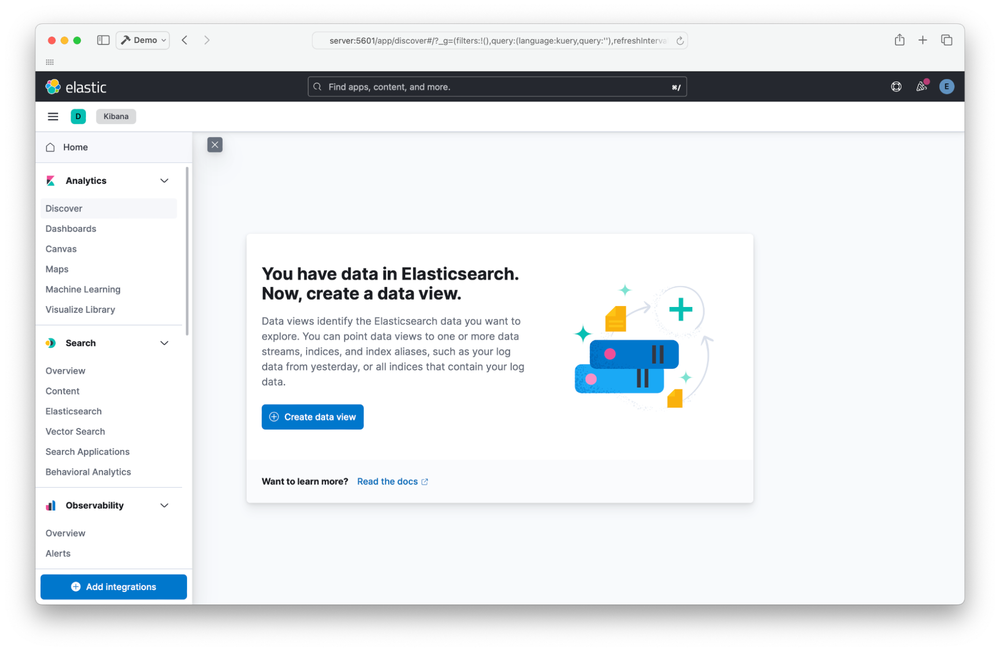
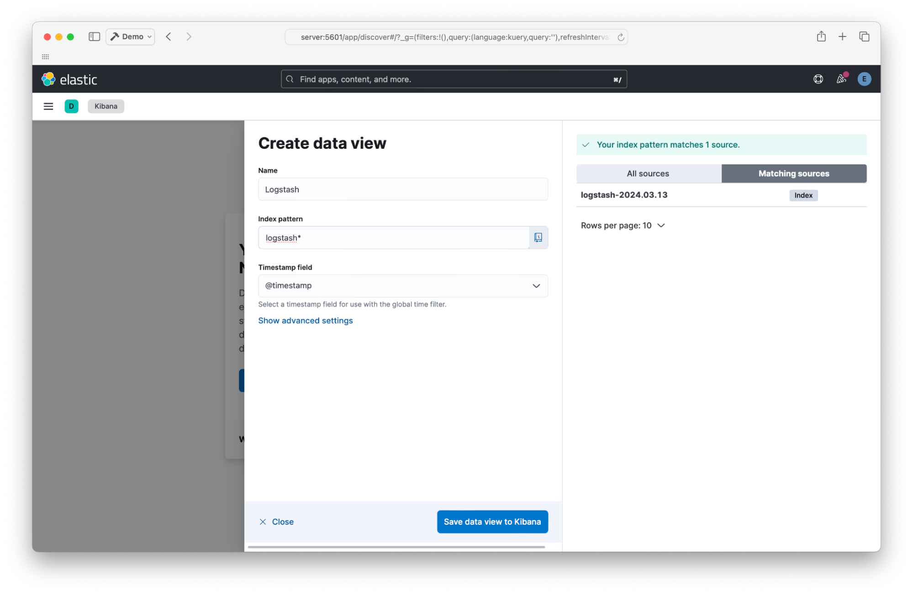
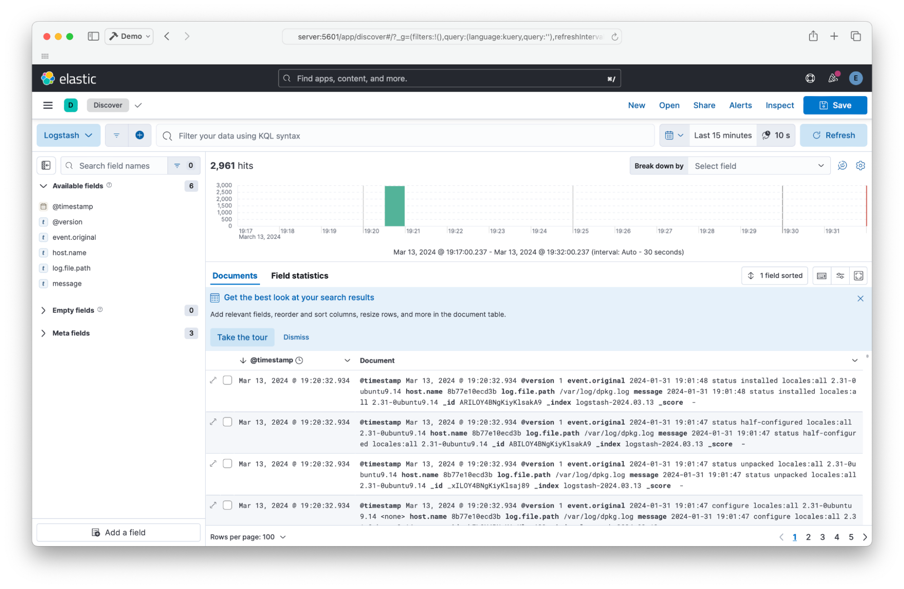

## Introduction

In this tutorial, you will learn how to install an ELK stack using Docker Compose on a server with Ubuntu (version 22.04). The ELK stack is comprised of Elasticsearch, Kibana, and Logstash.

* **Elasticsearch** is a search and analytics engine.
* **Kibana** is a user interface for data analysis.
* **Logstash** can analyse logs from applications.

**Prerequisites**

* A server running Ubuntu version 22.04 or later
  * [SSH access](https://community.hetzner.com/tutorials/howto-ssh-key) to that server
  * Access to the root user or a user with sudo permissions
* Basic knowledge of [Docker](https://docker.com), [Docker Compose](https://docs.docker.com/compose), [ElasticSearch](https://elastic.co)
  and YAML

**Example terminology**

* Username: `holu`
* Hostname: `<your_host>`

## Step 1 - Install Docker Compose

You may skip this step if you have already installed Docker Compose on your server. First, SSH into your server using
the following command:

> Replace `holu` with your own username and `<your_host>` with the IP of your server.

```shell
ssh holu@<your_host>
```

Make sure to update apt packages and install cURL:

```shell
sudo apt-get update && sudo apt-get install curl -y
```

After making sure curl is installed, we can use the quick install script provided by Docker to install Docker as well as
Docker Compose:

```shell
curl https://get.docker.com | sh
```

This command will download the script from [get.docker.com](https://get.docker.com/) and "pipe" it to sh (It will feed the downloaded script to sh which will execute that script and install Docker).
The last thing we can do is add ourselves to the Docker group so that we don’t need to use sudo everytime we use the docker command.

> Replace `holu` with your own username.

```shell
sudo usermod -aG docker holu
```

Make sure to log out and log in again to apply changes.

## Step 2 - Create docker-compose.yaml

The `docker-compose.yaml` file will be used to declare all the infrastructure for the ELK stack. It is used to create
several containers with a single command. 

Create a new folder on your server and create a `docker-compose.yaml` file in it:

```shell
mkdir elk-stack && cd elk-stack && touch docker-compose.yaml
```

We want to use Docker Compose to create three Docker containers:

| Container name           | Description |
| ------------------------ | ----------- |
| <kbd>setup</kbd>         | This container will start before the other containers and configure the passwords. |
| <kbd>elasticsearch</kbd> | This will be the container for Elasticsearch. |
| <kbd>kibana</kbd>        | You can use Kibana to visualize the data from Elasticsearch with beautiful graphs and dashboards. Take a look:<br> |

To create those three containers, add the following content to the `docker-compose.yaml` file:

```yaml
version: "3"
services:
  setup:
    image: docker.elastic.co/elasticsearch/elasticsearch:8.12.1
    environment:
      - ELASTIC_PASSWORD=${ELASTIC_PASSWORD}
      - KIBANA_PASSWORD=${KIBANA_PASSWORD}
    container_name: setup
    command:
      - bash
      - -c
      - |
        echo "Waiting for Elasticsearch availability";
        until curl -s http://elasticsearch:9200 | grep -q "missing authentication credentials"; do sleep 30; done;
        echo "Setting kibana_system password";
        until curl -s -X POST -u "elastic:${ELASTIC_PASSWORD}" -H "Content-Type: application/json" http://elasticsearch:9200/_security/user/kibana_system/_password -d "{\"password\":\"${KIBANA_PASSWORD}\"}" | grep -q "^{}"; do sleep 10; done;
        echo "All done!";

  elasticsearch:
    image: docker.elastic.co/elasticsearch/elasticsearch:8.12.1
    # give the container a name
    # this will also set the container's hostname as elasticsearch
    container_name: elasticsearch
    # this will store the data permanently outside the elastissearch container 
    volumes:
      - ./esdata:/usr/share/elasticsearch/data
    # this will allow access to the content from outside the container
    ports:
      - 9200:9200
    environment:
      - discovery.type=single-node
      - cluster.name=elasticsearch
      - bootstrap.memory_lock=true
      # limits elasticsearch to 1 GB of RAM
      - ES_JAVA_OPTS=-Xms1g -Xmx1g
      # The password for the 'elastic' user
      - ELASTIC_PASSWORD=${ELASTIC_PASSWORD}
      - xpack.security.http.ssl.enabled=false

  kibana:
    image: docker.elastic.co/kibana/kibana:8.12.1
    container_name: kibana
    ports:
      - 5601:5601
    environment:
      # remember the container_name for elasticsearch?
      # we use it here to access that container
      - ELASTICSEARCH_HOSTS=http://elasticsearch:9200
      - ELASTICSEARCH_USERNAME=kibana_system
      - ELASTICSEARCH_PASSWORD=${KIBANA_PASSWORD}
      # Change this to true if you want to sent
      # telemetry data to kibana developers
      - TELEMETRY_ENABLED=false

# this defines the volume to permanently store the elasticsearch container data.
volumes:
   esdata:
```


We are currently missing an element though, the `.env` file. The `.env` file is used to store secrets like passwords and API tokens to remove them from your configuration or code.
Docker Compose automatically recognizes the `.env` file and replaces variables like `${MY_VARIABLE}` with the variable from `.env`.

Create `.env` and add the following lines:
  
```shell
ELASTIC_PASSWORD=<your-elastic-password>
KIBANA_PASSWORD=<your-kibana-password>
```


You can now run docker compose to start everything up:

```shell
docker compose up -d
```

Output:

```shellsession
[+] Running 3/4
 ⠇ Network elk-stack_default  Created
 ✔ Container kibana           Started
 ✔ Container setup            Started
 ✔ Container elasticsearch    Started
```

You can use the `docker ps` command to check if everything works as expected.

```shell
holu@<your_host>:~/elk-stack$ docker ps
CONTAINER ID   IMAGE                                                  COMMAND       CREATED              STATUS              PORTS                                       NAMES
<id>           docker.elastic.co/kibana/kibana:8.12.1                 "<command>"   About a minute ago   Up About a minute   0.0.0.0:5601->5601/tcp, :::5601->5601/tcp   kibana
<id>           docker.elastic.co/elasticsearch/elasticsearch:8.12.1   "<command>"   About a minute ago   Up About a minute   9200/tcp, 9300/tcp                          elasticsearch
```

You can now open Kibana in a web browser by entering `<your_server>:5601` in the URL bar.

* Login with the username `elastic` and the password you set earlier in the `.env` file.
  

* If you have this screen when logging in, click on "Explore on my own".
  

* You should now be able to access the Kibana homepage. It looks like this:
  

## Step 3 - Logstash

Now it’s time to add the final piece of the puzzle, Logstash. Logstash can analyse logs from your application(s) and it feeds the analysed logs to elasticsearch.

Edit `docker-compose.yaml` and add a fourth container in the "services" section below "kibana".

```yaml
  logstash:
    image: docker.elastic.co/logstash/logstash:8.12.1
    container_name: logstash
    command:
      - /bin/bash
      - -c
      - |
        cp /usr/share/logstash/pipeline/logstash.yml /usr/share/logstash/config/logstash.yml
        echo "Waiting for Elasticsearch availability";
        until curl -s http://elasticsearch:9200 | grep -q "missing authentication credentials"; do sleep 1; done;
        echo "Starting logstash";
        /usr/share/logstash/bin/logstash -f /usr/share/logstash/pipeline/logstash.conf
    environment:
      - xpack.monitoring.enabled=false
      - ELASTIC_USER=elastic
      - ELASTIC_PASSWORD=${ELASTIC_PASSWORD}
      - ELASTIC_HOSTS=http://elasticsearch:9200
    volumes:
      - ./logstash.conf:/usr/share/logstash/pipeline/logstash.conf
```

Setting up Logstash is a bit more complicated. You need one additional configuration file, `logstash.conf`. Logstash works on something called a "pipeline". It’s a file explaining what Logstash should do (where do logs come from, how to analyse the logs, where to send them). The pipeline will be in the file `logstash.conf`.

This is one of the most basic pipelines you could have:

```text
input {
    file {
        path => "/var/log/dpkg.log"
        start_position => "beginning"
    }
}

filter { }

output {
    elasticsearch {
    hosts => "${ELASTIC_HOSTS}"
    user => "elastic"
    password => "${ELASTIC_PASSWORD}"
    index => "logstash-%{+YYYY.MM.dd}"
    }
    stdout { }
}
```

It’s pretty self explanatory. It takes a file as input (in this case `/var/log/dpkg.log`) 
and outputs to Elasticsearch and `stdout`.

Put the example above in your `logstash.conf` file.

The `elk-stack` directory should now contain the following files:

```ASCII
elk-stack/
├── .env
├── docker-compose.yaml
└── logstash.conf
```

You can now start Logstash using the following command:

```shell
docker compose up -d
```

Output:

```shellsession
[+] Running 4/4
 ✔ Container logstash       Started
 ✔ Container setup          Started
 ✔ Container elasticsearch  Running
 ✔ Container kibana         Running
```

You can now access Logstash from Kibana. You will need to create a logstash data view first.

* Go on the discover page of "Analytics". You should see something like this:
  

* Create your data view by clicking on the "Create data view" button:
  

* After you saved the data view, you should be able to see logs coming from Logstash:
  

## Step 4 - Destroy the stack

Lastly, to stop the stack and remove the containers, run the following command:

```shell
docker compose down
```

Output:

```shellsession
[+] Running 5/5
 ✔ Container logstash         Removed
 ✔ Container elasticsearch    Removed
 ✔ Container kibana           Removed
 ✔ Container setup            Removed
 ✔ Network elk-stack_default  Removed
```

## Conclusion

That’s it! You should have a working ELK stack running with Docker Compose. Next steps would be to add log exporters such as Filebeat, or check out the [official documentation](https://www.elastic.co/guide/index.html).

##### License: MIT

<!--

Contributor's Certificate of Origin

By making a contribution to this project, I certify that:

(a) The contribution was created in whole or in part by me and I have
    the right to submit it under the license indicated in the file; or

(b) The contribution is based upon previous work that, to the best of my
    knowledge, is covered under an appropriate license and I have the
    right under that license to submit that work with modifications,
    whether created in whole or in part by me, under the same license
    (unless I am permitted to submit under a different license), as
    indicated in the file; or

(c) The contribution was provided directly to me by some other person
    who certified (a), (b) or (c) and I have not modified it.

(d) I understand and agree that this project and the contribution are
    public and that a record of the contribution (including all personal
    information I submit with it, including my sign-off) is maintained
    indefinitely and may be redistributed consistent with this project
    or the license(s) involved.

Signed-off-by: [Alexandru Popescu (alexandru.popescu.fr@icloud.com)]

-->
