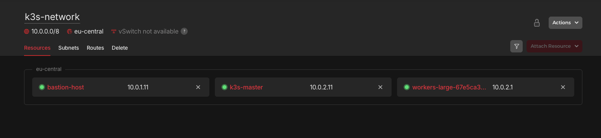
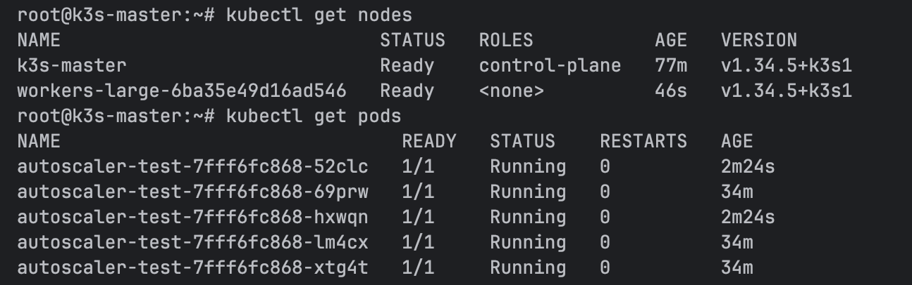
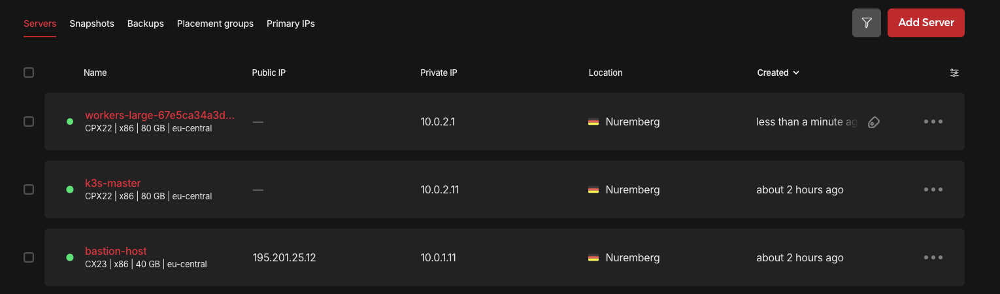

## Introduction

In this tutorial, we are going to set up a [K3s](https://docs.k3s.io/) cluster on Hetzner servers, inside a private network. We will explore Hetzner's Cloud Controller Manager capabilities, configure dynamic volume provisioning, and finally, dive into the most interesting part: achieving true cluster autoscaling on Hetzner.

**Prerequisites**

1. [Generate an API token](https://docs.hetzner.com/cloud/api/getting-started/generating-api-token/) with `Read & Write` Permissions
2. Download [hcloud cli](https://github.com/hetznercloud/cli) on your machine
3. se the [hcloud api token](https://community.hetzner.com/tutorials/howto-hcloud-cli) in the following tutorial

## Step 1 - Setup Base Infrastructure 
In this Step, We are going to create Network, Servers. We will place K3s master and worker nodes in a private subnet (with no public IP addresses). To access them, we will place a Bastion Host in a public subnet, and we'll also configure it to act as a NAT Gateway so our private nodes can reach the internet

### Step 1.1 - Create VPC and subnets 
Create network and two subnets: one for our public-facing Bastion Host, and one for our private Kubernetes nodes.

```bash
hcloud network create --name k3s-network --ip-range 10.0.0.0/8
# public subnet
hcloud network add-subnet  k3s-network  --type cloud --network-zone eu-central --ip-range 10.0.1.0/24
# private subnet
hcloud network add-subnet  k3s-network  --type cloud --network-zone eu-central --ip-range 10.0.2.0/24
```
### Step 1.2 - Create Bastion Host and K8 Master
Create and attach servers to network, which create in step1.1

Note: Using an SSH key is optional but highly recommended for better security. While this tutorial does not use one, if you prefer to use your own, simply append the following flag to the end of your server creation command:
`--ssh-key <ssh-key>`
  
  
```bash
# Bastion host with ip 10.0.1.11
hcloud server create --name bastion-host --type cx23 --image ubuntu-24.04 --location nbg1                                                      
hcloud server attach-to-network  bastion-host --network k3s-network --ip 10.0.1.11  

# k3s master with ip 10.0.2.11 
hcloud server create --name k3s-master --image ubuntu-24.04 --type cpx22  --location nbg1 --network  k3s-network --without-ipv4 --without-ipv6
# hetzner automatically assigned very first available IP address because we created it preivate 
# detach and attach to set the private ip we want
hcloud server detach-from-network k3s-master --network k3s-network
hcloud server attach-to-network   k3s-master  --network k3s-network --ip 10.0.2.11
```

### Step 1.3 - Configure Routes and Servers 
Kubernetes nodes have no public IP, they cannot reach the internet to download the k3s binaries or pull container images. We need to route internet traffic through our Bastion Host.
```bash
BASTION_HOST_PRIVATE_IP=$(hcloud server describe bastion-host -o format="{{ (index .PrivateNet 0).IP }}")
hcloud network add-route  k3s-network --destination 0.0.0.0/0 --gateway $BASTION_HOST_PRIVATE_IP
```
SSH into the Bastion Host and enable IP forwarding
```bash
BASTION_HOST_PUBLIC_IP=$(hcloud server describe bastion-host -o format="{{ .PublicNet.IPv4.IP }}")
ssh root@$BASTION_HOST_PUBLIC_IP

# Enable Ip forwarding and make the iptable rules persistent
echo "net.ipv4.ip_forward=1" | sudo tee /etc/sysctl.d/99-custom-routing.conf
sudo sysctl --system
sudo apt update
sudo apt install iptables-persistent -y
sudo iptables -t nat -A POSTROUTING -s 10.0.0.0/8 -o eth0 -j MASQUERADE
sudo netfilter-persistent save
```
SSH into the K3s Master node and Add DNS nameserver and default route so it can reach internet
```bash
ssh -J root@$BASTION_HOST_PUBLIC_IP root@10.0.2.11
# Find the name of private network interface (usually enp7s0)
PRIVATE_IFACE=$(ip -o -4 addr show | awk '$4 ~ /^10\./ {print $2}')

# Create a Netplan configuration to route traffic and set DNS
cat <<EOF | sudo tee /etc/netplan/60-private-routing.yaml
network:
  version: 2
  ethernets:
    $PRIVATE_IFACE:
      routes:
        - to: default
          via: 10.0.0.1
      nameservers:
        addresses: [1.1.1.1, 8.8.8.8]
EOF

# Apply the network changes
sudo netplan apply
```
<blockquote>

| Product          | IP range    | Name         | Network Zone / Location |
|------------------|-------------|--------------|-------------------------|
| Network          | 10.0.0.0/8  | k3s-network  | eu-central              |
| Subnet (Public)  | 10.0.1.0/24 |              | eu-central              |
| Subnet (Private) | 10.0.2.0/24 |              | eu-central              |
| Server (Bastion) | 10.0.1.11   | bastion-host | nbg1                    |
| Server (Master)  | 10.0.2.11   | k3s-master   | nbg1                    |

</blockquote>



## Step 2 - Install K3s on the Master Node

It’s time to install the Kubernetes control plane.
Because we want Hetzner to manage our IPs, Load Balancers, and Storage automatically, we have to pass args in K3s not to use its default internal cloud tools, and instead prepare for an "external" cloud provider.

### Step 2.1 - Run the K3s Installation Script
```bash
ssh -J root@$BASTION_HOST_PUBLIC_IP root@10.0.2.11

curl -vL https://get.k3s.io | INSTALL_K3S_EXEC="server \
  --disable-cloud-controller \
  --disable servicelb \
  --disable traefik \
  --kubelet-arg=cloud-provider=external \
  --node-ip=10.0.2.11 \
  --advertise-address=10.0.2.11 \
  --flannel-iface=enp7s0" sh -
  
# verify 
kubectl get nodes
```

`--disable-cloud-controller & --disable servicelb`: Turns off K3s's built-in networking tools so Hetzner's CCM can handle Load Balancers and routing.

`--kubelet-arg=cloud-provider=external`: Tells Kubernetes to wait for an external provider (Hetzner) to initialize the node.

`--node-ip & --advertise-address`: Forces K3s to use our private IP (10.0.2.11) instead of looking for a public one.

`--flannel-iface=enp7s0`: Forces internal Pod-to-Pod communication to route over Hetzner's private network cable.

Note: Please find all the options [here](https://docs.k3s.io/cli/server)

we used the cloud-provider=external flag, K3s has placed a strict "Taint" on this node (node.cloudprovider.kubernetes.io/uninitialized:NoSchedule). It is essentially "frozen" and will refuse to schedule normal pods (like CoreDNS and metrics server) until we install the Hetzner Cloud Controller Manager (CCM) in the next step.

### Step 2.2 - Extract Node Token
To allow future worker nodes to join, we need node token 

```bash
cat /var/lib/rancher/k3s/server/node-token
```
Copy this token and save it securely. You will need it whenever you want a new worker node to join the cluster.


### Step 2.3 - Install Hetzner Cloud Controller Manager
Before we deploy the CCM, we must create k8s secret with name hcloud give it the Hetzner API token and exact name of private network.

```bash

kubectl -n kube-system create secret generic hcloud \
  --from-literal=token=<YOUR_HETZNER_API_TOKEN> \
  --from-literal=network=k3s-network
```

Hetzner provides two versions of the CCM: one for public internet routing, and one for private networks. We use the Networks version.

```bash
kubectl apply -f https://github.com/hetznercloud/hcloud-cloud-controller-manager/releases/latest/download/ccm-networks.yaml
```

Official installation instructions and manifest files for this step can be found in the [Hetzner Cloud Controller Manager GitHub Repository].(https://github.com/hetznercloud/hcloud-cloud-controller-manager)

### Step 2.4 - Install Hetzner Container Storage Interface (CSI) Driver
we already created the hcloud secret containing our API token in the previous step, the CSI driver will automatically use it to authenticate. We just need to apply the manifest.
```bash
 kubectl apply -f https://raw.githubusercontent.com/hetznercloud/csi-driver/master/deploy/kubernetes/hcloud-csi.yml
 
# Verify
kubectl get pods -n kube-system | grep hcloud-csi
kubectl get storageclass

cat <<EOF | kubectl apply -f -
apiVersion: storage.k8s.io/v1
kind: StorageClass
metadata:
  name: hcloud-volumes
provisioner: csi.hetzner.cloud
reclaimPolicy: Delete
volumeBindingMode: WaitForFirstConsumer
allowVolumeExpansion: true
EOF

cat <<'EOF' | kubectl apply -f -
apiVersion: v1
kind: PersistentVolumeClaim
metadata:
  name: test-pvc
spec:
  accessModes:
    - ReadWriteOnce
  storageClassName: hcloud-volumes
  resources:
    requests:
      storage: 10Gi
EOF

# Should become Bound within ~30 seconds
kubectl get pvc test-pvc -w

```
Official installation instructions and manifest files for this step can be found in the [Hetzner Cloud Controller Manager GitHub Repository].(https://github.com/hetznercloud/csi-driver)


## Step 3 - Cluster Autoscaling

We use the official Kubernetes Cluster Autoscaler to dynamically spin up and delete servers based on our workload.

### Step 3.1 - Create the Worker Node cloud-init Script

When the Autoscaler tells Hetzner to create a new VM, that new server is completely blank. We have to provide a cloud-init script so the server automatically configures its private network routing (to reach the internet via our Bastion) and installs the K3s Agent to join our cluster.

Create a file named `worker-cloud-init.yaml`:
```yaml
#cloud-config
write_files:
  # Persist DNS via systemd-resolved drop-in file
  - path: /etc/systemd/resolved.conf.d/dns_servers.conf
    permissions: '0644'
    content: |
      [Resolve]
      DNS=8.8.8.8 1.1.1.1

  # Persist Default Route via Netplan
  - path: /etc/netplan/60-hetzner-private-route.yaml
    permissions: '0644'
    content: |
      network:
        version: 2
        ethernets:
          enp7s0:
            dhcp4: true
            # Ignore Hetzner's DHCP DNS so it uses our systemd-resolved config
            dhcp4-overrides:
              use-dns: false
            routes:
              - to: default
                via: 10.0.0.1
                on-link: true

runcmd:
  # Apply the persistent network and DNS configurations immediately
  - systemctl restart systemd-resolved
  - netplan apply
  
  # Give the network a few seconds to establish the new routes before curling
  - sleep 5

  # Download and install the K3s agent
  - |
    curl -sfL https://get.k3s.io | \
    K3S_URL=https://10.0.2.11:6443 \
    K3S_TOKEN=<YOUR_NODE_TOKEN> \
    INSTALL_K3S_EXEC="--kubelet-arg=cloud-provider=external --flannel-iface=enp7s0" \
    sh -s - agent
```

Convert this file to a base64 string so we can embed it into the autoscaler config:

```bash
cat worker-cloud-init.yaml | base64 -w0
```
Copy the resulting long string.

### Step 3.2 - Create the Autoscaler Config

```json
{
    "imagesForArch": {
        "amd64": "ubuntu-24.04"
    },
    "defaultSubnetIPRange": "10.0.0.0/8",
    "nodeConfigs": {
        "workers-small": {
            "cloudInit": "<PASTE_BASE64_STRING_HERE>",
            "subnetIPRange": "10.0.2.0/24"
            "labels": {
                "node.kubernetes.io/role": "autoscaler-node"
            },
            "taints":
            [
                {
                    "key": "node.kubernetes.io/role",
                    "value": "autoscaler-node",
                    "effect": "NoExecute"
                }
            ],
        },
        "workers-large": {
            "cloudInit": "<PASTE_BASE64_STRING_HERE>",
            "subnetIPRange": "10.0.2.0/24",
            "labels": {
                "node.kubernetes.io/role": "autoscaler-node-large"
            },
        }
    }
}
```
### Step 3.3 - Create the Autoscaler Secret
The Autoscaler needs Hetzner API token, the raw cloud-init file, and the JSON config to function. Package them all into a Kubernetes Secret:

```bash
kubectl -n kube-system create secret generic hcloud-autoscaler \
  --from-literal=token=<YOUR_HETZNER_API_TOKEN> \
  --from-literal=cloudInit="$(cat worker-cloud-init.yaml | base64 -w0)" \
  --from-literal=clusterConfig="$(cat config.json | base64 -w0)"
```

### Step 3.4 - Deploy the Cluster Autoscaler & RBAC
The Cluster Autoscaler is a powerful pod that needs permission to watch deployments, read metrics, and evict pods. We will apply a single YAML file that contains the strict RBAC roles, the ServiceAccount, and the Deployment itself.

Note: We set `HCLOUD_PUBLIC_IPV4` and `IPV6` to false to ensure the autoscaler provisions nodes securely in our private subnet.

Create and apply `cluster-autoscaler.yaml`:
```yaml
apiVersion: apps/v1
kind: Deployment
metadata:
  name: cluster-autoscaler
  namespace: kube-system
spec:
  replicas: 1
  selector:
    matchLabels:
      app: cluster-autoscaler
  template:
    metadata:
      labels:
        app: cluster-autoscaler
    spec:
      tolerations:
        - key: node-role.kubernetes.io/control-plane
          operator: "Exists"
          effect: NoSchedule
      nodeSelector:
        node-role.kubernetes.io/control-plane: "true"
      serviceAccountName: cluster-autoscaler
      containers:
        - name: cluster-autoscaler
          image: registry.k8s.io/autoscaling/cluster-autoscaler:v1.32.0
          command:
            - ./cluster-autoscaler
            - --cloud-provider=hetzner
            - --nodes=0:10:cx23:nbg1:workers-small   # min:max:type:region:poolname
            - --nodes=0:3:cpx22:nbg1:workers-large
            - --scale-down-delay-after-add=10m
            - --scale-down-unneeded-time=10m
            - --scan-interval=10s
            - --v=4
          env:
            - name: HCLOUD_TOKEN
              valueFrom:
                secretKeyRef:
                  name: hcloud-autoscaler
                  key: token
            - name: HCLOUD_CLOUD_INIT
              valueFrom:
                secretKeyRef:
                  name: hcloud-autoscaler
                  key: cloudInit
            - name: HCLOUD_CLUSTER_CONFIG
              valueFrom:
                secretKeyRef:
                  name: hcloud-autoscaler
                  key: clusterConfig
            - name: HCLOUD_NETWORK
              value: "k3s-network"
            - name: HCLOUD_PUBLIC_IPV4
              value: "false"
            - name: HCLOUD_PUBLIC_IPV6
              value: "false"
          resources:
            requests:
              cpu: 100m
              memory: 300Mi
---
apiVersion: v1
kind: ServiceAccount
metadata:
  name: cluster-autoscaler
  namespace: kube-system
---
apiVersion: rbac.authorization.k8s.io/v1
kind: ClusterRole
metadata:
  name: cluster-autoscaler
rules:
  - apiGroups: [""]
    resources: ["events", "endpoints"]
    verbs: ["create", "patch"]
  - apiGroups: [""]
    resources: ["pods", "nodes", "namespaces", "services", "persistentvolumeclaims", "persistentvolumes", "replicationcontrollers"]
    verbs: ["watch", "list", "get"]
  - apiGroups: [""]
    resources: ["nodes"]
    verbs: ["update"]
  - apiGroups: ["extensions", "apps"]
    resources: ["replicasets", "statefulsets", "daemonsets"]
    verbs: ["watch", "list", "get"]
  - apiGroups: ["policy"]
    resources: ["poddisruptionbudgets"]
    verbs: ["watch", "list"]
  - apiGroups: ["storage.k8s.io"]
    resources: ["storageclasses", "volumeattachments", "csinodes", "csidrivers", "csistoragecapacities"]
    verbs: ["watch", "list", "get"]
  - apiGroups: ["batch"]
    resources: ["jobs"]
    verbs: ["watch", "list", "get"]
  - apiGroups: ["coordination.k8s.io"]
    resources: ["leases"]
    verbs: ["create", "get", "update"]
---
apiVersion: rbac.authorization.k8s.io/v1
kind: ClusterRoleBinding
metadata:
  name: cluster-autoscaler
roleRef:
  apiGroup: rbac.authorization.k8s.io
  kind: ClusterRole
  name: cluster-autoscaler
subjects:
  - kind: ServiceAccount
    name: cluster-autoscaler
    namespace: kube-system
---
apiVersion: rbac.authorization.k8s.io/v1
kind: Role
metadata:
  name: cluster-autoscaler
  namespace: kube-system
rules:
  - apiGroups: [""]
    resources: ["configmaps"]
    verbs: ["create", "list", "watch", "get", "patch", "update"]
---
apiVersion: rbac.authorization.k8s.io/v1
kind: RoleBinding
metadata:
  name: cluster-autoscaler
  namespace: kube-system
roleRef:
  apiGroup: rbac.authorization.k8s.io
  kind: Role
  name: cluster-autoscaler
subjects:
  - kind: ServiceAccount
    name: cluster-autoscaler
    namespace: kube-system
```

```bash
kubectl apply -f cluster-autoscaler.yaml
kubectl get pods -n kube-system -l app=cluster-autoscaler
```

Official installation instructions for this step can be found in the [Cluster Autoscaler].(https://github.com/kubernetes/autoscaler/tree/master/cluster-autoscaler/cloudprovider/hetzner)


## Step 4 - Test Auto scaling 
create nginx pods and verify
```bash
cat <<EOF | kubectl apply -f -
apiVersion: apps/v1
kind: Deployment
metadata:
  name: autoscaler-test
spec:
  replicas: 5
  selector:
    matchLabels:
      app: test-web
  template:
    metadata:
      labels:
        app: test-web
    spec:
      containers:
      - name: web
        image: nginx:alpine
        resources:
          requests:
            cpu: "500m"
            memory: "512Mi"
EOF

# keep checking logs 
kubectl logs -f deployment/cluster-autoscaler -n kube-system

```
you should now able to see new nodes joining the cluster




## Conclusion

We have just built a Kubernetes environment that is both high-performance and cost-efficient. By moving away from expensive managed services and leveraging k3s on Hetzner, we’ve gained full control over your infrastructure

##### License: MIT

<!--

Contributor's Certificate of Origin

By making a contribution to this project, I certify that:

(a) The contribution was created in whole or in part by me and I have
    the right to submit it under the license indicated in the file; or

(b) The contribution is based upon previous work that, to the best of my
    knowledge, is covered under an appropriate license and I have the
    right under that license to submit that work with modifications,
    whether created in whole or in part by me, under the same license
    (unless I am permitted to submit under a different license), as
    indicated in the file; or

(c) The contribution was provided directly to me by some other person
    who certified (a), (b) or (c) and I have not modified it.

(d) I understand and agree that this project and the contribution are
    public and that a record of the contribution (including all personal
    information I submit with it, including my sign-off) is maintained
    indefinitely and may be redistributed consistent with this project
    or the license(s) involved.

Signed-off-by: Keerthana Palepu, keerthanapalepu2002@gmail.com

-->
