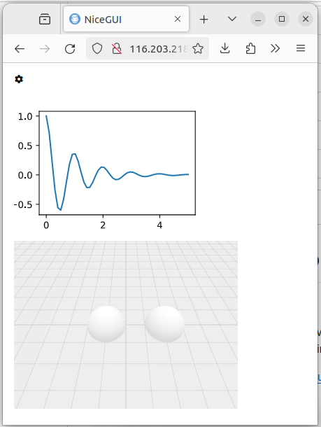

---
span
---

- A Hetzner account with your preferred payment method added.
- A cloud server with a dedicated IPv4 address.
- Basic knowledge of Linux & the terminal
- Ports 80, 81, 443 available


## Introduction

The NiceGUI implements a promising solution for web development in Python language.
[see documentaiton of nicegui](https://nicegui.io/)

NiceGUI makes use of several recent software approaches such as FastAPI, web-sockets which make
its deployment different to the popular synchronous web frameworks such as Flask or Django.

I will use the domain name provided by Hetzner (reverse DNS) in order to diminish the hassle of buying a custom domain name.

This tutorial shows how to deploy a basic NiceGUI application in production on Ubuntu server.
I will use `pyenv` script for installation of Python. Initially, this is more cumbersome than
using `apt`, but it makes your installation more flexible with respect to changing Python versions.

**Prerequisites**

- The virtual private server (VPS). The cheapest option will do.
- The initial setup of Ubuntu server (version 22.04) [Tutorial initial setup Ubuntu](howto-initial-setup-ubuntu/01.en.md)
- I assume the user account is named `user` and it works from the **bash** shell.

## Step 1 - Install Python

[Pyenv](https://github.com/pyenv/pyenv) is an open-source software for managing the Python
interpreters.
See this [blog post](https://medium.com/@aashari/easy-to-follow-guide-of-how-to-install-pyenv-on-ubuntu-a3730af8d7f0) for a more detailed explanation.

### Step 1.1 - Install Pyenv

- Login to the VPS as **root**
- Install the Ubuntu build tools

```commandline
apt install -y make build-essential libssl-dev zlib1g-dev libbz2-dev libreadline-dev libsqlite3-dev wget curl llvm libncursesw5-dev xz-utils tk-dev libxml2-dev libxmlsec1-dev libffi-dev liblzma-dev
```

- Login to the VPS as **user**
- Install pyenv via `curl https://pyenv.run | bash`
- Adjust the file `.profile` by appending the recommended commands.

For example, in my case the `.profile` ends up with

```shell
export PYENV_ROOT="$HOME/.pyenv"
[[ -d $PYENV_ROOT/bin ]] && export PATH="$PYENV_ROOT/bin:$PATH"
eval "$(pyenv init -)"
eval "$(pyenv virtualenv-init -)"
```

- Logout
- Login as user
- Update pyenv's data via `pyenv update`

### Step 1.2 - Install Python via Pyenv

- Login as user
- Install Python 3.11.9 via `pyenv install 3.11.9`

To verify the installed Python interpreter:

- Create a folder `mkdir tmp`
- Step-in to the new folder `cd tmp`
- Define Python interpreter to be used within current folder `pyenv local 3.11.9`
- Verify the version of the Python interpreter `python --version`

## Step 2 - Create the application

We will create a simple application with NiceGUI and see how it runs in development.

### Step 2.1 - Create the main file

- Login as user
- Create a root directory for the application `mkdir nicegui-test`
- Step in to the `nicegui-test` directory `cd nicegui-test`
- Create a file `nicegui-test/main.py` with the following content

```python
"""."""
from nicegui import ui
import numpy as np
from matplotlib import pyplot as plt


def main() -> None:
    """."""
    ui.icon('settings')

    with ui.pyplot(figsize=(3, 2)):
        x = np.linspace(0.0, 5.0)
        y = np.cos(2 * np.pi * x) * np.exp(-x)
        plt.plot(x, y, '-')

    ui.notify('my notification')

    with ui.scene(width=320, height=240) as scene:
        scene.spot_light(distance=100, intensity=0.6).move(-10, 0, 10)
        with scene.group() as group:
            scene.sphere().move(-1.0, 0.0, 0.0)
            scene.sphere().move(+2.0, 0.0, 0.0)
            group.rotate(30.0, 0.0, 0.0)


if __name__ in ('__main__', '__mp_main__'):
    main()
    ui.run(port=5000)
```

### Step 2.2 - Run the application in development mode

Let's run the `main.py` in the development mode to see what it does.

- Login as user
- Step into the `nicegui-test` directory from the previous step.
- Define the Python interpreter to be used via `pyenv local 3.11.9`
- Create a local Python environment `python -m venv env`
- Activate the local Python environment `source env/bin/activate`
- Install the NiceGUI and matplotlib `pip install nicegui matplotlib`
- Run the app `python main.py`

The web app should be served from your VPS.
The address:port combination will be shown in terminal.
You might need to add an inbound rule to your firewall allowing TCP traffic on port 5000.
If this is done or there is no firewall activated in your VPS, then please direct to the
browser to see the screen



Note the `settings` icon, 
the matplotlib figure and 
the interactive 3D scene with two unadorned spheres.
You can interact with the scene (rotate, zoom, pan) with mouse.  

## Step 3 - Create the system service

After playing with the development deployment, 
we will want to deploy the app in production.
The good news is that NiceGUI is using the production-grade web
server `uvicorn` under the hood. Our part of the work is to configure
the `systemd` service `nicegui-test`. 
The service `nicegui-test` will automatically run after restarts.

Moreover, we will split the application and its deployment
by using a little script `asgi.py`.
The purpose of this script is to define the port.

- Login as **user**
- Create the file `nicegui-test/asgi.py` (next to `main.py`). The file `asgi.py` should contain

```python
from main import main
from nicegui import ui

main()
ui.run(port=5129)
```

- Login as **root**
- Create a system service file at `/etc/systemd/system/nicegui-test.service` with the following content

```unit file (systemd)
[Unit]
Description = Running a test of NiceGUI.
After = network.target

[Service]
User = user
Group = www-data
WorkingDirectory = /home/user/nicegui-test
Environment="PATH=/home/user/nicegui-test/env/bin"
ExecStart=/home/user/nicegui-test/env/bin/python asgi.py

[Install]
WantedBy=multi-user.target
```

- Start the newly created service `systemctl start nicegui-test`
- Verify the service is running `systemctl status nicegui-test`
  - The address:port combination will be shown in the output of the last command.
  - You might need to add an inbound rule to your firewall allowing TCP traffic on port 5129.
  - Direct to address:5129 in your browser and see the application screen as in case of development deployment.  

## Step 4 - Configuration of nginx

Next challenge is to configure the domain name. We will use `nginx` software.
After this step, the application will be served via a domain name and standard port.

- Loging as **root**
- Install nginx via `apt install nginx`
- Create a new configuration file `/etc/nginx/sites-available/nicegui-test.conf` with the following content:

```nginx configuration
server {
	listen 80;
	server_name <domain-name>.de;

	location / {
		include proxy_params;
                proxy_pass http://localhost:5129;
                proxy_http_version 1.1;
                proxy_set_header Upgrade $http_upgrade;
                proxy_set_header Connection "Upgrade";
	}
}
```

Note: the `<domain-name>` in the configuration file above could be the automatic 
reverse DNS name assigned by Hetzner. This is visible in the _Networking_ tab of
your VPS. If you configured a custom domain name then 

## Step 5 - Obtaining SSL certificate (https)

## Conclusion

Great, you did it! This was a basic introduction to deploying a Node.js application to Ubuntu 18.04 by using Docker, Docker Hub and Docker Compose.

We've seen how to write a simple `Dockerfile`,  how to build the image, push it, and deploy it on a server. Setting up automated builds is useful and a first step into the Continuous Integration and Delivery world (CI/CD).

There's a lot more about Docker that is not covered by this tutorial, so make sure that you take a look at the Docker and Docker Compose documentation to learn more about the concepts and features.

##### License: MIT

<!--

Contributor's Certificate of Origin

By making a contribution to this project, I certify that:

(a) The contribution was created in whole or in part by me and I have
    the right to submit it under the license indicated in the file; or

(b) The contribution is based upon previous work that, to the best of my
    knowledge, is covered under an appropriate license and I have the
    right under that license to submit that work with modifications,
    whether created in whole or in part by me, under the same license
    (unless I am permitted to submit under a different license), as
    indicated in the file; or

(c) The contribution was provided directly to me by some other person
    who certified (a), (b) or (c) and I have not modified it.

(d) I understand and agree that this project and the contribution are
    public and that a record of the contribution (including all personal
    information I submit with it, including my sign-off) is maintained
    indefinitely and may be redistributed consistent with this project
    or the license(s) involved.

Signed-off-by: Matteo Contrini (matteo@contrini.it)

-->
