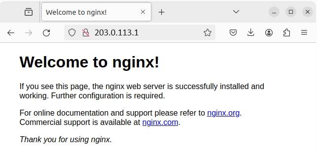

## Introduction

NiceGUI implements a promising solution for web development in Python language.
See [documentaiton of NiceGUI](https://nicegui.io/).

NiceGUI makes use of several recent software approaches such as FastAPI, web-sockets which make
its deployment different to the popular synchronous web frameworks such as Flask or Django.

I will use the domain name provided by Hetzner ([reverse DNS](https://docs.hetzner.com/cloud/servers/cloud-server-rdns/)) in order to diminish the hassle of buying a custom domain name.

This tutorial shows how to deploy a basic NiceGUI application in production on an Ubuntu server.
I will use `pyenv` script for the installation of Python. Initially, this is more cumbersome than
using `apt`, but it makes your installation more flexible with respect to changing Python versions.

**Prerequisites**

- Basic knowledge of Linux & the terminal
- A virtual private server (VPS) with a dedicated IPv4 address. The cheapest option will do.
- The initial setup of Ubuntu server (version 22.04). See [tutorial initial setup Ubuntu](/tutorials/howto-initial-setup-ubuntu)
- Access to root user or a user with sudo permissions

**Example terminology**

* Username: `holu`
* Domain: `example.com`
* IP address: `203.0.113.1`

## Step 1 - Install Python

[Pyenv](https://github.com/pyenv/pyenv) is an open-source software for managing the Python
interpreters.
See this [blog post](https://medium.com/@aashari/easy-to-follow-guide-of-how-to-install-pyenv-on-ubuntu-a3730af8d7f0) for a more detailed explanation.

### Step 1.1 - Install Pyenv

- Install the Ubuntu build tools
  ```commandline
  sudo apt update && sudo apt install -y make build-essential libssl-dev zlib1g-dev libbz2-dev libreadline-dev libsqlite3-dev wget curl llvm libncursesw5-dev xz-utils tk-dev libxml2-dev libxmlsec1-dev libffi-dev liblzma-dev
  ```
- Install pyenv via
  ```bash
  curl https://pyenv.run | bash
  ```
- Edit the file `.profile` in the home directory by appending the recommended commands.
  
  For example, in my case the `.profile` file ends with
  
  ```shell
  export PYENV_ROOT="$HOME/.pyenv"
  [[ -d $PYENV_ROOT/bin ]] && export PATH="$PYENV_ROOT/bin:$PATH"
  eval "$(pyenv init -)"
  eval "$(pyenv virtualenv-init -)"
  ```

- Logout and back in to apply the changes
- Update pyenv's data with
  ```bash
  pyenv update
  ```

### Step 1.2 - Install Python via Pyenv

- Install Python 3.11.9 with
  ```bash
  pyenv install 3.11.9
  ```

To verify the installed Python interpreter:

- Create a folder and open the new folder
  ```bash
  mkdir tmp && cd tmp
  ```
- Define Python interpreter to be used within current folder
  ```bash
  pyenv local 3.11.9
  ```
- Verify the version of the Python interpreter
  ```bash
  python --version
  ```
- Now that you know that everything works, you can use `rm -r tmp` to delete the directory.

## Step 2 - Create the application

We will create a simple application with NiceGUI and see how it runs in development.

### Step 2.1 - Create the main file

- Create a root directory for the application and open the `nicegui-test` directory
  ```bash
  mkdir nicegui-test && cd nicegui-test
  ```
- Create a file `nicegui-test/main.py` with the following content
  
  > If you want to use a different port, replace `5000` with a port of your choice.
  
  ```python
  """."""
  from nicegui import ui
  import numpy as np
  from matplotlib import pyplot as plt
  
  
  def main() -> None:
      """."""
  
      # Add a "settings" icon
      ui.icon('settings')
  
      # Add a matplotlib figure
      with ui.pyplot(figsize=(3, 2)):
          x = np.linspace(0.0, 5.0)
          y = np.cos(2 * np.pi * x) * np.exp(-x)
          plt.plot(x, y, '-')
  
      ui.notify('my notification')
  
      # Add an interactive 3D scene with two spheres
      with ui.scene(width=320, height=240) as scene:
          scene.spot_light(distance=100, intensity=0.6).move(-10, 0, 10)
          with scene.group() as group:
              scene.sphere().move(-1.0, 0.0, 0.0)
              scene.sphere().move(+2.0, 0.0, 0.0)
              group.rotate(30.0, 0.0, 0.0)
  
  # Set the port to 5000
  if __name__ in ('__main__', '__mp_main__'):
      main()
      ui.run(port=5000)
  ```

### Step 2.2 - Run the application in development mode

Let's run `main.py` in the development mode to see what it does.

- Step into the `nicegui-test` directory from the previous step.
- Define the Python interpreter to be used with
  ```bash
  pyenv local 3.11.9
  ```
- Create a local Python environment
  ```bash
  python -m venv env
  ```
- Activate the local Python environment
  ```bash
  source env/bin/activate
  ```
- Install the NiceGUI and matplotlib
  ```bash
  pip install nicegui matplotlib
  ```
- Run the app
  ```bash
  python main.py
  ```

The web app should be served from your VPS.
The `<address>:<port>` combination is shown in terminal. The example above used port 5000, so it would be something like `203.0.113.1:5000`.
You might need to add an inbound rule to your firewall allowing TCP traffic on port 5000.
If this is done or there is no firewall activated in your VPS, then please direct to the
browser to see the screen.


Note the `settings` icon, the matplotlib figure, and the interactive 3D scene with two unadorned spheres.
You can interact with the scene (rotate, zoom, pan) with your mouse.  

## Step 3 - Create the system service

After playing with the development deployment, 
we will want to deploy the app in production.
The good news is that NiceGUI is using the production-grade web
server `uvicorn` under the hood. Our part of the work is to configure
the `systemd` service `nicegui-test`. 
The service `nicegui-test` will automatically run after restarts.

Moreover, we will split the application and its deployment
by using a little script `asgi.py`.
The purpose of this script is to define the port.

- Create the file `nicegui-test/asgi.py` (next to `main.py`). The file `asgi.py` should contain
  
  ```python
  from main import main
  from nicegui import ui
  
  @ui.page('/')
  def main_page() -> None:
      main()
  
  ui.run(port=5129)
  ```

- Create a system service file
  ```bash
  sudo nano /etc/systemd/system/nicegui-test.service
  ```
  
  Add the following content
  
  > Replace `holu` with your own username and `/home/holu/nicegui-test` with the actual path to your `nicegui-test` directory.

  ```unit file (systemd)
  [Unit]
  Description = Running a test of NiceGUI.
  After = network.target
  
  [Service]
  User = holu
  Group = www-data
  WorkingDirectory = /home/holu/nicegui-test
  Environment="PATH=/home/holu/nicegui-test/env/bin"
  ExecStart=/home/holu/nicegui-test/env/bin/python asgi.py
  
  [Install]
  WantedBy=multi-user.target
  ```

- Start the newly created service
  ```bash
  sudo systemctl start nicegui-test
  ```
- Verify the service is running
  ```bash
  sudo systemctl status nicegui-test
  ```
  - The `<address>:<port>` combination will be shown in the output.
  - You might need to add an inbound rule to your firewall allowing TCP traffic on port 5129.
  - Direct to `address:5129` in your browser and see the application screen as in case of development deployment.  
- Enable the automatic start of the service
  ```bash
  sudo systemctl enable nicegui-test
  ```

## Step 4 - Configuration of nginx

Next challenge is to configure the domain name. We will use `nginx` software.
After this step, the application will be served via the standard HTTP port 80.

- Install nginx with
  ```bash
  sudo apt install nginx
  ```
- Verify that `nginx` is functional: Direct to the (IP) address in the browser and see the default page
  
  

- Create a new configuration file
  ```bash
  sudo nano /etc/nginx/sites-available/nicegui-test.conf
  ```
  
  Add the following content:
  
  <blockquote>
  
  Replace <kbd>example.com</kbd> with your domain or IP address. If you add an IP address, traffic will be served unencrypted (only HTTP; HTTPS not possible).

  If you have a Hetzner server, you could use the automatic reverse DNS name as domain.

  <details>
  <summary>Click here to see how to find the reverse DNS in Hetzner Cloud Console.</summary>

  

  </details>
  </blockquote>

  ```nginx
  server {
	  listen 80;
	  server_name example.com;

	  location / {
            include proxy_params;
                  proxy_pass http://localhost:5129;
                  proxy_http_version 1.1;
                  proxy_set_header Upgrade $http_upgrade;
                  proxy_set_header Connection "Upgrade";
	  }
  }
  ```

- Remove all files from the sites-enabled folder
  ```bash
  sudo rm /etc/nginx/sites-enabled/*
  ```
- Create symbolic link in sites-enabled folder
  ```bash
  sudo ln -s /etc/nginx/sites-available/nicegui-test.conf /etc/nginx/sites-enabled
  ```
- Verify the nginx configuration
  ```bash
  sudo nginx -t
  ```
- Restart the `nginx` service via
  ```bash
  sudo systemctl restart nginx
  ```
- Verify the NiceGUI application is served at the (IP) address _at standard port 80_
  - Direct to the IP address of the server without specifying any port number.
  - Note that you might need to hard-reload the page with `Ctrl`+`F5` key combination.

## Step 5 - Obtaining SSL certificate (HTTPS)

Finally, lets set up an SSL certificate for our experimental web page.
This is possible to do via the "Let's Encrypt" project by Linux foundation.

A good video tutorial on the topic is produced at [Tony Teaches Tech](https://www.youtube.com/watch?v=ghZXFyIyK1o).

Below you will find the instructions from this tutorial with some extra explanations
applicable to this production deployment.

In order to serve via HTTPS, we use `certbot`.

- Install `snap` package manager
  ```bash
  sudo apt update && sudo apt install snap snapd
  ```
- Set up the snap registry via
  ```bash
  sudo snap install core; sudo snap refresh
  ```
- Install `certbot` via
  ```bash
  sudo snap install --classic certbot
  ```
- Use `certbot` for ordering and setting up the SSL certificate. Start an interactive session with
  ```bash
  sudo certbot --nginx
  ```

The `certbot` will ask for an e-mail address and the domain name for which the certificate will be issued.
The `certbot` will ensure the ownership of the domain name and generate the certificate.
As a result of a successful `certbot` run, the following configurations will be done:

- The `nginx` configuration at `/etc/nginx/sites-available/nicegui-test.conf`.
If the configuration was simple as in the section above, then it will be extended with 
redirection instructions.

  <blockquote>
  <details>
  <summary>Click here to view an example <kbd>nicegui-test.conf</kbd> file.</summary>

  ```conf
  server {
          server_name example.com;
  
          location / {
                  include proxy_params;
                  proxy_pass http://localhost:5129;
                  proxy_http_version 1.1;
                  proxy_set_header Upgrade $http_upgrade;
                  proxy_set_header Connection "Upgrade";
          }
  
      listen 443 ssl; # managed by Certbot
      ssl_certificate /etc/letsencrypt/live/example.com/fullchain.pem; # managed by Certbot
      ssl_certificate_key /etc/letsencrypt/live/example.com/privkey.pem; # managed by Certbot
      include /etc/letsencrypt/options-ssl-nginx.conf; # managed by Certbot
      ssl_dhparam /etc/letsencrypt/ssl-dhparams.pem; # managed by Certbot
  
  }
  
  server {
      if ($host = example.com) {
          return 301 https://$host$request_uri;
      } # managed by Certbot
  
  
          listen 80;
          server_name example.com;
      return 404; # managed by Certbot
  
  
  }
  ```

  </details>
  </blockquote>

<br>

- A periodic service for the automatic certificate renewal will be added. You can verify this configuration with
  
  ```bash
  sudo systemctl list-timers
  ```

You can view the configuration of the timer and service in these files:

* `/etc/systemd/system/snap.certbot.renew.timer`
* `/etc/systemd/system/snap.certbot.renew.service`

## Conclusion

Great, you did it! This was a basic introduction to deploying a test NiceGUI application on
Ubuntu 22.04 by using `pyenv`, `systemd`, `nginx`, and `certbot`.

##### License: MIT

<!--

Contributor's Certificate of Origin

By making a contribution to this project, I certify that:

(a) The contribution was created in whole or in part by me and I have
    the right to submit it under the license indicated in the file; or

(b) The contribution is based upon previous work that, to the best of my
    knowledge, is covered under an appropriate license and I have the
    right under that license to submit that work with modifications,
    whether created in whole or in part by me, under the same license
    (unless I am permitted to submit under a different license), as
    indicated in the file; or

(c) The contribution was provided directly to me by some other person
    who certified (a), (b) or (c) and I have not modified it.

(d) I understand and agree that this project and the contribution are
    public and that a record of the contribution (including all personal
    information I submit with it, including my sign-off) is maintained
    indefinitely and may be redistributed consistent with this project
    or the license(s) involved.

Signed-off-by: Petr Koval Kotlov (koval.peter@gmail.com)

-->
