## Introduction

NocoDB is an open-source Airtable alternative that lets you turn an existing database into a spreadsheet-style interface. It supports REST APIs, team collaboration, and connections to MySQL or PostgreSQL.

In this tutorial, you will deploy NocoDB on a Hetzner Cloud server using Docker. For users who prefer GUI tools, applications such as [Server Compass](https://servercompass.app) can automate parts of this process. However, this guide walks through the deployment step by step rather than hiding it behind a GUI.

NocoDB requires relatively little memory (around 256 MB), so even small Hetzner Cloud servers can run it comfortably. On a small Hetzner Cloud server, the whole deployment usually takes only a few minutes.

**Prerequisites**

* A [Hetzner Cloud](https://console.hetzner.cloud/) account
* A server running Ubuntu 24.04
* SSH access to the server
* (Optional) A graphical server management tool such as [Server Compass](https://servercompass.app), which offers a free tier supporting a single server and application

## Overview

In this tutorial, you will:

- Create a Hetzner Cloud server running Ubuntu 24.04
- Configure SSH access to the server
- Install Docker on the server
- Deploy NocoDB using Docker Compose
- Verify the deployment and access the NocoDB web interface

## Step 1 - Generate an SSH Key

An SSH key lets your computer connect securely to a remote server without a password. You can generate one using the following command:

```bash
ssh-keygen -t ed25519 -C "nocodb-server"
```

This saves a key pair to `~/.ssh/`. To view your public key, run:

```bash
cat ~/.ssh/id_ed25519.pub
```

Copy the output and paste it into the SSH key field in the Hetzner Cloud Console in the next step.

If you prefer a graphical approach, tools such as Server Compass include a built-in key generator.

### Using Server Compass (Optional)

1. Open Server Compass
2. Click **SSH Keys** in the left sidebar
3. Click **+ Generate New Key** in the top right

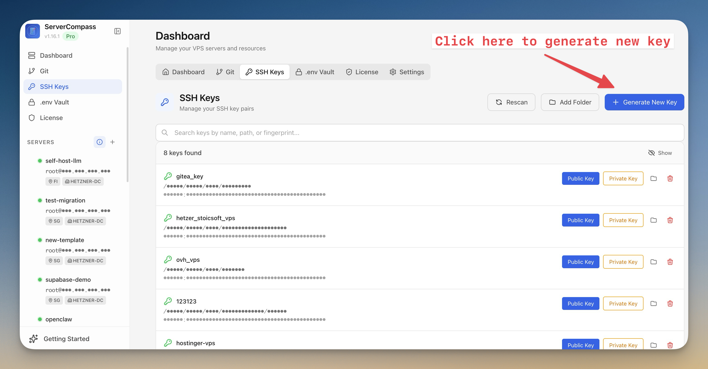

4. Enter a name for your key (for example: `my-demo-vps`)
5. Click **Generate Key Pair**

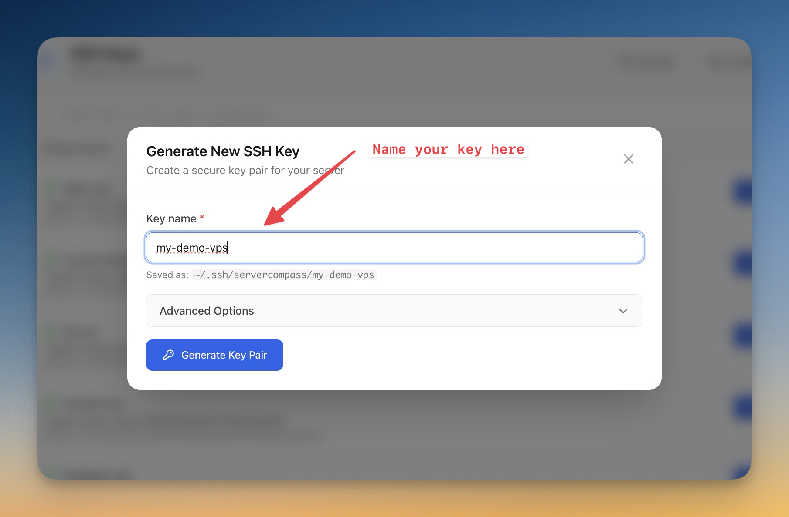

Server Compass generates a key pair and saves it on your computer.

6. Find your new key in the list and click **Public Key** to copy it to your clipboard

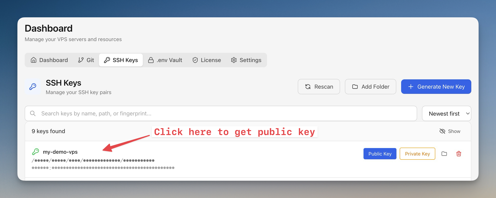

## Step 2 - Create a Hetzner Cloud Server

Log into the [Hetzner Cloud Console](https://console.hetzner.cloud/) and create a server that will run NocoDB.

1. Select your project (or create a new one by clicking **+ New Project**)
2. Click **Add Server**
3. Choose a **Location** closest to your users
4. Choose **Ubuntu 24.04** as the image
5. Choose the **CPX12** server type (1 vCPU, 2 GB RAM) — the cheapest option works fine since NocoDB only needs 256 MB of RAM

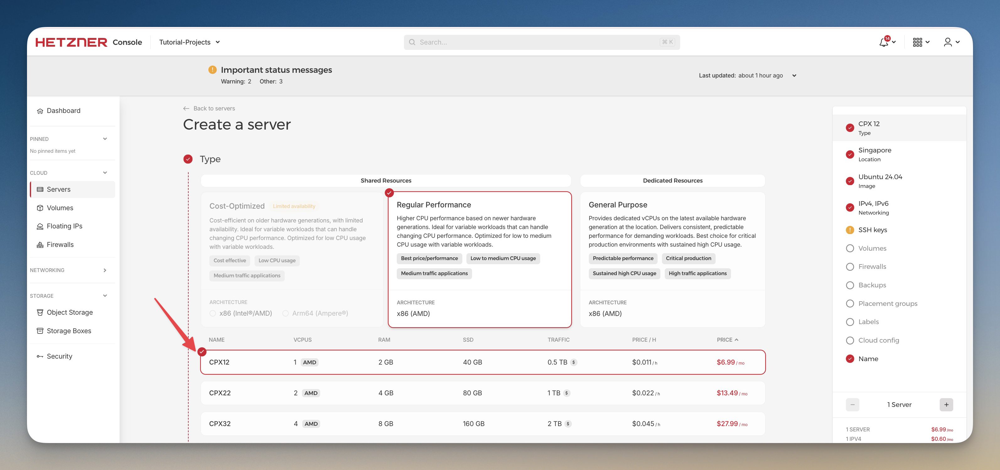

6. In the **SSH Keys** section, click **+ Add SSH key**

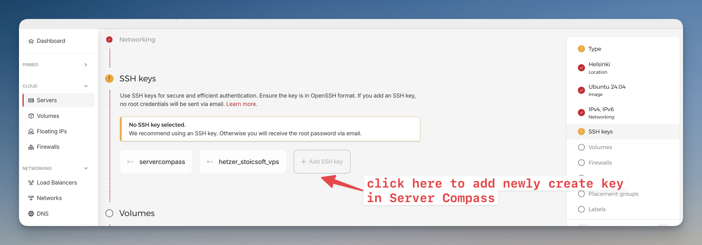

7. Paste the public key you generated in Step 1
8. Enter a name (for example: `my-demo-vps`)
9. Click **Add SSH key**

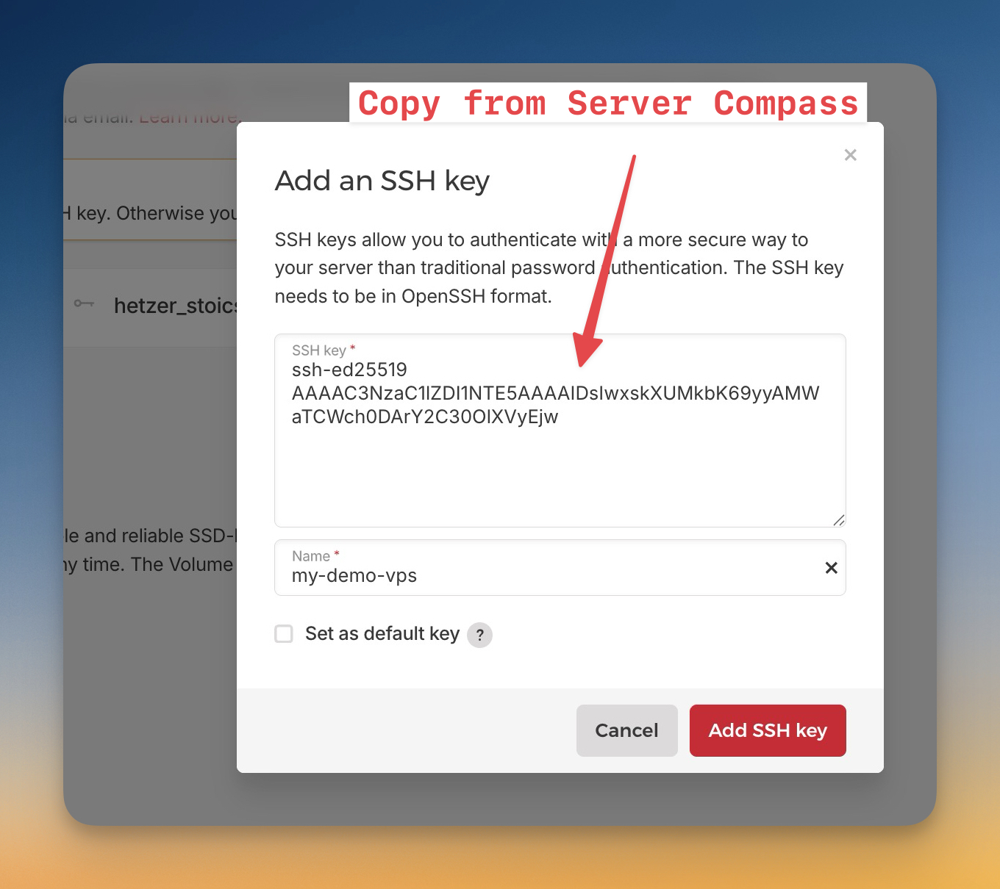

10. Set the server name to `my-demo-production`
11. Click **Create & Buy Now**

Your server will be ready in about 30 seconds. Note the **IPv4 address** displayed — you will need it in the following steps.

## Step 3 - Connect to Your Server

### Using the terminal

Connect to your server using SSH:

```bash
ssh root@<YOUR_SERVER_IP>
```

Replace `<YOUR_SERVER_IP>` with the IPv4 address from Step 2.

### Using Server Compass (Optional)

1. In Server Compass, click **Add Server**

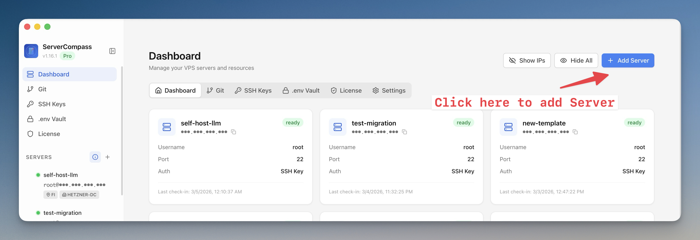

2. In the next screen, select `I know how to connect VPS before`

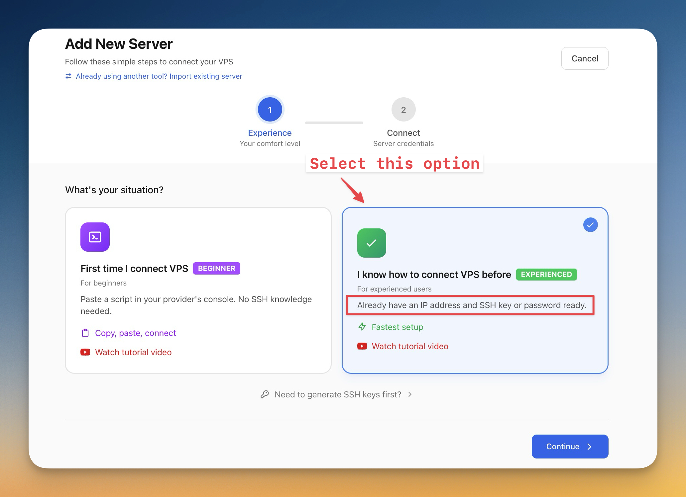

3. Fill in the following details:

   | Field                | Value                                   |
   | -------------------- | --------------------------------------- |
   | Display Name         | `my-demo-vps`                     |
   | Server IP / Hostname | Your server's IPv4 address from Step 2  |
   | Username             | `root`                                  |
   | Port                 | `22`                                    |

4. Under **Choose your authentication method**, select **SSH Key**
5. Select the key you created in Step 1 from the dropdown
6. Click **Test & Connect**

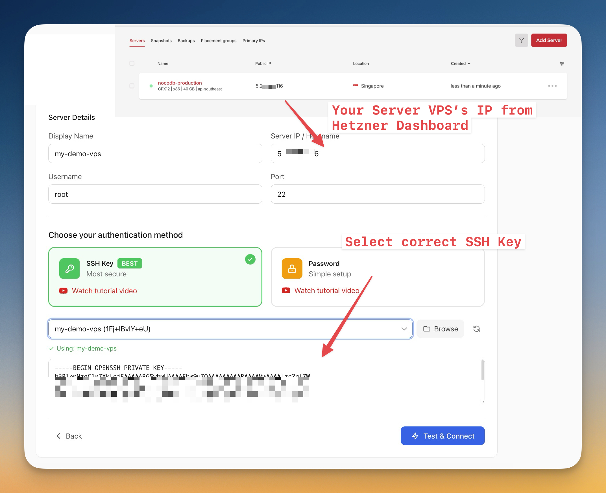

## Step 4 - Install Docker

Install Docker and Docker Compose on the server.

Update and upgrade the package lists:

```bash
apt update && apt upgrade -y
```

Install Docker:

```bash
apt install docker.io docker-compose-plugin -y
```

Enable Docker to start automatically on boot:

```bash
systemctl enable docker
systemctl start docker
```

Verify the installation:

```bash
docker --version
```

You should see output similar to `Docker version 24.x.x`.

## Step 5 - Deploy NocoDB with Docker

### Configure a Firewall

Enable a firewall to restrict open ports:

```bash
ufw allow OpenSSH
ufw allow 8080
ufw enable
```

This allows SSH access and the NocoDB web interface while blocking other incoming connections.

### Deploy Using Docker Compose

Create a directory for NocoDB and navigate into it:

```bash
mkdir -p ~/apps/nocodb && cd ~/apps/nocodb
```

Create a `docker-compose.yml` file:

```bash
nano docker-compose.yml
```

Paste the following configuration:

> **Note:** The passwords shown below are for demonstration purposes only. For production environments, replace them with secure randomly generated values before deploying.

```yaml
services:
  nocodb:
    image: nocodb/nocodb:latest
    ports:
      - "8080:8080"
    environment:
      - NC_DB=pg://db:5432?u=nocodb&p=CHANGE_THIS_PASSWORD&d=nocodb
      - NC_AUTH_JWT_SECRET=CHANGE_THIS_SECRET
      - NC_PUBLIC_URL=http://<YOUR_SERVER_IP>:8080
      - NC_DISABLE_TELE=false
    volumes:
      - nocodb_data:/usr/app/data
    restart: unless-stopped
    depends_on:
      db:
        condition: service_healthy

  db:
    image: postgres:16-alpine
    environment:
      - POSTGRES_DB=nocodb
      - POSTGRES_USER=nocodb
      - POSTGRES_PASSWORD=CHANGE_THIS_PASSWORD
    volumes:
      - db_data:/var/lib/postgresql/data
    restart: unless-stopped
    healthcheck:
      test: ["CMD-SHELL", "pg_isready -U nocodb -d nocodb"]
      interval: 10s
      timeout: 5s
      retries: 5
      start_period: 30s

volumes:
  nocodb_data:
  db_data:
```

Replace `<YOUR_SERVER_IP>` with your actual server IPv4 address, and both instances of `CHANGE_THIS_PASSWORD` and `CHANGE_THIS_SECRET` with secure values.

Save the file (`Ctrl+O`, then `Enter`, then `Ctrl+X`), then start the containers:

```bash
docker compose up -d
```

Docker will pull the NocoDB and PostgreSQL images and start both containers in the background.

### Deploy Using Server Compass (Optional)

Server Compass can automate the same deployment using a preconfigured NocoDB template.

1. Click on your server to open its detail page
2. Click the **Apps** tab
3. Click **+ New App** in the top right

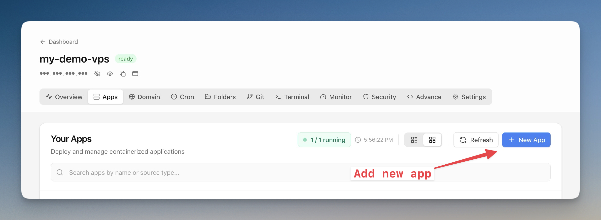

4. Select **App Template**

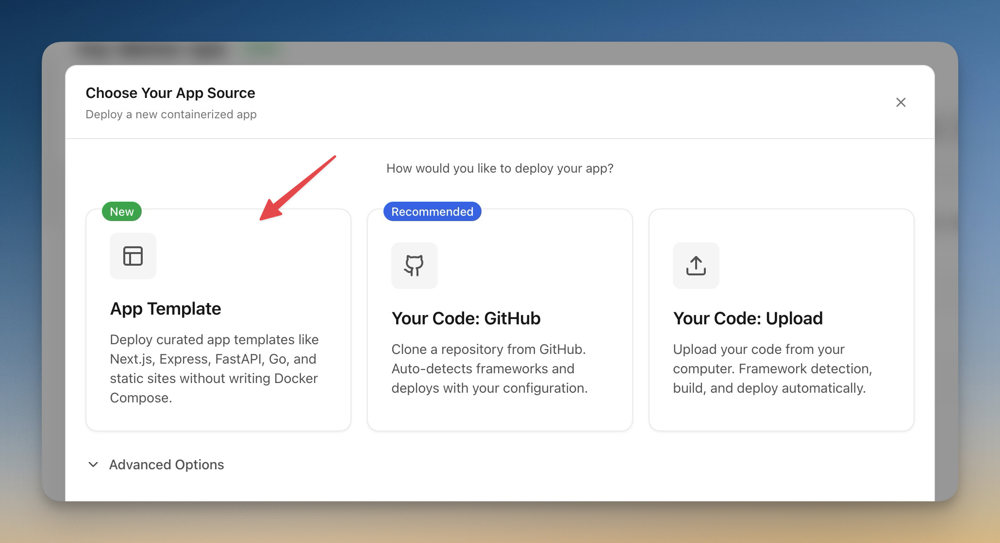

5. Search for `nocodb` and select the **NocoDB** template, then click **Next**

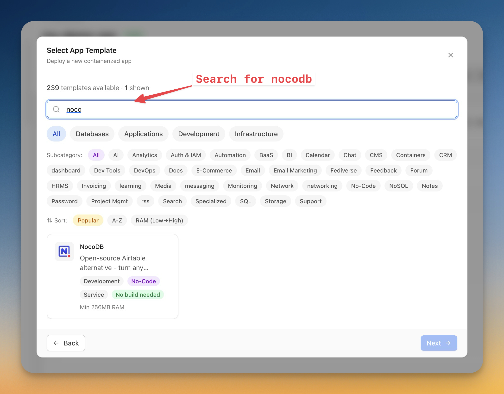

6. Enter a **Project Name** (e.g., `nocodb`) and keep the default port `8080`, then click **Next**

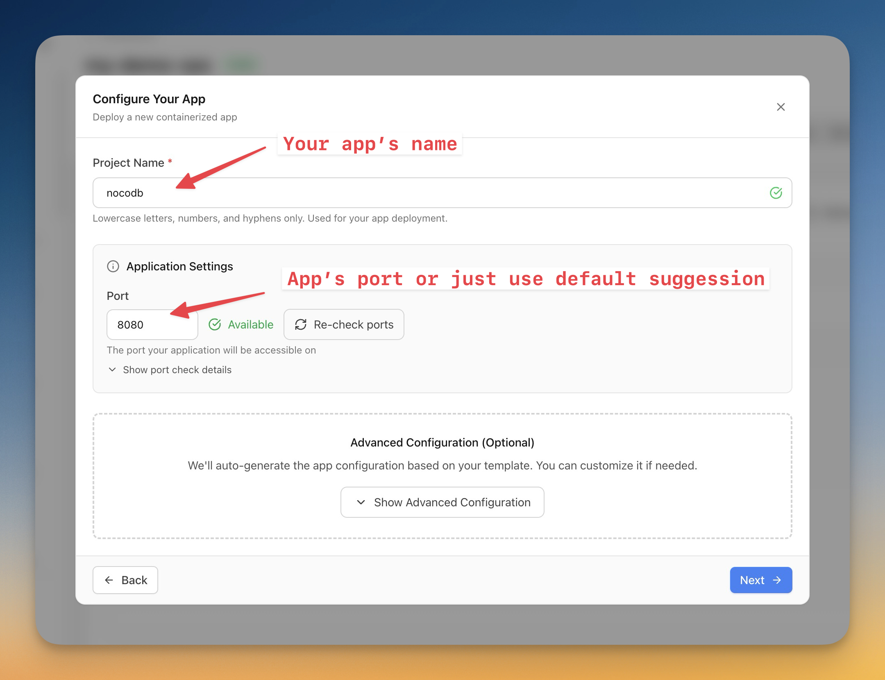

7. Review the environment variables, then click **Deploy**

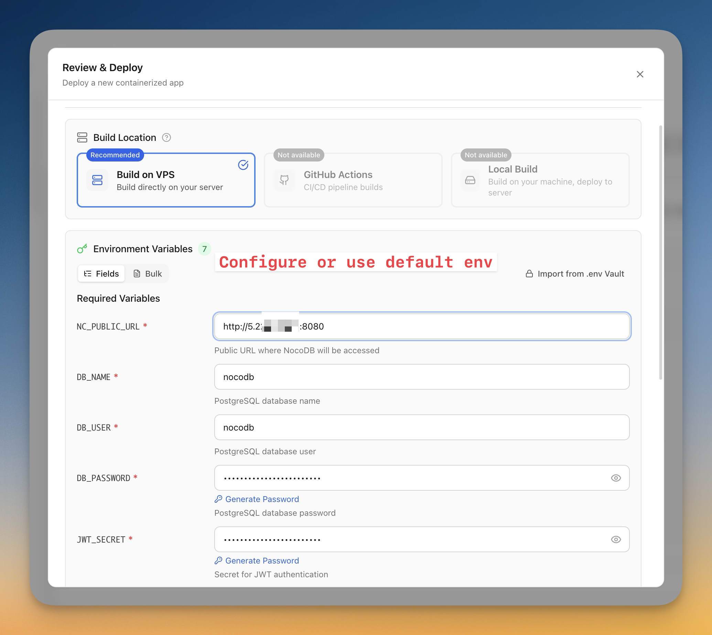

Server Compass will pull the Docker images, configure the containers, and start the application.

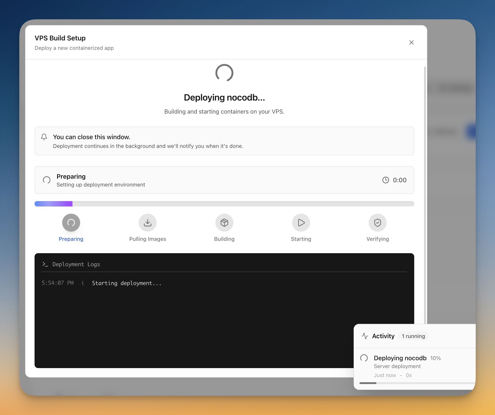

## Step 6 - Verify the Deployment

Verify that the NocoDB containers are running:

```bash
docker ps
```

You should see output similar to:

```
CONTAINER ID   IMAGE                  COMMAND                  CREATED             STATUS                       PORTS                                         NAMES
fe105f3ec178   nocodb/nocodb:latest   "/usr/bin/dumb-init …"   About an hour ago   Up About an hour             0.0.0.0:8080->8080/tcp, [::]:8080->8080/tcp   nocodb-nocodb-1
789a818a5e36   postgres:16-alpine     "docker-entrypoint.s…"   About an hour ago   Up About an hour (healthy)   5432/tcp                                      nocodb-db-1
```

Both containers should show an `Up` status.

> **Note:** On a fresh server, the PostgreSQL container usually needs around 20–40 seconds to pass its health check before NocoDB starts responding. If the NocoDB container shows `starting` rather than `Up`, wait a moment and run `docker ps` again.

## Step 7 - Access NocoDB

Open your browser and navigate to:

```
http://<YOUR_SERVER_IP>:8080
```

Replace `<YOUR_SERVER_IP>` with your server's actual IPv4 address from Step 2.

You will see the NocoDB sign-up page. Create your admin account to get started.

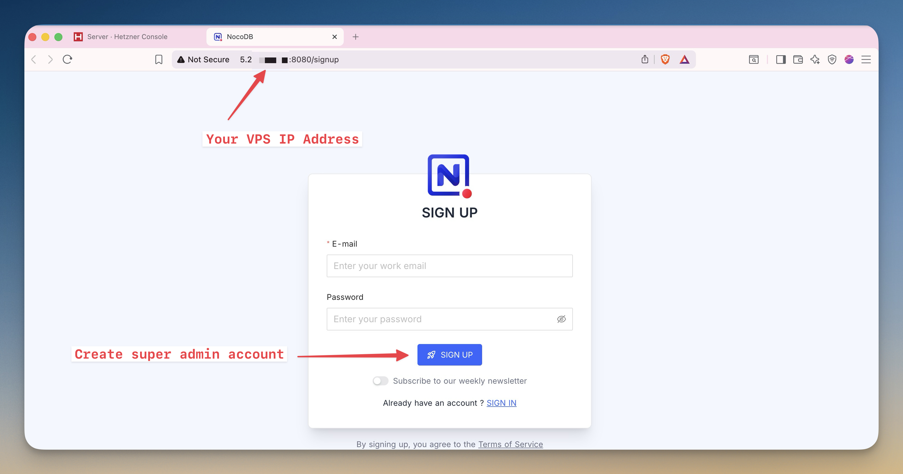

After signing in, you are ready to create your first table in NocoDB.

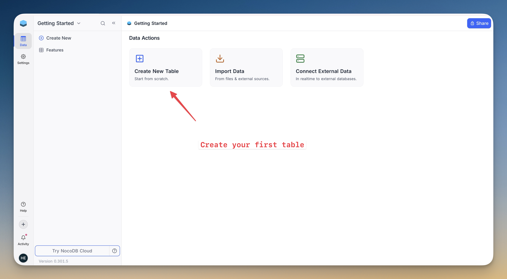

> **Note:** Accessing the application through an IP address is fine for testing. For production deployments, it is recommended to configure a domain and HTTPS using a reverse proxy such as Nginx, Traefik, or Caddy.

## Troubleshooting

If you cannot access the NocoDB interface, check the following:

**Container status**

Run `docker ps` to check if both containers are running. If a container is missing, inspect the logs:

```bash
docker compose logs nocodb
```

**Port access**

Confirm that port 8080 is allowed by your firewall:

```bash
ufw status
```

If port 8080 is not listed, add it:

```bash
ufw allow 8080
```

**Server IP address**

Verify you are using the correct IPv4 address from the Hetzner Cloud Console. IPv6 addresses will not work unless NocoDB is specifically configured for them.

**Container startup time**

The PostgreSQL container runs a health check before NocoDB starts. Wait 30–60 seconds after running `docker compose up -d` before accessing the interface.

## Conclusion

NocoDB is now running on your server and ready to use. Because the application runs in Docker containers, updating or restarting it later is as simple as running `docker compose pull` and `docker compose up`.

```bash
docker compose pull && docker compose up -d
```

**Next steps:**

* Configure a domain name and HTTPS using a reverse proxy
* Create your first NocoDB project
* Configure backups for the PostgreSQL volume

##### License: MIT

<!--

Contributor's Certificate of Origin

By making a contribution to this project, I certify that:

(a) The contribution was created in whole or in part by me and I have
    the right to submit it under the license indicated in the file; or

(b) The contribution is based upon previous work that, to the best of my
    knowledge, is covered under an appropriate license and I have the
    right under that license to submit that work with modifications,
    whether created in whole or in part by me, under the same license
    (unless I am permitted to submit under a different license), as
    indicated in the file; or

(c) The contribution was provided directly to me by some other person
    who certified (a), (b) or (c) and I have not modified it.

(d) I understand and agree that this project and the contribution are
    public and that a record of the contribution (including all personal
    information I submit with it, including my sign-off) is maintained
    indefinitely and may be redistributed consistent with this project
    or the license(s) involved.

Signed-off-by: Kai Builder (hello@stoicsoft.com)

-->