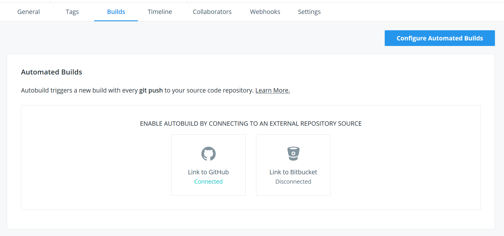
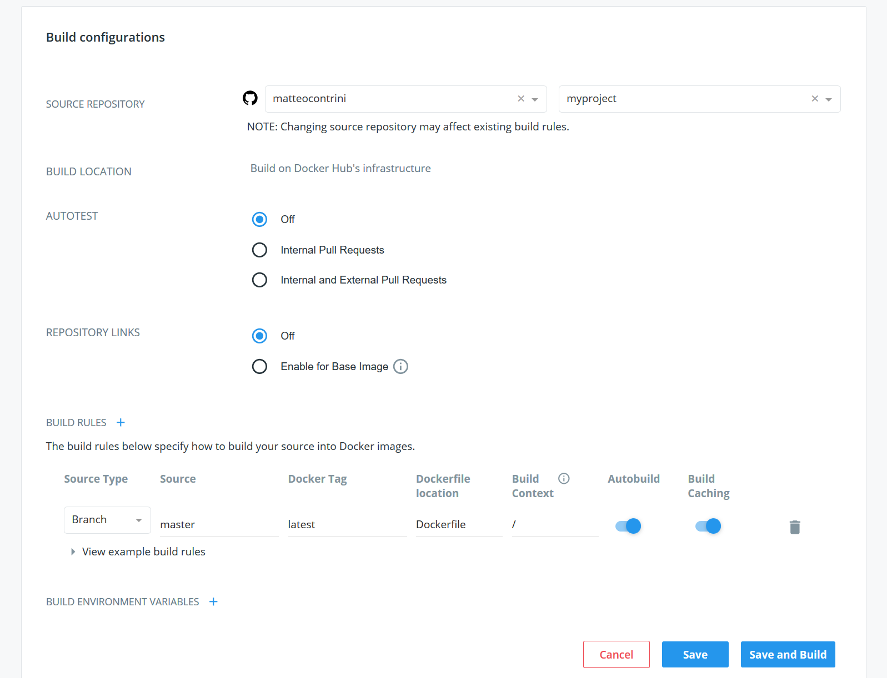
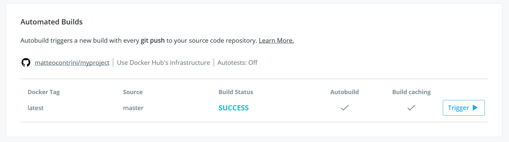

## Introduction

Node.js is a JavaScript runtime that in the past years has become popular for building server-side apps.

This tutorial shows how to deploy a Node.js application to a cloud server through Docker, Docker Hub and Docker Compose.

**Prerequisites**

- This tutorial assumes that you have Docker installed on your local system. If you don't have it, you can find the instructions for installing it in the [official documentation](https://docs.docker.com/install/)
- You should also have a cloud server with a Linux distribution, preferably Ubuntu 18.04. If you are using another distribution, you might have to look for specific instructions when it's time to install Docker on your server
- Some steps also require that you have Docker Hub (free) account to upload the Docker image for the application
- If you don't have any previous Docker experience, that's fine, this tutorial is pretty basic and explains the main concepts around what we're doing

**About Docker**

In case you're just getting started with Docker, here are some terms that are worth reviewing, to make sure that we're on the same track.

- **Images**: in Docker, images are "snapshots" or templates of a file system, and contain everything that is needed to launch an application
- **Containers**: these are the actual running instances of the application. They are created by taking a template (an image) and turning it into something that can be started and has a state
- **Layers** are the elements that compose a Docker image. Each layer is built on top of another one, allowing to provide a feature called layer caching. This means that you don't need to re-build or re-download all the layers of an image when only one of them changes
- **Registries** are the place where you upload (*push*) images to make them available to the world, or to those that have the credentials to access it. In this tutorial, we're going to use Docker Hub, but there are also alternatives provided by GCP, AWS, Azure, GitHub, and others.

## Step 1 - Create a Dockerfile

Create a file called `Dockerfile` with the following content in the root of your Node.js project directory:

```do
FROM node:10.16

WORKDIR /app

COPY package*.json .

RUN npm ci --only=production

COPY . .

EXPOSE 8080

CMD [ "node", "index.js" ]
```

The `Dockerfile` is the place where you put the instructions that allow Docker to *build* an image. Every instruction represents the creation of a layer, which is a modification of the image file system that is being created.

In this case, we're composing our image by starting from a template, sometimes called the *base image*, that in this case is `node:10.16`. This is an official image provided by the Docker company, and you can find more about it [here](https://hub.docker.com/_/node/).

The next step moves the current working directory to `/app`, which is where the following instructions will be executed.

The line `COPY package*.json .` has the effect of copying the files `package.json` and `package-lock.json` into the `/app` directory of the Docker image file system. Note that the dot at the end is required to indicate the current directory.

We now use the `RUN` instruction to install production dependencies, by using the `npm ci` command introduced with [npm 5.7.0](https://blog.npmjs.org/post/171556855892/introducing-npm-ci-for-faster-more-reliable).

One thing that should be noted at this point is that until now we copied in the build only the `package*.json` files, instead of the whole project directory. This allows to leverage Docker layers caching, so that if the dependent packages are unchanged, the layers can be reused without rebuilding them.

The following line (`COPY . .`) copies the remaining files in the image. Optionally, we can tell Docker that we want to expose a specific network port of the container, so that a web application can be accessed through it.

Finally, the last instruction determines the command that should be used by Docker to run the application when the container starts. In this case, we're assuming that the entrypoint of the application is the `index.js` file.

Usually, it's a good idea to also create a file called `.dockerignore`, together with the `Dockerfile`. This makes sure that, when you run `COPY . .`, useless files from your computer are not copied inside the image:

```
.git
Dockerfile
node_modules
```

In this case, we're not interested in having development versions of directories like `.git` or `node_modules` available inside the template we're building.

## Step 2 - Build the image

Now that we have a `Dockerfile`, we can tell Docker to use it to build an image.

The basic command to do that looks like the following one, and must be executed in the root directory of the project:

```sh
docker build -t myproject .
```

The `-t` option specifies the name of the image, in this case `myproject`. The `.` at the end of the line is required to tell Docker to look for a `Dockerfile` in the current directory.

**NOTE**: the first time that you run the build it will take a while, because Docker has to download all the layers of the base image (Node.js 10.16 in this case).

Since we're going to upload this image to the Docker Hub online registry (to make it accessible from our server), we need to name the image by using a specific convention.

The command above would therefore look like this:

```sh
docker build -t username/myproject:latest .
```

Where `username` is your Docker Hub username, and `latest` is the *tag* of the image. An image can have multiple tags, so you sometimes see a workflow similar to this:

```sh
docker build -t myproject .
docker tag myproject username/myproject:latest
docker tag myproject username/myproject:20190926
```

These commands build an image and then tag it with the tags `latest` and `20190926` (the date when this tutorial was written).

Docker Hub doesn't remove old images by default, so this allows to have an history of all the images that you pushed to the registry. The image with tag `latest` will always be the one that was most recently built, while the older ones will be tagged with a date.

## Step 3 - Push the image

Now that we have the image, we need to push it to the registry. First of all, run the following command to make sure that your Docker instance is authenticated with Docker Hub:

```sh
docker login
```

Then run `docker push` to upload the image, together with all the tags.

```sh
docker push username/myproject
```

If your application is small, this command should be fast to complete, because it needs to upload only the layers corresponding to your Node.js application and its JavaScript dependencies.

When you have a new version of the image, you should run the push command again to make sure it's uploaded on Docker Hub.

## Step 4 - Install Docker on Ubuntu 18.04

We can now move to the server to install Docker and Docker Compose. As mentioned in the prerequisites, the assumption here is that you have an Ubuntu 18.04 server that is already up and running.

First of all, installing Docker requires some system dependencies, which can be installed with the following commands:

```sh
sudo apt-get update
sudo apt-get install \
    apt-transport-https \
    ca-certificates \
    curl \
    gnupg-agent \
    software-properties-common
```

Now add the official Docker GPG key and configure a custom apt repository:

```sh
curl -fsSL https://download.docker.com/linux/ubuntu/gpg | sudo apt-key add -
sudo add-apt-repository \
   "deb [arch=amd64] https://download.docker.com/linux/ubuntu \
   $(lsb_release -cs) \
   stable"
```

Finally, update the apt index again and install Docker Community Edition:

```sh
sudo apt-get update
sudo apt-get install docker-ce
```

We're also going to install Docker Compose 1.24.1, by simply downloading a binary file. Docker Compose is a tool that greatly simplifies the management of containers and their lifecycle.

```sh
sudo curl -L "https://github.com/docker/compose/releases/download/1.24.1/docker-compose-$(uname -s)-$(uname -m)" -o /usr/local/bin/docker-compose
sudo chmod +x /usr/local/bin/docker-compose
```

One last useful step consists of adding the current Ubuntu user to the `docker` group, so that we can run Docker commands directly from it.

This can be easily done with the following command:

```sh
sudo gpasswd -a myuser docker
```

Verify that everything went fine by executing the following commands:

```sh
docker --version
docker ps
docker-compose --version
```

If you're not seeing any errors or warnings, you're good to go.

## Step 5 - Run the container with Docker Compose

Create a file called `docker-compose.yml` with the following content on your server:

```yaml
version: '3'

services:
  myproject:
    container_name: 'myproject'
    image: 'username/myproject'
    restart: unless-stopped
```

This is a very basic Docker Compose file that configures a single container called `myproject`, based on the `username/myproject` image from Docker Hub. If you don't specify a tag, it will default to `latest`, but you can also set a specific one, if you want:

```yaml
version: '3'

services:
  myproject:
    container_name: 'myproject'
    image: 'username/myproject:20190901'
    restart: unless-stopped
```

Finally, the `restart` property indicates that the container should be automatically restarted when it crashes, unless it is manually stopped.

If you now run this `up` Compose command, the Docker image will be pulled from the registry and your application will hopefully run:

```sh
docker-compose -f docker-compose.yml up
```

This command creates a container and executes it. The output of the container is captured by Docker and presented to you in the console. Press CTRL + C (or CMD + C) and wait some seconds for the container to stop.

If everything went fine, you're now ready to launch the container as a daemon, so that it will keep running in the background, until stopped. This can be achieved by adding the `-d` option to the command:

```sh
docker-compose -f docker-compose.yml up -d
```

Boom, node! (oops, I meant done)

Make sure you take a quick look at the Compose file [reference documentation](https://docs.docker.com/compose/compose-file/), where you can find useful features like mapping network ports between the server and the container. Here's a quick example that maps the external port 80 to the internal port 8080:

```yaml
version: '3'

services:
  myproject:
    container_name: 'myproject'
    image: 'username/myproject'
    restart: unless-stopped
    ports: '80:8080'
```

## Step 6 - Enable automated builds (optional)

Fantastic, you have now deployed the first release of your *containerized* Node.js application.

If your application code is hosted in a git repository on GitHub or BitBucket, I have great news for you: the Docker build process can be automated in the cloud for free by using Docker Hub.

If you go in the "Builds" tab of your image on Docker Hub, you'll be prompted with a similar page:



After linking your GitHub or BitBucket account, select the repository where your code and `Dockerfile` lie. The default configuration that Docker Hub suggests is fine for a first build, so click the "Save and Build" button and wait.



A Docker build will be started in the cloud in a few minutes, and you'll then find a new image with the tag  `latest` automatically pushed in the *Tags* section. Every new commit (push) on your git repository will now trigger a new build.



## Step 7 - Deploy a new version

Let's say that you need to publish a change to your application. Unless you enabled automated builds, you need to repeat steps 2 and 3, so that a new image will appear on Docker Hub.

Then, on your server, you must manually pull the new image, like this:

```sh
docker-compose -f docker-compose.yml pull
```

And restart the container with the new image:

```sh
docker-compose -f docker-compose.yml up -d --force-recreate
```

## Conclusion

Great, you did it! This was a basic introduction to deploying a Node.js application to Ubuntu 18.04 by using Docker, Docker Hub and Docker Compose.

We've seen how to write a simple `Dockerfile`,  how to build the image, push it, and deploy it on a server. Setting up automated builds is useful and a first step into the Continuous Integration and Delivery world (CI/CD).

There's a lot more about Docker that is not covered by this tutorial, so make sure that you take a look at the Docker and Docker Compose documentation to learn more about the concepts and features.

##### License: MIT

<!--

Contributor's Certificate of Origin

By making a contribution to this project, I certify that:

(a) The contribution was created in whole or in part by me and I have
    the right to submit it under the license indicated in the file; or

(b) The contribution is based upon previous work that, to the best of my
    knowledge, is covered under an appropriate license and I have the
    right under that license to submit that work with modifications,
    whether created in whole or in part by me, under the same license
    (unless I am permitted to submit under a different license), as
    indicated in the file; or

(c) The contribution was provided directly to me by some other person
    who certified (a), (b) or (c) and I have not modified it.

(d) I understand and agree that this project and the contribution are
    public and that a record of the contribution (including all personal
    information I submit with it, including my sign-off) is maintained
    indefinitely and may be redistributed consistent with this project
    or the license(s) involved.

Signed-off-by: Matteo Contrini (matteo@contrini.it)

-->
