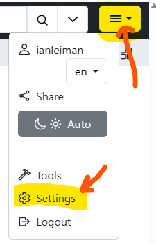
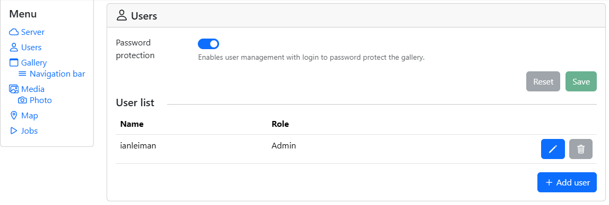
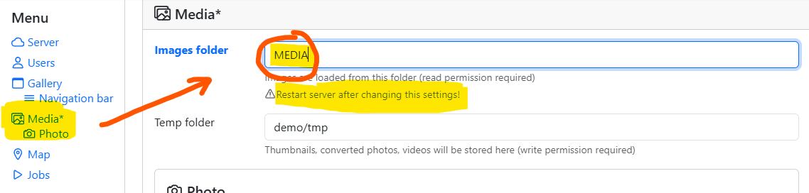

## Introduction

In this tutorial, we'll deploy a [PiGallery2 photo
gallery](https://github.com/bpatrik/pigallery2) application on a Hetzner
cloud server.

PiGallery2 is a **fast** (like faster than your PC
fast) **directory-first photo gallery website**, optimised for running
on low resource servers, especially on Raspberry Pi, but it will be
lightning fast even on a low end [Hetzner cloud
server](https://www.hetzner.com/cloud) such as CX23.

A live demo can be seen at [pigallery2.onrender.com](https://pigallery2.onrender.com/)


PiGallery2 is open source and free for personal use. PiGallery2 is
implemented in TypeScript language, and it has a backend that runs on
[node.js server](https://nodejs.org/en), and a fluent Single Page
Application (SPA) Web Graphical User interface based on JavaScript.
There is active development and a big supporting community.

By the end of this tutorial, you'll have a working PiGallery2 photo
gallery application deployed on your own server with automatic HTTPS.
PiGallery2 is deployed here on a basic Ubuntu Linux system, which should
have Apache and node.js installed. PiGallery2 will run on node.js server
on port 3000 as system service, and Apache reverse proxy makes the
server securely available to the public Internet.

**Prerequisites**

To run PiGallery you need to have the following prerequisites. Setting
these up is not in scope of this tutorial as there are other tutorials
available for this.

- A server with Ubuntu 24.04 and at least 4GB RAM
  > A [Hetzner cloud server](https://www.hetzner.com/cloud) such as CX23 is
  > a good choice for running PiGallery. CX23 will have enough performance
  > to additionally run many other lightweight web services in parallel. You can use
  > the [LAMP stack](https://docs.hetzner.com/cloud/apps/list/lamp-stack)
  > image to get a working Ubuntu and Apache out of the box. Note that PHP
  > and MySQL are not required for PiGallery but may be useful for running
  > other services in the same server.
- sudo privilege
- [Apache web server](https://ubuntu.com/tutorials/install-and-configure-apache#2-installing-apache) and node.js already installed
  ```bash
  sudo apt install nodejs apache2
  apache2 -v && nodejs -v
  ```
- [certbot already installed](https://certbot.eff.org/instructions?ws=apache&os=pip) for [Let's Encrypt](https://letsencrypt.org/) HTTPS
- A domain name you can configure
- Last but not least: you should have some media files on your server. For testing purposes, you can download an image by running:
  ```bash
  mkdir -p "$HOME/mediafiles"
  wget -O "$HOME/mediafiles/image.png" https://picsum.photos/200
  ```

**Example terminology**

* Domain: `example.com`
* Server public: `203.0.113.1`
* User name: `holu`
* Media directory: `/home/holu/mediafiles`

## Step 0 - Preparing the media files

PiGallery supports viewing JPEG, WebP, PNG, SVG, MP4, OGG, OGV, WebM
media files. It can easily show 100K files in a directory hierarchy.

It can access any media directory mounted on your server for which
it has read access. Unlike many other web media galleries, the media is
not stored to any database. You can simply copy your media to any
directory accessible to your server. You can use any methods of your
choice to manage those files such as FTP or SCP.

If you use a server like the Hetzner cloud server plan CX23, you will have 40 GB NVME storage
out of box, out of which about 30 GB you could dedicate to media files.
If that is not enough, then you can easily extend that up to 10TB with
block storage volumes.

PiGallery shows your media in directory hierarchy. It is a good practice
to organize your media files into a directory hierarchy by a topics or
categories, where each directory has no more than 100 files or
sub-directories.

In this tutorial we assume that your media files are located in a
directory `/home/holu/mediafiles`

## Step 1 - Installing nvm and node

PiGallery2 requires node version 22. It is best to install node using
Node Version Manager [nvm](https://www.nvmnode.com/), which we will
install first, and then [node](https://nodejs.org/en) and
[npm](https://www.npmjs.com/), specifically version 22. The latest 24 is
too new.

```bash
# install nvm
sudo curl -o- https://raw.githubusercontent.com/nvm-sh/nvm/v0.39.7/install.sh | bash
source ~/.bashrc

# optional: list available versions
nvm ls-remote

# install node 22
nvm install 22     
nvm use 22
nvm alias default 22

# verify versions
node -v
npm -v
```

We also install [ffmpeg](https://www.ffmpeg.org/), that is required for
video processing.

```bash
sudo apt install ffmpeg
```

## Step 2 - Installing PiGallery

At the time of writing, PiGallery release `3.0.1` is the latest one, released November 2025. A
release zip package is available at GitHub , see: [github.com/bpatrik/pigallery2/release](https://github.com/bpatrik/pigallery2/releases)

Here we use wget to download the zip which we then unzip to a directory
`/home/holu/pigallery/rel300`. You can chose some other
directory of course.

```bash
mkdir $HOME/pigallery
cd $HOME/pigallery
wget https://github.com/bpatrik/pigallery2/releases/download/3.0.1/pigallery2-release.zip
unzip pigallery2-release.zip -d rel300
```

Now we are ready to run the npm install, which will fetch all required
node packages automatically.

> Note that you need to have nodejs, npm, ffmpeg installed already

```bash
cd rel300 
npm install
```

Now you are ready to test that it works

```bash
mkdir -p $HOME/pigallery/rel300/demo/tmp
npm start -- --Server-port=3000
```

This will fire up PiGallery on localhost port 3000. Assuming your server
has the IP address `203.0.113.1`, you should now be able to see
PiGallery running at `http://203.0.113.1:3000`. You can choose some
other port number of course. Note that ports numbered **1024 and
higher** do not require root access to use, and ports below 1024 are
considered privileged and do require root privilege.

This will work only if you have configured your server to allow access
port 3000 externally. Or the other way around, you have not blocked port
3000 access with a firewall for example. At a later section, this
tutorial will show how to harden your server for better security.

After launching PiGallery this way, you can stop it running via `ctrl`+`c` in the
terminal. Or if you leave terminal open, it will eventually time out and
kill the child process PiGallery. A later section explains how you can
make PiGallery a system service that runs always.

## Step 3 - Configuring PiGallery on first run

On first run, PiGallery creates a `config.json` file, which contains the
application configuration. `config.json` can be edited manually but it is
better to use the UI to configure. To find the configuration after logging into the UI:

* Click on the hamburger menu in the top right corner
* Select "Settings"

On first run, also a SQLite database is created to store persistent data
used by the application.

The default Admin account on first run is:

* user: `admin`
* pass: `admin`

You should change this immediately. Login as admin/admin and then go to
settings:



- In Users, click `Add User`, give a name other than admin, role Admin
  and a good password.

- Once a new Admin-level user added, log out

- log in with your new Admin-level user credentials

- open settings

- In Users: click the trash can to remove the default admin/admin
  account

- log out again, and login again

- now confirm that the default admin/admin account is gone

You can add other accounts too, and it is recommended to add User and
Guest level accounts. Note that the passwords are stored encrypted.


### location of your media gallery

The next important thing to configure is the location of your media
gallery. Assuming your media files are located in
`/home/holu/mediafiles` and PiGallery is installed at
`/home/holu/pigallery/rel300`, use following commands to
link them. Make sure that you have read access for all of the media
files and directories.

```bash
cd $HOME/pigallery/rel300
ln -s $HOME/mediafiles MEDIA
```

In PiGallery settings, Media, enter to `Image Folder`: MEDIA. Then
click Save. Click on top menu `Gallery` to view your media.


Full list of configuration options are available at
the [MANPAGE.md](https://github.com/bpatrik/pigallery2/blob/master/MANPAGE.md).

## Step 4 - Configuring PiGallery systemd service

Now we configure PiGallery as a systemd service so that it runs 24/7.
This requires sudo privilege.

First we ned to know what the full path to node version 22 is, because
PiGallery needs exactly this version. If you installed node using nvm as
in previous steps and set version 22 as default, then you can use
`which node` command to see the path.

```bash
which node
/home/holu/.nvm/versions/node/v22.21.1/bin/node
```

In case your system default is some other version, then use `nvm which 22`

```bash
nvm which 22
/home/holu/.nvm/versions/node/v22.21.1/bin/node
```

Then we need to edit a file named
`/lib/systemd/system/pigallery.service`.

```bash
sudo nano "/lib/systemd/system/pigallery.service"
```

Below is an example `/lib/systemd/system/pigallery.service`, with
following configuration.

- use server port 3000 (you can change this)

- run node in production mode (you can also `development` for
  troubleshooting)

- PiGallery is to run as user `holu`

- PiGallery is installed at `/home/holu/pigallery2/rel300/`

- node version 22 is at
  `/home/holu/.nvm/versions/node/v22.21.1/bin/node`

```ini
[Unit]
Description=PiGallery 3.0.1 photo gallery
After=network-online.target

[Service]
Environment="NODE_ENV=production"
Environment="PORT=3000"
Restart=on-failure
User=holu
WorkingDirectory=/home/holu/pigallery/rel300/
ExecStart=/home/holu/.nvm/versions/node/v22.21.1/bin/node /home/holu/pigallery/rel300/src/backend/index.js

[Install]
WantedBy=multi-user.target
```

Now that the `pigallery.service` file is in place, you can run commands to load the
configuration and (re)start the service `pigallery`.

```bash
sudo systemctl daemon-reload
sudo systemctl restart pigallery
sudo systemctl status pigallery

# If it works, enable, do a reboot
sudo systemctl enable pigallery
sudo reboot

# After reboot, check status
sudo systemctl status pigallery
```

If it started ok, then you should see PiGallery running at:

```http
http://<serverip>:3000
```

### Troubleshooting

If PiGallery did not start, then following command will show error
messages:

```bash
sudo journalctl -lf -u pigallery
```

The most common problem is that the node version is wrong, node package
installations have failed, or `npm install` was a fail.

### Some useful commands

Following commands can be used to stop, restart, reload the service and
debug problems.

```bash
sudo systemctl daemon-reload            # reload configuration changes
sudo systemctl stop pigallery           # stop the service
sudo systemctl restart pigallery        # start the service
sudo systemctl disable pigallery        # disable
sudo systemctl enable pigallery         # enable
cat /lib/systemd/system/pigallery.service        # check the configuration
sudo nano /lib/systemd/system/pigallery.service  # edit the configuration
lsof -i:3000                            # check port 3000
ps -efl | grep "port=3000"              # processes related to port 3000
sudo journalctl -lf -u pigallery        # journal
```

## Step 5 - Configuring Apache and reverse proxy

Now PiGallery is running at port 3000 as `http://<serverip>:3000`,
but it is more convenient and secure if you could access it like
`https://mygallery.example.com`. This can be done assigning your
server's IP address to a domain name like `mygallery.example.com` and
then configuring Apache web server to proxy that domain name to port
3000.

How to configure DNS records to your server is not in scope of this
tutorial as there are other tutorials covering that. Following
instructions assume that you have configured `mygallery.example.com`
to point at your server's IP address.

### Test setup

It is a good practice to first test a new Apache virtual host with plain
HTML service before going to a proxy service. You can skip this step if
you are confident that your Apache surely works.

Create a file named `mygallery.example.com.conf` in
`/etc/apache2/sites-available/`:

```bash
sudo nano /etc/apache2/sites-available/mygallery.example.com.conf
```

Paste the following into the file:

```conf
<VirtualHost *:80>
ServerName mygallery.example.com
ServerAlias www.mygallery.example.com
DocumentRoot /var/www/mygallery

<Directory /var/www/mygallery>
Options Indexes FollowSymLinks
AllowOverride All
Require all granted
</Directory>

ErrorLog ${APACHE_LOG_DIR}/mygallery_error.log
CustomLog ${APACHE_LOG_DIR}/mygallery_access.log combined
</VirtualHost>
```

Create the Document Root

```bash
sudo mkdir -p /var/www/mygallery
sudo chown -R $USER:$USER /var/www/mygallery
```

Add a simple `index.html` to test:

```bash
echo "<h1>Welcome to MyGallery</h1>" | sudo tee /var/www/mygallery/index.html
```

Enable the Site and Restart Apache

```bash
sudo a2ensite mygallery.example.com.conf
sudo systemctl reload apache2
```

Now at **http://mygallery.example.com** you should your `index.html`

### Enable HTTPS

Most browsers will complain about your site being unsecure unless you
have HTTPS enabled.

Following instructions assume you will use [**Let's
Encrypt**](https://letsencrypt.org/) with the certbot tool. If you do
not have certbot already, then following commands will install it for
you. Skip this if you already have certbot:

```bash
sudo apt update
sudo apt install certbot python3-certbot-apache
```

Run this command to automatically configure HTTPS for your site

```bash
sudo certbot --apache -d mygallery.example.com
```

Let's Encrypt certificates expire every 90 days. Certbot sets up a cron
job or systemd timer to renew them automatically. You can test it with:

```bash
sudo certbot renew --dry-run
```

Visit **https://mygallery.example.com** in your browser. You should see
a secure connection with padlock icon.

Certbot has created a new file
`/etc/apache2/sites-available/mygallery.example.com-le-ssl.conf`.

At the beginning of that file you see virtual server for port 443 that
is the HTTPS port and Apache mod_ssl module is enabled for SSH.

```conf
<IfModule mod_ssl.c>
<VirtualHost *:443>
```

Then at the ned of the file there are the paths to SSL certificates for
this site

```bash
SSLCertificateFile /etc/letsencrypt/live/mygallery.example.com /fullchain.pem
SSLCertificateKeyFile /etc/letsencrypt/live/mygallery.example.com /privkey.pem
Include /etc/letsencrypt/options-ssl-apache.conf
```

Then new lines are added at end of
`/etc/apache2/sites-available/mygallery.example.com.conf` that will
redirect HTTP requests to the HTTPS to prevent unsecure access.

```conf
RewriteEngine on
RewriteCond %{SERVER_NAME} = mygallery.example.com
RewriteRule ^ https://%{SERVER_NAME}%{REQUEST_URI} [END,NE,R=permanent]
```

This information is needed for the next step.

### Proxy configuration 

Finally we change `mygallery.example.com` to connect to the PiGallery
service running on localhost port 3000.

* First you need to enable Apache proxy modules and restart Apache.
  ```bash
  sudo a2enmod proxy
  sudo a2enmod proxy_http
  sudo systemctl restart apache2
  ```

* Then modify `/etc/apache2/sites-available/mygallery.example.com.conf`

  ```conf
  # site mygallery.example.com
  # which is PiGallery2 nodejs app on port 3000
  <VirtualHost *:80>
  ServerName mygallery.example.com
  ServerAlias www.mygallery.tests.example.com
  
  ProxyPreserveHost On
  AllowEncodedSlashes On
  ProxyPass / http://localhost:3000/
  ProxyPassReverse / http://localhost:3000/
  <Proxy *>
     Require all granted
     Options None
  </Proxy>
      
  ErrorLog ${APACHE_LOG_DIR}/mygallery_error.log
  CustomLog ${APACHE_LOG_DIR}/mygallery_access.log combined
  RewriteEngine on
  RewriteCond %{SERVER_NAME} = mygallery.example.com
  RewriteRule ^ https://%{SERVER_NAME}%{REQUEST_URI} [END,NE,R=permanent]
  </VirtualHost>
  ```

* Modify `/etc/apache2/sites-available/mygallery.example.com-le-ssl.conf`
  
  ```conf
  # site mygallery.example.com
  # which is PiGallery2 nodejs app on port 3000
  <IfModule mod_ssl.c>
  <VirtualHost *:443>
  ServerName mygallery.example.com
  ServerAlias www.mygallery.example.com
  
  ProxyPreserveHost On
  AllowEncodedSlashes On
  ProxyPass / http://localhost:3000/
  ProxyPassReverse / http://localhost:3000/
  <Proxy *>
     Require all granted
     Options None
  </Proxy>
      
  ErrorLog ${APACHE_LOG_DIR}/mygallery_error.log
  CustomLog ${APACHE_LOG_DIR}/mygallery_access.log combined
  
  SSLCertificateFile /etc/letsencrypt/live/mygallery.example.com /fullchain.pem
  SSLCertificateKeyFile /etc/letsencrypt/live/mygallery.example.com /privkey.pem
  Include /etc/letsencrypt/options-ssl-apache.conf
  </VirtualHost>
  ```

* Now restart Apache
  ```bash
  sudo systemctl restart apache2
  ```

Visit `https://mygallery.example.com` to verify that PiGallery is now
accessible and running as expected. Now you have your media gallery
online.

## Step 6 - Final touches

Log into PiGallery and go to:

* Settings » Server

Add the following information:

| Option     | Content |
| ---------- | -------- |
| Public URL | https://mygallery.example.com |
| Page title | "My amazing PiGallery" or something like it |

Full list of configuration options are available at
the [MANPAGE.md](https://github.com/bpatrik/pigallery2/blob/master/MANPAGE.md).
There are a lot of things you can configure. Many languages are
supported.

### Server logs

The file `\${APACHE_LOG_DIR}/mygallery_access.log` will contain an
access log to your PiGallery.

You can view it for example like this:

```bash
source /etc/apache2/envvars
sudo less $APACHE_LOG_DIR/mygallery_access.log
```

## Step 7 - Hardening your server (Optional)

It is recommended to harden your server for better security by blocking
access to all ports that are not in service. Certainly port 3000 should
not be accessible for everyone. Following example shows how to block
access to all ports **except SSH (22), HTTP (80), and HTTPS
(443)** using ufw (Uncomplicated Firewall).

```bash
sudo ufw allow 22/tcp    # SSH
sudo ufw allow 80/tcp    # HTTP
sudo ufw allow 443/tcp   # HTTPS
sudo ufw default deny incoming
sudo ufw default allow outgoing
sudo ufw default allow outgoing
sudo ufw enable
```

But maybe you want to keep port 3000 open for your own testing? A secure
way to do this is to enable port 3000 access to an IP-address that only
you can use, let's say it is `198.51.100.1`. Following command does
the trick:

```bash
sudo ufw allow from 198.51.100.1 to any port 3000 proto tcp
```

Hardening your server this way prevents hackers to cause undue load to
your server and lessen the effect of denial-of-service attacks.

## Conclusion

You should now have a running PiGallery instance.

##### License: MIT

<!--

Contributor's Certificate of Origin

By making a contribution to this project, I certify that:

(a) The contribution was created in whole or in part by me and I have
    the right to submit it under the license indicated in the file; or

(b) The contribution is based upon previous work that, to the best of my
    knowledge, is covered under an appropriate license and I have the
    right under that license to submit that work with modifications,
    whether created in whole or in part by me, under the same license
    (unless I am permitted to submit under a different license), as
    indicated in the file; or

(c) The contribution was provided directly to me by some other person
    who certified (a), (b) or (c) and I have not modified it.

(d) I understand and agree that this project and the contribution are
    public and that a record of the contribution (including all personal
    information I submit with it, including my sign-off) is maintained
    indefinitely and may be redistributed consistent with this project
    or the license(s) involved.

Signed-off-by: Ian Leiman, ian.leiman@gmail.com

-->