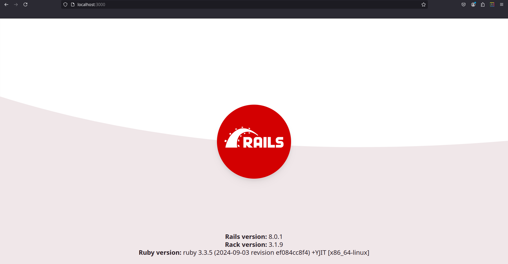

## Introduction

[Ruby on Rails](https://rubyonrails.org/) is a popular Ruby-based web framework for building fullstack applications. Rails (as it's popularly known) is well known for it's model-view-controller (MVC) architecture, ability to scaffold features, and large user community.

In this tutorial, we shall learn how to build a simple Ruby on Rails 8 web application and deploy it to a Hetzner virtual private server using [Kamal](https://kamal-deploy.org/), a nifty, zero-downtime deploy tool for deploying applications to the cloud using Docker containers.

**Prerequisites**

* A server running Ubuntu version 22.04(or later), or Debian 11 (or later)
  * [SSH access](https://community.hetzner.com/tutorials/howto-ssh-key) to that server
  * Access to the root user or a user with sudo permissions
* Basic knowledge of [Ruby on Rails](https://guides.rubyonrails.org/getting_started.html#introduction) and [Kamal](https://kamal-deploy.org/docs/installation/)
* Local development set up with [Ruby](https://www.ruby-lang.org/en/documentation/installation/), [Ruby on Rails](https://guides.rubyonrails.org/), [SQLite](https://www.sqlite.org/), [Docker](https://docs.docker.com/engine/install/), and [Bundler 2.3+](https://bundler.io/).

## Step 1 - Initiate a new Ruby on Rails app

Initialize a new Ruby on Rails application with the following command:

```shell
rails new my_blog_app
```

This command will setup a new Rails application with an SQLite database and some default boilerplate code which includes a Dockerfile and the Kamal configuration which we'll work with later on.

Next, `cd` into the app directory and run the command below to spin up a server to run the app:

```shell
rails server
```

Then visit, <http://localhost:3000> to view the default home page.



Now we are ready to create the blog functionality.

## Step 2 - Building the blog posting feature

We'll use one of Rails' notable features to build this functionality, scaffolding.

Start by running the command below:

```shell
rails generate scaffold Post title:string body:text
```

This command generates a bunch of files including:

* A migration file to create the database table for posts.

* A model that will give us an intuitive way to interact with this table and the database.

* A controller to hold all post-related business logic.

* Adding routes for handling post creation, editing, updating and deleting to the app's route configuration.

* Post views for handling _create_, _read_, _edit_ and _delete_ actions.

Then, run newly generated database migration file using the command below to create the posts table in the database:

```shell
rails db:migrate
```

Finally, head over to <http://localhost:3000/posts> and play around with the app by creating a few posts:


## Step 3 - Create your server

* Login to your cloud dashboard from [https://console.hetzner.cloud]
* Create new project and name it whatever you want
* Choose your server location that you like
* Click `Add Server` and select `Ubuntu 24.04` from Image
* Add your local SSH Key
    * You can read the [documentation here](https://docs.github.com/en/authentication/connecting-to-github-with-ssh/generating-a-new-ssh-key-and-adding-it-to-the-ssh-agent) for steps on how to generate an SSH key
* Write your server hostname in `name` input
* Click `Create & Buy Now`

## Step 4 - Prepare server for Kamal deployment (Optional)

* Go to the server list in console cloud and copy your server's IP address (e.g. 10.0.0.1)
* Open your terminal and input the following `ssh root@10.0.0.1`
* Next, update your server with `sudo apt get update && sudo apt upgrade -y`
* Reboot the server with `sudo reboot`

_Note: We could manually install Docker on the server, but since Kamal can handle this for us, there's no need to go through the manual process._

## Step 5 - Make your app ready for Kamal deployment

Since we are working with a simple Ruby on Rails application, our main job will be on the Kamal deploy configuration file `config/deploy.yml`.

Start by opening up the file and editing it to resemble the example shown below:

```yaml
# Name of your application. Used to uniquely configure containers.
service: <name_of_your_app>

# Name of the container image.
image: <username/repository_name>

# Deploy to these servers.
servers:
  web:
    - 10.0.0.1

# Enable SSL auto certification via Let's Encrypt
proxy:
  ssl: true
  host: <your_app_domain_name>

# Credentials for your image host.
registry:
  # Specify the registry server, if you're not using Docker Hub
  server: <docker_registry>
  username: <your_docker_username>

  # Always use an access token rather than real password when possible.
  password:
    - DOCKER_REGISTRY_PASSWORD

# Inject ENV variables into containers (secrets come from .kamal/secrets).
env:
  secret:
    - RAILS_MASTER_KEY
    - DOCKER_REGISTRY_PASSWORD
  clear:
    SOLID_QUEUE_IN_PUMA: true

aliases:
  console: app exec --interactive --reuse "bin/rails console"
  shell: app exec --interactive --reuse "bash"
  logs: app logs -f
  dbc: app exec --interactive --reuse "bin/rails dbconsole"

volumes:
  - "my_blog_app_storage:/rails/storage"

asset_path: /rails/public/assets

# Configure the image builder.
builder:
  arch: amd64

```

You can get more details on configuring the Kamal deploy configuration file from the [documentation](https://kamal-deploy.org/docs/configuration/overview/).

### Step 5.1 - Setup Kamal secrets

It's never a good idea to commit secrets like the repository tokens, database passwords and other sensitive data to your git repository, so we make use of the secrets file `.kamal/secrets`.

First, ensure this file is never committed to your Git repository by adding it to the `.gitignore` file:

```ignore
...
/.kamal/secrets
```

Finally, with the deploy configuration done, make sure to commit all your changes to Git.

## Step 6 - Deploy the app

Deploy the Rails 8 app with the command below:

```shell
kamal setup
```

This command will:

* Log into your server
* Install any server prerequisites, for example, Linux packages, database packages etc.
* Fetch and install Docker if it is not installed
* Fetch your app from the Git repository and push it to the image registry you specified
* Fetch your app's image from the image repository and deploy it to the server
* Create and assign an SSL for the domain name you specified
* Make your app availalbe on the domain you specified


## Conclusion

In this tutorial, you've learned how to build a simple Ruby on Rails 8 web application and deploy the app to Hetzner using Kamal. This is an introductory tutorial to give you an idea of what's possible. Explore the [Rails](https://guides.rubyonrails.org/) and Kamal [documentation](https://kamal-deploy.org/docs/installation/) for more information on how to deploy more advanced apps.

##### License: MIT

<!--

Contributor's Certificate of Origin

By making a contribution to this project, I certify that:

(a) The contribution was created in whole or in part by me and I have
    the right to submit it under the license indicated in the file; or

(b) The contribution is based upon previous work that, to the best of my
    knowledge, is covered under an appropriate license and I have the
    right under that license to submit that work with modifications,
    whether created in whole or in part by me, under the same license
    (unless I am permitted to submit under a different license), as
    indicated in the file; or

(c) The contribution was provided directly to me by some other person
    who certified (a), (b) or (c) and I have not modified it.

(d) I understand and agree that this project and the contribution are
    public and that a record of the contribution (including all personal
    information I submit with it, including my sign-off) is maintained
    indefinitely and may be redistributed consistent with this project
    or the license(s) involved.

Signed-off-by: [Aestimo Kirina and email address a***@gmail.com]

-->