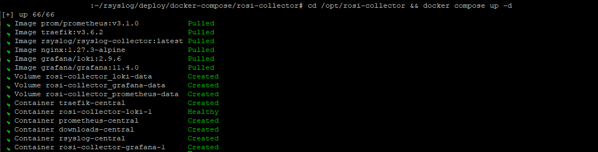

## Introduction

Managing logs and metrics across multiple Hetzner Cloud VPS instances can be challenging. Without centralized observability, you're left checking individual servers, making it difficult to correlate events, troubleshoot issues, or maintain a comprehensive view of your infrastructure.

ROSI (Rsyslog Operations Stack Initiative) Collector provides a production-ready, self-hosted solution for centralized log aggregation and monitoring. Built on open-source technologies—rsyslog, Loki, Grafana, and Prometheus—ROSI Collector offers a lightweight alternative to resource-intensive stacks like ELK, while maintaining full data sovereignty and privacy.

This tutorial will guide you through deploying ROSI Collector on Hetzner Cloud, configuring multiple client servers to forward logs and metrics, and accessing pre-built Grafana dashboards for visualization. By the end, you'll have a fully functional observability stack that aggregates logs from all your Hetzner Cloud servers into a single, searchable interface.

**Key Benefits:**

- **Self-hosted and privacy-focused**: Your logs stay in your infrastructure
- **Resource-efficient**: Lower memory and CPU footprint ELK and similar stacks
- **Production-ready**: Includes pre-configured dashboards, alerting, and TLS support
- **Multi-server aggregation**: Collect logs and metrics from unlimited client servers
- **Cost-effective**: Runs efficiently on Hetzner Cloud CX22 or larger instances

**Prerequisites**

- A Hetzner Cloud Server (CX22 or larger recommended) running Ubuntu 24.04 LTS
  - For environments with more than 10 clients or high log verbosity (e.g. DEBUG level), consider CPX31 or CX32 for more stable Loki performance.
  - [SSH access](https://community.hetzner.com/tutorials/howto-ssh-key) to the server
  - Root or sudo access
- Docker Engine 20.10+ and Docker Compose v2 (on a fresh server you can install them in one go using the ROSI script in Step 1.1b; otherwise see [howto-docker-install](https://community.hetzner.com/tutorials/howto-docker-install))
- Basic knowledge of Linux command line, Docker, and YAML
- (Optional) A domain name for TLS certificates via Let's Encrypt
- (Optional) Additional Hetzner Cloud VPS instances to act as clients

**Example terminology**

- Username: `holu`
- Hostname: `<your_host>`
- Domain: `<example.com>`
- ROSI Collector server IP: `<10.0.0.1>`
- Client server IP: `<198.51.100.1>`

## Architecture Overview

ROSI Collector uses a centralized architecture where multiple client servers forward logs and metrics to a single collector server. The collector processes, stores, and visualizes this data through a web interface.


**Components:**

1. **rsyslog** - Receives syslog messages from clients via TCP port 10514 (or TLS on 6514)
2. **Loki** - Stores and indexes log data efficiently
3. **Grafana** - Provides web-based dashboards for log visualization and querying
4. **Prometheus** - Collects and stores metrics from node_exporter instances
5. **Traefik** - Reverse proxy with automatic TLS certificate management
6. **node_exporter** - Installed on each client (and the collector server) to expose system metrics

**Data Flow:**

1. Client servers forward syslog messages → ROSI Collector (TCP 10514/6514)
2. rsyslog receives logs → Forwards to Loki via HTTP
3. Loki stores logs → Grafana queries Loki for visualization
4. Prometheus scrapes node_exporter → Stores metrics → Grafana visualizes metrics
5. Users access Grafana via Traefik (HTTPS) → View dashboards and query logs

**Network Requirements:**

- **Inbound on collector**: TCP 80, 443 (Traefik), 10514 (rsyslog plaintext), 6514 (rsyslog TLS, optional)
- **Outbound from clients**: TCP 10514/6514 to collector
- **Inbound on clients**: TCP 9100 (node_exporter, from collector)

## Step 1 - Deploy ROSI Collector

In this step, we'll clone the ROSI Collector repository, initialize the environment, and start the Docker Compose stack.

### Step 1.1 - Clone Repository and Navigate to Directory

SSH into your Hetzner Cloud server and clone the rsyslog repository:

```bash
ssh holu@<your_host>
```

Update your system packages:

```bash
sudo apt update && sudo apt upgrade -y
```

Install required dependencies:

```bash
sudo apt install -y git curl
```

Clone the rsyslog repository:

```bash
git clone https://github.com/rsyslog/rsyslog.git
cd rsyslog/deploy/docker-compose/rosi-collector
```

### Step 1.1b - Prepare fresh server (first time only)

If this is a **new/fresh** Hetzner Cloud server and Docker is not yet installed, run the prepare script **once** before initializing. It installs Docker, configures the firewall, and applies optional hardening (sysctl, fail2ban, logrotate, etc.):

```bash
# From rosi-collector directory (after clone)
sudo ./scripts/install-server.sh
```

The script will ask before installing each configuration file. For a fully automated run:

```bash
sudo NONINTERACTIVE=1 ./scripts/install-server.sh
```

**Warning:** Only run this on fresh systems. Do not use it on servers you already maintain—it modifies system configuration and installs packages. If Docker is already installed (e.g. via [howto-docker-install](https://community.hetzner.com/tutorials/howto-docker-install)), skip this step and go to Step 1.2.

### Step 1.2 - Initialize Environment

The initialization script (`init.sh`) will prompt you for configuration values and set up the entire environment. Run it with sudo:

```bash
sudo ./scripts/init.sh
```

**Interactive Prompts:**

The script will ask for the following information:

1. **Installation directory** (default: `/opt/rosi-collector`)
   - Press Enter to accept the default, or specify a custom path
   - Your choice is saved for future runs (e.g. to `~/.config/rsyslog/rosi-collector.conf` or `/etc/rsyslog/rosi-collector.conf`) and reused automatically on later runs

2. **TRAEFIK_DOMAIN** - Domain or IP address for accessing Grafana
   - If you have a domain: `logs.example.com`
   - If using IP only: `<10.0.0.1>` (will use self-signed certificate)
   - This is required

3. **TRAEFIK_EMAIL** - Email for Let's Encrypt certificate notifications
   - Example: `admin@example.com`
   - Required for Let's Encrypt (not needed if using IP only)

4. **GRAFANA_ADMIN_PASSWORD** - Password for Grafana admin user
   - Press Enter to auto-generate a secure password (recommended)
   - Or enter your own password
   - The password will be shown at the end of setup and saved in `.env`

5. **TLS Configuration** - Enable encrypted syslog on port 6514
   - Choose `y` for production environments (recommended)
   - Choose `N` for testing or if you'll use a VPN
   - If enabled, you'll configure TLS hostname and authentication mode

6. **Server syslog forwarding** - Forward the collector server's own logs
   - Choose `Y` to include the collector server's logs in Grafana (recommended)
   - Choose `n` if you only want client logs

When you run the script, output will look similar to:

```
./scripts/init.sh
Loaded configuration from: /root/.config/rsyslog/rosi-collector.conf
Copying configuration files to /opt/rosi-collector...
Rendering Grafana dashboards from templates (source)...
Installing local Grafana dashboards...
Downloading Grafana dashboards from grafana.com...
Downloading Grafana dashboard 1860...
Successfully downloaded dashboard 1860
Downloading Grafana dashboard 14055...
Successfully downloaded dashboard 14055
Total dashboards installed: 13

━━━━━━━━━━━━━━━━━━━━━━━━━━━━━━━━━━━━━━━━━━━━━━━━━━━━━━━━━━━━
  ROSI Collector Configuration
━━━━━━━━━━━━━━━━━━━━━━━━━━━━━━━━━━━━━━━━━━━━━━━━━━━━━━━━━━━━

No .env file found. Please provide the following configuration:

┌─────────────────────────────────────────────────────────────┐
│ TRAEFIK_DOMAIN                                              │
│ The domain or IP address for accessing Grafana/Prometheus  │
│ Examples: rosi.example.com, 192.168.1.100                   │
└─────────────────────────────────────────────────────────────┘
Enter domain or IP: logs.example.com

┌─────────────────────────────────────────────────────────────┐
│ TRAEFIK_EMAIL                                               │
│ Email for Let's Encrypt certificate notifications          │
│ (Also used for alert notifications if SMTP configured)     │
└─────────────────────────────────────────────────────────────┘
Enter email [admin@logs.example.com]:

┌─────────────────────────────────────────────────────────────┐
│ GRAFANA_ADMIN_PASSWORD                                      │
│ Password for Grafana admin user                             │
│ Leave empty to auto-generate a secure password              │
└─────────────────────────────────────────────────────────────┘
Enter password (hidden) or press Enter to generate:
  → Generated secure password (will be shown at end of setup)

┌─────────────────────────────────────────────────────────────┐
│ TLS/mTLS Configuration                                      │
│ Enable encrypted syslog transport on port 6514?             │
│ Recommended for production environments                     │
└─────────────────────────────────────────────────────────────┘
Enable TLS for syslog? [y/N]: y

  TLS Configuration Options:

  TLS hostname [logs.example.com]:
  CA certificate validity in days [3650] (10 years):
  Server certificate validity in days [1825] (5 years):
  Client certificate validity in days [730] (2 years):

  Authentication mode:
    anon        - TLS encryption only (no client certificates)
    x509/certvalid - Require valid client certificates (mTLS)
    x509/name   - Require certificates + verify CN/SAN (strictest)
  Auth mode [anon]:

Created .env file
Generated Traefik basic auth config: /opt/rosi-collector/traefik/dynamic.yml

┌─────────────────────────────────────────────────────────────┐
│ Server Syslog Forwarding                                    │
│ Forward this server's logs to ROSI Collector (localhost)    │
│ This makes server logs visible in Grafana dashboards        │
└─────────────────────────────────────────────────────────────┘
Configure server to forward its syslog to ROSI Collector? [Y/n]: y
Installing rsyslog forwarding configuration...
Created: /etc/rsyslog.d/99-forward-to-rosi.conf

Server syslog forwarding configured!
  Config: /etc/rsyslog.d/99-forward-to-rosi.conf
  Target: 127.0.0.1:10514
  Host will appear in Grafana as: collector-server

Testing rsyslog configuration...
Configuration test passed
Restarting rsyslog service...
rsyslog service restarted successfully

OK. ROSI Collector environment ready:
  /opt/rosi-collector
  Systemd service: rosi-collector-docker.service
  Monitor script: /usr/local/bin/rosi-monitor
  Prometheus target helper: /usr/local/bin/prometheus-target
  node_exporter: installed and running on this server
  TLS scripts: /usr/local/bin/rosi-generate-ca, /usr/local/bin/rosi-generate-client-cert
  TLS: enabled (port 6514, authmode: anon)

━━━━━━━━━━━━━━━━━━━━━━━━━━━━━━━━━━━━━━━━━━━━━━━━━━━━━━━━━━━━
  IMPORTANT: Save your credentials!
━━━━━━━━━━━━━━━━━━━━━━━━━━━━━━━━━━━━━━━━━━━━━━━━━━━━━━━━━━━━

  Grafana URL:    https://logs.example.com/
  Username:       admin
  Password:       ••••••••••••••••••••••••••••••••

  (Password is also stored in /opt/rosi-collector/.env)
━━━━━━━━━━━━━━━━━━━━━━━━━━━━━━━━━━━━━━━━━━━━━━━━━━━━━━━━━━━━

Next steps:
  cd /opt/rosi-collector && docker compose up -d
  # Or start via systemd: systemctl start rosi-collector-docker.service
  # Monitor: rosi-monitor status
  # Check node_exporter: systemctl status node_exporter

Note: To update config files, re-run this script - it will copy latest configs
```

On first run you may also see the installation directory prompt; the script then copies files, installs Grafana dashboards (including downloads from grafana.com), asks for configuration, creates the `.env` file, optionally configures server syslog forwarding, and ends with the summary and credentials—**save the Grafana password**.

The script will:

- Copy all configuration files to the installation directory
- Generate `.env` file with secure passwords
- Install and configure node_exporter for server self-monitoring
- Add the server to Prometheus targets automatically
- Configure server syslog forwarding (if enabled)
- Create Docker network and systemd service
- Generate TLS certificates (if TLS enabled)
- Install management scripts (`rosi-monitor`, `prometheus-target`)

**Under the hood:** The script populates `/opt/rosi-collector/` with rsyslog receiver configuration, Traefik dynamic config (`traefik/dynamic.yml`), Loki and Prometheus configs, Grafana provisioning (dashboards, datasources), and TLS certificates (if enabled). You can inspect these files to understand or customize the stack.

**Non-interactive init:** You can run the script without prompts by setting environment variables:

```bash
sudo TRAEFIK_DOMAIN=logs.example.com TRAEFIK_EMAIL=admin@example.com ./scripts/init.sh
```

Optionally add `SERVER_SYSLOG_FORWARDING=true` to also enable forwarding the collector server's own logs without prompting.

**Important:** Save the Grafana admin password shown at the end of the script output. You'll need it to log into Grafana.

### Step 1.3 - Start the Stack

Navigate to the installation directory and start the Docker Compose stack:

```bash
cd /opt/rosi-collector
docker compose up -d
```

The **first time** you run this, Docker will pull the required images (Prometheus, Traefik, rsyslog-collector, nginx, Loki, Grafana), create the data volumes, and then start the containers. You'll see output similar to the following (images pulled, volumes created, containers created or healthy):



Subsequent runs start the existing containers without re-pulling. Wait a few moments for containers to initialize.

### Step 1.4 - Verify Services are Running

Check the status of all containers:

```bash
docker compose ps
```

You should see all services in "Up" status. Container names may vary (e.g. `rosi-grafana-1`, `grafana-central`) depending on the Compose project name.

Alternatively, use the monitoring script:

```bash
rosi-monitor status
```

This provides detailed information including container health, network details, and resource usage.

### Step 1.5 - Check Service Logs

If any service fails to start, check its logs:

```bash
# View logs for a specific service
docker compose logs rsyslog
docker compose logs grafana
docker compose logs loki

# View all logs
docker compose logs

# Follow logs in real-time
docker compose logs -f
```

Common issues and solutions:

- **Port conflicts**: Ensure ports 80, 443, 10514, and 6514 are not in use
- **Permission errors**: Verify the installation directory permissions
- **Network issues**: Check Docker network creation with `docker network ls`

### Step 1.6 - Configure Firewall

If you're using UFW (Uncomplicated Firewall), allow the required ports:

```bash
# Allow HTTP and HTTPS (Traefik)
sudo ufw allow 80/tcp
sudo ufw allow 443/tcp

# Allow rsyslog plaintext (from clients)
sudo ufw allow 10514/tcp

# Allow rsyslog TLS (if enabled, from clients)
sudo ufw allow 6514/tcp

# Verify firewall status
sudo ufw status
```

**Note:** If your Hetzner Cloud server uses the Hetzner Cloud Firewall (configured in the Cloud Console), you'll need to add rules there as well. The Hetzner Cloud Firewall operates at the network level and is separate from UFW.

## Step 2 - Configure Client Servers

Now that the ROSI Collector is running, we'll configure client servers to forward their logs and metrics. You can configure as many client servers as needed.

### Step 2.1 - Download Client Setup Script

On each client server, download the rsyslog client setup script from your ROSI Collector:

```bash
# Replace <10.0.0.1> with your ROSI Collector IP or domain
wget https://<10.0.0.1>/downloads/install-rsyslog-client.sh

# Make it executable
chmod +x install-rsyslog-client.sh
```

**Note:** If you're using an IP address instead of a domain, you may need to accept a self-signed certificate warning. This is normal for IP-based deployments.

The client script can optionally set up an rsyslog **impstats sidecar** (port 9898) for the "Syslog Health" dashboard in Grafana. To skip it, run: `sudo ./install-rsyslog-client.sh --no-sidecar`.

### Step 2.2 - Run Client Setup Script

Execute the script with sudo:

```bash
sudo ./install-rsyslog-client.sh
```

The script will:

1. Check for existing rsyslog client configuration
2. Prompt for ROSI Collector IP address or hostname
3. Prompt for port (default: 10514 for plaintext, or 6514 for TLS)
4. Install rsyslog forwarding configuration
5. Create spool directory for disk-assisted queuing
6. Test configuration syntax
7. Restart rsyslog service
8. Show verification logs

**Example Session:**

```
[INFO]==========================================
[INFO]rsyslog Client Configuration Installer
[INFO]==========================================

[PROMPT]Enter central server IP address:
10.0.0.1

[PROMPT]Enter central server port [default: 10514]:
10514

[INFO]Installation configuration:
[INFO]  Target IP: 10.0.0.1
[INFO]  Target Port: 10514

[PROMPT]Proceed with installation? [y/N]
y

[INFO]Installing rsyslog client configuration...
[INFO]Configuration file created successfully
[INFO]Spool directory already exists: /var/spool/rsyslog
[INFO]Testing rsyslog configuration...
[INFO]Configuration test passed
[INFO]Restarting rsyslog service...
[INFO]rsyslog service restarted successfully
```

### Step 2.3 - Test Log Forwarding

Send a test log message from the client:

```bash
logger "Test message from $(hostname) at $(date)"
```

This message should appear in Grafana within a few seconds. We'll verify this in Step 3.

### Step 2.4 - Install Node Exporter (Optional but Recommended)

Node Exporter exposes system metrics (CPU, memory, disk, network) that Prometheus can scrape. Install it on each client:

```bash
# Download the installation script
wget https://<10.0.0.1>/downloads/install-node-exporter.sh
chmod +x install-node-exporter.sh

# Run the installation
sudo ./install-node-exporter.sh
```

The script will:

- Download and install node_exporter binary
- Create a systemd service
- Start and enable the service
- Configure it to listen on port 9100

Verify node_exporter is running:

```bash
sudo systemctl status node_exporter
curl http://localhost:9100/metrics | head -5
```

### Step 2.5 - Add Client to Prometheus Targets

On the ROSI Collector server, add the client as a Prometheus scrape target.

**Option A – node_exporter only (port 9100):**

```bash
# SSH to ROSI Collector server
ssh holu@<10.0.0.1>

# Add client target (replace with your client's IP and hostname)
prometheus-target add <198.51.100.1>:9100 host=webserver role=web network=internal
```

**Option B – node_exporter and impstats sidecar (ports 9100 and 9898) in one step:**

If the client runs the impstats sidecar (default with the client script), register both in one command:

```bash
prometheus-target add-client <198.51.100.1> host=webserver role=web network=internal
```

This adds the client to both the node (9100) and impstats (9898) jobs.

**Note:** The `prometheus-target` script writes to the `prometheus-targets/` directory (YAML files in the installation folder). Prometheus auto-reloads these targets. If you automate deployments with Ansible or similar, you can manage these files directly instead of using the script.

**Label Options:**

- `host=<name>` - Hostname (required)
- `role=<value>` - Server role (e.g., web, db, app, monitoring)
- `env=<value>` - Environment (e.g., production, staging, development)
- `network=<value>` - Network zone (e.g., internal, dmz, public)

**Example with multiple labels:**

```bash
prometheus-target add <198.51.100.1>:9100 host=webserver-prod role=web env=production network=internal
# Or with add-client for both node and impstats:
prometheus-target add-client <198.51.100.1> host=webserver-prod role=web env=production network=internal
```

List all configured targets:

```bash
prometheus-target list
```

Prometheus will automatically pick up new targets within 5 minutes. No restart is required.

### Step 2.6 - Configure Client Firewall

The ROSI client install script (e.g. `install-rsyslog-client.sh`) typically configures the local firewall (UFW/firewalld) for node_exporter and impstats when run—see the [official ROSI Collector client setup documentation](https://www.rsyslog.com/doc/deployments/rosi_collector/client_setup.html) for details. If you installed the client manually or need to adjust rules, on each client server allow inbound connections for node_exporter so Prometheus can scrape metrics:

```bash
# Allow node_exporter from ROSI Collector
sudo ufw allow from <10.0.0.1> to any port 9100 proto tcp

# If the client runs the impstats sidecar (port 9898), allow that too
sudo ufw allow from <10.0.0.1> to any port 9898 proto tcp

# Verify the rules
sudo ufw status | grep -E '9100|9898'
```

**Note:** If using Hetzner Cloud Firewall, add rules allowing TCP ports 9100 (and 9898 if using impstats) from the ROSI Collector server's IP.

### Step 2.7 - Verify Client Connectivity

From the ROSI Collector server, test connectivity to the client:

```bash
# Test rsyslog port (should connect)
telnet <198.51.100.1> 10514

# Test node_exporter (should return metrics)
curl http://<198.51.100.1>:9100/metrics | head -10
```

If both tests succeed, your client is properly configured.

## Step 3 - Access Grafana Dashboard

Grafana provides the web interface for viewing logs and metrics. Let's access it and explore the pre-built dashboards.

### Step 3.1 - Access Grafana

Open your web browser and navigate to your ROSI Collector domain or IP:

```
https://logs.example.com
```

Or if using an IP address:

```
https://<10.0.0.1>
```

**Note:** If using a self-signed certificate (IP address mode), your browser will show a security warning. Click "Advanced" and "Proceed to site" (or similar) to continue. This is expected for self-signed certificates.

### Step 3.2 - Login to Grafana

Use the following credentials:

- **Username**: `admin`
- **Password**: The password shown at the end of `init.sh` setup, or check:

```bash
# On ROSI Collector server
grep GRAFANA_ADMIN_PASSWORD /opt/rosi-collector/.env
```

After logging in, Grafana may prompt you to change the password. You can skip this for now or set a new password.

### Step 3.3 - Explore Pre-built Dashboards

ROSI Collector includes several pre-configured dashboards. Click the "Dashboards" icon (four squares) in the left sidebar, then "Browse":


**Available Dashboards:**

1. **Syslog Explorer** - Search and browse logs from all clients
2. **Syslog Analysis** - Distribution analysis (severity, hosts, facilities), log volume, and error trends
3. **Syslog Health** - rsyslog impstats (queues, actions, CPU); requires clients to run the impstats sidecar and targets added via `prometheus-target --job impstats` or `add-client`
4. **Host Metrics Overview** - System metrics from node_exporter per host (CPU, memory, disk, network)
5. **Alerting Overview** - Active alerts and notification status

Open the "Syslog Explorer" dashboard to view logs from all your clients.

### Step 3.4 - Query Logs in Grafana

In the Syslog Explorer dashboard, you can:

1. **Search logs** - Use the search bar at the top to filter logs
2. **Filter by host** - Select a specific hostname from the dropdown
3. **Time range** - Adjust the time range selector (top right)
4. **View log details** - Click on any log entry to see full details

**Example LogQL Queries:**

In Grafana's Explore view (compass icon), you can write LogQL queries:

```logql
# All logs from a specific host
{host="webserver"}

# Logs containing "error"
{host=~".+"} |= "error"

# Logs from auth facility
{facility="auth"}

# Logs from last hour with "failed" keyword
{host=~".+"} |= "failed" [1h]
```

### Step 3.5 - View Metrics Dashboards

Open the "Host Metrics Overview" dashboard to see system metrics:

- **CPU Usage** - Per-core and overall CPU utilization
- **Memory** - RAM usage and available memory
- **Disk I/O** - Read/write operations and throughput
- **Network** - Interface traffic and packet statistics
- **Load Average** - System load over 1, 5, and 15 minutes

Metrics are automatically labeled with the hostname and any custom labels you added when configuring Prometheus targets.

## Step 4 - Advanced Configuration

This section covers advanced configuration options for production deployments.

### Step 4.1 - Enable TLS/mTLS for Syslog

If you didn't enable TLS during initial setup, you can enable it later:

1. Edit the `.env` file:

```bash
sudo nano /opt/rosi-collector/.env
```

2. Set TLS variables:

```bash
SYSLOG_TLS_ENABLED=true
SYSLOG_TLS_HOSTNAME=logs.example.com
SYSLOG_TLS_AUTHMODE=anon
```

3. Re-run the init script to generate certificates (from your cloned rosi-collector directory, e.g. where you ran init in Step 1.2):

```bash
cd ~/rsyslog/deploy/docker-compose/rosi-collector   # adjust if you cloned elsewhere
sudo ./scripts/init.sh
```

4. Restart the stack:

```bash
cd /opt/rosi-collector
docker compose restart rsyslog
```

**Authentication Modes:**

- `anon` - TLS encryption only, no client certificates required (easiest)
- `x509/certvalid` - mTLS, clients must present valid CA-signed certificates
- `x509/name` - mTLS, clients must have certificates matching permitted peers (strictest)

**Generate Client Certificates (for mTLS):**

```bash
# On ROSI Collector server
rosi-generate-client-cert --download client-hostname

# This creates a downloadable package at:
# https://logs.example.com/downloads/tls-packages/client-hostname.tar.gz
```

### Step 4.2 - Configure Log Retention

Loki is configured with 30-day retention by default. To change this, edit the Loki configuration:

```bash
sudo nano /opt/rosi-collector/loki-config.yml
```

Find the `limits_config` section and adjust:

```yaml
limits_config:
  retention_period: 720h  # 30 days (default)
  # Change to 168h for 7 days, or 2160h for 90 days
```

Restart Loki:

```bash
docker compose restart loki
```

### Step 4.3 - Add More Clients

To add additional clients, repeat Step 2 for each new server. Each client is independent and doesn't affect others.

**Quick Client Setup Checklist:**

- [ ] Download and run `install-rsyslog-client.sh` on client
- [ ] (Optional) Install node_exporter on client
- [ ] Add client to Prometheus targets: `prometheus-target add <IP>:9100 host=<name> role=<role>` or `prometheus-target add-client <IP> host=<name> role=<role> network=<network>` (adds both node and impstats if sidecar is used)
- [ ] Configure client firewall to allow node_exporter (and 9898 if using impstats) from collector
- [ ] Verify connectivity and test log forwarding

### Step 4.4 - Configure Hetzner Cloud Firewall

If you're using Hetzner Cloud Firewall (configured in the Cloud Console), add rules for:

**ROSI Collector Server:**
- Inbound: TCP 80, 443, 10514, 6514
- Outbound: All (default)

**Client Servers:**
- Inbound: TCP 9100 (from ROSI Collector IP)
- Outbound: TCP 10514, 6514 (to ROSI Collector IP)

**Firewall Rules Example:**

In Hetzner Cloud Console → Firewalls → Create/Edit Firewall:

1. **Rule for ROSI Collector:**
   - Direction: Inbound
   - Port: 80, 443, 10514, 6514
   - Source IPs: 0.0.0.0/0 (or restrict to your IPs)

2. **Rule for Clients:**
   - Direction: Inbound
   - Port: 9100
   - Source IPs: ROSI Collector server IP

### Step 4.5 - Monitor Stack Health

Use the `rosi-monitor` command for comprehensive health checks:

```bash
# Show container status and health
rosi-monitor status

# View recent logs
rosi-monitor logs

# Health check (verifies all services)
rosi-monitor health

# Interactive debug menu
rosi-monitor debug
```

The `status` command shows:
- Container status and health
- Docker network information
- Internal container IPs
- Resource usage (CPU, memory, network I/O)

Other useful commands include `rosi-monitor backup`, `restore`, `reset-password`, `smtp` (check SMTP config), and `shell <service>` (e.g. `shell grafana`) to get a shell inside a container. See the [ROSI Collector documentation](https://www.rsyslog.com/doc/deployments/rosi_collector/index.html) for the full list.

## Step 5 - Troubleshooting

This section covers common issues and their solutions.

### Logs Not Appearing in Grafana

**Symptoms:** Logs sent from clients don't appear in Grafana.

**Solutions:**

1. **Check rsyslog is receiving logs on collector:**

```bash
docker compose logs rsyslog | tail -50
```

Look for connection messages or errors.

2. **Verify rsyslog is forwarding to Loki:**

```bash
docker compose logs rsyslog | grep -i loki
```

3. **Check Loki health:**

```bash
curl http://localhost:3100/ready
```

Should return "Ready".

4. **Test client connectivity:**

From client, test connection to collector:

```bash
telnet <10.0.0.1> 10514
```

If connection fails, check firewall rules.

5. **Verify client rsyslog configuration:**

```bash
# On client
sudo rsyslogd -N1
sudo systemctl status rsyslog
sudo tail -f /var/log/syslog | grep rsyslog
```

**rsyslog omfwd errors:** If you see errors about `omfwd.so` or a missing module, remove any explicit `module(load="omfwd")` from your config; the omfwd action is built-in and does not need to be loaded.

### Container Won't Start

**Symptoms:** Docker containers fail to start or exit immediately.

**Solutions:**

1. **Check container logs:**

```bash
docker compose logs <service-name>
```

2. **Verify disk space:**

```bash
df -h
```

Ensure `/opt/rosi-collector` has sufficient space (at least 10GB free recommended).

3. **Check Docker status:**

```bash
systemctl status docker
docker info
```

4. **Verify port availability:**

```bash
sudo netstat -tlnp | grep -E ':(80|443|10514|6514|3000|3100|9090)'
```

If ports are in use, either stop the conflicting service or change ports in `docker-compose.yml`.

### Prometheus Can't Scrape node_exporter

**Server (collector) target down:** The node_exporter on the ROSI Collector server must bind to the Docker bridge gateway IP so Prometheus (running inside a container) can scrape it. The `init.sh` script configures this. If the server target shows DOWN:

1. Check current binding: `grep listen-address /etc/systemd/system/node_exporter.service`
2. Check Docker network gateway: `rosi-monitor status` (shows network info) or `docker network inspect rosi-collector-net --format '{{range .IPAM.Config}}{{.Gateway}}{{end}}'`
3. Ensure firewall allows the Docker subnet to reach the server's node_exporter on port 9100 (init.sh adds this when UFW/firewalld is active)

**Client targets down:** If client hosts show as DOWN in Prometheus:

1. **Check node_exporter is running on client:**

```bash
# On client
sudo systemctl status node_exporter
curl http://localhost:9100/metrics | head -3
```

2. **Verify firewall allows access:**

```bash
# On client
sudo ufw status | grep 9100
```

3. **Test from collector:**

```bash
# On ROSI Collector server
curl http://<198.51.100.1>:9100/metrics | head -3
```

4. **Check Prometheus targets:**

Navigate to Prometheus UI: `https://logs.example.com:9090` → Status → Targets

5. **Verify target configuration:**

```bash
prometheus-target list
```

Ensure the IP and port are correct.

### High Memory Usage

**Symptoms:** Server running out of memory, containers being killed.

**Solutions:**

1. **Check current memory usage:**

```bash
free -h
docker stats
```

2. **Reduce Loki memory usage:**

Edit `loki-config.yml`:

```yaml
limits_config:
  ingestion_rate_mb: 10  # Reduce from default
  ingestion_burst_size_mb: 20  # Reduce from default
```

3. **Reduce log retention:**

Decrease `retention_period` in `loki-config.yml` (see Step 4.2).

4. **Upgrade server size:**

Consider upgrading to a larger Hetzner Cloud instance (CX32 or larger) if memory is consistently high.

### TLS Certificate Issues

**Symptoms:** TLS connections fail, certificate errors.

**Solutions:**

1. **Verify certificates exist:**

```bash
ls -la /opt/rosi-collector/certs/
```

Should show `ca.pem`, `server-cert.pem`, `server-key.pem`.

2. **Check certificate validity:**

```bash
openssl x509 -in /opt/rosi-collector/certs/server-cert.pem -text -noout | grep -A 2 Validity
```

3. **Regenerate certificates:**

```bash
cd ~/rsyslog/deploy/docker-compose/rosi-collector   # adjust if you cloned elsewhere
sudo rm -rf /opt/rosi-collector/certs/
sudo ./scripts/init.sh
```

4. **For client certificates:**

Ensure client certificates match the server's CA and are not expired.

## Conclusion

You've successfully deployed ROSI Collector on Hetzner Cloud and configured it to aggregate logs and metrics from multiple client servers. Your observability stack is now providing:

- **Centralized log aggregation** from all your Hetzner Cloud VPS instances
- **System metrics collection** via Prometheus and node_exporter
- **Web-based visualization** through Grafana dashboards
- **Production-ready features** including TLS support, alerting, and log retention

**What You've Accomplished:**

- Deployed ROSI Collector stack using Docker Compose
- Configured rsyslog clients to forward logs
- Set up Prometheus metrics collection
- Accessed Grafana dashboards for log and metric visualization
- Learned advanced configuration options

**Next Steps:**

- Explore additional Grafana dashboards and create custom ones
- Configure alerting rules in Prometheus for critical events
- Set up TLS/mTLS for encrypted log transport in production
- Add more client servers to expand your observability coverage
- Review and adjust log retention policies based on your needs

**Additional Resources:**

- **ROSI Collector (official)**: [ROSI Collector](https://www.rsyslog.com/doc/deployments/rosi_collector/index.html) — [Installation](https://www.rsyslog.com/doc/deployments/rosi_collector/installation.html), [Client Setup](https://www.rsyslog.com/doc/deployments/rosi_collector/client_setup.html), [Grafana Dashboards](https://www.rsyslog.com/doc/deployments/rosi_collector/grafana_dashboards.html), [Troubleshooting](https://www.rsyslog.com/doc/deployments/rosi_collector/troubleshooting.html)
- **ROSI Collector source**: `https://github.com/rsyslog/rsyslog/tree/main/deploy/docker-compose/rosi-collector`
- **rsyslog Documentation**: `https://www.rsyslog.com/doc/`
- **Grafana Documentation**: `https://grafana.com/docs/grafana/latest/`
- **Loki Documentation**: `https://grafana.com/docs/loki/latest/`
- **Prometheus Documentation**: `https://prometheus.io/docs/`

**Maintenance Tips:**

- Regularly check `rosi-monitor status` for service health
- Monitor disk usage in `/opt/rosi-collector` (Loki data grows over time)
- Review and rotate log retention as needed
- Keep Docker and container images updated
- Backup the `.env` file and configuration directory

##### License: MIT

<!--

Contributor's Certificate of Origin

By making a contribution to this project, I certify that:

(a) The contribution was created in whole or in part by me and I have
    the right to submit it under the license indicated in the file; or

(b) The contribution is based upon previous work that, to the best of my
    knowledge, is covered under an appropriate license and I have the
    right under that license to submit that work with modifications,
    whether created in whole or in part by me, under the same license
    (unless I am permitted to submit under a different license), as
    indicated in the file; or

(c) The contribution was provided directly to me by some other person
    who certified (a), (b) or (c) and I have not modified it.

(d) I understand and agree that this project and the contribution are
    public and that a record of the contribution (including all personal
    information I submit with it, including my sign-off) is maintained
    indefinitely and may be redistributed consistent with this project
    or the license(s) involved.

Signed-off-by: [submitter's name and email address here]

-->
