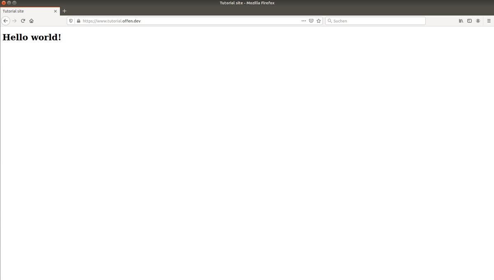
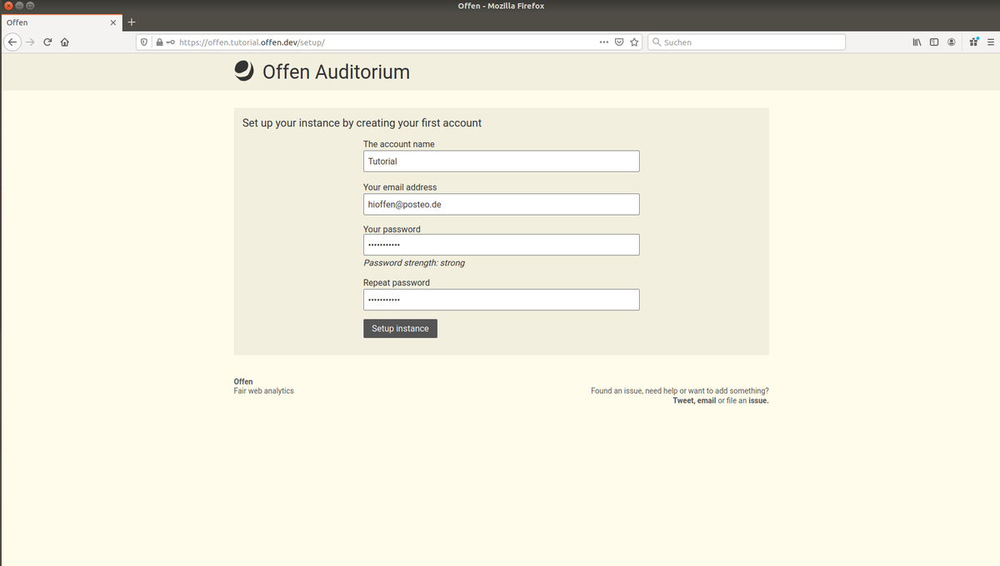
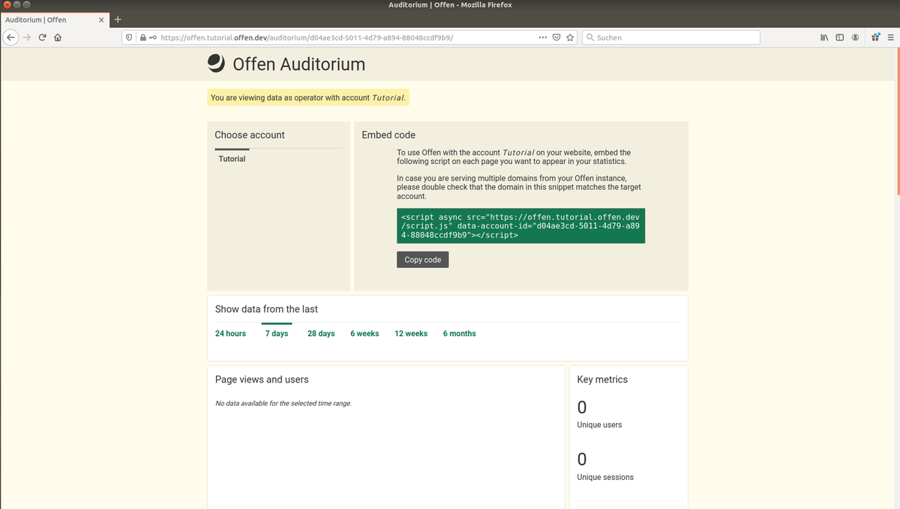
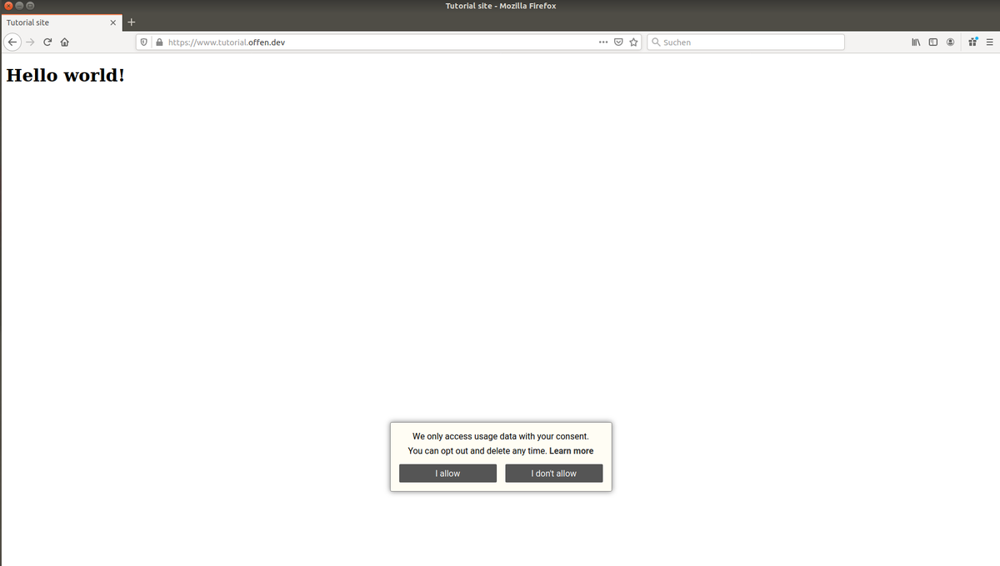

## Introduction

Static websites are making a comeback: they are convenient to develop, easy to deploy and perform well on minimal hardware.

Yet, when it comes to adding third party tools, most people think a static site limits you to using services hosted by third parties only. These third party services often come with **serious privacy and performance implications**. Which is especially true when it comes to analytics.

If you care about your user's privacy, you should consider using self-hosted software instead, giving you full ownership and control over the data you collect.

---

This guide will walk you through the steps needed for deploying a static website alongside an [**Offen**][offen] analytics instance to a VPS (Virtual Private Server).

When following this guide you will use [**Docker**][docker] and [**docker-compose**][compose] for deploying your site and Offen. [**Caddy**][caddy] is used as a lightweight server in front of your setup handling **free and automated SSL**, serving static content and routing to subdomains.

[offen]: https://www.offen.dev
[caddy]: https://caddyserver.com/
[docker]: https://www.docker.com/
[compose]: https://docs.docker.com/compose/

All of the used software is **free and using permissive licenses**, so there are no usage restrictions or hidden costs in any of the tools used by this tutorial.

**Prerequisites**

This tutorial assumes you already have chosen a setup for creating your static site and know how to build the assets required for serving your site. In case you are still looking for a tool, there are a lot of great choices out there, e.g. [**Hugo**][hugo] (Golang ecosystem), [**Pelican**][pelican] (Python ecosystem) or [**Gatsby**][gatsby] (NodeJS ecosystem). It's also still totally possible to write your HTML by hand.

[hugo]: https://gohugo.io/
[pelican]: https://blog.getpelican.com/
[gatsby]: https://www.gatsbyjs.com/

---

To be able to follow this tutorial correctly, you are expected to complete the following tasks before:

- Setup `www.<example.com>` (your site) and `offen.<example.com>` (your Offen instance) subdomains that point to your new VPS. This can be either a `A Record` or a `CNAME Record`.
- Offen needs to be able to send transactional email in case you want to invite another user, or you have forgotten your password. To do this you will need to provide a set of SMTP credentials (host, username and password). If you don't want to figure this out right now, you can always add these at a later point. Be aware that there is **no possibility to reset your password without it** though.

## Step 1 - Install Docker and docker-compose

The easiest and recommended way of installing Docker on a new system is by using the official `apt` repository. To do so, run the following commands:

```sh
# first, import and verify the repository key
$ curl -fsSL https://download.docker.com/linux/ubuntu/gpg | sudo apt-key add -
OK
$ apt-key fingerprint 0EBFCD88
pub   rsa4096 2017-02-22 [SCEA]
      9DC8 5822 9FC7 DD38 854A  E2D8 8D81 803C 0EBF CD88
uid           [ unknown] Docker Release (CE deb) <docker@docker.com>
sub   rsa4096 2017-02-22 [S]
# next, you can add the repository
$ add-apt-repository \
   "deb [arch=amd64] https://download.docker.com/linux/ubuntu \
   $(lsb_release -cs) \
   stable"

...output omitted...

Reading package lists... Done
# now install Docker
$ apt-get update && apt-get install docker-ce docker-ce-cli containerd.io

...output omitted...

# you can now use docker version to check whether your install was successful
# depending on when you install, this might print a newer version
$ docker version --format "{{ .Client.Version }}"
19.03.12
$
```

Now, docker-compose can be installed:

```sh
$ curl -sSL "https://github.com/docker/compose/releases/download/1.26.2/docker-compose-$(uname -s)-$(uname -m)" -o /usr/local/bin/docker-compose
$ chmod +x /usr/local/bin/docker-compose
# use docker-compose version to check success
$ docker-compose version
docker-compose version 1.26.2, build eefe0d31
docker-py version: 4.2.2
CPython version: 3.7.7
OpenSSL version: OpenSSL 1.1.0l  10 Sep 2019
$
```

---

In case you have trouble using the above instructions, refer to the official documentation on [installing Docker][install-docker] and [installing docker-compose][install-compose].

[install-docker]: https://docs.docker.com/engine/install/ubuntu/
[install-compose]: https://docs.docker.com/compose/install/

## Step 2 - Serve your static site using Caddy

For the purpose of this tutorial, you can create a simple HTML file as our static site in a directory called `~/site`:

```sh
$ cd && mkdir -p site
$ cat > ./site/index.html <<EOF
<!DOCTYPE html>
<html lang="en">
<head>
    <meta charset="UTF-8">
    <title>Tutorial site</title>
</head>
<body>
    <h1>Hello world!</h1>
</body>
</html>
EOF
$
```

If you already have your static site at hand, copy it into the `site` directory. If you are not sure how to do this, you can use tools like [scp][] or [rsync][] to do so.

[rsync]: https://wiki.ubuntuusers.de/rsync/
[scp]: https://help.ubuntu.com/community/SSH/TransferFiles

---

Next, create a file called `docker-compose.yml` in your home directory and populate it with the following content:

```yml
version: '3'
services:
  caddy:
    image: caddy:2.1.1-alpine
    ports:
      - 80:80
      - 443:443
    volumes:
      - ./Caddyfile:/etc/caddy/Caddyfile
      - ./site:/usr/share/caddy
      - caddy_data:/data

volumes:
  # this is where Caddy caches SSL certificates, so it's important to the setup
  caddy_data:
```

The configuration for Caddy goes into a file called `Caddyfile` that you can create in your VPS' home directory (next to `site`). It is expected to contain the following content (replacing the domain with the one you already configured):

```sh
www.example.com {
  root * /usr/share/caddy
  file_server
}
```

---

You are now ready to start serving your static site by running:

```sh
docker-compose up -d
```

Caddy will now automatically acquire a free SSL certificate from [Let's Encrypt][le] for you, so you should be able to access your site at `https://www.example.com` already.



[le]: https://letsencrypt.org/

## Step 3 - Install Offen

Now that your site is up and running, you are ready to add the Offen container to your compose setup, configure Offen and add the Offen script to your site.

### Step 3.1 - Add an Offen container to your Docker setup

Offen is available as a lightweight Docker image (~10MB) on [Docker Hub][docker-hub]. At the time of writing, the latest version is `v0.1.5`, but it is a good idea to check the [official releases page][releases] for the latest version before you start.

[docker-hub]: https://hub.docker.com/r/offen/offen
[releases]: https://github.com/offen/offen/releases

Configuration for Offen is stored in a file called `offen.env` that you can create in your home directory. Start configuring your instance by adding a random secret:

```sh
$ echo "OFFEN_SECRET=\"$(docker run --rm offen/offen:v0.1.5 secret -quiet)\"" >> offen.env
$
```

Next, add your SMTP credentials to the `offen.env` file so that it looks like this (you can do this at a later point in time as well, but remember you won't be able to reset your password or invite other users before you have done so):

```sh
OFFEN_SECRET="<some-secret>"
OFFEN_SMTP_HOST="example.com"
OFFEN_SMTP_PASSWORD="<some-password>"
OFFEN_SMTP_USER="email@example.com"
# this is the sender displayed in outbound email
OFFEN_SMTP_SENDER="email@example.com"
```

Now, add an `offen` service to your `docker-compose.yml` so that it looks like this:

```yml
version: '3'
services:
  caddy:
    image: caddy:2.1.1-alpine
    ports:
      - 80:80
      - 443:443
    volumes:
      - ./Caddyfile:/etc/caddy/Caddyfile
      - ./site:/usr/share/caddy
      - caddy_data:/data

  offen:
    image: offen/offen:v0.1.5
    volumes:
      - offen_data:/var/opt/offen
      - ./offen.env:/etc/offen/offen.env

volumes:
  caddy_data:
  # this is where Offen stores the SQLite database
  offen_data:
```

As a last step, Caddy needs to know to route requests to `offen.example.com` to your Offen instance. Edit your Caddyfile appending your real-world domain to look like this:

```sh
offen.example.com {
  reverse_proxy offen:80
}
```

You can now restart your docker-compose setup so that it also runs your Offen instance:

```sh
docker-compose down && docker-compose up -d
```

To check the status of your setup, use `docker-compose ps`:

```sh
$ docker-compose ps
    Name                  Command               State                       Ports
-----------------------------------------------------------------------------------------------------
root_caddy_1   caddy run --config /etc/ca ...   Up      2019/tcp, 0.0.0.0:443->443/tcp,
                                                        0.0.0.0:80->80/tcp
root_offen_1   offen                            Up      443/tcp, 80/tcp
$
```

### Step 3.2 - Use the in-browser setup to finish setup

Both your static site as well as your Offen instance are now being served. You can head to `https://offen.example.com/setup/` to create your login and your first account:



You can now access the Offen instance using your new login. Here, you can also create additional logins as well as accounts in case you need them.

### Step 3.3 - Add the Offen script to your website

To enable Offen to collect usage data on your site, you need to add the **script** to any page you want to appear in your stats. The snippet can be copied from the account view when you are logged in.



In the case of our minimal example, this would mean editing `~/site/index.html` to look like this (make sure to use the correct account id from your installation here):

```html
<!DOCTYPE html>
<html lang="en">
<head>
    <meta charset="UTF-8">
    <title>Tutorial site</title>
</head>
<body>
    <h1>Hello world!</h1>
    <script async src="https://offen.example.com/script.js" data-account-id="YOUR_ACCOUNT_ID"></script></body>
</html>
```

Caddy will pick up the changes to your site instantly, so there is no need to restart anything. You can now visit `https://www.example.com` and see Offen in use:



## Step 4 - Finalizing your setup to be production ready

While the above setup works, there are some tweaks you likely want to apply to it if you plan to use this in production. All of these items are optional, but recommended.

### Step 4.1 - Set up a firewall

Assuming your VPS is not behind some sort of firewall yet - you can close all ports but HTTP, HTTPS and SSH in this setup - you can use [ufw][] to setup such rules for your server:

```sh
$ ufw default deny incoming
Default incoming policy changed to 'deny'
(be sure to update your rules accordingly)
$ ufw default allow outgoing
Default outgoing policy changed to 'allow'
(be sure to update your rules accordingly)
$ ufw allow ssh
Rules updated
Rules updated (v6)
$ ufw allow http
Rules updated
Rules updated (v6)
$ ufw allow https
Rules updated
Rules updated (v6)
$ ufw --force enable
Firewall is active and enabled on system startup
$
```

[ufw]: https://help.ubuntu.com/community/UFW

### Step 4.2 - Configure rsyslog and logrotate

Over time, both your static site as well as Offen will generate a lot of logs, so it's a good idea to think ahead and setup `rsyslogd` (for redirecting log output to dedicated files) as well as `logrotate` (for removing old log files) now.

It makes sense to redirect the log output of your static site to a log file at `/var/log/caddy.log` and the log output of Offen to `/var/log/offen.log`. To do so, create a file called `10-static-site.conf` in `/etc/rsyslog.d/` and populate it with the following rules:

```sh
:syslogtag, startswith, "caddy" /var/log/caddy.log
:syslogtag, startswith, "offen" /var/log/offen.log
```

Restart the `rsyslog` service:

```sh
$ systemctl restart rsyslog.service
$
```

Now, you can define rotation rules for your new log files by appending the following to `/etc/logrotate.d/rsyslog`:

```sh
# existing content is left untouched

/var/log/caddy.log
/var/log/offen.log
{
        rotate 7
        daily
        missingok
        notifempty
        delaycompress
        compress
        postrotate
                /usr/lib/rsyslog/rsyslog-rotate
        endscript
}
```

As a last step, specify the `syslog` logging driver to be used in your `docker-compose.yml`:

```yml
version: '3'
services:
  caddy:
    image: caddy:2.1.1-alpine
    ports:
      - 80:80
      - 443:443
    volumes:
      - ./Caddyfile:/etc/caddy/Caddyfile
      - ./site:/usr/share/caddy
      - caddy_data:/data
    logging:
      driver: syslog
      options:
        tag: caddy
  
  offen:
    image: offen/offen:v0.1.5
    volumes:
      - offen_data:/var/opt/offen
      - ./offen.env:/etc/offen/offen.env
    logging:
      driver: syslog
      options:
        tag: offen

volumes:
  caddy_data:
  offen_data:
```

Restart your setup for the changes to have effect:

```sh
docker-compose down && docker-compose up -d
```

To check if your logs arrive in the desired places you can `tail` one of the log files:

```sh
$ tail -f /var/log/offen.log
... continuous log output ...
```

### Step 4.3 - Set up database backups

Production systems should always have recurring backups of their data so you can recover from hardware failures or similar.

As the setup you just created stores its database file in a Docker volume, you can leverage the [docker-volume-backup][] tool to create automated backups.

[docker-volume-backup]: https://github.com/futurice/docker-volume-backup

Using it is as simple as adding another service to your `docker-compose.yml`:

```yml
version: '3'
services:
  caddy:
    image: caddy:2.1.1-alpine
    ports:
      - 80:80
      - 443:443
    volumes:
      - ./Caddyfile:/etc/caddy/Caddyfile
      - ./site:/usr/share/caddy
      - caddy_data:/data

  offen:
    image: offen/offen:v0.1.5
    volumes:
      - offen_data:/var/opt/offen
      - ./offen.env:/etc/offen/offen.env
    labels:
      # this means the backup process will stop Offen for a short
      # time in order to guarantee consistent database backups
      - docker-volume-backup.stop-during-backup=true

  backup:
    image: futurice/docker-volume-backup:2.1.0
    volumes:
      - offen_data:/backup/offen_data:ro
      - ./backups:/archive
      # allow use of the "stop-during-backup" feature
      - /var/run/docker.sock:/var/run/docker.sock:ro

volumes:
  caddy_data:
  offen_data:
```

By default, this will create daily, timestamped backups in `~/backups`. Feel free to adjust this to your needs and also think about moving these backups to another system to increase redundancy. For example, the `docker-volume-backup` image would already know about how to upload files to compatible storages. Refer to the [docs][docker-volume-backup] for a full list of options.

## Conclusion

As you've just seen, self-hosting your analytics software does not need to be daunting or complex, and is a real world option for bigger and smaller projects alike. The setup covered by this tutorial is capable of running on very small (i.e. cheap) VPS instances and requires zero to no maintenance once set up.

Self-hosting your analytics instead of using a service gives you full control over your data. Using Offen shares this control with your users, which makes this a perfect setup if you need to collect usage statistics and also care about the privacy of your users.

## Further reading

The official documentation site for Offen can be found at <https://docs.offen.dev>, Documentation for Caddy is available at <https://caddyserver.com/>.

##### License: MIT

<!--

Contributor's Certificate of Origin

By making a contribution to this project, I certify that:

(a) The contribution was created in whole or in part by me and I have
    the right to submit it under the license indicated in the file; or

(b) The contribution is based upon previous work that, to the best of my
    knowledge, is covered under an appropriate license and I have the
    right under that license to submit that work with modifications,
    whether created in whole or in part by me, under the same license
    (unless I am permitted to submit under a different license), as
    indicated in the file; or

(c) The contribution was provided directly to me by some other person
    who certified (a), (b) or (c) and I have not modified it.

(d) I understand and agree that this project and the contribution are
    public and that a record of the contribution (including all personal
    information I submit with it, including my sign-off) is maintained
    indefinitely and may be redistributed consistent with this project
    or the license(s) involved.

Signed-off-by: Frederik Ring <frederik.ring@gmail.com>

-->
