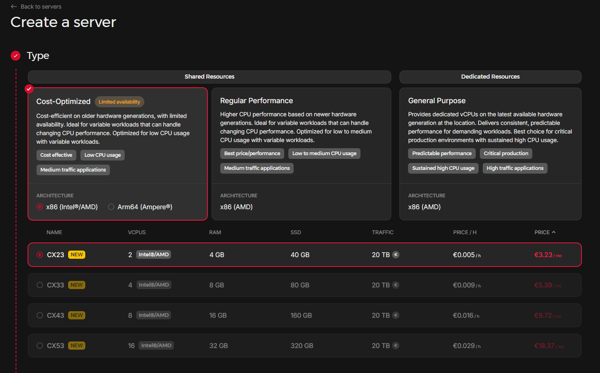
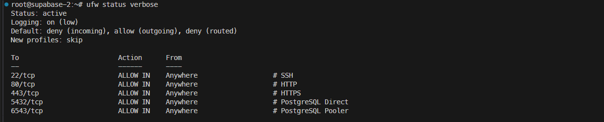
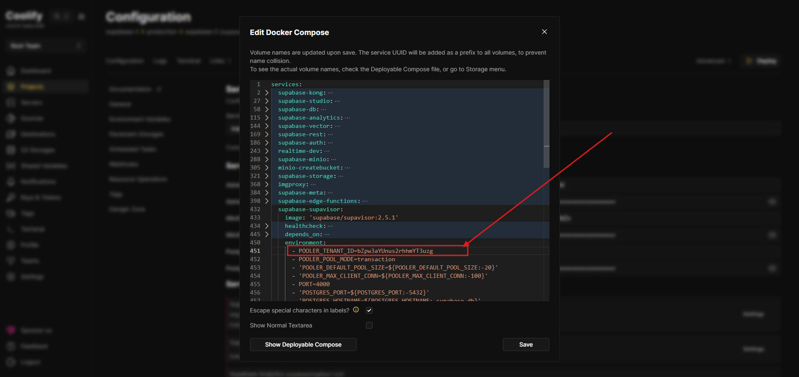

## Introduction

Supabase is an open-source Firebase alternative that provides a PostgreSQL database, authentication, instant APIs, real-time subscriptions, and storage. While Supabase offers a managed cloud service, self-hosting gives you complete control over your data and infrastructure.

This tutorial guides you through deploying a production-ready Supabase instance on Hetzner Cloud using Coolify — an open-source, self-hostable platform that simplifies application deployment. By the end of this tutorial, you'll have a fully functional Supabase instance with:

- Secure HTTPS access via Traefik reverse proxy
- Automatic SSL certificate management with Let's Encrypt
- UFW firewall protection
- A hardened tenant ID for additional security

**Prerequisites**

- A Hetzner Cloud account
- A domain name with DNS management access (this tutorial uses Namecheap as an example)
- An existing Coolify installation (or follow the [Coolify installation guide](https://coolify.io/docs/installation))
- Basic familiarity with Linux command line and Docker

**Example terminology**

This tutorial uses example values that you should replace with your own:

| Placeholder             | Example        | Description                           |
| ----------------------- | -------------- | ------------------------------------- |
| `<server-ip>`           | `203.0.113.10` | Your Hetzner server's public IP       |
| `<your-domain.com>`     | `example.com`  | Your domain name                      |
| `<alphanumeric-string>` | `472snc2m5h`   | Random string for subdomain obscurity |

## Step 1 - Create a Hetzner Cloud Server

First, provision a new server in your Hetzner Cloud Console.

**Step 1.1 - Configure the server**

1. Log in to [Hetzner Cloud Console](https://console.hetzner.cloud)
2. Select your project or create a new one
3. Click **Add Server**
4. Configure with these settings:

| Setting    | Value                                          |
| ---------- | ---------------------------------------------- |
| Location   | Choose closest to your users (e.g., Nuremberg) |
| Image      | Apps → **Docker CE**                           |
| Type       | CX23 or higher (2 vCPU, 4GB RAM)               |
| Networking | Public IPv4 ✅, IPv6 disabled                  |
| SSH Keys   | Select your SSH key                            |
| Name       | `supabase-1`                                   |



5. Click **Create & Buy Now**

**Step 1.2 - Initial server access**

Once the server is running, connect via SSH:

```bash
ssh root@<server-ip>
```

Update the system:

```bash
apt update && apt upgrade -y
```

## Step 2 - Initial Server Configuration

**Step 2.1 - Add Coolify SSH key**

Your Coolify instance needs SSH access to manage this server. In your Coolify dashboard:

1. Navigate to **Keys & Tokens** → your SSH key
2. Copy the **Public Key**

On the Supabase server, add the key:

```bash
echo "your-coolify-public-key" >> /root/.ssh/authorized_keys
```

**Step 2.2 - Set server timezone**

```bash
timedatectl set-timezone Europe/Zurich
```

Adjust the timezone to match your location.

**Step 2.3 - Harden SSH access**

Disable password authentication and apply security settings:

```bash
# Disable password authentication
sed -i 's/#PasswordAuthentication yes/PasswordAuthentication no/' /etc/ssh/sshd_config
sed -i 's/PasswordAuthentication yes/PasswordAuthentication no/' /etc/ssh/sshd_config

# Disable root login with password (key-only)
sed -i 's/#PermitRootLogin prohibit-password/PermitRootLogin prohibit-password/' /etc/ssh/sshd_config

# Disable empty passwords
sed -i 's/#PermitEmptyPasswords no/PermitEmptyPasswords no/' /etc/ssh/sshd_config

# Limit authentication attempts
echo "MaxAuthTries 3" >> /etc/ssh/sshd_config

# Set login grace time
echo "LoginGraceTime 60" >> /etc/ssh/sshd_config

# Restart SSH
systemctl restart ssh
```

## Step 3 - DNS Configuration

You'll create DNS records that point to your server. Using a random subdomain string adds security through obscurity.

**Step 3.1 - Generate a random subdomain**

Generate a random alphanumeric string (10 characters recommended):

```bash
openssl rand -hex 5
```

Example output: `472snc2m5h`

**Step 3.2 - Create DNS records**

In your DNS provider, add these A records:

| Type | Host                               | Value         | TTL       |
| ---- | ---------------------------------- | ------------- | --------- |
| A    | `supabase.<alphanumeric-string>`   | `<server-ip>` | Automatic |
| A    | `*.supabase.<alphanumeric-string>` | `<server-ip>` | Automatic |

Example:

- `supabase.472snc2m5h.example.com` → `203.0.113.10`
- `*.supabase.472snc2m5h.example.com` → `203.0.113.10`

> **Note**: If using Namecheap with DNS challenge for SSL certificates, whitelist your server's IP in **Profile** → **Tools** → **Namecheap API Access** → **Whitelisted IPs**.

## Step 4 - Add Server to Coolify

**Step 4.1 - Register the server**

In your Coolify dashboard:

1. Go to **Servers** → **Add Server**
2. Configure:
   - **Name**: `supabase-1`
   - **IP Address**: `<server-ip>`
   - **SSH Key**: Select your Coolify SSH key
3. Click **Save**

**Step 4.2 - Configure server settings**

After adding the server:

1. Go to the server's **Settings**
2. Set **Wildcard Domain**: `https://supabase.<alphanumeric-string>.<your-domain.com>`
3. Enable **Metrics** (optional but recommended)
4. Click **Save**
5. Click **Restart Proxy**

## Step 5 - Configure Traefik Proxy

Coolify uses Traefik as its reverse proxy. Configure it for your domain.

**Step 5.1 - Create log directory**

SSH into your server:

```bash
mkdir -p /var/log/traefik
chmod 755 /var/log/traefik
```

**Step 5.2 - Update Traefik configuration**

In Coolify → **Server** → **Proxy** tab, update the Traefik configuration.

Add environment variables for DNS challenge (example for Namecheap):

```yaml
services:
  traefik:
    environment:
      - NAMECHEAP_API_KEY=<your-api-key>
      - NAMECHEAP_API_USER=<your-api-user>
```

Add commands for access logging and DNS challenge:

```yaml
command:
  - "--accesslog=true"
  - "--accesslog.filepath=/var/log/traefik/access.log"
  - "--certificatesresolvers.letsencrypt.acme.dnschallenge=true"
  - "--certificatesresolvers.letsencrypt.acme.dnschallenge.provider=namecheap"
  - "--certificatesresolvers.letsencrypt.acme.dnschallenge.delaybeforecheck=30"
  - "--certificatesresolvers.letsencrypt.acme.email=<your-email@example.com>"
```

> **Note**: Remove any existing HTTP challenge commands if present e.g.:
>
> ~~- "--certificatesresolvers.letsencrypt.acme.httpchallenge=true"~~  
> ~~- "--certificatesresolvers.letsencrypt.acme.httpchallenge.entrypoint=http"~~
>
> DNS challenge is required for wildcard certificates.

Add labels for wildcard certificate:

```yaml
labels:
  - traefik.http.routers.traefik.tls.certresolver=letsencrypt
  - traefik.http.routers.traefik.tls.domains[0].main=supabase.<alphanumeric-string>.<your-domain.com>
  - traefik.http.routers.traefik.tls.domains[0].sans=*.supabase.<alphanumeric-string>.<your-domain.com>
```

Add volume mount for logs:

```yaml
volumes:
  - /var/log/traefik:/var/log/traefik
```

Click **Save** and **Restart Proxy**.


## Step 6 - Configure Firewall (UFW)

SSH into your server and configure the firewall:

```bash
# Reset and set defaults
ufw --force reset
ufw default deny incoming
ufw default allow outgoing

# Allow required ports
ufw allow 22/tcp comment 'SSH'
ufw allow 80/tcp comment 'HTTP'
ufw allow 443/tcp comment 'HTTPS'
ufw allow 5432/tcp comment 'PostgreSQL Direct'
ufw allow 6543/tcp comment 'PostgreSQL Pooler'

# Disable IPv6 if not used
sed -i 's/IPV6=yes/IPV6=no/' /etc/default/ufw

# Enable firewall
ufw --force enable
```

Verify the configuration:

```bash
ufw status verbose
```

Expected output:



## Step 7 - Deploy Supabase

**Step 7.1 - Create the project**

In Coolify:

1. Click **Add New Project**
2. Name it `supabase-1`
3. Click **Add New Resource** → **Docker Compose** → **Supabase** template

**Step 7.2 - Fix known template issue**

There's a known issue with Coolify's Supabase template. In the Docker Compose file, find and replace:

| Find                       | Replace With                |
| -------------------------- | --------------------------- |
| `SERVICE_URL_SUPABASEKONG` | `SERVICE_URL_SUPABASE_KONG` |

> **Note**: Leave `SERVICE_URL_SUPABASEKONG_8000` unchanged.

**Step 7.3 - Configure Kong domain**

Generate another random string for the Kong subdomain:

```bash
openssl rand -hex 4
```

Example output: `qc2ru8yz`

In Coolify → **supabase-kong** service:

Set domain: `https://<kong-string>.supabase.<alphanumeric-string>.<your-domain.com>`

Example: `https://qc2ru8yz.supabase.472snc2m5h.example.com`

**Step 7.4 - Harden the Pooler Tenant ID**

The Supabase connection pooler uses a tenant identifier that appears in all database connection strings. By default, this is `dev_tenant`, which is predictable.

Generate a random tenant ID:

```bash
openssl rand -base64 16 | tr -d '=' | tr '+/' '-_'
```

Example output: `Kx7mP9qR2sT4vW6y8zA1`

In Coolify → **Edit Compose File**, locate the `supabase-supavisor` service and update:

```yaml
supabase-supavisor:
  environment:
    - POOLER_TENANT_ID=Kx7mP9qR2sT4vW6y8zA1
```

> **Important**: This must be configured **before initial deployment**. Changing it later requires database migrations.



**Step 7.5 - Add environment variables**

In the service's environment variables section:

```
# SMTP Configuration (for auth emails)
SMTP_ADMIN_EMAIL=admin@example.com
SMTP_HOST=mail.example.com
SMTP_PASS=<your-smtp-password>
SMTP_PORT=587
SMTP_SENDER_NAME=Supabase
SMTP_USER=admin@example.com

# Studio Configuration
STUDIO_DEFAULT_ORGANIZATION=My Organization
STUDIO_DEFAULT_PROJECT=My Project
```

**Step 7.6 - Deploy**

Click **Deploy** and wait for all services to start. This may take several minutes on first deployment.

## Step 8 - Verify Deployment

**Step 8.1 - Check service health**

In Coolify, verify all services show as healthy:

- ✅ supabase-db
- ✅ supabase-kong
- ✅ supabase-auth
- ✅ supabase-rest
- ✅ supabase-realtime
- ✅ supabase-storage
- ✅ supabase-studio
- ✅ supabase-supavisor

**Step 8.2 - Access Supabase Studio**

Open your browser and navigate to:

```
https://<kong-string>.supabase.<alphanumeric-string>.<your-domain.com>
```

You should see the basic auth login prompt. Use the credentials from the Coolify "Supabase
Dashboard User" and "Supabase Dashboard Password".:


**Step 8.3 - Test database connection**

From your local machine, test the connection:

```bash
psql "postgresql://postgres.<TENANT_ID>:<password>@supabase.<alphanumeric-string>.<your-domain.com>:5432/postgres"
```

Replace:

- `<TENANT_ID>` with your custom tenant ID (e.g., `Kx7mP9qR2sT4vW6y8zA1`)
- `<password>` with your PostgreSQL password (from Coolify's generated secrets)

## Step 9 - Connection String Reference

After deployment, use these connection strings for your applications:

**Direct connection (for migrations)**

```
postgresql://postgres.<TENANT_ID>:[PASSWORD]@<domain>:5432/postgres
```

**Pooled connection (for application runtime)**

```
postgresql://postgres.<TENANT_ID>:[PASSWORD]@<domain>:6543/postgres?pgbouncer=true
```

**Prisma example (.env file)**

```env
DATABASE_URL="postgresql://postgres.<TENANT_ID>:[PASSWORD]@<domain>:6543/postgres?pgbouncer=true"
DIRECT_URL="postgresql://postgres.<TENANT_ID>:[PASSWORD]@<domain>:5432/postgres"
```

## Conclusion

You now have a fully functional self-hosted Supabase instance running on Hetzner Cloud. The deployment includes:

- ✅ Secure HTTPS access with automatic SSL certificates
- ✅ Randomized subdomains for security through obscurity
- ✅ Custom tenant ID to prevent enumeration attacks
- ✅ UFW firewall with minimal open ports
- ✅ SSH hardening

**Next steps**

For production deployments, consider:

1. **SSL hardening**: Enforce SSL for all database connections — see the companion tutorial "[Harden PostgreSQL SSL for Self-Hosted Supabase](https://community.hetzner.com/tutorials/supabase-postgresql-ssl-hardening)"
2. **Intrusion detection**: Add CrowdSec for automated threat detection — see "[Protect Self-Hosted Services with CrowdSec and Traefik](https://community.hetzner.com/tutorials/crowdsec-traefik-supavisor-protection)"
3. **Monitoring**: Set up centralized logging and metrics — see "[Centralized Security Monitoring with Prometheus and Grafana](https://community.hetzner.com/tutorials/crowdsec-prometheus-grafana-monitoring)"
4. **Backups**: Configure automated PostgreSQL backups (check Hetzner Snapshots or other solutions)

##### License: MIT

<!--

Contributor's Certificate of Origin

By making a contribution to this project, I certify that:

(a) The contribution was created in whole or in part by me and I have
    the right to submit it under the license indicated in the file; or

(b) The contribution is based upon previous work that, to the best of my
    knowledge, is covered under an appropriate license and I have the
    right under that license to submit that work with modifications,
    whether created in whole or in part by me, under the same license
    (unless I am permitted to submit under a different license), as
    indicated in the file; or

(c) The contribution was provided directly to me by some other person
    who certified (a), (b) or (c) and I have not modified it.

(d) I understand and agree that this project and the contribution are
    public and that a record of the contribution (including all personal
    information I submit with it, including my sign-off) is maintained
    indefinitely and may be redistributed consistent with this project
    or the license(s) involved.

Signed-off-by: Yusuf Khasbulatov khashashin@proton.me

-->
