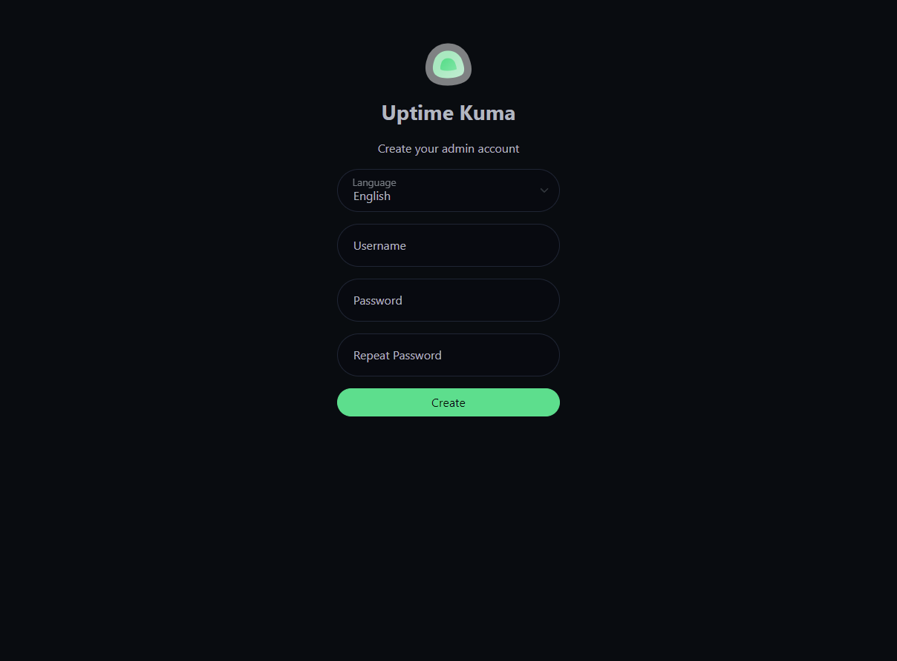
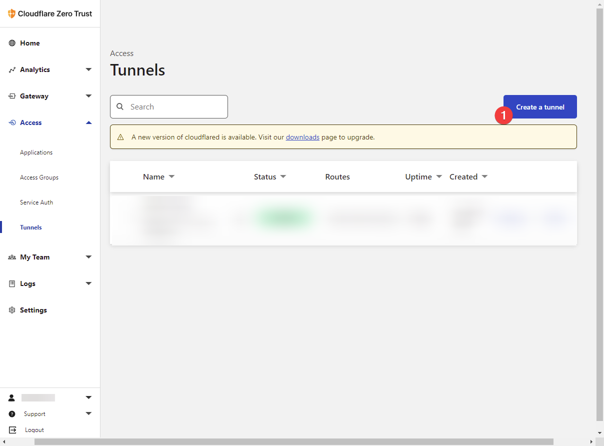
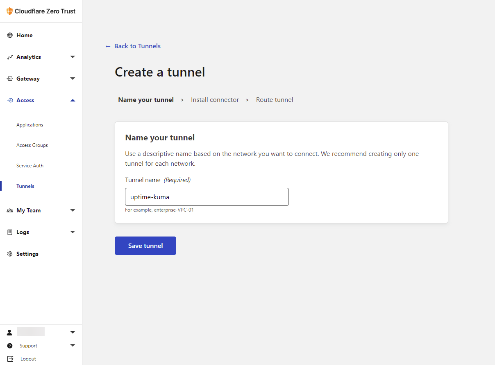
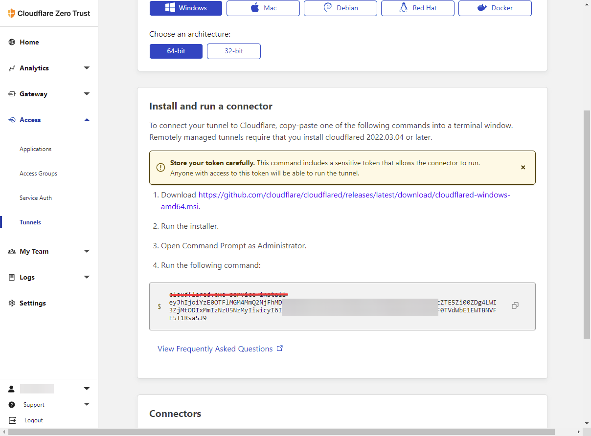
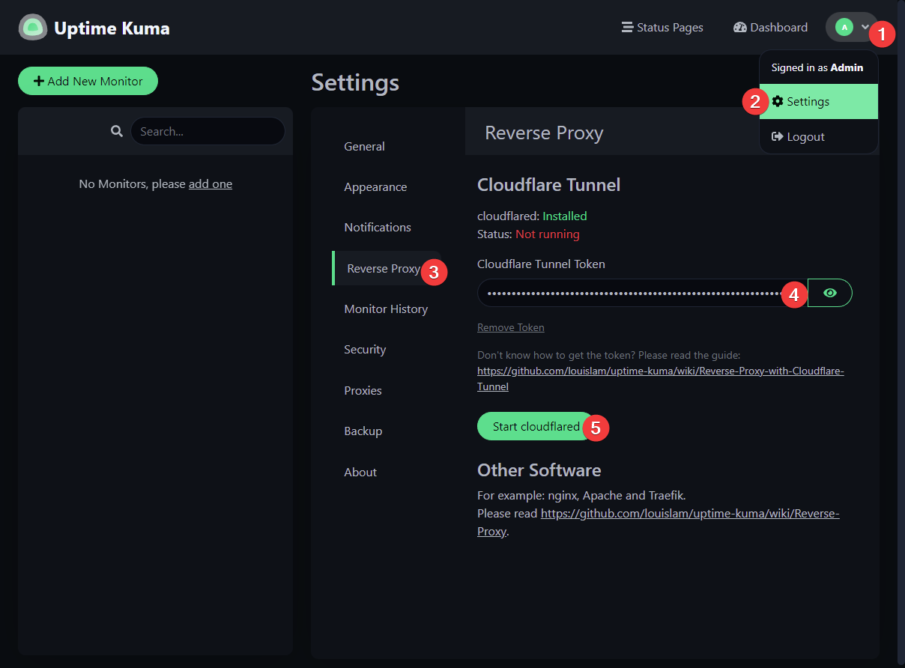
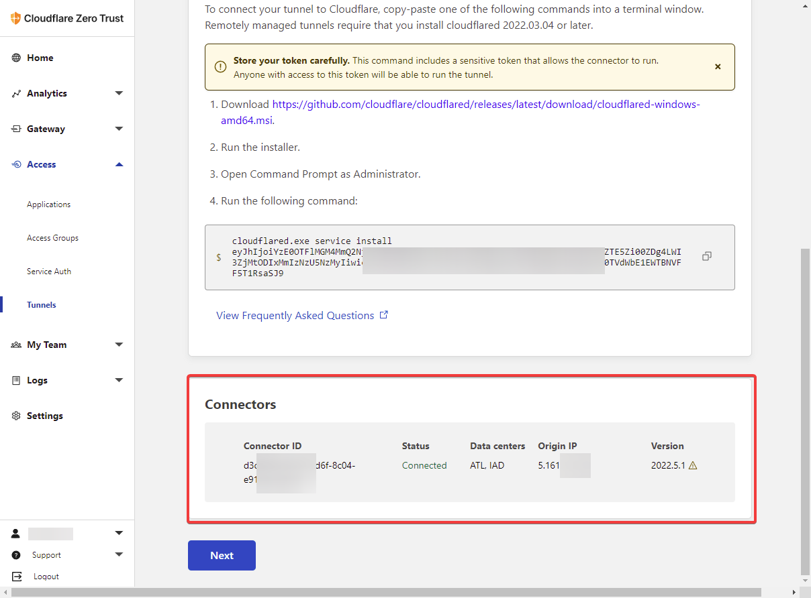
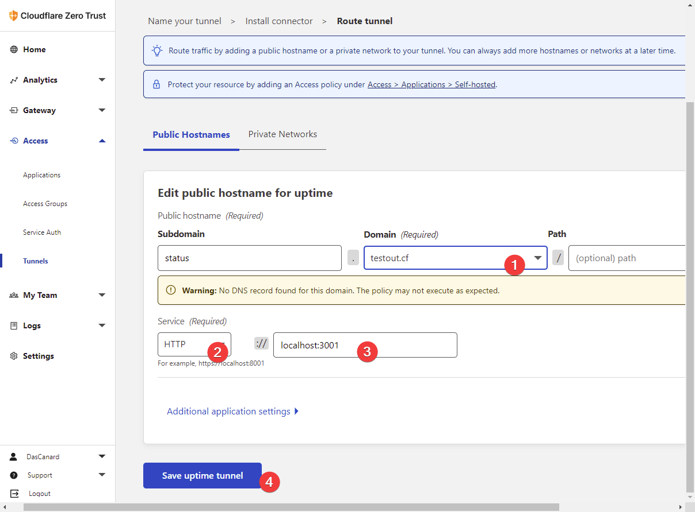
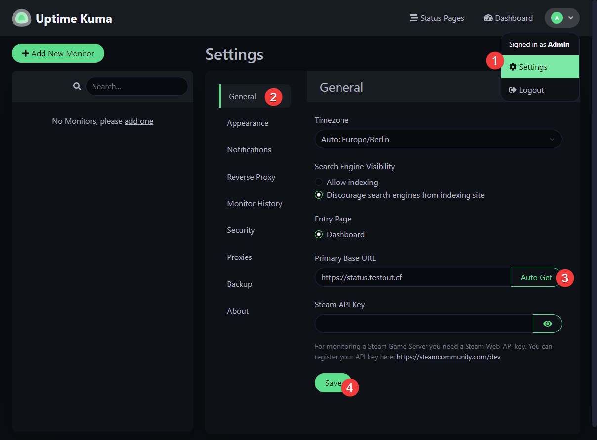
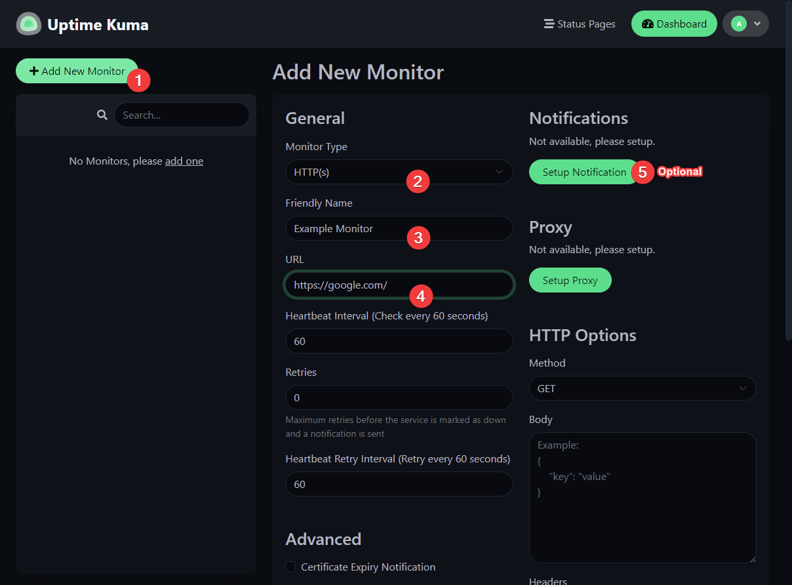
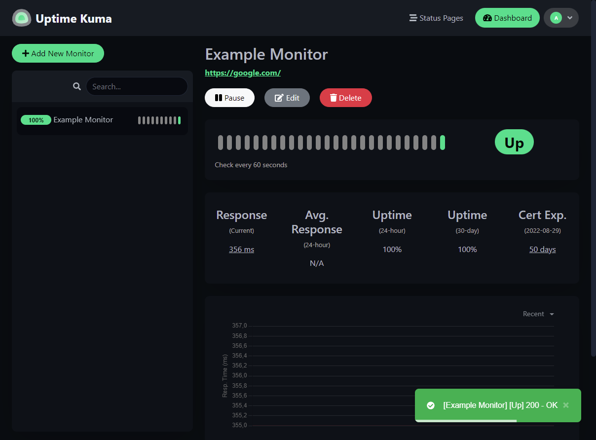

## Introduction

This tutorial will briefly show you how to install docker and how to deploy Uptime-Kuma with Cloudflare Tunnels.

**Prerequisites**

 * Server with Ubuntu, Debian or CentOS installed (For Example: Hetzner Cloud CX11 or CPX11)
 * A domain at Cloudflare

## Step 1 - Install Docker

If you don't have Docker installed yet, you can install Docker with the following command. If necessary, install `curl` if the curl command was not found.

#### Step 1.1 - Install Curl 
    
```bash
# Install curl on Ubuntu
apt install curl -y

#Install curl on CentOS
yum install curl -y
```

#### Step 1.2 - Install Docker
    
```bash
curl -fsSL https://get.docker.com -o get-docker.sh && sh get-docker.sh
```

Now that you have Docker installed you can proceed to the next step and install Uptime-Kuma.

## Step 2 - Install Uptime-Kuma

When installing Uptime-Kuma you have the option to decide on the `PORT` and the directory of the local database/installation directory.

So you can now first decide whether you use the Docker volumes or specify a direct path to the installation directory.

```bash
# If you choose Docker volumes then use the following command.
docker volume create uptime-kuma

# Start the container and change the <PORT> variable to whatever you want
# to publish the status page with.
docker run -d --restart=always -p <PORT>:3001 -v uptime-kuma:/app/data --name uptime-kuma louislam/uptime-kuma:1

# As already mentioned, there is also the option of specifying a direct path. Such as:
docker run -d --restart=always -p <PORT>:3001 -v /opt/uptime-data:/app/data --name uptime-kuma louislam/uptime-kuma:1
```

Your Uptime-Kuma instance should now be reachable under the IP of your server and your specified `PORT`.

## Step 3 - Setup a Uptime-Kuma User

If this is your first time on the site, you must create a user with a password that is at least 6 characters long and contains letters and numbers.




Note: Uptime-Kuma does not currently offer user management, this account is used to manage the Uptime-Kuma instance.

## Step 4 - Setup the Domain with Cloudflare Tunnel

With Cloudflare Tunnel, you can easily achieve a few benefits.
- Free SSL
- Global CDN
- Do not reveal your real IP
- Zero Config due to implementation in Uptime Kuma (Docker)

### Step 4.1 - Setup Cloudflare Tunnel

1. Go to - [Cloudflare Zero Trust](https://dash.teams.cloudflare.com/)

2. Access > Tunnels > Create Tunnel



3. Type a Tunnel name such as `uptime-kuma` and save tunnel.



4. Click the token to copy it. Note: Filter out the token (remove the command)



5. Go to your Uptime Kuma instance.

6. Settings > Reverse Proxy

7. Paste the token into the Cloudflare Tunnel Token field.

8. Click Start cloudflared



9. Go back to Cloudflare Zero Trust, if you see your connector, then click Next



10. Now click on next and choose your favorite domain name and map to `http://localhost:3001`



Now the Uptime-Kuma Instance should be reachable under the (subdomain.)Domain you've set up.
And also should notice that SSL is already turned on.

## Step 5 - Set the Domain in Uptime-Kuma

At the final step we just need to set the Domain for Uptime-Kuma in its settings.



## Step 6 - Setup the first monitor

Now that you have a Uptime-Kuma instance, you can add a monitor and optionally set it up the way you want.



After adding a monitor, you will be able to see the status of your monitor in the Uptime-Kuma status page.



## Conclusion

In this guide you learned how to install an Uptime-Kuma instance (Status Page) with Docker. In addition, you now know how to create a tunnel on Cloudflare. Yeah!

##### License: MIT

<!--

Contributor's Certificate of Origin

By making a contribution to this project, I certify that:

(a) The contribution was created in whole or in part by me and I have
    the right to submit it under the license indicated in the file; or

(b) The contribution is based upon previous work that, to the best of my
    knowledge, is covered under an appropriate license and I have the
    right under that license to submit that work with modifications,
    whether created in whole or in part by me, under the same license
    (unless I am permitted to submit under a different license), as
    indicated in the file; or

(c) The contribution was provided directly to me by some other person
    who certified (a), (b) or (c) and I have not modified it.

(d) I understand and agree that this project and the contribution are
    public and that a record of the contribution (including all personal
    information I submit with it, including my sign-off) is maintained
    indefinitely and may be redistributed consistent with this project
    or the license(s) involved.

Signed-off-by: Richard N. (mail@dascanard.xyz)

-->
