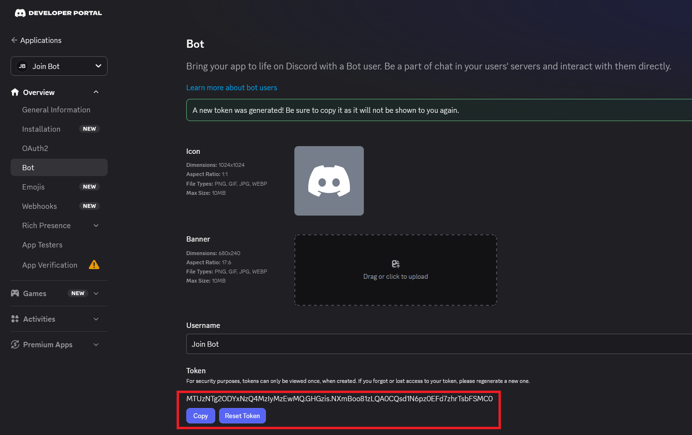

## Introduction

Discord servers often need to notify their community when new members join. Running a dedicated bot for this task is a common solution. In this tutorial, you will learn how to create a Discord bot from scratch using the Developer Portal, and then containerize it with [Docker][docker] on a Rocky Linux server. The bot will listen for the `guildMemberAdd` event and send a customizable welcome message to a specified channel.

> In Discord's developer documentation and API, a Guild is the technical term for what users commonly call a Discord server. While everyday users say "server," the Discord API uses "guild" to represent any collection of channels, members, and roles that make up a community space on the platform.

By containerizing the bot, you gain significant advantages:
- **Isolation**: The bot runs in its own environment, independent of the host system's packages.
- **Portability**: The same container image can run on any OS with Docker.
- **Ease of Management**: Starting, stopping, and updating the bot becomes a simple matter of managing a Docker container.

##### Why Dockerize a Discord Bot?

While you could run the bot directly on your server, using Docker provides a cleaner and more maintainable setup.

| Feature | Dockerized Bot | Direct Installation |
|---|---|---|
| **Environment Consistency** | Guarantees the bot runs with the exact same [Node.js][nodejs] version and dependencies every time, regardless of the host OS. | Requires manually managing Node.js versions and dependencies, which can lead to conflicts. |
| **Isolation** | Runs in a sandbox, preventing its dependencies from interfering with other system services. | Its dependencies and processes are shared on the host system. |
| **Updates** | Updating is as simple as rebuilding the image and restarting the container. | Updates often require manual installation and dependency resolution. |
| **Rollbacks** | You can easily revert to a previous image version. | Rollbacks are more complex to manage. |
| **Scalability** | Can be deployed as part of a larger [Docker Compose][docker_compose] setup. | Harder to integrate into a microservices architecture. |

- **Use Docker when:**
  - You want a clean, reproducible, and isolated environment.
  - You plan to integrate the bot with other containerized services (e.g., a database, a web dashboard).
  - You want to simplify deployment and updates.

- **Use a direct install when:**
  - You are running a quick, one-off test.
  - You are on a shared host with no Docker support.
  - You prefer a simpler, non-containerized setup for a single, simple script.

**Prerequisites**

Before you begin, ensure you have:

* Basic familiarity with Linux commands.
* A server running [Rocky Linux][hetzner_cloud] with `root` or `sudo` access.
* A [Discord account][discord] and the necessary permissions to create applications.

**Example terminology**

For this tutorial, we will use the following example placeholders:

* Bot Token: `<YOUR_BOT_TOKEN>`
* Channel ID: `<YOUR_CHANNEL_ID>`
* Guild ID: `<YOUR_GUILD_ID>`

## Step 1 - Create a Discord Bot

Before writing any code, you must create the bot application on Discord's side. This process will provide you with the necessary credentials (Token and IDs) for your bot to function.

1. **Navigate to the Discord Developer Portal**:  
   Open your web browser and go to the [Discord Developer Portal][discord_dev_portal].

2. **Create a New Application**:
   * Click on the **"New Application"** button in the top right corner.
   * A dialog box will appear asking for a name. Enter a name for your bot. This name will be visible to users.
   * Click the **"Create"** button.

3. **Configure the Application**:
   * After creation, you will be taken to the application's settings page.
   * Take a moment to set an **App Icon** and add a **Short Description** if desired. These are displayed to users.

4. **Get the Bot Token**:
   * In the left-hand sidebar, click on the **"Bot"** tab.
   * Under the **"Token"** section, click the **"Reset Token"** button.
   * This token is your bot's password and is required for it to log in. You will not be able to view it again from the portal, you would have to reset it.
   * This is your `<YOUR_BOT_TOKEN>`.
   
   > Security Warning: Never share your bot token or commit it to public repositories like GitHub.
   
   

5. **Enable Necessary Intents**:
   * Still on the "Bot" page, scroll down to the **"Privileged Gateway Intents"** section.
   * Your bot needs the `SERVER MEMBERS INTENT` to receive the `guildMemberAdd` event.
   * Toggle the switch next to **"Server Members Intent"** to the ON.

6. **Get Your Guild ID**:
   * This is the unique ID of your Discord server.
   * Open your Discord [client][discord_app] and go to your server.
   * **Enable Developer Mode**: Go to `User Settings` (gear icon next to your username) -> `Developer` -> toggle **"Developer Mode"** ON.
   * **Copy the Server ID**: Right-click on your server's name at the top-left of the channel list. In the context menu, click **"Copy Server ID"**.
   * This is your `<YOUR_GUILD_ID>`.

7. **Get Your Channel ID**:
   * Ensure Developer Mode is still enabled.
   * Right-click on the text channel where you want the welcome messages to be sent.
   * In the context menu, click **"Copy Channel ID"**.
   * This is your `<YOUR_CHANNEL_ID>`.

8. **Invite the Bot to Your Server**:
   * You must generate an invite link with the correct permissions.
   * In the [Developer Portal][discord_dev_portal], go to your application's **"OAuth2"** page -> **"OAuth2 URL Generator"**.
   * Under **"Scopes"**, check the **"bot"** box.
   * Under **"Bot Permissions"**, check the **"Send Messages"** and **"View Channels"** permissions. The bot will need these to send the welcome message.
  * A generated URL will appear at the bottom. Copy this URL and open it in your web browser.
  * Select the server you want to add the bot to (ensure you have the "Manage Server" permission) and click **"Authorize"**.

Your bot is now created, configured with the necessary intents, and is a member of your server. You have all the IDs and tokens required to configure the bot code.

## Step 2 - Install Docker on Rocky Linux

[Rocky Linux][rockylinux] is based on Red Hat Enterprise Linux. While RHEL ships with [Podman][podman] by default, Docker can be installed cleanly from the official Docker CE repository.

1. Remove possible conflicting packages:
   
   ```sh
   sudo dnf remove -y podman buildah
   ```

2. Update your system packages:
   
   ```sh
   sudo dnf -y update
   ```
   
   If a kernel update was included, reboot your server to ensure you're using the latest kernel:
   
   ```sh
   sudo reboot
   ```

3. Install the `bash-completion` package, which provides the framework that Docker's completion scripts rely on:
   
   ```sh
   sudo dnf install -y bash-completion
   ```

4. Now install Docker.
   
   To do so, set up the repository and install Docker Engine, the CLI tools, and containerd runtime as explained in the official Docker documentation:
   
   * [Install on RHEL][docker_install]
   
   You won't need to install `docker-buildx-plugin` and `docker-compose-plugin` for this tutorial.

5. Verify that the Docker service is running as expected:
   
   ```sh
   sudo systemctl enable --now docker
   systemctl status docker
   ```
   
   You should see an output showing `active (running)`.

6. (Optional) To run `docker` commands as a non-root user, add your user to the `docker` group. This is a convenient step for a personal server:
   
   > Replace `$USER` with a real username.
   
   ```sh
   sudo usermod -aG docker $USER
   newgrp docker
   ```

## Step 3 - Create the Project Directory

We will create a directory on the host server to store the bot's source code and its `Dockerfile`. This approach makes it easy to edit the bot's code and rebuild the image.

1. Create the project directory and navigate into it:
   
   ```sh
   mkdir ~/discord_bot
   cd ~/discord_bot
   ```

2. Initialize a new Node.js project. This will create a `package.json` file, which will track our dependencies.
   
   ```sh
   npm init -y
   ```

## Step 4 - Create the Bot Source Code

Now, let's create the JavaScript source code for the Discord bot.

1. Inside the `~/discord_bot` directory, create a file named `bot.js` using your preferred text editor (`vi bot.js`).
2. Add the following code to `bot.js`. This script uses [Discord.js][discordjs] to log in, and listens for the `guildMemberAdd` event to send a message.
   
   > Replace `<YOUR_BOT_TOKEN>`, `<YOUR_GUILD_ID>`, and `<YOUR_CHANNEL_ID>` with the values you copied earlier.
   
    ```js
	const { Client, GatewayIntentBits } = require('discord.js');

	// Configuration (Replace these with your actual values)
	const TOKEN = '<YOUR_BOT_TOKEN>';
	const GUILD_ID = '<YOUR_GUILD_ID>';
	const CHANNEL_ID = '<YOUR_CHANNEL_ID>';

	// Create a new Discord client instance
	const client = new Client({
		intents: [
			GatewayIntentBits.Guilds, // Receive guild events
			GatewayIntentBits.GuildMembers // Receive member join/leave events
		]
	});

	// When the bot is ready and logged in
	client.once('clientReady', () => {
		console.log(`[BOT] Logged in as ${client.user.tag}!`);
		console.log(`[BOT] Ready to monitor guild: ${GUILD_ID}`);
	});

	// When a new member joins a Discord server
	client.on('guildMemberAdd', async (member) => {
		// Check if the member joined the specific guild we are monitoring
		if (member.guild.id !== GUILD_ID) return;

		// Get the channel object from the cache
		const channel = member.guild.channels.cache.get(CHANNEL_ID);

		// If the channel doesn't exist or isn't text-based, log an error and exit
		if (!channel || !channel.isTextBased()) {
			console.error(`[BOT] Channel ${CHANNEL_ID} not found or is not a text channel.`);
			return;
		}

		// Create a welcome message
		const welcomeMessage = `Welcome to the server, ${member.user}! We're glad to have you. 🎉`;

		try {
			// Send the message to the channel
			await channel.send(welcomeMessage);
			console.log(`[BOT] Sent welcome message to ${member.user.tag} in channel ${CHANNEL_ID}`);
		} catch (error) {
			console.error(`[BOT] Failed to send welcome message: ${error}`);
		}
	});

	// Log in to Discord with the bot token
	client.login(TOKEN).catch((error) => {
		console.error('[BOT] Failed to login:', error);
	});

	// Graceful shutdown handling
	// This ensures the bot logs out properly when the container stops

	// Function to handle shutdown gracefully
	async function gracefulShutdown(signal) {
		console.log(`[BOT] Received ${signal}, starting graceful shutdown...`);

		try {
			// Destroy the client connection to Discord
			await client.destroy();
			console.log('[BOT] Successfully disconnected from Discord.');
			process.exit(0);
		} catch (error) {
			console.error('[BOT] Error during shutdown:', error);
			process.exit(1);
		}
	}

	// Listen for termination signals
	// SIGTERM: Sent by Docker when stopping the container (docker stop)
	// SIGINT: Sent when pressing Ctrl+C in the terminal
	process.on('SIGTERM', () => gracefulShutdown('SIGTERM'));
	process.on('SIGINT', () => gracefulShutdown('SIGINT'));
	```
   
   ##### Understanding the Bot Code
   - **Imports**: The code imports the necessary classes from the `discord.js` library.
   - **Intents**: It defines `GatewayIntentBits.Guilds` and `GuildMembers`. The `GuildMembers` intent is crucial for receiving the `guildMemberAdd` event. Without it, the bot will not be notified when a new member joins.
   - **Configuration**: It uses constants for the `TOKEN`, `GUILD_ID`, and `CHANNEL_ID`. You must replace these placeholders with your actual values.
   - **`guildMemberAdd` Event**: This event listener is the core of the bot. It receives a `member` object, finds the specified channel, and sends a welcome message.
   - **Graceful Shutdown Handling**: The bot listens for termination signals like `SIGTERM` (sent by Docker when stopping the container) and `SIGINT` (sent when pressing `Ctrl+C`). When a signal is received, the bot:
     1. Logs the signal that triggered the shutdown.
     2. Calls `client.destroy()` to cleanly close the WebSocket connection to Discord, preventing the bot from appearing as "online" after the container stops.
     3. Exits the process with a success code. This ensures the bot shuts down cleanly, avoids zombie connections, and prevents rate-limiting issues when restarting.

3. You can now add your `package.json` file. It should now have a `dependencies` section that includes `discord.js`. It's also a good practice to specify the Node.js version. For example, you can add an `engines` field:
   
   ```json
   {
     "name": "discord_bot",
     "version": "1.0.0",
     "description": "",
     "main": "bot.js",
     "scripts": {},
     "keywords": [],
     "author": "",
     "dependencies": {
       "discord.js": "^14.27.0"
     },
     "engines": {
       "node": ">=24.17.0"
     }
   }
   ```

## Step 5 - Create the Dockerfile

A `Dockerfile` is a text file that contains the instructions for building a Docker image for your bot.

1. In the `~/discord_bot` directory, create a file named `Dockerfile` (no extension).
2. Add the following content to the `Dockerfile`:
   
   ```sh
   # Use the official Node.js LTS image from Docker Hub
   FROM node:lts-alpine
   
   # Create and set the working directory inside the container
   WORKDIR /usr/src/app
   
   # Copy package.json
   COPY package*.json ./
   
   # Install the application dependencies inside the container
   RUN npm install
   
   # Copy the rest of the application source code
   COPY . .
   
   # Define the command to run the bot when the container starts
   # 'node' and 'bot.js' are the command and its argument
   CMD ["node", "bot.js"]
   ```
   
   ##### Understanding the Dockerfile
   - **`FROM node:lts-alpine`**: This specifies the base image. We use the official Node.js LTS image based on [Alpine Linux][alpine], which is very small and secure.
   - **`WORKDIR /usr/src/app`**: This sets the current working directory inside the container to `/usr/src/app`. All subsequent commands will be run from this location.
   - **`COPY package*.json ./`**: This copies `package.json` from your host to the container's working directory. This step is separate from copying the rest of the code to optimize Docker's caching. If the `package.json` file doesn't change, Docker can reuse the cached `npm install` layer.
   - **`RUN npm install`**: This runs `npm install` inside the container, installing all required dependencies.
   - **`COPY . .`**: This copies the rest of your application source code (e.g., `bot.js`) into the container.
   - **`CMD ["node", "bot.js"]`**: This is the command that will be executed when the container starts. It tells the container to run the Node.js runtime and execute the `bot.js` script.

## Step 6 - Create a .dockerignore File

To ensure your Docker image remains small and doesn't include unnecessary files from your local machine, create a `.dockerignore` file. This file acts like a `.gitignore` for Docker builds.

1. In the `~/discord_bot` directory, create a file named `.dockerignore`.
2. Add the following content to it:
   
   ```dockerignore
   # Ignore local node_modules
   node_modules
   # Ignore local environment files
   .env
   # Ignore local git files
   .git
   .gitignore
   ```

## Step 7 - Build the Docker Image

With the `Dockerfile` and source code ready, we can now build the Docker image.

1. In the `~/discord_bot` directory, run the following command to build the image:
   
   ```sh
   docker build -t discord_bot .
   ```
   
   ##### Understanding the Command
   - **docker build**: The command to build an image from a Dockerfile.
   - **-t discord_bot**: Tags the image with the name `discord_bot`. This makes it easy to reference later.
   - **.**: Tells Docker to look for the `Dockerfile` in the current directory.

2. After the build completes, verify the image is present on your system:
   
   ```sh
   docker image ls
   ```
   
   You should see a new image named `discord_bot` in the list.

## Step 8 - Run the Bot Container

Now it's time to run the bot container. This is where the bot will actually connect to Discord.

1. Run the following command to start your bot container:
   
   ```sh
   docker run -d \
      --name bot_container \
      --restart always \
      discord_bot
   ```
   
   ##### Understanding the Command
   - **docker run -d**: Runs the container in detached mode (in the background).
   - **--name bot_container**: Assigns the name "bot_container" to the container.
   - **--restart always**: Ensures the container automatically restarts if it stops, the system reboots, or Docker itself is restarted.
   - **discord_bot**: The name of the image we built in Step 7.

2. Verify that the container is running:
   
   ```sh
   docker ps -a
   ```
   
   You should see your `bot_container` container in the list with a status of "Up".

3. Check the logs to ensure the bot has started successfully and logged in:
   
   ```sh
   docker logs bot_container
   ```
   
   You should see output similar to:
   ```
   [BOT] Logged in as YourBotName#1234!
   [BOT] Ready to monitor guild: <YOUR_GUILD_ID>
   ```
   If you see an error, it likely means your `TOKEN`, `GUILD_ID`, or `CHANNEL_ID` are incorrect. You will need to stop the container, update your `bot.js` file, rebuild the image, and run it again.

## Step 9 - Testing the Bot

To confirm that your bot is working correctly, test the welcome message:

1. Open Discord [client][discord_app] and navigate to your server.
2. Invite a new user to the server, or, if you are an administrator, you can use a test account to join.
3. Upon joining, the bot should immediately send a welcome message to the specified channel.

If the message is sent, your bot is fully functional. If not, check the container logs (`docker logs bot_container`) for any errors. Common issues include:
- The bot not having the correct permissions to view the channel or send messages.
- The `GUILD_ID` or `CHANNEL_ID` being incorrect.
- The bot not having the `SERVER MEMBERS INTENT` enabled on the Discord Developer Portal. You must enable this intent in the "Bot" section of your application.

## Conclusion

You have successfully created a Discord bot from the Developer Portal and deployed it as a containerised application on Rocky Linux using **Docker** and **Discord.js**. The bot runs in an isolated environment, is configured to restart automatically, and sends a welcome message to a specified channel when new members join your server.

This architecture is robust, portable, and easy to maintain. All configuration and source code are stored in your project directory. To make changes to the bot's behavior, simply edit the `bot.js` file, rebuild the Docker image, and restart the container.

This setup gives you several benefits:

- **Clean containerization** - easy to deploy, update, or roll back.
- **Automatic restarts** - the `--restart always` flag ensures high availability.
- **Separation of concerns** - the bot's code and its dependencies are completely isolated from the host system.

From here you can:

- **Customize the welcome message** to include the user's name, a link to the rules, or a role assignment.
- **Expand the bot's functionality** to respond to other events, such as `messageCreate` for moderation or `guildMemberRemove` for goodbye messages.
- **Use environment variables** to pass sensitive information like the bot token, guild ID, and channel ID instead of hardcoding them, making your setup more secure.
- **Integrate with other services** by running additional containers alongside your bot using Docker Compose.

If you need to enable more intents or handle different Discord events, refer to the official [Discord.js Guide][discordjs_guide] for a complete overview of the library's capabilities.

[discord]: https://discord.com/
[discord_app]: https://discord.com/channels/@me
[discordjs]: https://discord.js.org/
[discordjs_guide]: https://discordjs.guide/
[discord_dev_portal]: https://discord.com/developers/applications
[docker]: https://www.docker.com/
[docker_compose]: https://docs.docker.com/compose/
[docker_install]: https://docs.docker.com/engine/install/rhel/#set-up-the-repository
[rockylinux]: https://rockylinux.org/
[alpine]: https://www.alpinelinux.org/
[podman]: https://podman.io/
[nodejs]: https://nodejs.org/en
[hetzner_cloud]: https://www.hetzner.com/cloud/

##### License: MIT

<!--

Contributor's Certificate of Origin

By making a contribution to this project, I certify that:

(a) The contribution was created in whole or in part by me and I have
    the right to submit it under the license indicated in the file; or

(b) The contribution is based upon previous work that, to the best of my
    knowledge, is covered under an appropriate license and I have the
    right under that license to submit that work with modifications,
    whether created in whole or in part by me, under the same license
    (unless I am permitted to submit under a different license), as
    indicated in the file; or

(c) The contribution was provided directly to me by some other person
    who certified (a), (b) or (c) and I have not modified it.

(d) I understand and agree that this project and the contribution are
    public and that a record of the contribution (including all personal
    information I submit with it, including my sign-off) is maintained
    indefinitely and may be redistributed consistent with this project
    or the license(s) involved.

Signed-off-by: Nik oqabemail@gmail.com

-->
