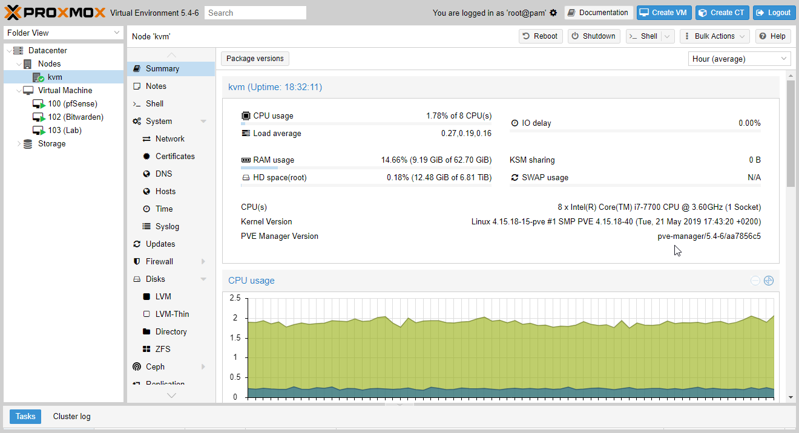
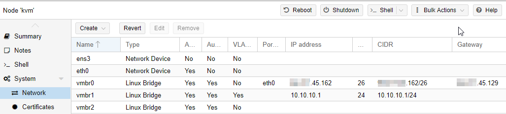
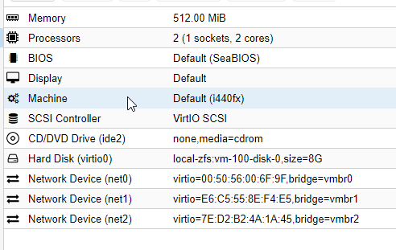
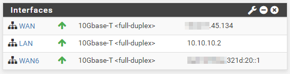
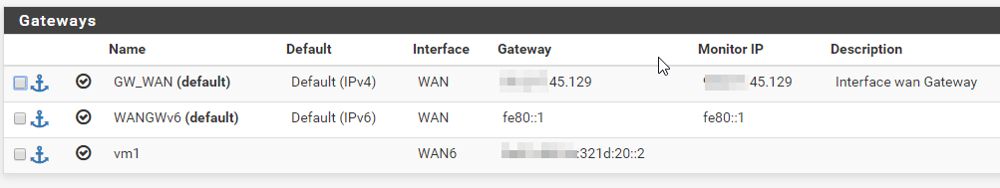
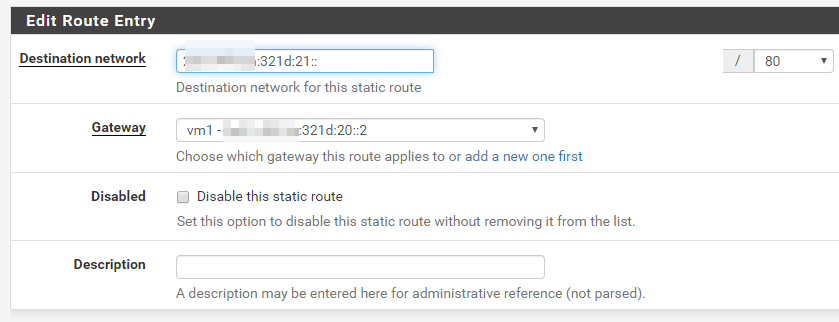
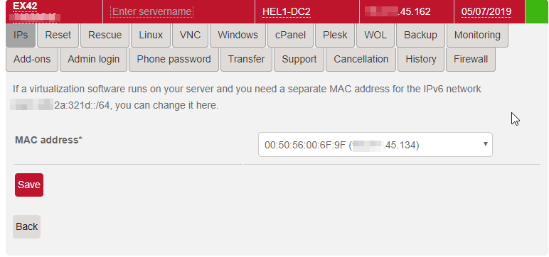

## Introduction

This tutorial will help you setup Docker with IPv6 in a secure way.


**Objectives**

* Automatic provisioning of IPv6
   * Each Docker container will receive an IPv6 automatically
* Routed IPv6 traffic between container in different Hosts
   * Each host will have a /80 that will be routed through pfSense
* Secured public access to our containers via IPv6
   * They will be reachable publicly so we want to be able to whitelist open ports in a secure way
* Out of band Firewall
   * Having an out of band firewall, meaning outside of the VM, will increase the security of the system

**Requirements**

1) IPv6 network

For this article, we will use a /64 IPv6 network because that is what many hosting providers give, and we will use the example 2001:db8:1234:321d::1/64. This will be divided in 4096 /76s:
* 2001:db8:1234:321d:10::1/76 WAN in Pfsense
* 2001:db8:1234:321d:20::1/76 VIP (or WAN6) gateway for VM1
  * 2001:db8:1234:321d:21::/80 for Docker containers in VM1
* 2001:db8:1234:321d:30:1/76 VIP gateway for VM2
  * 2001:db8:1234:321d:31::1/80 for Docker containers in VM2
* 2001:db8:1234:321d:3e80::1/76 VMx
  * 2001:db8:1234:321d:3e81::1/80 for Docker containers in VMx

2) Hypervisor

We will need a way to provision VMs, for this article we selected Proxmox. More information on Prxmox can be found on their website: https://www.proxmox.com/en/proxmox-ve/get-started

There is already a Tutorial on how to install Proxmox remotely on any server: https://community.hetzner.com/tutorials/install-and-configure-proxmox_ve



## Step 1 - Create Bridges

We will create 3 bridges:

* **vmbr0**: It will connect to the internet and receive both IPv4 and IPv6 traffic but will only have the main IPv4 assigned x.y.145.162/26
* **vmbr1**: The internal network shared between VMs, 10.10.10.1/24
* **vmbr2**: This bridge will hold the IPv6 network for our VMs, in this case a /64

Contents of /etc/network/interfaces (this is autogenerated by Proxmox):

```
auto lo
iface lo inet loopback

iface ens3 inet manual

iface eth0 inet manual

auto vmbr0
iface vmbr0 inet static
        address  x.y.145.162
        netmask  26
        gateway  x.y.45.129
        bridge-ports eth0
        bridge-stp off
        bridge-fd 0

auto vmbr1
iface vmbr1 inet static
        address  10.10.10.1
        netmask  24
        bridge-ports none
        bridge-stp off
        bridge-fd 0
        bridge-vlan-aware yes
        bridge-vids 2-4094

auto vmbr2
iface vmbr2 inet manual
        bridge-ports none
        bridge-stp off
        bridge-fd 0

```



## Step 2 - Setup Firewall (pfSense)

We will need an out of band Firewall to be able to whitelist open ports and for this, we are going to use pfSense.

More information on using pfSense with Proxmox can be found here: https://docs.netgate.com/pfsense/en/latest/virtualization/virtualizing-pfsense-with-proxmox.html

We will add 3 network cards and configure each one to one of the Bridges we created before.



### Step 2.1 - Interface assignments



**IPv4**
* WAN NAT IPv4: x.y.145.136/26
* WAN NAT IPv6: 2001:db8:1234:321d:10::1/76
* LAN 10.10.10.2

We have 2 IPv4 assigned, one to access the Host KVM and the other to use as NAT and for the internal LAN.

**IPv6**
Default gateways for the VM hosts.
* WAN6 2001:db8:1234:321d:20::1
  * VIP 2001:db8:1234:321d:30::1
  ...
  * VIP 2001:db8:1234:321d:3e80::1

### Step 2.2 - Routing

The default GW for IPv6 is fe80::1 through the WAN interface (not WAN6). This is because this interface is connected to the KVM bridge that has access to the connection to the internet.

Each Docker network in the VM host gets a static route so they can comunicate between each other.
For this we need to define a Gateway as 2001:db8:1234:321d:20::2 through the WAN6 interface called "vm1" in the picture.



Finally we add a static route saying that our container subnet 21::/80 can be reached through the "vm1" gateway, that means through the interface WAN6 via the host at 20::2.



### Step 2.3 - MAC assignment for IPv6

Many hosters require that IPv6 traffic comes from the same MAC address associated with one of the IPv4. In this case it is the extra NAT IPv4.



### Step 2.4 - Firewall Rules

We need to create the following firewall rules:
* **WAN:**
  * ANY to our IPv6 /80
  * ANY to our IPv6/ports we want to be public
  * From WAN6 to ANY (outgoing traffic)

* **WAN6:**
  * Protocol IPv6 to WAN6 (outgoing traffic)

## Step 3 - VM configuration

In this example we use systemd-networkd but the same idea can be used on any network manager. Basic information on systemd-networkd can be found here: https://wiki.archlinux.org/index.php/Systemd-networkd

Notice we use ::2 for our VM IPv6 and WAN6 interface IP as a default route.

```
[Match]
Name=eth1

[Network]
Address=2001:db8:1234:321d:20::2/80
Gateway=2001:db8:1234:321d:20::1

[Route]
Gateway=2001:db8:1234:321d:20::1

```

This will give us:

```
# ip -6 addr show dev eth1
3: eth1: <BROADCAST,MULTICAST,UP,LOWER_UP> mtu 1500 qdisc fq_codel master docker0 state UP group default qlen 1000
    inet6 2001:db8:1234:321d:20::2/76 scope global
       valid_lft forever preferred_lft forever
    inet6 fe80::e470:c4ff:fe34:1491/64 scope link
       valid_lft forever preferred_lft forever


```

Test we have IPv6 connectivity:

```
# ping -6 www.google.com
PING www.google.com(ams16s29-in-x04.1e100.net (2a00:1450:400e:804::2004)) 56 data bytes
64 bytes from ams16s29-in-x04.1e100.net (2a00:1450:400e:804::2004): icmp_seq=1 ttl=55 time=32.2 ms
64 bytes from ams16s29-in-x04.1e100.net (2a00:1450:400e:804::2004): icmp_seq=2 ttl=55 time=32.5 ms
64 bytes from ams16s29-in-x04.1e100.net (2a00:1450:400e:804::2004): icmp_seq=3 ttl=55 time=32.4 ms
```

## Step 4 - Docker configuration

Baisc information on configuring a routed Docker environment with IPv6 can be found here: https://docs.docker.com/v17.09/engine/userguide/networking/default_network/ipv6/#routed-network-environment

We configure docker to use our /80 subnets under 21::/80.

```
# cat /etc/docker/daemon.json
{
  "ipv6": true,
  "fixed-cidr-v6": "2001:db8:1234:321d:21::/80"
}
```

Test it by using an alpine container:

```
# docker run -it alpine ash
/ # ip -6 route
2001:db8:1234:321d:21::/80 dev eth0  metric 256
fe80::/64 dev eth0  metric 256
default via 2001:db8:1234:321d:21::1 dev eth0  metric 1024
ff00::/8 dev eth0  metric 256

/ # ip -6 addr
1: lo: <LOOPBACK,UP,LOWER_UP> mtu 65536 state UNKNOWN qlen 1000
    inet6 ::1/128 scope host
       valid_lft forever preferred_lft forever
43: eth0@if44: <BROADCAST,MULTICAST,UP,LOWER_UP,M-DOWN> mtu 1500 state UP
    inet6 2001:db8:1234:321d:21:242:ac11:2/80 scope global flags 02
       valid_lft forever preferred_lft forever
    inet6 fe80::42:acff:fe11:2/64 scope link
       valid_lft forever preferred_lft forever

/ # ping -6 www.google.com
PING www.google.com (2a00:1450:400e:807::2004): 56 data bytes
64 bytes from 2a00:1450:400e:807::2004: seq=0 ttl=55 time=26.828 ms
64 bytes from 2a00:1450:400e:807::2004: seq=1 ttl=55 time=26.904 ms
```

From here we can see we got 2001:db8:1234:321d:21:242:ac11:2/80 and ping to google works.

### Step 4.1 - Static IP

Ideally we would want to have static IPv6 for some of the Docker containers that run some kind of server. This can be acheived by passing the correct arguments at the time of creation:

For example:

```
--ip6 2001:db8:1234:321d::1234
```

## Conclusion

If you have followed this tutorial, then every Docker container that you create will have an IPv6 provisioned automatically that can be accessed from the public internet, and you can control which ports are accessible through an out of band firewall (pfSense).

##### License: MIT

<!---

Contributors's Certificate of Origin

By making a contribution to this project, I certify that:

(a) The contribution was created in whole or in part by me and I have
    the right to submit it under the license indicated in the file; or

(b) The contribution is based upon previous work that, to the best of my
    knowledge, is covered under an appropriate license and I have the
    right under that license to submit that work with modifications,
    whether created in whole or in part by me, under the same license
    (unless I am permitted to submit under a different license), as
    indicated in the file; or

(c) The contribution was provided directly to me by some other person
    who certified (a), (b) or (c) and I have not modified it.

(d) I understand and agree that this project and the contribution are
    public and that a record of the contribution (including all personal
    information I submit with it, including my sign-off) is maintained
    indefinitely and may be redistributed consistent with this project
    or the license(s) involved.

Signed-off-by: [Rodrigo A. Diaz Leven ramakandra@gmail.com]

-->
